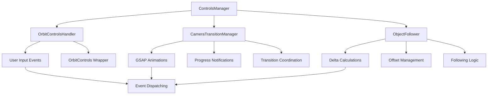

# Three.js Controls (`@teskooano/renderer-threejs-controls`)

Low-level camera controls and interaction management system that provides robust user input handling, smooth animated transitions, and object following capabilities for the Teskooano Three.js scene.

## 🎯 Purpose

This package provides comprehensive low-level camera control functionality:

- **User Input Management**: Handles mouse, touch, and keyboard interactions through OrbitControls
- **Smooth Transitions**: GSAP-powered animated camera movements for programmatic view changes
- **Object Following**: Enables camera tracking of moving objects while preserving user control
- **Event System**: Communicates camera state changes to the rest of the application
- **Composable Architecture**: Modular design with specialized handlers for different control aspects

## 🚀 Core Features

### 1. User Interaction Management

- **OrbitControls Integration**: Standard Three.js orbit controls for zoom, pan, and rotate
- **Event Handling**: Comprehensive event system for user interaction tracking
- **Damping Control**: Smooth, physics-based camera movement with configurable damping
- **Input Validation**: Robust input handling with proper event cleanup

### 2. Animated Transitions

- **GSAP Integration**: High-quality, smooth camera transitions using GSAP animations
- **Multi-Stage Transitions**: Two-stage transitions (align then travel) for optimal UX
- **Duration Calculation**: Intelligent duration calculation based on distance and complexity
- **Progress Notifications**: Real-time progress updates with speed and ETA information

### 3. Object Following System

- **Delta-Based Following**: Precise camera tracking using frame-to-frame movement deltas
- **Offset Management**: Maintains relative camera position during object movement
- **Transition Coordination**: Prevents conflicts between following and transition animations
- **Manual Override**: Allows user manipulation while maintaining follow behavior

### 4. Composable Architecture

- **Specialized Handlers**: Separate handlers for orbit controls, transitions, and following
- **Clean Separation**: Clear separation of concerns between different control aspects
- **Extensible Design**: Easy to extend with new control types or behaviors
- **Resource Management**: Proper cleanup and disposal of all resources

## 🏗️ Architecture

The controls system follows a composable architecture pattern where specialized handlers manage specific aspects of camera control:

### Handler Responsibilities

- **ControlsManager**: Main orchestrator that coordinates all control aspects
- **OrbitControlsHandler**: Manages Three.js OrbitControls lifecycle and events
- **CameraTransitionManager**: Handles GSAP-based animated transitions
- **ObjectFollower**: Manages camera following logic for moving objects

## ⚡ Performance Considerations

### Efficiency

- **Delta-Based Updates**: Efficient frame-to-frame movement calculations
- **Resource Pooling**: Reusable vectors and objects to minimize allocations
- **Event Optimization**: Efficient event handling with proper cleanup
- **Animation Management**: Smart animation lifecycle management

### Quality Metrics

- **Smooth Interactions**: 60 FPS user interactions with proper damping
- **Reliable Transitions**: Consistent, smooth animated transitions
- **Precise Following**: Accurate object tracking with minimal lag
- **Memory Safety**: Proper resource cleanup and disposal

### Performance Monitoring

- **Frame Rate Tracking**: Monitors interaction performance
- **Animation Performance**: Tracks transition smoothness and timing
- **Memory Usage**: Monitors resource allocation and cleanup
- **Event Processing**: Tracks event handling performance

## 🔌 Integration Points

### Primary Integration

- **Three.js**: Direct integration with Three.js camera and controls systems
- **GSAP**: Animation library integration for smooth transitions
- **Core State**: Integration with state management for object tracking
- **Notifications**: Progress notification system for user feedback

### Secondary Integration

- **Data Types**: Uses shared interfaces and type definitions
- **Core Math**: OSVector3 integration for precise calculations
- **Renderer Core**: Integration with renderer events and timing
- **Camera Package**: Works with high-level camera management

## 🐛 Debug Features

### Validation

- **Input Validation**: Validates user input and camera parameters
- **State Validation**: Ensures control state consistency
- **Animation Validation**: Validates transition parameters and timing
- **Following Validation**: Validates object following state and offsets

### Monitoring

- **Performance Monitoring**: Tracks interaction and animation performance
- **Event Monitoring**: Monitors event handling and processing
- **State Monitoring**: Tracks control state changes and updates
- **Memory Monitoring**: Monitors resource usage and cleanup

### Debugging Tools

- **Debug Mode**: Placeholder for advanced debug controls
- **Event Logging**: Comprehensive event logging for troubleshooting
- **State Inspection**: Access to control state for debugging
- **Performance Metrics**: Performance monitoring and optimization tools

## 🔮 Future Enhancements

### Optimization Opportunities

- **Performance Optimization**: Further animation and interaction optimizations
- **Memory Optimization**: Advanced memory management and pooling strategies
- **Code Optimization**: Additional algorithmic improvements for control calculations
- **Architecture Optimization**: Enhanced modular architecture and handler design

### Potential Improvements

- **Advanced Controls**: Support for additional control types (fly controls, etc.)
- **Gesture Recognition**: Enhanced touch and gesture support
- **Multi-Camera Support**: Support for multiple camera instances
- **Advanced Following**: Enhanced object following with predictive algorithms

## 📚 Architecture Patterns

- **Composition Pattern**: ControlsManager composes specialized handlers
- **Handler Pattern**: Specialized handlers for different control aspects
- **Event-Driven Pattern**: Event-based communication between components
- **Resource Management Pattern**: Proper lifecycle management of all resources
- **Strategy Pattern**: Configurable control behaviors and transitions

## 📚 Documentation Structure

### Core Components

- [[ControlsManager]] - Main orchestrator for all camera control functionality
- [[OrbitControlsHandler]] - Three.js OrbitControls lifecycle and event management
- [[CameraTransitionManager]] - GSAP-based animated camera transitions
- [[ObjectFollower]] - Camera following logic for moving objects

### Architecture & Integration

- [[Three.js Controls Architecture]] - Overall system architecture and design decisions
- [[Control Integration Patterns]] - How controls integrate with other systems
- [[Performance Optimization]] - Performance considerations and strategies

## 🔄 Quick Navigation

### By Component Type

- **Main Orchestrator**: [[ControlsManager]]
- **Input Handlers**: [[OrbitControlsHandler]]
- **Animation Handlers**: [[CameraTransitionManager]]
- **Following Handlers**: [[ObjectFollower]]

### By Architecture Pattern

- **Composition Pattern**: [[ControlsManager]] composes specialized handlers
- **Handler Pattern**: All handlers implement common interfaces
- **Event-Driven Pattern**: Event-based communication system
- **Resource Management**: Proper lifecycle management

## 🚀 Getting Started

1. Start with [[ControlsManager]] to understand the main control system
2. Explore [[OrbitControlsHandler]] for user input handling
3. Learn about [[CameraTransitionManager]] for animated transitions
4. Check out [[ObjectFollower]] for object tracking capabilities
5. Review the architecture patterns for system design

## 📦 Dependencies

### Core Dependencies

- **[[core/core-state/core-state|Core State]]** - State management and object tracking
- **[[data/data-types/data-types|Data Types]]** - Interface definitions and type safety
- **[[threejs-core/threejs-core|Three.js Core]]** - Core renderer events and utilities
- **[[threejs-camera/threejs-camera|Three.js Camera]]** - High-level camera management integration
- **[[notifications]]** - Progress notification system
- **Three.js** - 3D graphics library and OrbitControls
- **GSAP** - Animation library for smooth transitions

### Development Dependencies

- **typescript** - Type safety and modern JavaScript features
- **vitest** - Testing framework with browser support
- **@vitest/browser** - Browser testing capabilities
- **@vitest/ui** - Vitest user interface
- **@playwright/test** - End-to-end testing
- **playwright** - Browser automation for testing
- **eslint** - Code quality and consistency
- **@types/three** - TypeScript definitions for Three.js
- **happy-dom** - Lightweight DOM implementation for testing

## 📚 Related Documentation

- [[threejs-camera/threejs-camera|Three.js Camera]] - High-level camera management system
- [[threejs-core/threejs-core|Three.js Core]] - Core renderer events and utilities
- [[core/core-state/core-state|Core State]] - State management and object tracking
- [[data/data-types/data-types|Data Types]] - Interface definitions and types
- [[notifications]] - Progress notification system

---

_This package provides the foundation for all camera control and interaction in the Teskooano system, with comprehensive support for user input, smooth transitions, and object following._
