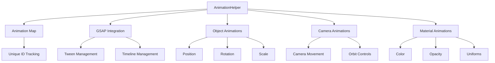

# AnimationHelper

GSAP-powered animation utilities for Three.js objects, cameras, and materials with built-in lifecycle control and pooling of active animations.

## 🎯 Purpose

The `AnimationHelper` class provides a comprehensive animation system built on top of GSAP (GreenSock Animation Platform) specifically designed for Three.js applications. It manages the lifecycle of animations, prevents memory leaks, and provides convenient methods for animating common Three.js objects and properties.

## 🏗️ Architecture

The `AnimationHelper` uses a centralized animation tracking system with unique IDs for each animation:



## 🚀 Core Features

- **Transform Animations**: Position, rotation, and scale animations for Three.js objects
- **Camera Animations**: Smooth camera movements with optional OrbitControls integration
- **Material Animations**: Color, opacity, and shader uniform animations
- **Predefined Animations**: Floating, rotation, pulse, orbit, and dolly animations
- **Animation Management**: Centralized tracking, stopping, pausing, and resuming
- **Memory Management**: Automatic cleanup and disposal to prevent memory leaks

## 🔧 Key Methods

### Transform Animations

```typescript
// Animate object position
animatePosition(object: THREE.Object3D, target: THREE.Vector3, config: AnimationConfig): string

// Animate object rotation
animateRotation(object: THREE.Object3D, target: THREE.Euler, config: AnimationConfig): string

// Animate object scale
animateScale(object: THREE.Object3D, target: THREE.Vector3, config: AnimationConfig): string
```

### Camera Animations

```typescript
// Animate camera with optional lookAt and OrbitControls sync
animateCamera(
  camera: THREE.PerspectiveCamera,
  targetPos: THREE.Vector3,
  options: CameraAnimationOptions
): string

// Create orbit animation around a target
createOrbitAnimation(
  camera: THREE.PerspectiveCamera,
  target: THREE.Vector3,
  radius: number,
  startAngle: number,
  endAngle: number,
  config: AnimationConfig
): string

// Create dolly animation (zoom in/out)
createDollyAnimation(
  camera: THREE.PerspectiveCamera,
  target: THREE.Vector3,
  startDistance: number,
  endDistance: number,
  config: AnimationConfig
): string
```

### Material Animations

```typescript
// Animate material properties via property path
animateMaterial(
  material: THREE.Material,
  propertyPath: string,
  toValue: any,
  config: AnimationConfig
): string

// Convenience methods
animateColor(material: THREE.Material, color: THREE.Color, config: AnimationConfig): string
animateOpacity(material: THREE.Material, opacity: number, config: AnimationConfig): string
```

### Predefined Animations

```typescript
// Create floating animation
createFloatingAnimation(object: THREE.Object3D, config: FloatAnimationConfig): string

// Create rotation animation
createRotationAnimation(object: THREE.Object3D, config: RotationAnimationConfig): string

// Create pulse animation
createPulseAnimation(object: THREE.Object3D, config: PulseAnimationConfig): string
```

### Animation Management

```typescript
// Stop specific animation
stopAnimation(animationId: string): void

// Stop all animations for an object
stopObjectAnimations(object: THREE.Object3D): void

// Stop all animations
stopAllAnimations(): void

// Pause/resume all animations
pauseAllAnimations(): void
resumeAllAnimations(): void

// Get animation statistics
getActiveAnimationCount(): number
getActiveAnimationIds(): string[]
hasActiveAnimations(): boolean
```

## 📊 Technical Specifications

- **Animation Engine**: GSAP 3.13.0
- **Memory Management**: Centralized Map-based tracking
- **Performance**: Optimized for 60fps with minimal overhead
- **TypeScript**: Full type definitions included
- **Lifecycle**: Automatic cleanup on disposal

## 💡 Usage Examples

### Basic Object Animation

```typescript
import { AnimationHelper } from "@teskooano/renderer-threejs-helpers";

const animationHelper = new AnimationHelper();

// Animate a cube's position
const cube = new THREE.Mesh(geometry, material);
const targetPosition = new THREE.Vector3(10, 5, 0);

const animationId = animationHelper.animatePosition(cube, targetPosition, {
  duration: 2,
  ease: "power2.out",
  onComplete: () => console.log("Animation complete!"),
});
```

### Camera Animation with OrbitControls

```typescript
// Animate camera with OrbitControls integration
const animationId = animationHelper.animateCamera(
  camera,
  new THREE.Vector3(0, 10, 20),
  {
    duration: 3,
    lookAt: new THREE.Vector3(0, 0, 0),
    orbitControls: controls,
    ease: "power2.inOut",
  },
);
```

### Material Animation

```typescript
// Animate material color
const material = new THREE.MeshBasicMaterial({ color: 0xff0000 });
animationHelper.animateColor(material, new THREE.Color(0x00ff00), {
  duration: 1.5,
  ease: "sine.inOut",
});

// Animate shader uniform
animationHelper.animateMaterial(material, "uniforms.time.value", 1.0, {
  duration: 2,
  ease: "linear",
});
```

### Predefined Animations

```typescript
// Create floating animation
animationHelper.createFloatingAnimation(planet, {
  amplitude: 2,
  duration: 4,
  ease: "sine.inOut",
});

// Create orbit animation
animationHelper.createOrbitAnimation(camera, target, 50, 0, Math.PI * 2, {
  duration: 10,
  ease: "linear",
});
```

## ⚡ Performance Considerations

- **Memory Management**: Uses a single Map for tracking to minimize memory overhead
- **GSAP Integration**: Leverages GSAP's optimized animation engine
- **Disposal**: Always call `dispose()` to clean up animations and prevent memory leaks
- **Batch Operations**: Use `stopAllAnimations()` for efficient cleanup
- **Animation Limits**: Monitor active animation count to prevent performance issues

## 🔌 Integration Points

- **threejs-celestial**: Used by `CelestialAnimationHelper` for celestial object animations
- **threejs-camera**: Integrates with camera management systems
- **threejs-controls**: Syncs with OrbitControls for smooth camera transitions
- **threejs-core**: Provides animation capabilities for core rendering components

## 🐛 Debug Features

- **Animation Tracking**: Monitor active animations with `getActiveAnimationCount()`
- **ID Management**: Track specific animations with `getActiveAnimationIds()`
- **State Queries**: Check animation state with `hasActiveAnimations()`
- **Memory Monitoring**: Built-in cleanup and disposal methods

## 🔮 Future Enhancements

- **Animation Blending**: Support for blending between animations
- **Timeline Editor**: Visual timeline editing capabilities
- **Performance Profiling**: Enhanced performance monitoring and optimization
- **WebGPU Support**: Prepare for WebGPU animation pipeline

## 📚 Architecture Patterns

- **Manager Pattern**: Centralized management of animation lifecycle
- **Strategy Pattern**: Configurable animation algorithms and easing functions
- **Observer Pattern**: Event-driven animation completion and progress callbacks
- **Resource Management Pattern**: Automatic cleanup and disposal

## 📚 Related Documentation

- [[CelestialAnimationHelper]]: Domain-specific animations for celestial objects
- [[threejs-celestial]]: Celestial object rendering system
- [[threejs-camera]]: Camera management and controls
- [[threejs-controls]]: Camera controls and interaction systems
