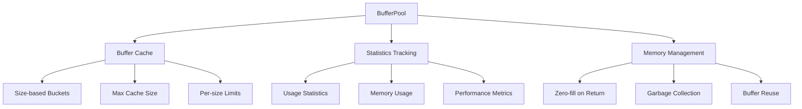

# BufferPool

Memory pool for `THREE.BufferAttribute` instances keyed by vertex count. Reduces GC churn for dynamic lines/trails.

## 🎯 Purpose

The `BufferPool` class provides an efficient memory management system for Three.js buffer attributes, particularly useful for dynamic geometries like orbital lines, trails, and particle systems. By reusing buffer instances instead of creating new ones, it significantly reduces garbage collection pressure and improves performance.

## 🏗️ Architecture

The `BufferPool` uses a size-based caching system with configurable limits:



## 🚀 Core Features

- **Size-based Caching**: Buffers are cached by vertex count for efficient retrieval
- **Memory Optimization**: Reduces garbage collection by reusing buffer instances
- **Statistics Tracking**: Monitor buffer usage and memory consumption
- **Configurable Limits**: Set maximum cache size and per-size limits
- **Zero-fill Safety**: Buffers are zero-filled on return to prevent data leakage
- **Garbage Collection**: Automatic cleanup of unused buffers

## 🔧 Key Methods

### Buffer Management

```typescript
// Get a buffer for the specified vertex count
getBuffer(vertexCount: number): Float32Array

// Get a buffer with specific item size (components per vertex)
getBufferWithItemSize(vertexCount: number, itemSize: number): Float32Array

// Release a buffer back to the pool
releaseBuffer(buffer: Float32Array): void
```

### Pool Management

```typescript
// Clear all cached buffers
clear(): void

// Force garbage collection of unused buffers
garbageCollect(): void

// Reset statistics counters
resetStats(): void
```

### Statistics and Monitoring

```typescript
// Get usage statistics
getStatistics(): BufferPoolStatistics

// Get current memory usage
getMemoryUsage(): number
```

## 📊 Technical Specifications

- **Buffer Type**: Float32Array for optimal performance
- **Caching Strategy**: Size-based buckets with configurable limits
- **Memory Management**: Automatic cleanup and garbage collection
- **Performance**: O(1) buffer retrieval and return operations
- **Safety**: Zero-fill on return prevents data leakage

## 💡 Usage Examples

### Basic Buffer Pool Usage

```typescript
import { BufferPool } from "@teskooano/renderer-threejs-helpers";

const bufferPool = new BufferPool({
  maxCachedBufferSize: 1000000, // 1M vertices
  maxBuffersPerSize: 10,
});

// Get a buffer for 1000 vertices
const buffer = bufferPool.getBuffer(1000);

// Use the buffer for geometry data
// ... populate buffer with vertex data ...

// Release the buffer back to the pool
bufferPool.releaseBuffer(buffer);
```

### Line Helper Integration

```typescript
// Used internally by LineHelper for orbital lines
const lineHelper = new LineHelper(bufferPool);

// Create a line with 500 vertices
const line = lineHelper.createLine(500);

// The buffer is automatically managed by the pool
// When the line is disposed, the buffer is returned to the pool
```

### Statistics Monitoring

```typescript
// Monitor buffer pool performance
const stats = bufferPool.getStatistics();
console.log(`Active buffers: ${stats.activeBuffers}`);
console.log(`Cached buffers: ${stats.cachedBuffers}`);
console.log(`Total allocations: ${stats.totalAllocations}`);

// Check memory usage
const memoryUsage = bufferPool.getMemoryUsage();
console.log(`Memory usage: ${memoryUsage} bytes`);
```

## ⚡ Performance Considerations

- **Memory Efficiency**: Reuses buffers to reduce garbage collection
- **Size-based Caching**: Efficient retrieval based on vertex count
- **Configurable Limits**: Prevents unlimited memory growth
- **Zero-fill Safety**: Ensures clean buffers on return
- **Statistics Tracking**: Monitor performance and memory usage

## 🔌 Integration Points

- **LineHelper**: Primary consumer for orbital line and trail buffers
- **threejs-orbits**: Uses buffer pool for orbital path rendering
- **threejs-celestial**: Utilizes buffer pool for celestial object trails
- **Performance Monitoring**: Provides statistics for performance analysis

## 🐛 Debug Features

- **Usage Statistics**: Track buffer allocations and releases
- **Memory Monitoring**: Monitor memory usage and growth
- **Performance Metrics**: Track cache hit rates and efficiency
- **Garbage Collection**: Manual cleanup for debugging memory issues

## 🔮 Future Enhancements

- **Multiple Buffer Types**: Support for different buffer types (Uint32Array, etc.)
- **Advanced Caching**: LRU-based cache eviction strategies
- **Memory Pressure Detection**: Automatic cleanup based on memory pressure
- **WebGPU Support**: Prepare for WebGPU buffer management

## 📚 Architecture Patterns

- **Pool Pattern**: Efficient object reuse and recycling
- **Factory Pattern**: Centralized buffer creation and management
- **Resource Management Pattern**: Automatic cleanup and disposal
- **Observer Pattern**: Statistics tracking and monitoring

## 📚 Related Documentation

- [[LineHelper]]: Primary consumer of buffer pool for line rendering
- [[CircularBuffer]]: Alternative buffer implementation for fixed-size data
- [[threejs-orbits]]: Orbital rendering system that uses buffer pool
- [[threejs-celestial]]: Celestial object rendering with trail support
