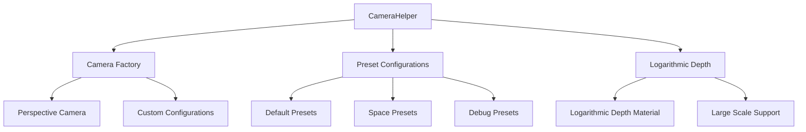

# CameraHelper

Creates `THREE.PerspectiveCamera` with presets and applies log-depth configuration when required.

## 🎯 Purpose

The `CameraHelper` class provides factory methods for creating optimized Three.js cameras with consistent defaults and configurations. It centralizes camera creation logic and applies recommended settings for the Teskooano renderer ecosystem, including logarithmic depth buffer support for large-scale scenes.

## 🏗️ Architecture

The `CameraHelper` uses a factory pattern with preset configurations:



## 🚀 Core Features

- **Camera Factory**: Centralized creation of PerspectiveCamera instances
- **Preset Configurations**: Pre-configured camera settings for common use cases
- **Logarithmic Depth**: Automatic logarithmic depth buffer configuration
- **Consistent Defaults**: Standardized camera settings across the renderer
- **Performance Optimization**: Optimized settings for 60fps rendering

## 🔧 Key Methods

### Camera Creation

```typescript
// Create a perspective camera with default settings
static createPerspectiveCamera(config?: CameraConfig): THREE.PerspectiveCamera

// Create camera with logarithmic depth support
static createLogDepthCamera(config?: LogDepthCameraConfig): THREE.PerspectiveCamera

// Create camera with specific presets
static createSpaceCamera(): THREE.PerspectiveCamera
static createDebugCamera(): THREE.PerspectiveCamera
```

## 📊 Technical Specifications

- **Camera Type**: THREE.PerspectiveCamera
- **Depth Buffer**: Logarithmic depth support for large-scale scenes
- **Performance**: Optimized for 60fps rendering
- **TypeScript**: Full type definitions included
- **Configuration**: Flexible configuration options

## 💡 Usage Examples

### Basic Camera Creation

```typescript
import { CameraHelper } from "@teskooano/renderer-threejs-helpers";

// Create a default perspective camera
const camera = CameraHelper.createPerspectiveCamera();

// Create camera with custom configuration
const customCamera = CameraHelper.createPerspectiveCamera({
  fov: 75,
  aspect: window.innerWidth / window.innerHeight,
  near: 0.1,
  far: 1000,
});
```

### Logarithmic Depth Camera

```typescript
// Create camera with logarithmic depth for large-scale scenes
const spaceCamera = CameraHelper.createLogDepthCamera({
  fov: 60,
  near: 0.001,
  far: 1000000,
});
```

### Preset Cameras

```typescript
// Create camera optimized for space scenes
const spaceCamera = CameraHelper.createSpaceCamera();

// Create camera for debugging
const debugCamera = CameraHelper.createDebugCamera();
```

## ⚡ Performance Considerations

- **Logarithmic Depth**: Essential for large-scale space scenes
- **Optimized Settings**: Pre-configured for optimal performance
- **Memory Efficiency**: Minimal memory footprint
- **Rendering Performance**: Optimized for 60fps rendering

## 🔌 Integration Points

- **threejs-core**: Used by SceneManager for scene initialization
- **threejs-camera**: Integrates with CameraManager for advanced camera control
- **threejs-controls**: Works with OrbitControls for camera interaction
- **LogarithmicDepthMaterial**: Applies logarithmic depth configuration

## 🐛 Debug Features

- **Debug Presets**: Pre-configured cameras for debugging
- **Logarithmic Depth**: Visual debugging for depth buffer issues
- **Performance Monitoring**: Built-in performance optimization

## 🔮 Future Enhancements

- **WebGPU Support**: Prepare for WebGPU camera pipeline
- **Advanced Presets**: More specialized camera configurations
- **Performance Profiling**: Enhanced performance monitoring
- **Custom Projections**: Support for custom projection matrices

## 📚 Architecture Patterns

- **Factory Pattern**: Centralized object creation with consistent defaults
- **Strategy Pattern**: Configurable camera algorithms and settings
- **Utility Pattern**: Static utility methods for common operations

## 📚 Related Documentation

- [[threejs-core|LogarithmicDepthMaterial]]: Logarithmic depth buffer implementation
- [[threejs-camera|CameraManager]]: Advanced camera management system
- [[threejs-controls]]: Camera controls and interaction systems
- [[SceneHelper]]: Scene creation and management utilities
