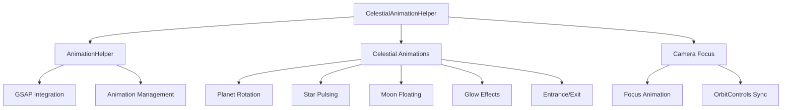

# CelestialAnimationHelper

Domain-specific animation helpers built atop [[AnimationHelper]] for planets, stars, moons, and camera focus.

## 🎯 Purpose

The `CelestialAnimationHelper` class provides specialized animation methods for celestial objects in space simulations. Built on top of the base `AnimationHelper`, it offers domain-specific animations like planet rotation, star pulsing, moon floating, and camera focus transitions that are commonly needed in astronomical visualizations.

## 🏗️ Architecture

The `CelestialAnimationHelper` extends the base animation system with celestial-specific behaviors:



## 🚀 Core Features

- **Planet Rotation**: Infinite Y-axis rotation for planetary bodies
- **Star Pulsing**: Scale-based pulsing animations for stars
- **Moon Floating**: Gentle bobbing motion for moons and satellites
- **Glow Effects**: Shader uniform animations for atmospheric effects
- **Entrance/Exit**: Fade and scale animations for object visibility
- **Camera Focus**: Smooth camera transitions to focus on celestial objects
- **OrbitControls Integration**: Synchronized camera control updates

## 🔧 Key Methods

### Celestial Object Animations

```typescript
// Create infinite planet rotation
createPlanetRotation(object: THREE.Object3D, rotationPeriod: number): string

// Create star pulsing animation
createStarPulse(object: THREE.Object3D, intensity: number, period: number): string

// Create moon floating animation
createMoonFloat(object: THREE.Object3D, amplitude: number, period: number): string

// Create glow animation for materials
createGlowAnimation(material: THREE.Material, min: number, max: number, period: number): string
```

### Visibility Animations

```typescript
// Create entrance animation (fade + scale in)
createEntranceAnimation(object: THREE.Object3D): string

// Create exit animation (fade + scale out)
createExitAnimation(object: THREE.Object3D): string
```

### Camera Focus

```typescript
// Create camera focus animation
createFocusAnimation(
  camera: THREE.PerspectiveCamera,
  object: THREE.Object3D,
  distance: number
): string
```

### Animation Management

```typescript
// Stop all animations for a specific object
stopCelestialAnimations(object: THREE.Object3D): void

// Dispose of the helper and clean up animations
dispose(): void
```

## 📊 Technical Specifications

- **Base Class**: Extends AnimationHelper functionality
- **Animation Engine**: GSAP 3.13.0
- **Performance**: Optimized for continuous celestial animations
- **TypeScript**: Full type definitions included
- **Memory Management**: Automatic cleanup and disposal

## 💡 Usage Examples

### Planet Rotation

```typescript
import { CelestialAnimationHelper } from "@teskooano/renderer-threejs-helpers";

const celestialAnimations = new CelestialAnimationHelper();

// Create a rotating planet (24-hour rotation period)
const planet = new THREE.Mesh(planetGeometry, planetMaterial);
const rotationId = celestialAnimations.createPlanetRotation(planet, 24);

// The planet will rotate continuously around its Y-axis
```

### Star Pulsing

```typescript
// Create a pulsing star
const star = new THREE.Mesh(starGeometry, starMaterial);
const pulseId = celestialAnimations.createStarPulse(star, 0.2, 3);

// The star will pulse with 20% scale variation over 3 seconds
```

### Moon Floating

```typescript
// Create a floating moon
const moon = new THREE.Mesh(moonGeometry, moonMaterial);
const floatId = celestialAnimations.createMoonFloat(moon, 1.5, 4);

// The moon will bob up and down with 1.5 unit amplitude over 4 seconds
```

### Camera Focus

```typescript
// Focus camera on a celestial object
const focusId = celestialAnimations.createFocusAnimation(
  camera,
  planet,
  50, // distance from object
);

// Camera will smoothly move to focus on the planet
```

### Glow Effects

```typescript
// Create atmospheric glow animation
const atmosphereMaterial = new THREE.ShaderMaterial({...});
const glowId = celestialAnimations.createGlowAnimation(
  atmosphereMaterial,
  0.5, // min intensity
  1.0, // max intensity
  2.0  // period in seconds
);
```

## ⚡ Performance Considerations

- **Continuous Animations**: Optimized for long-running celestial animations
- **Memory Management**: Proper cleanup prevents memory leaks
- **GSAP Integration**: Leverages GSAP's optimized animation engine
- **Batch Operations**: Efficient animation management for multiple objects

## 🔌 Integration Points

- **AnimationHelper**: Built on top of the base animation system
- **threejs-celestial**: Primary consumer for celestial object animations
- **threejs-controls**: Integrates with OrbitControls for camera focus
- **threejs-camera**: Works with camera management systems

## 🐛 Debug Features

- **Animation Tracking**: Monitor active celestial animations
- **Object-specific Control**: Stop animations per celestial object
- **Performance Monitoring**: Track animation performance and memory usage

## 🔮 Future Enhancements

- **Orbital Animations**: Add orbital motion animations
- **Seasonal Effects**: Support for seasonal variations
- **Atmospheric Effects**: Enhanced atmospheric animation support
- **Performance Profiling**: Advanced performance monitoring

## 📚 Architecture Patterns

- **Decorator Pattern**: Extends base AnimationHelper with celestial-specific functionality
- **Strategy Pattern**: Configurable animation algorithms for different celestial objects
- **Manager Pattern**: Centralized management of celestial animations
- **Resource Management Pattern**: Automatic cleanup and disposal

## 📚 Related Documentation

- [[AnimationHelper]]: Base animation system that this helper extends
- [[threejs-celestial]]: Celestial object rendering system
- [[threejs-controls]]: Camera controls and interaction systems
- [[threejs-camera]]: Camera management and control systems
