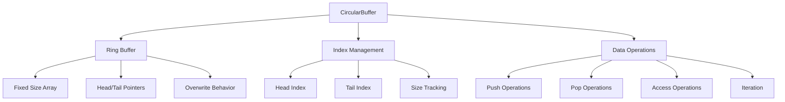

# CircularBuffer<T>

Generic fixed-size ring buffer with O(1) push/pop and iterators. Ideal for history (e.g., trails) without reallocations.

## 🎯 Purpose

The `CircularBuffer<T>` class provides a high-performance, fixed-size circular buffer implementation that maintains a sliding window of data. It's optimized for scenarios where you need to maintain a history of recent data points, such as object trails, position history, or time-series data, without the memory overhead of dynamic arrays.

## 🏗️ Architecture

The `CircularBuffer` uses a ring buffer architecture with efficient O(1) operations:



## 🚀 Core Features

- **Fixed Size**: Pre-allocated buffer prevents memory growth
- **O(1) Operations**: Constant time push, pop, and access operations
- **Overwrite Behavior**: Automatically overwrites oldest data when full
- **Iteration Support**: Forward and reverse iteration with Symbol.iterator
- **Batch Operations**: Efficient batch push and retrieval operations
- **Statistics Tracking**: Built-in usage statistics and monitoring
- **Resize Support**: Dynamic resizing while preserving recent data

## 🔧 Key Methods

### Core Operations

```typescript
// Add single item to buffer
push(item: T): void

// Add multiple items to buffer
pushMany(items: T[]): void

// Remove and return oldest item
pop(): T | undefined

// Remove and return newest item
take(): T | undefined

// Clear all items from buffer
clear(): void
```

### Access Operations

```typescript
// Get item at specific index (0 = oldest)
getAt(index: number): T | undefined

// Get most recent item without removing
peek(): T | undefined

// Get oldest item without removing
peekOldest(): T | undefined

// Get last item (same as peek)
getLast(): T | undefined

// Get all items in chronological order
getOrderedItems(): T[]
```

### Buffer Management

```typescript
// Resize buffer while preserving recent data
resize(newSize: number): void

// Check if buffer is empty
isEmpty(): boolean

// Check if buffer is full
isFull(): boolean

// Get current number of items
size(): number

// Get fill percentage (0-1)
fillPercentage(): number
```

### Statistics and Monitoring

```typescript
// Get usage statistics
getStatistics(): CircularBufferStatistics

// Reset statistics counters
resetStats(): void
```

### Iteration

```typescript
// Forward iteration (oldest to newest)
[Symbol.iterator](): Iterator<T>

// Reverse iteration (newest to oldest)
reverseIterator(): Iterator<T>

// Find first item matching predicate
find(predicate: (item: T) => boolean): T | undefined

// Filter items matching predicate
filter(predicate: (item: T) => boolean): T[]

// Map items to new values
map<U>(mapper: (item: T) => U): U[]
```

## 📊 Technical Specifications

- **Data Structure**: Ring buffer with fixed-size array
- **Time Complexity**: O(1) for push, pop, peek operations
- **Space Complexity**: O(n) where n is buffer size
- **Memory Management**: No dynamic allocations after initialization
- **TypeScript**: Full generic type support

## 💡 Usage Examples

### Basic Usage

```typescript
import { CircularBuffer } from "@teskooano/renderer-threejs-helpers";

// Create buffer for position history
const positionBuffer = new CircularBuffer<THREE.Vector3>(100);

// Add positions
positionBuffer.push(new THREE.Vector3(0, 0, 0));
positionBuffer.push(new THREE.Vector3(1, 0, 0));
positionBuffer.push(new THREE.Vector3(2, 0, 0));

// Get recent positions
const recentPosition = positionBuffer.peek();
const oldestPosition = positionBuffer.peekOldest();
```

### Trail Rendering

```typescript
// Create buffer for object trail
const trailBuffer = new CircularBuffer<THREE.Vector3>(50);

// Update trail in animation loop
function updateTrail(object: THREE.Object3D) {
  // Add current position to trail
  trailBuffer.push(object.position.clone());

  // Get trail positions for rendering
  const trailPositions = trailBuffer.getOrderedItems();

  // Update line geometry with trail positions
  updateTrailGeometry(trailPositions);
}
```

### Batch Operations

```typescript
// Add multiple items at once
const positions = [
  new THREE.Vector3(0, 0, 0),
  new THREE.Vector3(1, 0, 0),
  new THREE.Vector3(2, 0, 0),
];

trailBuffer.pushMany(positions);

// Get all items in order
const allPositions = trailBuffer.getOrderedItems();
```

### Iteration

```typescript
// Forward iteration (oldest to newest)
for (const position of trailBuffer) {
  console.log(position);
}

// Reverse iteration (newest to oldest)
for (const position of trailBuffer.reverseIterator()) {
  console.log(position);
}

// Find specific position
const foundPosition = trailBuffer.find((pos) => pos.x > 5);

// Filter positions
const highPositions = trailBuffer.filter((pos) => pos.y > 10);
```

### Statistics Monitoring

```typescript
// Monitor buffer usage
const stats = trailBuffer.getStatistics();
console.log(`Buffer size: ${stats.size}`);
console.log(`Fill percentage: ${stats.fillPercentage * 100}%`);
console.log(`Total pushes: ${stats.totalPushes}`);

// Reset statistics
trailBuffer.resetStats();
```

### Dynamic Resizing

```typescript
// Resize buffer while preserving recent data
trailBuffer.resize(200); // Increase size
trailBuffer.resize(50); // Decrease size (keeps most recent 50 items)
```

## ⚡ Performance Considerations

- **Memory Efficiency**: Fixed-size allocation prevents memory growth
- **O(1) Operations**: Constant time operations for optimal performance
- **No Garbage Collection**: Reuses existing array slots
- **Batch Operations**: Efficient bulk operations for multiple items
- **Statistics Tracking**: Minimal overhead for monitoring

## 🔌 Integration Points

- **LineHelper**: Used for efficient trail and path rendering
- **threejs-orbits**: Utilizes for orbital path history
- **threejs-celestial**: Used for celestial object trails
- **Performance Monitoring**: Provides statistics for performance analysis

## 🐛 Debug Features

- **Usage Statistics**: Track buffer usage and performance
- **Fill Monitoring**: Monitor buffer fill percentage
- **Iteration Support**: Easy debugging with forward/reverse iteration
- **Size Validation**: Built-in size and capacity validation

## 🔮 Future Enhancements

- **Compression**: Support for data compression in large buffers
- **Serialization**: Built-in serialization for buffer persistence
- **Advanced Statistics**: More detailed performance metrics
- **Memory Pooling**: Integration with memory pool systems

## 📚 Architecture Patterns

- **Ring Buffer Pattern**: Efficient circular data structure
- **Resource Management Pattern**: Fixed-size resource management
- **Iterator Pattern**: Standard iteration interface
- **Statistics Pattern**: Built-in performance monitoring

## 📚 Related Documentation

- [[BufferPool]]: Memory management system for dynamic buffers
- [[LineHelper]]: Line rendering system that uses circular buffers
- [[threejs-orbits]]: Orbital rendering with path history
- [[threejs-celestial]]: Celestial object rendering with trails
