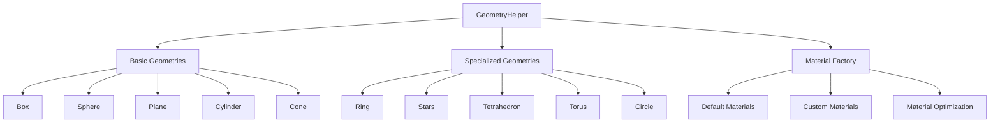

# GeometryHelper

Convenience factory for common meshes with consistent material defaults and transform helpers; includes a fast starfield creator.

## 🎯 Purpose

The `GeometryHelper` class provides a comprehensive factory for creating common Three.js geometries and meshes with consistent material defaults and optimized settings. It simplifies the creation of standard 3D shapes and includes specialized methods for astronomical objects like rings and starfields.

## 🏗️ Architecture

The `GeometryHelper` uses a factory pattern with consistent material defaults:



## 🚀 Core Features

- **Basic Geometries**: Factory methods for common 3D shapes
- **Specialized Geometries**: Custom geometries for astronomical objects
- **Material Management**: Consistent material defaults and optimization
- **Starfield Generation**: Fast creation of particle-based starfields
- **Ring Geometry**: Specialized ring geometry for planetary rings
- **Performance Optimization**: Optimized settings for 60fps rendering

## 🔧 Key Methods

### Basic Geometry Creation

```typescript
// Create basic 3D shapes
static createBox(size?: number): THREE.Mesh
static createSphere(radius?: number, segments?: number): THREE.Mesh
static createPlane(width?: number, height?: number): THREE.Mesh
static createCylinder(radius?: number, height?: number): THREE.Mesh
static createCone(radius?: number, height?: number): THREE.Mesh
```

### Specialized Geometries

```typescript
// Create specialized geometries
static createRing(innerRadius: number, outerRadius: number, material?: THREE.Material): THREE.Mesh
static createCircle(radius: number, segments?: number): THREE.Mesh
static createTetrahedron(radius?: number): THREE.Mesh
static createTorus(radius?: number, tube?: number): THREE.Mesh
```

### Starfield Generation

```typescript
// Create particle-based starfield
static createStars(
  amount: number,
  color?: THREE.Color,
  size?: number,
  spread?: number
): THREE.Points
```

## 📊 Technical Specifications

- **Geometry Types**: Standard Three.js geometries with optimized parameters
- **Material System**: Consistent material defaults and customization
- **Performance**: Optimized for 60fps rendering
- **TypeScript**: Full type definitions included
- **Memory Management**: Efficient geometry creation and disposal

## 💡 Usage Examples

### Basic Geometry Creation

```typescript
import { GeometryHelper } from "@teskooano/renderer-threejs-helpers";

// Create a basic cube
const cube = GeometryHelper.createBox(2);

// Create a sphere with custom segments
const sphere = GeometryHelper.createSphere(1, 32);

// Create a plane
const plane = GeometryHelper.createPlane(10, 10);
```

### Specialized Geometries

```typescript
// Create a planetary ring
const ring = GeometryHelper.createRing(5, 8, customRingMaterial);

// Create a starfield
const stars = GeometryHelper.createStars(
  1000,
  new THREE.Color(0xffffff),
  2,
  100,
);

// Create a tetrahedron
const tetrahedron = GeometryHelper.createTetrahedron(1);
```

### Custom Materials

```typescript
// Create geometry with custom material
const customMaterial = new THREE.MeshBasicMaterial({ color: 0xff0000 });
const customBox = GeometryHelper.createBox(1);
customBox.material = customMaterial;

// Create ring with custom material
const ringMaterial = new THREE.MeshBasicMaterial({
  color: 0x888888,
  transparent: true,
  opacity: 0.8,
});
const ring = GeometryHelper.createRing(3, 5, ringMaterial);
```

### Starfield Configuration

```typescript
// Create a dense starfield
const starfield = GeometryHelper.createStars(
  5000, // 5000 stars
  new THREE.Color(0xffffff), // white color
  1, // size
  200, // spread radius
);

// Add to scene
scene.add(starfield);
```

## ⚡ Performance Considerations

- **Geometry Optimization**: Pre-configured optimal parameters for performance
- **Material Efficiency**: Consistent material defaults reduce draw calls
- **Starfield Performance**: Optimized particle system for large starfields
- **Memory Management**: Efficient geometry creation and disposal

## 🔌 Integration Points

- **threejs-celestial**: Used for creating celestial object geometries
- **threejs-orbits**: Utilizes ring geometry for orbital visualizations
- **threejs-background**: Uses starfield generation for background stars
- **threejs-core**: Provides geometry creation for scene setup

## 🐛 Debug Features

- **Geometry Validation**: Ensures proper geometry parameters
- **Material Debugging**: Consistent material defaults for debugging
- **Performance Monitoring**: Optimized settings for performance analysis

## 🔮 Future Enhancements

- **WebGPU Support**: Prepare for WebGPU geometry pipeline
- **Advanced Geometries**: More specialized astronomical geometries
- **LOD Support**: Level-of-detail geometry generation
- **Procedural Generation**: Advanced procedural geometry creation

## 📚 Architecture Patterns

- **Factory Pattern**: Centralized object creation with consistent defaults
- **Strategy Pattern**: Configurable geometry algorithms and parameters
- **Utility Pattern**: Static utility methods for common operations

## 📚 Related Documentation

- [[threejs-celestial/threejs-celestial|Three.js Celestial]]: Celestial object rendering system
- [[threejs-orbits/threejs-orbits|Three.js Orbits]]: Orbital mechanics and visualization
- [[threejs-background/threejs-background|Three.js Background]]: Background rendering and starfields
- [[threejs-core/threejs-core|Three.js Core]]: Core rendering infrastructure
