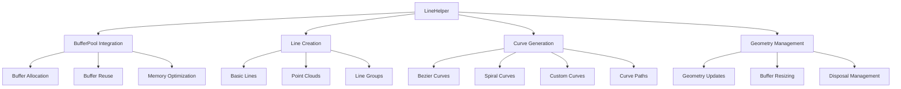

# LineHelper

Efficient creation and updates of buffered line/points geometries with a backing [[BufferPool]]. Used heavily by orbit/trail renderers.

## 🎯 Purpose

The `LineHelper` class provides efficient creation and management of line and point geometries for orbital paths, trails, and other continuous line-based visualizations. It integrates with the `BufferPool` system to minimize memory allocation and garbage collection, making it ideal for dynamic orbital rendering and particle trails.

## 🏗️ Architecture

The `LineHelper` integrates with the buffer pool system for efficient memory management:



## 🚀 Core Features

- **Buffer Pool Integration**: Efficient memory management with reusable buffers
- **Line Creation**: Fast creation of line and point geometries
- **Curve Generation**: Support for various curve types (Bezier, spiral, custom)
- **Dynamic Updates**: Efficient geometry updates without reallocation
- **Performance Optimization**: Optimized for continuous path rendering
- **Memory Management**: Automatic buffer disposal and cleanup

## 🔧 Key Methods

### Line Creation and Management

```typescript
// Create a line with specified vertex count
createLine(vertexCount: number): THREE.Line

// Update line geometry with new positions
updateLine(line: THREE.Line, positions: Float32Array): void

// Resize line buffer when capacity grows
resizeLineBuffer(line: THREE.Line, newCapacity: number): void

// Dispose of a line and return buffer to pool
disposeLine(line: THREE.Line): void

// Clear all lines and return buffers to pool
clear(): void
```

### Curve Generation

```typescript
// Create line from curve
createLineCurve(curve: THREE.Curve<THREE.Vector3>, segments?: number): THREE.Line

// Create quadratic Bezier curve
createQuadraticBezierCurve(
  start: THREE.Vector3,
  control: THREE.Vector3,
  end: THREE.Vector3,
  segments?: number
): THREE.Line

// Create cubic Bezier curve
createCubicBezierCurve(
  start: THREE.Vector3,
  control1: THREE.Vector3,
  control2: THREE.Vector3,
  end: THREE.Vector3,
  segments?: number
): THREE.Line

// Create custom curve
createCustomCurve(points: THREE.Vector3[], segments?: number): THREE.Line

// Create curve path from multiple curves
createCurvePath(curves: THREE.Curve<THREE.Vector3>[]): THREE.Line
```

### Point and Spiral Generation

```typescript
// Create line from points
createLineFromPoints(points: THREE.Vector3[]): THREE.Line

// Create points from points
createPointsFromPoints(points: THREE.Vector3[]): THREE.Points

// Create spiral points
createSpiralPoints(radius: number, height: number, turns: number, segments: number): THREE.Vector3[]

// Create spiral lines group
createSpiralLinesGroup(spirals: SpiralConfig[]): THREE.Group
```

### Geometry Updates

```typescript
// Update lines group
updateLinesGroup(group: THREE.Group, data: LineGroupData): void

// Update geometry from curve
updateGeometryFromCurve(geometry: THREE.BufferGeometry, curve: THREE.Curve<THREE.Vector3>): void

// Create curve alpha function
createCurveAlphaFunction(curve: THREE.Curve<THREE.Vector3>): (t: number) => number
```

## 📊 Technical Specifications

- **Buffer Management**: Integration with BufferPool for memory efficiency
- **Performance**: Optimized for continuous path rendering
- **Geometry Types**: Lines, points, and line groups
- **Curve Support**: Bezier, spiral, and custom curves
- **Memory Management**: Automatic buffer disposal and cleanup

## 💡 Usage Examples

### Basic Line Creation

```typescript
import { LineHelper, BufferPool } from '@teskooano/renderer-threejs-helpers';

const bufferPool = new BufferPool();
const lineHelper = new LineHelper(bufferPool);

// Create a line with 100 vertices
const line = lineHelper.createLine(100);

// Update line with new positions
const positions = new Float32Array([...]); // vertex positions
lineHelper.updateLine(line, positions);
```

### Orbital Path Creation

```typescript
// Create orbital path using Bezier curve
const orbitalPath = lineHelper.createQuadraticBezierCurve(
  new THREE.Vector3(0, 0, 0), // start
  new THREE.Vector3(50, 0, 0), // control point
  new THREE.Vector3(0, 0, 0), // end (closed orbit)
  64, // segments
);

// Add to scene
scene.add(orbitalPath);
```

### Spiral Generation

```typescript
// Create spiral points
const spiralPoints = lineHelper.createSpiralPoints(10, 20, 3, 100);

// Create line from spiral points
const spiralLine = lineHelper.createLineFromPoints(spiralPoints);
```

### Dynamic Line Updates

```typescript
// Create line for dynamic updates
const dynamicLine = lineHelper.createLine(500);

// Update line geometry in animation loop
function animate() {
  // Generate new positions based on time
  const newPositions = generatePositions(Date.now());
  lineHelper.updateLine(dynamicLine, newPositions);

  requestAnimationFrame(animate);
}
```

### Line Groups

```typescript
// Create multiple spiral lines
const spiralConfigs = [
  { radius: 10, height: 20, turns: 2, segments: 50 },
  { radius: 15, height: 25, turns: 3, segments: 75 },
];

const spiralGroup = lineHelper.createSpiralLinesGroup(spiralConfigs);
scene.add(spiralGroup);
```

## ⚡ Performance Considerations

- **Buffer Pooling**: Reuses buffers to minimize garbage collection
- **Frustum Culling**: Disabled for continuous path rendering
- **Dynamic Updates**: Efficient geometry updates without reallocation
- **Memory Management**: Automatic cleanup prevents memory leaks

## 🔌 Integration Points

- **BufferPool**: Primary integration for memory management
- **threejs-orbits**: Used for orbital path rendering
- **threejs-celestial**: Utilizes for celestial object trails
- **threejs-core**: Provides line rendering capabilities

## 🐛 Debug Features

- **Buffer Statistics**: Monitor buffer usage and memory consumption
- **Performance Metrics**: Track line creation and update performance
- **Geometry Validation**: Ensure proper geometry parameters
- **Memory Monitoring**: Track memory usage and cleanup

## 🔮 Future Enhancements

- **WebGPU Support**: Prepare for WebGPU line rendering
- **Advanced Curves**: More sophisticated curve generation algorithms
- **LOD Support**: Level-of-detail for line rendering
- **Performance Profiling**: Enhanced performance monitoring

## 📚 Architecture Patterns

- **Pool Pattern**: Integration with BufferPool for memory efficiency
- **Factory Pattern**: Centralized line and curve creation
- **Resource Management Pattern**: Automatic cleanup and disposal
- **Strategy Pattern**: Configurable curve generation algorithms

## 📚 Related Documentation

- [[BufferPool]]: Memory management system for line buffers
- [[CircularBuffer]]: Alternative buffer implementation
- [[threejs-orbits]]: Orbital rendering system
- [[threejs-celestial]]: Celestial object rendering with trails
