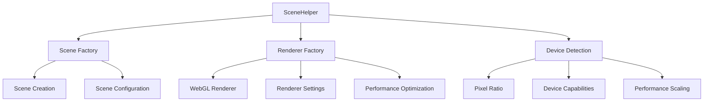

# SceneHelper

Factory utilities to create optimized `THREE.Scene` and `THREE.WebGLRenderer` instances with recommended defaults for the Teskooano renderer.

## 🎯 Purpose

The `SceneHelper` class provides factory methods for creating optimized Three.js scenes and WebGL renderers with consistent defaults and device-aware configurations. It centralizes the setup of tone mapping, shadow maps, pixel ratio, and other renderer settings to ensure consistent behavior across the Teskooano renderer ecosystem.

## 🏗️ Architecture

The `SceneHelper` uses a factory pattern with device-aware configuration:



## 🚀 Core Features

- **Scene Factory**: Centralized creation of Three.js scenes
- **Renderer Factory**: Optimized WebGL renderer creation
- **Device Awareness**: Automatic device capability detection and configuration
- **Performance Optimization**: Pre-configured settings for optimal performance
- **Consistent Defaults**: Standardized settings across the renderer
- **Tone Mapping**: Proper tone mapping configuration for realistic rendering

## 🔧 Key Methods

### Scene Creation

```typescript
// Create optimized scene
static createScene(): THREE.Scene

// Create scene with custom configuration
static createScene(config: SceneConfig): THREE.Scene
```

### Renderer Creation

```typescript
// Create optimized WebGL renderer
static createRenderer(canvas?: HTMLCanvasElement): THREE.WebGLRenderer

// Create renderer with custom configuration
static createRenderer(config: RendererConfig): THREE.WebGLRenderer

// Create renderer with device-aware settings
static createDeviceAwareRenderer(canvas?: HTMLCanvasElement): THREE.WebGLRenderer
```

## 📊 Technical Specifications

- **Scene Type**: THREE.Scene with optimized settings
- **Renderer Type**: THREE.WebGLRenderer with performance optimizations
- **Device Detection**: Automatic pixel ratio and capability detection
- **Performance**: Optimized for 60fps rendering
- **TypeScript**: Full type definitions included

## 💡 Usage Examples

### Basic Scene and Renderer Creation

```typescript
import { SceneHelper } from "@teskooano/renderer-threejs-helpers";

// Create optimized scene
const scene = SceneHelper.createScene();

// Create optimized renderer
const renderer = SceneHelper.createRenderer();

// Set up renderer
renderer.setSize(window.innerWidth, window.innerHeight);
document.body.appendChild(renderer.domElement);
```

### Device-Aware Renderer

```typescript
// Create renderer with automatic device detection
const renderer = SceneHelper.createDeviceAwareRenderer();

// The renderer will automatically configure:
// - Pixel ratio based on device capabilities
// - Shadow map size based on performance
// - Tone mapping for realistic rendering
// - Antialiasing based on device support
```

### Custom Configuration

```typescript
// Create scene with custom configuration
const scene = SceneHelper.createScene({
  fog: new THREE.Fog(0x000000, 1, 1000),
  background: new THREE.Color(0x000000),
});

// Create renderer with custom settings
const renderer = SceneHelper.createRenderer({
  canvas: customCanvas,
  antialias: true,
  alpha: true,
  powerPreference: "high-performance",
});
```

### Integration with SceneManager

```typescript
// Used by SceneManager for initialization
import { SceneHelper } from "@teskooano/renderer-threejs-helpers";

class SceneManager {
  constructor() {
    this.scene = SceneHelper.createScene();
    this.renderer = SceneHelper.createDeviceAwareRenderer();
  }
}
```

## ⚡ Performance Considerations

- **Device Detection**: Automatic performance scaling based on device capabilities
- **Pixel Ratio**: Optimized pixel ratio for different screen densities
- **Shadow Maps**: Balanced shadow quality vs performance
- **Tone Mapping**: Proper tone mapping for realistic rendering
- **Memory Management**: Efficient renderer configuration

## 🔌 Integration Points

- **threejs-core**: Used by SceneManager for scene initialization
- **threejs-background**: Provides renderer access for background rendering
- **threejs-celestial**: Integrates with celestial rendering systems
- **threejs-camera**: Works with camera management systems

## 🐛 Debug Features

- **Device Information**: Log device capabilities and configuration
- **Performance Monitoring**: Track renderer performance and settings
- **Configuration Validation**: Ensure proper renderer settings

## 🔮 Future Enhancements

- **WebGPU Support**: Prepare for WebGPU renderer pipeline
- **Advanced Device Detection**: More sophisticated device capability detection
- **Performance Profiling**: Enhanced performance monitoring and optimization
- **Custom Renderers**: Support for custom renderer configurations

## 📚 Architecture Patterns

- **Factory Pattern**: Centralized object creation with consistent defaults
- **Strategy Pattern**: Configurable algorithms based on device capabilities
- **Utility Pattern**: Static utility methods for common operations

## 📚 Related Documentation

- [[threejs-core|SceneManager]]: Scene management system that uses SceneHelper
- [[threejs-background|BackgroundManager]]: Background rendering system
- [[threejs-celestial]]: Celestial object rendering system
- [[threejs-camera]]: Camera management and control systems
