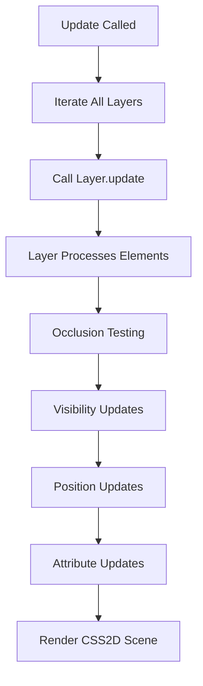

# Layer2DManager

The central orchestrator for all CSS2D rendered UI elements, organized into distinct layers for different types of labels and UI components.

## 🎯 Purpose

The `Layer2DManager` provides a unified interface for managing all 2D UI elements that overlay the 3D scene. It handles the core CSS2DRenderer setup and provides an organized layer system for different types of labels, each with their own specialized logic and components.

## 🏗️ Architecture

### Core Components

- **CSS2DRenderer**: The underlying Three.js renderer for 2D HTML elements
- **Layer Registry**: Map-based system for organizing different label types
- **Component Registration**: Automatic registration of required web components
- **Scene Integration**: Seamless integration with the main Three.js scene

### Layer Types

```typescript
enum CSS2DLayerType {
  CELESTIAL_LABELS = "celestial-labels",
  TOOLTIPS = "tooltips",
  AU_MARKERS = "au-markers",
  PREDICTION_LABELS = "prediction-labels",
}
```

### Layer Management Strategy

- **Dedicated Layers**: Each label type has its own specialized layer
- **Component Isolation**: Layers manage their own web components and logic
- **Unified Interface**: Common interface for all layer operations
- **Automatic Cleanup**: Proper disposal and resource management

## 🔧 Core Methods

### Constructor

```typescript
constructor(scene: THREE.Scene, container: HTMLElement)
```

- **scene**: The main Three.js scene for 3D object positioning
- **container**: HTML element that hosts the renderer's canvas
- **Initialization**: Creates CSS2DRenderer and sets up DOM integration

### Layer Registration

```typescript
registerLayer(layerType: CSS2DLayerType, layer: BaseLabelLayer): void
```

- **layerType**: Enum key identifying the layer type
- **layer**: Instance of a BaseLabelLayer subclass
- **Component Registration**: Automatically registers required web components
- **Overwrite Protection**: Warns if layer type already exists

### Layer Retrieval

```typescript
getLayer(layerType: CSS2DLayerType): BaseLabelLayer | undefined
```

- **Returns**: The registered layer instance or undefined
- **Type Safety**: Uses enum for type-safe layer access

### Update Cycle

```typescript
update(camera: THREE.PerspectiveCamera, objectManager: ObjectManager): void
```

- **camera**: Current camera for visibility calculations
- **objectManager**: Access to celestial objects for occlusion testing
- **Delegation**: Calls update on all registered layers
- **Performance**: Efficient batch processing of all layers

### Element Management

```typescript
removeElement(layerType: CSS2DLayerType, id: string): void
setLayerVisibility(layerType: CSS2DLayerType, visible: boolean): void
clearLayer(layerType: CSS2DLayerType): void
```

- **Element Removal**: Removes specific elements from layers
- **Visibility Control**: Global visibility toggle for entire layers
- **Layer Clearing**: Complete cleanup of layer contents

### Rendering

```typescript
render(camera: THREE.PerspectiveCamera): void
```

- **camera**: Camera to use for rendering
- **CSS2DRenderer**: Delegates to the underlying CSS2DRenderer
- **Update Separation**: Rendering separated from update logic

### Instance Control

```typescript
showInstance(layer: CSS2DLayerType, id: string): void
hideInstance(layer: CSS2DLayerType, id: string): void
```

- **Individual Control**: Show/hide specific instances within layers
- **Layer Integration**: Works with layer's visibility state
- **Element Access**: Direct access to CSS2DObject instances

## 🔄 Update Flow



## 🚀 Usage Example

```typescript
// Create the manager
const layer2DManager = new Layer2DManager(scene, container);

// Register celestial label layer
const celestialLayer = new CelestialLabelLayer(scene);
layer2DManager.registerLayer(CSS2DLayerType.CELESTIAL_LABELS, celestialLayer);

// Register AU marker layer
const auMarkerLayer = new AuMarkerLabelLayer(scene);
layer2DManager.registerLayer(CSS2DLayerType.AU_MARKERS, auMarkerLayer);

// Update cycle (called each frame)
layer2DManager.update(camera, objectManager);

// Render the 2D scene
layer2DManager.render(camera);

// Control layer visibility
layer2DManager.setLayerVisibility(CSS2DLayerType.CELESTIAL_LABELS, false);

// Remove specific elements
layer2DManager.removeElement(CSS2DLayerType.CELESTIAL_LABELS, "earth-label");

// Clean up
layer2DManager.dispose();
```

## 🔗 Integration Points

### Three.js Integration

- **Scene**: Labels positioned relative to 3D objects
- **Camera**: Camera position used for visibility and occlusion
- **CSS2DRenderer**: Underlying renderer for HTML element overlay
- **ObjectManager**: Access to celestial objects for occlusion testing

### Layer Integration

- **BaseLabelLayer**: All layers inherit from this abstract class
- **Component Registration**: Automatic web component registration
- **Update Delegation**: Centralized update cycle management
- **Resource Management**: Proper cleanup and disposal

### Performance Integration

- **Update Throttling**: Layers handle their own update frequency
- **Occlusion Testing**: Delegated to individual layers
- **Visibility Culling**: Distance and LOD-based culling
- **Memory Management**: Automatic cleanup of unused elements

## 🎯 Performance Considerations

### Renderer Setup

- **CSS2DRenderer**: Efficient 2D HTML rendering
- **DOM Integration**: Minimal DOM manipulation
- **Canvas Positioning**: Absolute positioning for overlay effect
- **Pointer Events**: Disabled to prevent interference with 3D interaction

### Layer Management

- **Map-Based Registry**: O(1) layer access and retrieval
- **Component Caching**: Web components registered once per layer type
- **Update Delegation**: Efficient batch processing
- **Memory Cleanup**: Proper disposal of layers and elements

### Update Optimization

- **Batch Updates**: All layers updated in single cycle
- **Conditional Updates**: Layers handle their own update frequency
- **Occlusion Delegation**: Individual layers manage occlusion testing
- **Visibility Caching**: Layers cache visibility states

## 🔍 Debug Features

### Layer Debugging

- **Layer Registry**: Inspect registered layers and their types
- **Component Registration**: Track web component registration
- **Update Performance**: Monitor update cycle performance
- **Memory Usage**: Track layer and element memory usage

### Renderer Debugging

- **CSS2DRenderer State**: Inspect renderer configuration
- **DOM Integration**: Verify DOM element positioning
- **Canvas Setup**: Check canvas size and positioning
- **Event Handling**: Monitor pointer event configuration

## 📚 Related Components

- **[[BaseLabelLayer]]** - Abstract base class for all layers
- **[[CelestialLabelLayer]]** - Celestial body labels
- **[[AuMarkerLabelLayer]]** - AU distance marker labels
- **[[PredictionLabelLayer]]** - Trajectory prediction labels
- **[[LabelSystem Interface]]** - System configuration interface

## 🚀 Core Features

### 1. Layer Management System

- **Multi-Layer Architecture**: Organized layers for different label types
- **CSS2D Integration**: HTML elements rendered in 3D space
- **Dynamic Visibility**: Distance and occlusion-based visibility rules
- **Performance Optimization**: Caching, throttling, and efficient updates

### 2. Component Registration

- **Automatic Registration**: Web components registered automatically
- **Type Safety**: Enum-based layer type identification
- **Overwrite Protection**: Warns if layer type already exists
- **Component Isolation**: Layers manage their own web components

### 3. Update and Rendering

- **Centralized Updates**: All layers updated in single cycle
- **Efficient Rendering**: Delegates to underlying CSS2DRenderer
- **Performance Monitoring**: Track update and render performance
- **Resource Management**: Proper cleanup and disposal

## ⚡ Performance Considerations

### Renderer Setup

- **CSS2DRenderer**: Efficient 2D HTML rendering
- **DOM Integration**: Minimal DOM manipulation
- **Canvas Positioning**: Absolute positioning for overlay effect
- **Pointer Events**: Disabled to prevent interference with 3D interaction

### Layer Management

- **Map-Based Registry**: O(1) layer access and retrieval
- **Component Caching**: Web components registered once per layer type
- **Update Delegation**: Efficient batch processing
- **Memory Cleanup**: Proper disposal of layers and elements

### Update Optimization

- **Batch Updates**: All layers updated in single cycle
- **Conditional Updates**: Layers handle their own update frequency
- **Occlusion Delegation**: Individual layers manage occlusion testing
- **Visibility Caching**: Layers cache visibility states

## 🔌 Integration Points

### Three.js Integration

- **Scene**: Labels positioned relative to 3D objects
- **Camera**: Camera position used for visibility and occlusion
- **CSS2DRenderer**: Underlying renderer for HTML element overlay
- **ObjectManager**: Access to celestial objects for occlusion testing

### Layer Integration

- **BaseLabelLayer**: All layers inherit from this abstract class
- **Component Registration**: Automatic web component registration
- **Update Delegation**: Centralized update cycle management
- **Resource Management**: Proper cleanup and disposal

### Performance Integration

- **Update Throttling**: Layers handle their own update frequency
- **Occlusion Testing**: Delegated to individual layers
- **Visibility Culling**: Distance and LOD-based culling
- **Memory Management**: Automatic cleanup of unused elements

## 🔮 Future Enhancements

### Performance Optimizations

- **Web Workers**: Offload layer updates to background threads
- **GPU Rendering**: GPU-based rendering for better performance
- **Spatial Indexing**: Octree or BVH for faster layer queries
- **Predictive Updates**: Predict layer updates based on camera movement

### Feature Enhancements

- **Dynamic Layer Creation**: Create layers dynamically based on needs
- **Layer Clustering**: Group similar layers for better performance
- **Interactive Layers**: Clickable layers with hover effects
- **Layer Animations**: Smooth transitions for layer appearance/disappearance

### Integration Improvements

- **VR/AR Support**: Enhanced support for immersive environments
- **Mobile Optimization**: Touch-friendly layer interactions
- **Accessibility**: Screen reader support and keyboard navigation
- **Internationalization**: Multi-language layer support

## 📚 Architecture Patterns

- **Manager Pattern**: Centralized orchestration of multiple layers
- **Registry Pattern**: Map-based layer registration and retrieval
- **Delegate Pattern**: Update and rendering delegation to layers
- **Factory Pattern**: Automatic component registration and creation
- **Observer Pattern**: Layer updates triggered by external events

## 📚 Related Documentation

- **[[BaseLabelLayer]]** - Abstract base class for all layers
- **[[CelestialLabelLayer]]** - Celestial body labels
- **[[AuMarkerLabelLayer]]** - AU distance marker labels
- **[[PredictionLabelLayer]]** - Trajectory prediction labels
- **[[LabelSystem Interface]]** - System configuration interface

---
