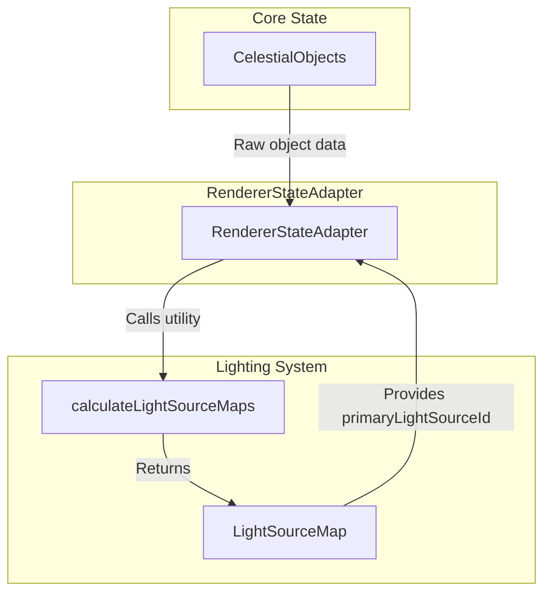

# Three.js Lighting (`@teskooano/renderer-threejs-lighting`)

The dynamic lighting management system for the Teskooano renderer, providing sophisticated star illumination, shadow casting, and multi-star system support.

## 🎯 Purpose

This package manages the complex lighting requirements of a space simulation:

- **Dynamic Light Sources**: Stars that move and change intensity based on stellar properties
- **Multi-Star Systems**: Support for binary and multiple star systems with proper light source assignment
- **Planetary Shadow Casting**: Planets automatically cast shadows on each other when positioned between light sources and targets
- **Performance-Optimized Queries**: Efficient finding of influential lights for each object using squared distance calculations
- **Hierarchy Calculation**: Determining which star illuminates each celestial body based on gravitational relationships

## 🏗️ Core Components

### [[LightingManager]]

A registry that holds all active `LightSourceComponent` instances in the scene.

**Key Responsibilities:**

- Maintains a registry of all active light sources
- Provides performant queries for influential lights affecting specific objects
- Manages light source lifecycle (registration/unregistration)
- Handles dynamic shadow casting for planets and ring systems
- Optimizes light source queries using squared distance calculations

### [[LightSourceComponent]]

A wrapper that associates a `THREE.Light` instance with a `RenderableCelestialObject`.

**Key Responsibilities:**

- Wraps a `THREE.Light` instance with celestial object data
- Updates light position to match its associated object
- Provides access to both the light and its celestial object
- Manages light intensity and color based on stellar properties

### [[calculateLightSourceMaps]] Utility

A function that operates on raw `CelestialObject` data from the core state.

**Key Responsibilities:**

- Traverses the system's hierarchy to build light source relationships
- Determines which star illuminates each object based on gravitational dominance
- Calculates `primaryLightSourceId` for every object
- Handles complex multi-star system lighting relationships

## 🔄 Data Flow

The lighting process is split into two distinct phases:

### Phase 1: Hierarchy Calculation (Pre-Render)



### Phase 2: Scene Lighting (Render-time)

```mermaid
graph TD
    subgraph "ObjectManager"
        OM[ObjectManager]
    end

    subgraph "LightingManager"
        LM[LightingManager]
        LSC[LightSourceComponent]
    end

    subgraph "Three.js Scene"
        SC[THREE.Scene]
        L[THREE.Light]
    end

    subgraph "Celestial Renderers"
        CR[CelestialRenderers]
    end

    OM -->|Creates| LSC
    OM -->|Registers| LM
    LSC -->|Wraps| L
    LM -->|Adds to| SC
    CR -->|Queries for lights| LM
    LM -->|getInfluentialLights()| CR
```

## 🎨 Multi-Star System Support

### Binary Star Systems

- **Close Binaries**: Planets within 3x binary separation orbit the primary star
- **Wide Binaries**: Distance-based logic with bias toward primary star
- **Dynamic Switching**: Planets can switch between stars based on gravitational dominance

### Multiple Star Systems

- **Hierarchical Analysis**: Determines gravitational relationships between stars
- **Light Source Assignment**: Assigns primary light sources based on mass and distance
- **Complex Interactions**: Handles tertiary and higher-order star systems

## 📊 Technical Specifications

### Interface/Type Definitions

```typescript
interface LightSourceOptions {
  /** The specific THREE.Light instance to use. Defaults to a PointLight. */
  light?: THREE.Light;
  /** Whether this light source should cast shadows. Defaults to false. */
  castShadow?: boolean;
}

interface LightActionPlan {
  adds: {
    id: string;
    position: THREE.Vector3;
    color?: number;
    intensity?: number;
  }[];
  updates: {
    id: string;
    position: THREE.Vector3;
    color?: number;
    intensity?: number;
  }[];
  removes: string[];
}

interface LightManagerConfig {
  /** The Three.js scene to manage lights within. */
  scene: THREE.Scene;
  /** The Three.js camera. */
  camera: THREE.PerspectiveCamera;
  /** Whether post-processing is enabled. */
  enablePostProcessing: boolean;
  /** An optional Observable stream of renderable objects. */
  objects$?: Observable<Record<string, RenderableCelestialObject>>;
  /** The color of the ambient light. Defaults to 0xffffff. */
  ambientLightColor?: number;
  /** The intensity of the ambient light. Defaults to 0.3. */
  ambientLightIntensity?: number;
  /** The default color for new star point lights. Defaults to 0xffffff. */
  defaultStarLightColor?: number;
  /** The default intensity for new star point lights. Defaults to 1.5. */
  defaultStarLightIntensity?: number;
  /** The default distance for new star point lights. Defaults to 0 (no falloff). */
  defaultStarLightDistance?: number;
  /** The default decay for new star point lights. Defaults to 0.5. */
  defaultStarLightDecay?: number;
  /** Configuration for calculating star light intensity from temperature. */
  intensityCalculation?: {
    /** The base intensity value. Defaults to 1.0. */
    base: number;
    /** The minimum temperature (in Kelvin) before intensity starts increasing. Defaults to 3000. */
    minTemp: number;
    /** The divisor used to scale the temperature difference. Defaults to 5000. */
    divisor: number;
  };
}
```

### Configuration Options

```typescript
// Performance constants
const INFLUENCE_THRESHOLD = 0.0;
const MAX_INFLUENTIAL_LIGHTS = 4;
const SHADOW_DISTANCE_THRESHOLD = 10000; // Max distance for shadow casting in scene units
const SHADOW_UPDATE_INTERVAL = 500; // Update shadows every 500ms instead of every frame
```

## 💡 Usage Examples

### Basic Usage

```typescript
import {
  LightingManager,
  LightSourceComponent,
  calculateLightSourceMaps,
} from "@teskooano/renderer-threejs-lighting";
import * as THREE from "three";

// Create lighting manager
const scene = new THREE.Scene();
const lightingManager = new LightingManager(scene);

// Phase 1: Calculate light source relationships
const lightSourceMap = calculateLightSourceMaps(celestialObjects);

// Phase 2: Create and register light sources
stars.forEach((star) => {
  const lightSource = new LightSourceComponent(star, {
    castShadow: true,
  });
  lightingManager.register(lightSource);
});

// Register planets as shadow casters
planets.forEach((planet) => {
  const planetMesh = createPlanetMesh(planet);
  planetMesh.receiveShadow = true;
  lightingManager.registerShadowCaster(planet.id, planetMesh, planet);
});

// In render loop - LightingManager updates automatically via state subscriptions
function animate() {
  requestAnimationFrame(animate);
  // lightingManager.update() is not needed - updates happen automatically via state subscriptions
  renderer.render(scene, camera);
}
```

### Advanced Usage

```typescript
import {
  LightingManager,
  LightSourceComponent,
} from "@teskooano/renderer-threejs-lighting";

// Advanced configuration with custom light
const customLight = new THREE.PointLight(0xff0000, 2.0, 0, 2);
const lightSource = new LightSourceComponent(starObject, {
  light: customLight,
  castShadow: true,
});

// Register with mesh group instead of scene
const starMeshGroup = new THREE.Group();
lightingManager.register(lightSource, starMeshGroup);

// Register ring system shadows
const ringMeshes = createRingMeshes(ringObject);
lightingManager.registerRingShadowCasters(
  ringObject.id,
  ringMeshes,
  ringObject,
  parentPlanet,
);

// Query for influential lights in shader
const influentialLights = lightingManager.getInfluentialLights(
  targetObject,
  3, // max 3 lights
);

// Update shader uniforms
shaderMaterial.uniforms.lightPositions.value = influentialLights.map(
  (light) => light.light.position,
);
shaderMaterial.uniforms.lightColors.value = influentialLights.map(
  (light) => light.light.color,
);
shaderMaterial.uniforms.lightIntensities.value = influentialLights.map(
  (light) => light.light.intensity,
);
```

### Real-world Scenario

```typescript
// Multi-star system with dynamic lighting
const binarySystem = {
  primaryStar: createStar({ luminosity: 1.0, color: "#ffffff" }),
  secondaryStar: createStar({ luminosity: 0.5, color: "#ffaaaa" }),
  planet: createPlanet({ parentId: "primaryStar" }),
};

// Calculate light source relationships
const lightSourceMap = calculateLightSourceMaps(binarySystem);
// Result: { primaryStar: 'primaryStar', secondaryStar: 'primaryStar', planet: 'primaryStar' }

// Create lighting manager
const lightingManager = new LightingManager(scene, renderableObjects$);

// Register both stars as light sources
const primaryLight = new LightSourceComponent(binarySystem.primaryStar);
const secondaryLight = new LightSourceComponent(binarySystem.secondaryStar);
lightingManager.register(primaryLight);
lightingManager.register(secondaryLight);

// Register planet for shadow casting
const planetMesh = createPlanetMesh(binarySystem.planet);
lightingManager.registerShadowCaster(
  binarySystem.planet.id,
  planetMesh,
  binarySystem.planet,
);

// In planet renderer, get influential lights
const influentialLights = lightingManager.getInfluentialLights(
  binarySystem.planet,
  2, // max 2 lights for binary system
);

// Both stars will influence the planet's lighting
console.log(influentialLights.length); // 2
```

## 🔌 Integration Points

### Primary Integration

- **[[threejs-objects/threejs-objects|Three.js Objects]]** - Creates and manages LightSourceComponent instances for stars and other light-emitting objects
- **[[threejs-celestial/threejs-celestial|Three.js Celestial]]** - Uses light source data for shader calculations and material updates
- **[[threejs-core/threejs-core|Three.js Core]]** - Provides scene access for light attachment and Three.js integration
- **[[Modular Space Renderer]]** - Orchestrates the lighting pipeline and coordinates with other renderer systems

### Secondary Integration

- **[[core/core-state/core-state|Core State]]** - Provides celestial object data and state management for light source synchronization
- **[[data/data-types/data-types|Data Types]]** - Defines RenderableCelestialObject and related types used by lighting components
- **[[renderer-threejs-helpers]]** - Provides LightingHelper for optimized Three.js light creation
- **[[core/core-math/core-math|Core Math]]** - Provides OSVector3 for position calculations and mathematical operations

### Data Flow Integration

- **State Access**: LightingManager subscribes to renderable objects state changes for automatic updates
- **Component Lifecycle**: LightSourceComponent integrates with object creation/destruction lifecycle
- **Shader Integration**: Light data flows from LightingManager to celestial renderers for shader uniforms
- **Scene Management**: Three.js lights are automatically added/removed from scene based on object lifecycle

## 📚 Architecture Patterns

- **Registry Pattern**: LightingManager acts as a registry for light sources
- **Component Pattern**: LightSourceComponent wraps light with celestial data
- **Utility Pattern**: calculateLightSourceMaps provides pure function calculations
- **Query Pattern**: Efficient light source queries for renderers
- **Shadow Pattern**: Dynamic shadow casting based on geometric relationships

## 🎯 Performance Considerations

### Light Source Queries

- **Squared Distance**: Avoids expensive square root operations
- **Distance Thresholds**: Limits queries to relevant light sources
- **Caching**: Light source positions cached for efficient updates

### Multi-Star Optimization

- **Hierarchy Caching**: Light source relationships cached until system changes
- **Incremental Updates**: Only recalculate when star positions change significantly
- **Distance-Based Filtering**: Ignore stars too far away to be influential

### Shadow Casting Optimization

- **Geometric Calculations**: Efficient shadow casting using ray-object intersections
- **Update Throttling**: Shadow updates limited to prevent performance impact
- **Ring System Support**: Specialized shadow casting for ring systems

### Memory Management

- **Component Lifecycle**: Automatic cleanup when objects are removed
- **Light Disposal**: Proper disposal of Three.js light instances
- **Registry Cleanup**: LightingManager clears unused light sources

## 🐛 Debug Features

### Validation

- **Input Validation**: LightSourceComponent validates celestial object data and stellar properties
- **Output Validation**: LightingManager validates light source queries and shadow casting calculations
- **State Validation**: Automatic validation of object state changes and light source synchronization
- **Configuration Validation**: LightSourceOptions and LightManagerConfig validation for proper setup

### Monitoring

- **Performance Monitoring**: Track light source query performance and shadow casting frequency
- **Error Monitoring**: Console warnings for circular dependencies in light source hierarchy
- **Usage Monitoring**: Monitor light source registration/unregistration and component lifecycle
- **Health Monitoring**: Track lighting system health through state subscription status

### Debugging Tools

- **Debug Mode**: Console logging for light source hierarchy calculation and shadow casting decisions
- **Logging**: Detailed logging of light source queries, shadow casting, and performance metrics
- **Tracing**: Trace light source relationships and shadow casting paths for debugging
- **Profiling**: Performance profiling for light source queries and shadow casting calculations

### Light Source Visualization

- **Debug Spheres**: Visual representation of light source positions and influence ranges
- **Intensity Indicators**: Color-coded spheres showing light intensity and visual intensity mapping
- **Relationship Lines**: Lines showing light source assignments and shadow casting relationships
- **Shadow Visualization**: Visual indicators for active shadow casting and blocking relationships

## 🔮 Future Enhancements

### Optimization Opportunities

- **Performance Optimization**: Implement light source culling based on camera frustum and distance to reduce unnecessary calculations
- **Memory Optimization**: Add light source pooling and reuse for frequently created/destroyed objects
- **Code Optimization**: Optimize shadow casting calculations with spatial partitioning for large numbers of objects
- **Architecture Optimization**: Implement light source LOD system to reduce complexity for distant objects

### Potential Improvements

- **Feature Enhancement**: Add support for directional and spot lights for specialized lighting scenarios
- **Integration Enhancement**: Improve integration with post-processing effects like bloom and lens flares
- **API Enhancement**: Add more granular control over light source influence calculations and shadow casting parameters
- **User Experience**: Add visual debugging tools for light source relationships and shadow casting visualization

## Dependencies

### Core Dependencies

- **@teskooano/core-math** - Mathematical operations and vector calculations for lighting calculations
- **@teskooano/core-state** - State management and object synchronization for light source updates
- **@teskooano/data-types** - Type definitions for celestial objects and lighting components
- **@teskooano/renderer-threejs-core** - Core Three.js renderer integration and scene management
- **three** - Three.js library for 3D graphics and lighting

### Development Dependencies

- **typescript** - Type safety and modern JavaScript features
- **vitest** - Testing framework with browser support
- **@vitest/browser** - Browser testing capabilities
- **@playwright/test** - End-to-end testing
- **eslint** - Code quality and consistency

---

_This package provides the dynamic lighting system that brings the space simulation to life with realistic star illumination and planetary shadows._
