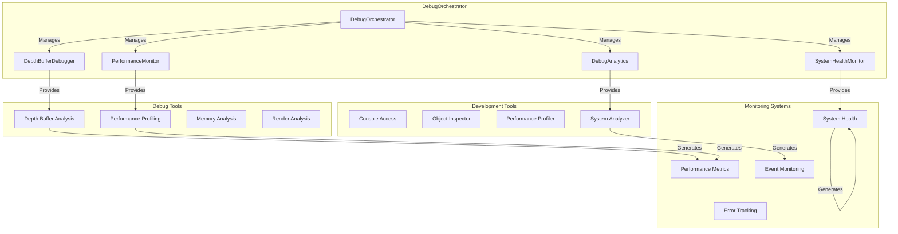

# DebugOrchestrator

Manages debug and analysis tools for the rendering system, providing comprehensive debugging capabilities and performance analysis tools.

## 🎯 Purpose

The DebugOrchestrator serves as the debug and analysis coordinator that:

- **Debug Tool Management**: Manages all debug tools and analysis utilities
- **Performance Monitoring**: Monitors performance across all rendering systems
- **Depth Buffer Analysis**: Provides depth buffer debugging and analysis
- **System Health Monitoring**: Monitors health and status of all systems
- **Development Support**: Provides tools for development and debugging

## 🏗️ Architecture

The DebugOrchestrator follows a centralized debug management pattern:



### Core Components

```typescript
class DebugOrchestrator {
  /**
   * Handles depth buffer analysis and debugging.
   */
  private depthDebugger: DepthBufferDebugger;

  /**
   * Performance monitoring and analysis.
   */
  private performanceMonitor: PerformanceMonitor;

  /**
   * System health monitoring.
   */
  private systemHealthMonitor: SystemHealthMonitor;

  /**
   * Debug analytics and reporting.
   */
  private debugAnalytics: DebugAnalytics;
}
```

## 🚀 Core Features

### Depth Buffer Analysis

- **Depth Buffer Debugging**: Analyzes depth buffer issues and artifacts
- **Occlusion Analysis**: Analyzes object occlusion and visibility
- **Depth Range Analysis**: Analyzes depth range and precision issues
- **Visual Debugging**: Provides visual debugging tools for depth issues

### Performance Monitoring

- **Frame Rate Monitoring**: Monitors frame rate and performance metrics
- **Memory Usage Tracking**: Tracks memory usage and garbage collection
- **Render Time Analysis**: Analyzes render time and bottlenecks
- **System Performance**: Monitors performance of all systems

### System Health Monitoring

- **System Status**: Monitors status of all rendering systems
- **Error Tracking**: Tracks errors and exceptions
- **Resource Monitoring**: Monitors resource usage and availability
- **Health Reporting**: Reports system health and issues

### Development Tools

- **Console Access**: Provides console access to debug tools
- **Object Inspection**: Inspects objects and their properties
- **Performance Profiling**: Profiles performance and identifies bottlenecks
- **System Analysis**: Analyzes system behavior and performance

## 🔧 Core Methods

### Lifecycle Management

#### Constructor

Creates a new DebugOrchestrator instance.

```typescript
constructor(sceneManager: SceneManager)
```

**Process:**

1. Initializes DepthBufferDebugger with scene manager
2. Sets up performance monitoring
3. Configures system health monitoring
4. Sets up debug analytics
5. Makes debugger accessible globally during development

### Debug Tool Access

#### getDepthDebugger()

Returns the depth debugger for direct access.

```typescript
getDepthDebugger(): DepthBufferDebugger
```

**Returns**: `DepthBufferDebugger` - The depth buffer debugger

#### runDepthAnalysis()

Runs a comprehensive depth buffer analysis.

```typescript
runDepthAnalysis(): void
```

**Process:**

1. Analyzes depth buffer configuration
2. Checks for depth buffer issues
3. Analyzes object occlusion
4. Generates analysis report
5. Provides recommendations for fixes

### Performance Monitoring

#### startPerformanceMonitoring()

Starts performance monitoring across all systems.

```typescript
startPerformanceMonitoring(): void
```

**Process:**

1. Initializes performance counters
2. Starts frame rate monitoring
3. Begins memory usage tracking
4. Sets up render time analysis
5. Configures performance alerts

#### stopPerformanceMonitoring()

Stops performance monitoring.

```typescript
stopPerformanceMonitoring(): void
```

**Process:**

1. Stops all performance counters
2. Generates final performance report
3. Cleans up monitoring resources
4. Saves performance data

### System Health

#### checkSystemHealth()

Checks the health of all rendering systems.

```typescript
checkSystemHealth(): SystemHealthReport
```

**Process:**

1. Checks status of all systems
2. Analyzes error rates
3. Monitors resource usage
4. Generates health report
5. Provides health recommendations

#### getSystemStatus()

Returns the current status of all systems.

```typescript
getSystemStatus(): SystemStatus
```

**Returns**: `SystemStatus` - Current system status

### Resource Management

#### dispose()

Disposes debug resources and cleans up.

```typescript
dispose(): void
```

**Process:**

1. Stops all monitoring
2. Disposes debug tools
3. Cleans up resources
4. Removes global references
5. Clears debug data

## 🔄 Data Flow

### Debug Analysis Flow

1. **Data Collection**: Collects data from all systems
2. **Analysis Processing**: Processes data for analysis
3. **Issue Detection**: Detects issues and problems
4. **Report Generation**: Generates analysis reports
5. **Recommendation**: Provides recommendations for fixes

### Performance Monitoring Flow

1. **Metric Collection**: Collects performance metrics
2. **Data Processing**: Processes performance data
3. **Trend Analysis**: Analyzes performance trends
4. **Alert Generation**: Generates performance alerts
5. **Report Creation**: Creates performance reports

### System Health Flow

1. **Health Check**: Checks health of all systems
2. **Status Analysis**: Analyzes system status
3. **Issue Identification**: Identifies issues and problems
4. **Health Reporting**: Reports system health
5. **Recommendation**: Provides health recommendations

## 📊 Technical Specifications

### Interface Definitions

```typescript
interface DebugConfig {
  /** Enable/disable debug mode */
  enabled: boolean;
  /** Performance monitoring configuration */
  performanceMonitoring: PerformanceMonitoringConfig;
  /** Depth buffer analysis configuration */
  depthBufferAnalysis: DepthBufferAnalysisConfig;
  /** System health monitoring configuration */
  systemHealthMonitoring: SystemHealthMonitoringConfig;
}

interface PerformanceMonitoringConfig {
  /** Frame rate monitoring interval */
  frameRateInterval: number;
  /** Memory monitoring interval */
  memoryInterval: number;
  /** Render time monitoring interval */
  renderTimeInterval: number;
  /** Performance alert thresholds */
  alertThresholds: PerformanceThresholds;
}

interface DepthBufferAnalysisConfig {
  /** Analysis frequency */
  analysisFrequency: number;
  /** Depth range analysis */
  depthRangeAnalysis: boolean;
  /** Occlusion analysis */
  occlusionAnalysis: boolean;
  /** Visual debugging */
  visualDebugging: boolean;
}
```

### Analysis Result Types

```typescript
interface AnalysisResult {
  /** Analysis type */
  type: "depth_buffer" | "performance" | "system_health";
  /** Analysis timestamp */
  timestamp: number;
  /** Analysis data */
  data: any;
  /** Analysis recommendations */
  recommendations: string[];
  /** Analysis severity */
  severity: "low" | "medium" | "high" | "critical";
}

interface SystemHealthReport {
  /** Overall health score */
  healthScore: number;
  /** System status */
  systemStatus: Record<string, SystemStatus>;
  /** Issues found */
  issues: Issue[];
  /** Recommendations */
  recommendations: string[];
  /** Timestamp */
  timestamp: number;
}
```

## 💡 Usage Examples

### Basic Setup

```typescript
import { DebugOrchestrator } from "@teskooano/renderer-threejs";

// Create debug orchestrator
const debugOrchestrator = new DebugOrchestrator(sceneManager);

// Access depth debugger
const depthDebugger = debugOrchestrator.getDepthDebugger();

// Run depth analysis
debugOrchestrator.runDepthAnalysis();
```

### Performance Monitoring

```typescript
// Start performance monitoring
debugOrchestrator.startPerformanceMonitoring();

// Check system health
const healthReport = debugOrchestrator.checkSystemHealth();
console.log("System health score:", healthReport.healthScore);

// Get system status
const systemStatus = debugOrchestrator.getSystemStatus();
console.log("System status:", systemStatus);

// Stop performance monitoring
debugOrchestrator.stopPerformanceMonitoring();
```

### Depth Buffer Analysis

```typescript
// Access depth debugger
const depthDebugger = debugOrchestrator.getDepthDebugger();

// Run comprehensive analysis
debugOrchestrator.runDepthAnalysis();

// Access analysis results
const analysisResults = depthDebugger.getAnalysisResults();
analysisResults.forEach((result) => {
  console.log(`Analysis: ${result.type}`);
  console.log(`Severity: ${result.severity}`);
  console.log(`Recommendations: ${result.recommendations.join(", ")}`);
});
```

### Development Debugging

```typescript
// Access global debug tools (development only)
if (window.teskooano && window.teskooano.debugger) {
  const debugger = window.teskooano.debugger;

  // Run depth analysis
  debugger.runFullAnalysis();

  // Get performance metrics
  const metrics = debugger.getPerformanceMetrics();
  console.log('Performance metrics:', metrics);

  // Inspect scene objects
  const sceneObjects = debugger.inspectScene();
  console.log('Scene objects:', sceneObjects);
}
```

### Custom Debug Configuration

```typescript
// Configure debug settings
const debugConfig: DebugConfig = {
  enabled: true,
  performanceMonitoring: {
    frameRateInterval: 1000,
    memoryInterval: 5000,
    renderTimeInterval: 100,
    alertThresholds: {
      frameRate: 30,
      memoryUsage: 0.8,
      renderTime: 16.67,
    },
  },
  depthBufferAnalysis: {
    analysisFrequency: 5000,
    depthRangeAnalysis: true,
    occlusionAnalysis: true,
    visualDebugging: true,
  },
  systemHealthMonitoring: {
    healthCheckInterval: 10000,
    errorTracking: true,
    resourceMonitoring: true,
  },
};

// Apply configuration
debugOrchestrator.configure(debugConfig);
```

## ⚡ Performance Considerations

### Debug Overhead

- **Minimal Impact**: Debug tools have minimal performance impact when disabled
- **Conditional Execution**: Debug code only executes in development mode
- **Efficient Monitoring**: Uses efficient monitoring techniques
- **Resource Management**: Properly manages debug resources

### Analysis Optimization

- **Asynchronous Analysis**: Performs analysis asynchronously to avoid blocking
- **Cached Results**: Caches analysis results to avoid redundant computation
- **Incremental Analysis**: Performs incremental analysis for large datasets
- **Smart Sampling**: Uses smart sampling for performance monitoring

### Memory Management

- **Debug Data Cleanup**: Cleans up debug data to prevent memory leaks
- **Resource Pooling**: Pools debug resources for reuse
- **Memory Monitoring**: Monitors memory usage of debug tools
- **Garbage Collection**: Minimizes garbage collection pressure

## 🔌 Integration Points

### Scene Manager Integration

- **Scene Access**: Accesses scene for analysis and debugging
- **Object Inspection**: Inspects scene objects and their properties
- **Render Analysis**: Analyzes rendering performance and issues
- **Resource Monitoring**: Monitors scene resources

### Performance System Integration

- **Frame Rate Monitoring**: Integrates with frame rate monitoring
- **Memory Tracking**: Integrates with memory usage tracking
- **Render Profiling**: Integrates with render time profiling
- **System Metrics**: Integrates with system performance metrics

### Development Environment Integration

- **Console Access**: Provides console access to debug tools
- **Global Debugging**: Makes debug tools globally accessible
- **Development Mode**: Only active in development mode
- **Production Safety**: Safely disabled in production

## 🐛 Debug Features

### Depth Buffer Debugging

- **Visual Debugging**: Visual tools for depth buffer issues
- **Occlusion Analysis**: Analyzes object occlusion problems
- **Depth Range Issues**: Identifies depth range and precision issues
- **Artifact Detection**: Detects depth buffer artifacts

### Performance Analysis

- **Frame Rate Analysis**: Analyzes frame rate performance
- **Memory Usage Analysis**: Analyzes memory usage patterns
- **Render Time Analysis**: Analyzes render time bottlenecks
- **System Performance**: Analyzes overall system performance

### System Health Monitoring

- **Health Scoring**: Provides system health scoring
- **Issue Detection**: Detects system issues and problems
- **Error Tracking**: Tracks errors and exceptions
- **Resource Monitoring**: Monitors resource usage and availability

### Development Tools

- **Object Inspection**: Inspects objects and their properties
- **Performance Profiling**: Profiles performance and identifies bottlenecks
- **System Analysis**: Analyzes system behavior and performance
- **Debug Reporting**: Generates comprehensive debug reports

## 🔮 Future Enhancements

### Optimization Opportunities

- **Advanced Analysis**: Implement more advanced analysis algorithms
- **Machine Learning**: Use ML for performance prediction and optimization
- **Real-time Analysis**: Implement real-time analysis capabilities
- **Automated Optimization**: Implement automated optimization suggestions

### Potential Improvements

- **Visual Debugging**: Enhanced visual debugging tools
- **Performance Prediction**: Predict performance issues before they occur
- **Automated Testing**: Automated performance and quality testing
- **Advanced Reporting**: More advanced reporting and analytics

## 📚 Related Components

### Core Dependencies

- [[DepthBufferDebugger]] - Depth buffer analysis and debugging
- [[SceneManager]] - Scene management for analysis

### Integration Components

- [[RenderingOrchestrator]] - Rendering system integration
- [[InteractionOrchestrator]] - Interaction system integration
- [[ModularSpaceRenderer]] - Main renderer integration

## 🏛️ Architecture Patterns

- **Orchestrator Pattern**: Coordinates multiple debug tools
- **Observer Pattern**: Observes system events and performance
- **Strategy Pattern**: Uses different analysis strategies
- **Facade Pattern**: Provides simplified interface to complex debug tools
- **Resource Management**: Proper lifecycle management of debug resources

---

_The DebugOrchestrator is the debug and analysis coordinator that provides comprehensive debugging capabilities, performance monitoring, and system health analysis for the rendering system._
