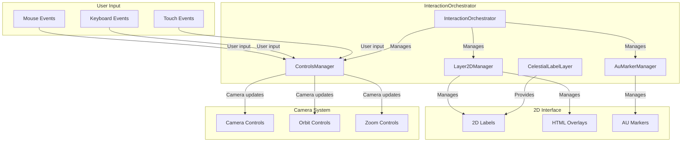

# InteractionOrchestrator

Manages all user interaction and interface-related systems including camera controls, 2D labels, and AU markers, providing centralized coordination for user interface elements.

## 🎯 Purpose

The InteractionOrchestrator serves as the user interaction coordinator that:

- **User Input Management**: Manages all user input and camera controls
- **2D Interface Coordination**: Coordinates 2D labels and overlays
- **AU Marker Management**: Manages astronomical unit markers and distance indicators
- **System Integration**: Integrates interaction systems with rendering systems
- **Event Handling**: Handles user events and interface interactions

## 🏗️ Architecture

The InteractionOrchestrator follows a centralized interaction management pattern:



### Core Components

```typescript
class InteractionOrchestrator {
  /**
   * Handles the camera controls and user input.
   */
  private controlsManager: ControlsManager;

  /**
   * Handles the 2D labels and overlays.
   */
  private css2DManager: Layer2DManager;

  /**
   * Handles the AU markers and distance indicators.
   */
  private auMarkerManager: AuMarkerManager;
}
```

## 🚀 Core Features

### User Input Management

- **Camera Controls**: Manages camera movement, rotation, and zoom
- **Event Handling**: Handles mouse, keyboard, and touch events
- **Input Validation**: Validates and processes user input
- **Control Configuration**: Configures control behavior and sensitivity

### 2D Interface Management

- **Label Rendering**: Manages 2D labels for celestial objects
- **Overlay Management**: Manages HTML overlays and UI elements
- **Layer Coordination**: Coordinates different 2D layers
- **Visibility Control**: Controls visibility of 2D elements

### AU Marker System

- **Distance Markers**: Creates and manages astronomical unit markers
- **Distance Calculation**: Calculates distances for marker placement
- **Marker Visibility**: Controls marker visibility based on camera position
- **Label Integration**: Integrates markers with 2D label system

### System Integration

- **Rendering Integration**: Integrates with rendering orchestrator
- **State Synchronization**: Synchronizes with core state changes
- **Event Broadcasting**: Broadcasts interaction events to other systems
- **Performance Optimization**: Optimizes interaction performance

## 🔧 Core Methods

### Lifecycle Management

#### Constructor

Creates a new InteractionOrchestrator instance.

```typescript
constructor(
  container: HTMLElement,
  renderingOrchestrator: any
)
```

**Process:**

1. Initializes Layer2DManager with scene and container
2. Creates CelestialLabelLayer for celestial object labels
3. Registers celestial layer with CSS2D manager
4. Initializes ControlsManager with camera and DOM element
5. Initializes AuMarkerManager with scene and CSS2D manager
6. Creates AU markers
7. Integrates with RenderingOrchestrator

### System Access

#### getControlsManager()

Returns the controls manager for direct access.

```typescript
getControlsManager(): ControlsManager
```

**Returns**: `ControlsManager` - The camera controls manager

#### getLayer2DManager()

Returns the 2D layer manager for direct access.

```typescript
getLayer2DManager(): Layer2DManager
```

**Returns**: `Layer2DManager` - The 2D layer manager

#### getAuMarkerManager()

Returns the AU marker manager for direct access.

```typescript
getAuMarkerManager(): AuMarkerManager | undefined
```

**Returns**: `AuMarkerManager | undefined` - The AU marker manager

### Debug and Configuration

#### setDebugMode()

Sets debug mode for interaction components.

```typescript
setDebugMode(enabled: boolean): void
```

**Process:**

1. Enables debug mode in controls manager
2. Configures debug visualization
3. Sets up debug monitoring

#### onResize()

Handles window resize events for all interaction components.

```typescript
onResize(width: number, height: number): void
```

**Process:**

1. Updates CSS2D manager with new dimensions
2. Adjusts 2D layer positioning
3. Updates AU marker positioning

### Resource Management

#### dispose()

Disposes all interaction resources.

```typescript
dispose(): void
```

**Process:**

1. Disposes controls manager
2. Disposes CSS2D manager
3. Disposes AU marker manager
4. Cleans up event listeners
5. Clears references

## 🔄 Data Flow

### User Input Flow

1. **Input Reception**: Receives user input events (mouse, keyboard, touch)
2. **Input Processing**: Processes input through ControlsManager
3. **Camera Updates**: Updates camera position, rotation, and zoom
4. **Event Broadcasting**: Broadcasts camera changes to other systems
5. **UI Updates**: Updates 2D interface elements based on camera changes

### 2D Interface Flow

1. **Label Creation**: Creates 2D labels for celestial objects
2. **Layer Management**: Manages different 2D layers
3. **Visibility Control**: Controls label visibility based on camera position
4. **Update Coordination**: Coordinates updates with rendering system
5. **Event Handling**: Handles 2D interface events

### AU Marker Flow

1. **Marker Creation**: Creates AU markers at specified distances
2. **Distance Calculation**: Calculates distances for marker placement
3. **Visibility Management**: Manages marker visibility based on camera position
4. **Label Integration**: Integrates markers with 2D label system
5. **Update Coordination**: Coordinates marker updates with camera changes

## 📊 Technical Specifications

### Interface Definitions

```typescript
interface InteractionOrchestratorConfig {
  /** Container element for the renderer */
  container: HTMLElement;
  /** Rendering orchestrator for integration */
  renderingOrchestrator: RenderingOrchestrator;
  /** CSS2D layer configuration */
  css2DConfig?: CSS2DConfig;
  /** Controls configuration */
  controlsConfig?: ControlsConfig;
  /** AU marker configuration */
  auMarkerConfig?: AuMarkerConfig;
}
```

### Manager Configuration

```typescript
interface CSS2DConfig {
  /** Layer visibility settings */
  layerVisibility: Record<CSS2DLayerType, boolean>;
  /** Label styling configuration */
  labelStyle: LabelStyleConfig;
  /** Update frequency for labels */
  updateFrequency: number;
}

interface ControlsConfig {
  /** Camera control sensitivity */
  sensitivity: number;
  /** Zoom limits */
  zoomLimits: { min: number; max: number };
  /** Rotation limits */
  rotationLimits: { min: number; max: number };
  /** Enable/disable specific controls */
  enabledControls: string[];
}
```

### Event Types

```typescript
interface InteractionEvent {
  /** Event type */
  type: "camera_change" | "label_click" | "marker_click";
  /** Event data */
  data: any;
  /** Event timestamp */
  timestamp: number;
}
```

## 💡 Usage Examples

### Basic Setup

```typescript
import { InteractionOrchestrator } from "@teskooano/renderer-threejs";

// Create interaction orchestrator
const container = document.getElementById("renderer-container");
const interactionOrchestrator = new InteractionOrchestrator(
  container,
  renderingOrchestrator,
);

// Access individual managers
const controlsManager = interactionOrchestrator.getControlsManager();
const layer2DManager = interactionOrchestrator.getLayer2DManager();
const auMarkerManager = interactionOrchestrator.getAuMarkerManager();
```

### Camera Control Configuration

```typescript
// Configure camera controls
const controlsManager = interactionOrchestrator.getControlsManager();

// Set control sensitivity
controlsManager.setSensitivity(0.5);

// Configure zoom limits
controlsManager.setZoomLimits({ min: 0.1, max: 1000 });

// Enable/disable specific controls
controlsManager.enableControl("rotate", true);
controlsManager.enableControl("zoom", true);
controlsManager.enableControl("pan", false);
```

### 2D Label Management

```typescript
// Access 2D layer manager
const layer2DManager = interactionOrchestrator.getLayer2DManager();

// Toggle label visibility
layer2DManager.setLayerVisible(CSS2DLayerType.CELESTIAL_LABELS, true);

// Update label styling
layer2DManager.updateLabelStyle({
  fontSize: "14px",
  color: "#ffffff",
  backgroundColor: "rgba(0, 0, 0, 0.7)",
});

// Handle label clicks
layer2DManager.onLabelClick((label, object) => {
  console.log("Label clicked:", label, object);
});
```

### AU Marker Management

```typescript
// Access AU marker manager
const auMarkerManager = interactionOrchestrator.getAuMarkerManager();

// Toggle marker visibility
auMarkerManager.setVisible(true);

// Update marker distances
auMarkerManager.updateMarkers([1, 5, 10, 50, 100]); // AU distances

// Handle marker clicks
auMarkerManager.onMarkerClick((marker, distance) => {
  console.log("AU marker clicked:", distance, "AU");
});
```

### Event Handling

```typescript
// Subscribe to camera changes
const controlsManager = interactionOrchestrator.getControlsManager();
controlsManager.onCameraChange((camera) => {
  console.log("Camera position:", camera.position);
  console.log("Camera rotation:", camera.rotation);
});

// Subscribe to label events
const layer2DManager = interactionOrchestrator.getLayer2DManager();
layer2DManager.onLabelHover((label, object) => {
  console.log("Label hovered:", label, object);
});
```

## ⚡ Performance Considerations

### Input Optimization

- **Event Throttling**: Throttles high-frequency input events
- **Input Validation**: Validates input to prevent unnecessary processing
- **Control Smoothing**: Smooths control movements for better user experience
- **Performance Monitoring**: Monitors input processing performance

### 2D Interface Optimization

- **Label Culling**: Culls labels outside viewport for performance
- **Update Batching**: Batches label updates to reduce render calls
- **Memory Management**: Manages memory usage of 2D elements
- **Render Optimization**: Optimizes 2D rendering performance

### AU Marker Optimization

- **Distance Culling**: Culls markers outside visible range
- **Update Frequency**: Controls update frequency based on camera movement
- **Memory Pooling**: Pools marker objects for reuse
- **Performance Scaling**: Scales performance based on device capabilities

## 🔌 Integration Points

### Rendering System Integration

- **RenderingOrchestrator**: Integrates with rendering orchestrator
- **SceneManager**: Uses scene manager for 3D object access
- **Camera System**: Integrates with camera system for positioning
- **ObjectManager**: Coordinates with object manager for label updates

### Core State Integration

- **State Subscription**: Subscribes to core state changes
- **Event Broadcasting**: Broadcasts interaction events to core state
- **State Synchronization**: Synchronizes with core state changes
- **Performance Optimization**: Optimizes state change handling

### External System Integration

- **UI Components**: Integrates with external UI components
- **Event System**: Integrates with application event system
- **Performance Monitoring**: Integrates with performance monitoring
- **Debug System**: Integrates with debug and analysis tools

## 🐛 Debug Features

### Interaction Monitoring

- **Input Tracking**: Tracks all user input events
- **Camera Monitoring**: Monitors camera position and movement
- **Event Logging**: Logs all interaction events
- **Performance Metrics**: Tracks interaction performance

### 2D Interface Debugging

- **Label Debugging**: Debug tools for 2D labels
- **Layer Inspection**: Inspect 2D layer state
- **Visibility Debugging**: Debug label visibility issues
- **Performance Profiling**: Profile 2D rendering performance

### AU Marker Debugging

- **Marker Debugging**: Debug tools for AU markers
- **Distance Calculation**: Debug distance calculations
- **Visibility Debugging**: Debug marker visibility
- **Performance Analysis**: Analyze marker performance

## 🔮 Future Enhancements

### Optimization Opportunities

- **Input Prediction**: Implement input prediction for smoother controls
- **Advanced Culling**: Implement advanced culling for 2D elements
- **Memory Optimization**: Optimize memory usage patterns
- **Performance Scaling**: Implement dynamic performance scaling

### Potential Improvements

- **Gesture Support**: Add support for touch gestures
- **Accessibility**: Improve accessibility features
- **Custom Controls**: Support for custom control schemes
- **Advanced UI**: Support for more advanced UI elements

## 📚 Related Components

### Core Dependencies

- [[ControlsManager]] - Camera controls management
- [[Layer2DManager]] - 2D layer management
- [[AuMarkerManager]] - AU marker management

### Integration Components

- [[RenderingOrchestrator]] - Rendering system integration
- [[SceneManager]] - Scene management integration
- [[CameraManager]] - Camera system integration

## 🏛️ Architecture Patterns

- **Orchestrator Pattern**: Coordinates multiple interaction systems
- **Manager Pattern**: Each interaction system has its own manager
- **Observer Pattern**: Observes user input and system events
- **Facade Pattern**: Provides simplified interface to complex interaction systems
- **Resource Management**: Proper lifecycle management of all resources

---

_The InteractionOrchestrator is the user interaction coordinator that manages all user input, 2D interface elements, and AU markers, providing centralized coordination for user interface systems._
