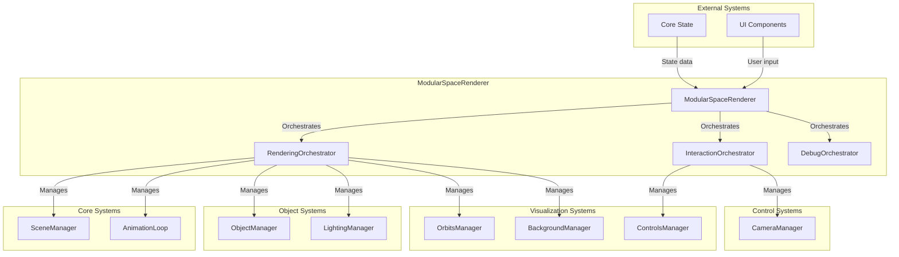

---
aliases:
  [ModularSpaceRenderer, modular-space-renderer, main-renderer, orchestrator]
tags: [renderer, threejs, integrator, orchestrator, facade, main]
type: Class
package: "@teskooano/renderer-threejs"
name: ModularSpaceRenderer
dependencies:
  [
    "@teskooano/renderer-threejs-core",
    "@teskooano/renderer-threejs-objects",
    "@teskooano/renderer-threejs-lighting",
    "@teskooano/renderer-threejs-orbits",
    "@teskooano/renderer-threejs-labels",
    "@teskooano/renderer-threejs-camera",
    "@teskooano/renderer-threejs-controls",
    "@teskooano/renderer-threejs-background",
    "@teskooano/core-state",
    "@teskooano/data-types",
    "three",
  ]
classes:
  [
    "RenderingOrchestrator",
    "InteractionOrchestrator",
    "DebugOrchestrator",
    "RendererStateAdapter",
    "RenderPipeline",
  ]
functions: []
constants: []
types:
  [
    "ModularSpaceRendererOptions",
    "RenderPipelineOptions",
    "RendererVisualSettings",
  ]
status: active
---

# ModularSpaceRenderer

The main orchestrator component that coordinates all renderer systems in the Teskooano space simulation.

## 🎯 Purpose

The ModularSpaceRenderer serves as the central hub that:

- **Orchestrates All Systems**: Coordinates between all renderer packages
- **Manages State Integration**: Bridges core state with rendering systems
- **Provides Public API**: Clean interface for external systems to control rendering
- **Handles Lifecycle**: Manages initialization, updates, and cleanup of all renderer components

## 🏗️ Architecture

The ModularSpaceRenderer uses a three-tier orchestrator pattern to manage complexity:



### Orchestrator Pattern

The ModularSpaceRenderer delegates responsibilities to three specialized orchestrators:

- **RenderingOrchestrator**: Manages core rendering systems (scene, objects, lighting, orbits, background)
- **InteractionOrchestrator**: Manages user interaction systems (controls, camera, labels, AU markers)
- **DebugOrchestrator**: Manages debug and analysis tools (depth buffer debugging, performance analysis)

## 🚀 Core Features

### System Orchestration

- **Unified Interface**: Single entry point for all rendering functionality
- **Modular Design**: Each system is independently manageable through specialized orchestrators
- **Loose Coupling**: Systems communicate through well-defined interfaces
- **Extensibility**: Easy to add new rendering features through orchestrator pattern

### State Integration

- **Reactive Updates**: Automatically responds to core state changes
- **Data Transformation**: Converts core state to renderer-friendly formats
- **Event Broadcasting**: Propagates state changes to all systems
- **Performance Optimization**: Efficient change detection and updates

### Lifecycle Management

- **Initialization**: Proper setup of all orchestrators and systems
- **Runtime Management**: Dynamic system updates and configuration
- **Cleanup**: Comprehensive resource disposal and memory management
- **Error Handling**: Graceful error recovery and system stability

## 🔧 Core Methods

### Lifecycle Management

#### Constructor

Creates a new ModularSpaceRenderer instance.

```typescript
constructor(container: HTMLElement)
```

**Process:**

1. Stores container reference
2. Creates orchestrator instances
3. Sets up animation callbacks
4. Initializes resize handler

#### start()

Starts the render loop and all systems.

```typescript
public start(): void
```

**Process:**

1. Starts the rendering orchestrator
2. Starts the interaction orchestrator
3. Begins the animation loop

#### stop()

Stops the render loop and all systems.

```typescript
public stop(): void
```

**Process:**

1. Stops the animation loop
2. Stops all orchestrators
3. Cleans up resources

#### dispose()

Cleans up all resources and removes event listeners.

```typescript
public dispose(): void
```

**Process:**

1. Stops the render loop
2. Disposes all orchestrators
3. Removes resize handler
4. Clears container reference

### System Access

#### scene

Returns the Three.js scene instance.

```typescript
get scene(): THREE.Scene
```

#### camera

Returns the Three.js camera instance.

```typescript
get camera(): THREE.PerspectiveCamera
```

#### renderer

Returns the Three.js WebGL renderer instance.

```typescript
get renderer(): THREE.WebGLRenderer
```

#### controls

Returns the camera controls manager.

```typescript
get controls(): ControlsManager
```

### Debug and Analysis

#### setDebugMode()

Enables or disables debug mode across all systems.

```typescript
public setDebugMode(enabled: boolean): void
```

**Process:**

1. Enables debug mode in rendering orchestrator
2. Enables debug mode in interaction orchestrator
3. Enables debug mode in debug orchestrator

#### getTriangleCount()

Returns the total number of triangles being rendered.

```typescript
public getTriangleCount(): number
```

## 📊 Technical Specifications

### Interface Definitions

```typescript
interface ModularSpaceRendererOptions extends WebGLRendererParameters {
  /** Enables/disables antialiasing. */
  antialias?: boolean;
  /** Enables/disables shadows. */
  shadows?: boolean;
  /** Enables/disables High Dynamic Range rendering for lighting. */
  hdr?: boolean;
  /** Sets the initial background. Can be a color string or a texture. */
  background?: string | THREE.Texture;
  /** Sets the initial visibility of the debug grid. */
  showGrid?: boolean;
  /** Sets the initial visibility of 2D object labels. */
  showCelestialLabels?: boolean;
  /** Sets the initial visibility of Astronomical Unit markers. */
  showAuMarkers?: boolean;
  /** Sets the initial visibility of particle effects for destroyed objects. */
  showDebrisEffects?: boolean;
  grid?: "polar" | "cartesian";
  labelConfig?: LabelVisibilityConfig;
}
```

### Orchestrator Configuration

```typescript
interface RenderPipelineOptions {
  /** The manager for the core THREE.Scene, camera, and renderer. */
  sceneManager: SceneManager;
  /** The manager for user interaction and camera controls. */
  controlsManager: ControlsManager;
  /** The manager for visualizing orbital paths. */
  orbitManager: OrbitsManager;
  /** The manager for creating and updating 3D objects. */
  objectManager: ObjectManager;
  /** The manager for the skybox and background. */
  backgroundManager: BackgroundManager;
  /** The manager for scene lighting. */
  lightingManager: LightingManager;
  /** The manager for the grid helper. */
  gridManager: GridManager;
  /** The optional manager for 2D HTML labels. */
  css2DManager: Layer2DManager;
}
```

### State Integration Types

```typescript
interface RendererVisualSettings {
  /** A multiplier that adjusts the length of orbital trails. */
  trailLengthMultiplier: number;
  /** The simulation configuration for rendering-specific decisions. */
  simulationConfig: SimulationConfiguration;
  /** The time scale for the simulation. */
  timeScale: number;
  /** The number of steps for the simulation. */
  predictionSteps: number;
  /** The duration of the prediction in seconds. */
  predictionDuration: number;
}
```

## 🔄 Data Flow

### Initialization Flow

1. **Container Setup**: Receives HTML container element
2. **Orchestrator Creation**: Creates specialized orchestrators
3. **System Initialization**: Each orchestrator initializes its systems
4. **Animation Setup**: Sets up animation callbacks
5. **Event Binding**: Binds resize and other events

### Update Flow

1. **State Changes**: Core state updates trigger changes
2. **Orchestrator Updates**: Each orchestrator updates its systems
3. **Animation Loop**: Drives the render cycle
4. **Scene Rendering**: Final scene is rendered to canvas

### Event Flow

1. **User Input**: User interactions trigger events
2. **Interaction Orchestrator**: Handles input and camera changes
3. **State Updates**: Updates propagate to core state
4. **System Updates**: All systems respond to state changes

## 🚀 Usage Examples

### Basic Setup

```typescript
import { ModularSpaceRenderer } from "@teskooano/renderer-threejs";

// Get container element
const container = document.getElementById("renderer-container");
if (!container) throw new Error("Container not found");

// Create renderer
const renderer = new ModularSpaceRenderer(container);

// Start rendering
renderer.start();

// Handle cleanup
window.addEventListener("beforeunload", () => {
  renderer.dispose();
});
```

### Advanced Configuration

```typescript
// Create renderer with custom options
const renderer = new ModularSpaceRenderer(container);

// Access individual systems
const sceneManager = renderer.renderingOrchestrator.sceneManager;
const objectManager = renderer.renderingOrchestrator.objectManager;
const controlsManager = renderer.interactionOrchestrator.getControlsManager();

// Enable debug mode
renderer.setDebugMode(true);

// Get performance metrics
const triangleCount = renderer.getTriangleCount();
console.log(`Rendering ${triangleCount} triangles`);
```

### Integration with Core State

```typescript
// The renderer automatically integrates with core state
// through the RendererStateAdapter in the rendering orchestrator

// State changes automatically trigger renderer updates
simulationState.updateTimeScale(2.0); // Automatically updates renderer
simulationState.addCelestialObject(planet); // Automatically creates renderer
```

## 🔌 Integration Points

### Core State Integration

- **State Subscription**: Subscribes to core state changes through RendererStateAdapter
- **Data Transformation**: Converts core state data to renderer-friendly formats
- **Event Broadcasting**: Broadcasts state changes to all dependent systems
- **Performance Optimization**: Efficient change detection and selective updates

### External System Integration

- **UI Components**: Provides clean interface for UI systems to control rendering
- **Physics Engine**: Integrates with physics engine changes for orbital visualization
- **Simulation State**: Responds to simulation time scale and configuration changes
- **Device Capabilities**: Adapts to device performance and capabilities

### Package Dependencies

- **Core Package**: Uses threejs-core for foundational Three.js infrastructure
- **Feature Packages**: Integrates all specialized renderer packages
- **State Management**: Connects to core-state for reactive updates
- **Data Types**: Uses shared data types for consistent interfaces

### Event System Integration

- **Renderer Events**: Emits and subscribes to renderer-specific events
- **State Events**: Responds to core state change events
- **Performance Events**: Broadcasts performance metrics and optimization changes
- **Debug Events**: Handles debug mode changes and analysis requests

## 🎯 Performance Considerations

### Orchestrator Efficiency

- **Specialized Management**: Each orchestrator manages related systems
- **Lazy Initialization**: Systems are initialized only when needed
- **Efficient Updates**: Only affected systems are updated
- **Resource Sharing**: Common resources are shared between systems

### Memory Management

- **Proper Disposal**: All systems are properly disposed on cleanup
- **Event Cleanup**: Event listeners are removed to prevent memory leaks
- **Resource Pooling**: Expensive resources are pooled and reused
- **Garbage Collection**: Unused objects are properly dereferenced

### Render Loop Optimization

- **Callback Management**: Efficient callback registration and execution
- **Update Prioritization**: Critical updates are prioritized
- **Frame Budgeting**: Updates fit within frame budget
- **Performance Monitoring**: Continuous performance tracking

## 🐛 Debug Features

### System Monitoring

- **Orchestrator Status**: Track status of all orchestrators
- **System Health**: Monitor health of individual systems
- **Performance Metrics**: Track performance across all systems
- **Memory Usage**: Monitor memory usage of all components

### Debug Tools

- **Depth Buffer Analysis**: Analyze depth buffer issues
- **Render Order Validation**: Validate render order correctness
- **Performance Profiling**: Profile performance bottlenecks
- **State Inspection**: Inspect system state and data flow

### Validation and Testing

- **System Validation**: Validate system initialization and configuration
- **Integration Testing**: Test integration between orchestrators
- **Performance Testing**: Test performance under various conditions
- **Error Handling**: Test error recovery and graceful degradation

## 📚 Related Components

### Core Dependencies

- [[SceneManager]] - Core scene management from threejs-core
- [[AnimationLoop]] - Animation loop management from threejs-core
- [[RendererStateAdapter]] - State integration and transformation

### Orchestrators

- [[RenderingOrchestrator]] - Manages core rendering systems
- [[InteractionOrchestrator]] - Manages user interaction systems
- [[DebugOrchestrator]] - Manages debug and analysis tools

### Feature Packages

- [[threejs-objects]] - ObjectManager for celestial object rendering
- [[threejs-lighting]] - LightingManager for dynamic lighting
- [[threejs-orbits]] - OrbitsManager for trajectory visualization
- [[threejs-labels]] - CSS2DManager for 2D label rendering
- [[threejs-camera]] - CameraManager for camera control
- [[threejs-controls]] - ControlsManager for user interaction
- [[threejs-background]] - BackgroundManager for skybox and background

## 🏛️ Architecture Patterns

- **Orchestrator Pattern**: Delegates to specialized orchestrators
- **Facade Pattern**: Provides simplified interface to complex subsystem
- **Adapter Pattern**: Bridges core state with rendering systems
- **Observer Pattern**: Responds to state changes and events
- **Resource Management**: Proper lifecycle management of all resources

## 🔮 Future Enhancements

### Optimization Opportunities

- **System Lazy Loading**: Load systems only when needed
- **Dynamic Quality Adjustment**: Adjust quality based on performance
- **Memory Pool Optimization**: Optimize memory pooling strategies
- **Render Pipeline Optimization**: Optimize render pipeline efficiency

### Potential Improvements

- **Multi-Threading Support**: Support for Web Workers
- **Advanced Caching**: Implement advanced caching strategies
- **Performance Analytics**: Enhanced performance analytics
- **Plugin Architecture**: Support for custom renderer plugins

---

_The ModularSpaceRenderer is the central nervous system that brings all the individual renderer components together into a cohesive, high-performance space simulation._
