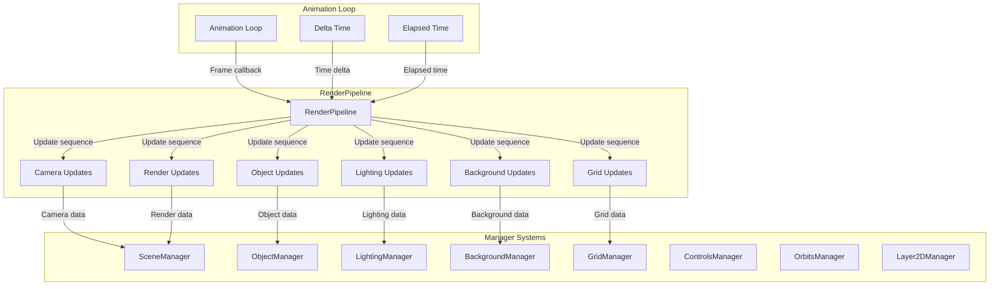

# RenderPipeline

Orchestrates the per-frame update sequence for all renderer systems, ensuring proper update order and performance optimization.

## 🎯 Purpose

The RenderPipeline serves as the update orchestrator that:

- **Update Coordination**: Coordinates updates across all renderer systems in the correct order
- **Performance Optimization**: Implements throttling and caching for expensive operations
- **Frame Management**: Manages frame-based updates and performance monitoring
- **System Integration**: Ensures all systems are updated consistently and efficiently
- **Resource Management**: Manages resources and prevents performance bottlenecks

## 🏗️ Architecture

The RenderPipeline follows a systematic update pattern with performance optimizations:



### Core Components

```typescript
class RenderPipeline {
  private sceneManager: SceneManager;
  private controlsManager: ControlsManager;
  private orbitManager: OrbitsManager;
  private objectManager: ObjectManager;
  private backgroundManager: BackgroundManager;
  private lightingManager: LightingManager;
  private gridManager: GridManager;
  private css2DManager: Layer2DManager;

  // Performance optimization: cache expensive values
  private cachedRendererHeight: number = 0;
  private lastHeightCheck: number = 0;
  private readonly HEIGHT_CHECK_INTERVAL = 1000; // Check height every 1 second

  // Throttling for expensive operations
  private frameCount: number = 0;
  private readonly GRID_UPDATE_FREQUENCY = 10; // Update grid every 10 frames
  private readonly BACKGROUND_UPDATE_FREQUENCY = 5; // Update background every 5 frames
}
```

## 🚀 Core Features

### Update Orchestration

- **Sequential Updates**: Updates systems in the correct order for dependencies
- **Performance Throttling**: Throttles expensive operations to maintain frame rate
- **Caching**: Caches expensive calculations to avoid redundant work
- **Frame Management**: Manages frame-based updates and performance monitoring

### Performance Optimization

- **Height Caching**: Caches renderer height to avoid expensive DOM queries
- **Update Frequency Control**: Controls update frequency for different systems
- **Resource Management**: Manages resources efficiently to prevent bottlenecks
- **Memory Optimization**: Optimizes memory usage through efficient data structures

### System Integration

- **Manager Coordination**: Coordinates updates across all manager systems
- **Dependency Management**: Handles dependencies between different systems
- **Error Handling**: Provides error handling and recovery for system updates
- **State Synchronization**: Ensures all systems stay synchronized

## 🔧 Core Methods

### Update Management

#### Constructor

Creates a new RenderPipeline instance.

```typescript
constructor(managers: RenderPipelineOptions)
```

**Process:**

1. Stores references to all manager systems
2. Initializes performance optimization variables
3. Sets up caching and throttling mechanisms
4. Configures update frequencies

#### update()

Main update method called by the animation loop.

```typescript
public update = (deltaTime: number, elapsedTime: number): void => {
```

**Process:**

1. Updates camera and controls
2. Updates objects and lighting
3. Updates background and grid (throttled)
4. Updates orbits and labels
5. Renders the final scene

#### stop()

Stops the render pipeline and cleans up resources.

```typescript
public stop(): void
```

**Process:**

1. Stops all manager systems
2. Cleans up cached data
3. Resets performance counters
4. Disposes of resources

### Performance Optimization

#### getRendererHeight()

Gets the current renderer height with caching.

```typescript
private getRendererHeight(): number
```

**Process:**

1. Checks if height cache is still valid
2. If not, queries DOM for current height
3. Updates cache with new height
4. Returns cached height

## 🔄 Data Flow

### Update Sequence Flow

1. **Camera Updates**: Updates camera position and controls
2. **Object Updates**: Updates all celestial objects
3. **Lighting Updates**: Updates lighting systems
4. **Background Updates**: Updates background (throttled)
5. **Grid Updates**: Updates grid system (throttled)
6. **Orbit Updates**: Updates orbital visualizations
7. **Label Updates**: Updates 2D labels
8. **Scene Rendering**: Renders the final scene

### Performance Optimization Flow

1. **Height Check**: Checks if renderer height needs updating
2. **Frame Counting**: Counts frames for throttling decisions
3. **Update Throttling**: Throttles expensive operations
4. **Cache Management**: Manages cached values
5. **Resource Cleanup**: Cleans up unused resources

### Error Handling Flow

1. **Update Monitoring**: Monitors each system update
2. **Error Detection**: Detects errors in system updates
3. **Error Recovery**: Attempts to recover from errors
4. **Fallback Handling**: Provides fallback behavior
5. **Error Logging**: Logs errors for debugging

## 📊 Technical Specifications

### Interface Definitions

```typescript
interface RenderPipelineOptions {
  /** The manager for the core THREE.Scene, camera, and renderer. */
  sceneManager: SceneManager;
  /** The manager for user interaction and camera controls. */
  controlsManager: ControlsManager;
  /** The manager for visualizing orbital paths. */
  orbitManager: OrbitsManager;
  /** The manager for creating and updating 3D objects. */
  objectManager: ObjectManager;
  /** The manager for the skybox and background. */
  backgroundManager: BackgroundManager;
  /** The manager for scene lighting. */
  lightingManager: LightingManager;
  /** The manager for the grid helper. */
  gridManager: GridManager;
  /** The optional manager for 2D HTML labels. */
  css2DManager: Layer2DManager;
}
```

### Performance Configuration

```typescript
interface PerformanceConfig {
  /** Height check interval in milliseconds */
  HEIGHT_CHECK_INTERVAL: number;
  /** Grid update frequency in frames */
  GRID_UPDATE_FREQUENCY: number;
  /** Background update frequency in frames */
  BACKGROUND_UPDATE_FREQUENCY: number;
}
```

### Update Callback Types

```typescript
type RenderCallback = () => void;
type UpdateCallback = (deltaTime: number, elapsedTime: number) => void;
```

## 💡 Usage Examples

### Basic Setup

```typescript
import { RenderPipeline } from "@teskooano/renderer-threejs";

// Create render pipeline with all managers
const renderPipeline = new RenderPipeline({
  sceneManager,
  controlsManager,
  orbitManager,
  objectManager,
  backgroundManager,
  lightingManager,
  gridManager,
  css2DManager,
});

// Register with animation loop
animationLoop.onAnimate((deltaTime, elapsedTime) => {
  renderPipeline.update(deltaTime, elapsedTime);
});
```

### Performance Monitoring

```typescript
// Monitor update performance
let frameCount = 0;
let lastTime = performance.now();

function monitorPerformance() {
  frameCount++;
  const currentTime = performance.now();

  if (currentTime - lastTime >= 1000) {
    const fps = frameCount / ((currentTime - lastTime) / 1000);
    console.log(`FPS: ${fps.toFixed(2)}`);
    frameCount = 0;
    lastTime = currentTime;
  }
}

// Add to update loop
animationLoop.onAnimate((deltaTime, elapsedTime) => {
  monitorPerformance();
  renderPipeline.update(deltaTime, elapsedTime);
});
```

### Custom Update Logic

```typescript
// Extend RenderPipeline for custom update logic
class CustomRenderPipeline extends RenderPipeline {
  public update = (deltaTime: number, elapsedTime: number): void => {
    // Custom pre-update logic
    this.customPreUpdate(deltaTime, elapsedTime);

    // Call parent update
    super.update(deltaTime, elapsedTime);

    // Custom post-update logic
    this.customPostUpdate(deltaTime, elapsedTime);
  };

  private customPreUpdate(deltaTime: number, elapsedTime: number): void {
    // Custom logic before standard updates
  }

  private customPostUpdate(deltaTime: number, elapsedTime: number): void {
    // Custom logic after standard updates
  }
}
```

## ⚡ Performance Considerations

### Update Optimization

- **Throttled Updates**: Expensive operations are throttled to maintain frame rate
- **Caching**: Expensive calculations are cached to avoid redundant work
- **Selective Updates**: Only updates systems that need updates
- **Frame Budgeting**: Ensures updates fit within frame budget

### Memory Management

- **Height Caching**: Caches renderer height to avoid DOM queries
- **Resource Pooling**: Pools expensive resources for reuse
- **Garbage Collection**: Minimizes garbage collection pressure
- **Memory Monitoring**: Monitors memory usage and cleans up unused resources

### System Coordination

- **Update Ordering**: Ensures systems are updated in the correct order
- **Dependency Management**: Handles dependencies between systems
- **Error Isolation**: Isolates errors to prevent system-wide failures
- **Performance Monitoring**: Monitors performance of each system

## 🔌 Integration Points

### Animation Loop Integration

- **Callback Registration**: Registers update callback with animation loop
- **Time Management**: Receives delta time and elapsed time from animation loop
- **Frame Management**: Manages frame-based updates and performance
- **Error Handling**: Provides error handling for animation loop

### Manager System Integration

- **SceneManager**: Updates scene, camera, and renderer
- **ObjectManager**: Updates all celestial objects
- **LightingManager**: Updates lighting systems
- **BackgroundManager**: Updates background and skybox
- **GridManager**: Updates grid system
- **ControlsManager**: Updates camera controls
- **OrbitsManager**: Updates orbital visualizations
- **Layer2DManager**: Updates 2D labels

### Performance System Integration

- **Height Monitoring**: Monitors renderer height changes
- **Frame Counting**: Counts frames for throttling decisions
- **Cache Management**: Manages cached values and resources
- **Performance Metrics**: Collects performance metrics

## 🐛 Debug Features

### Performance Monitoring

- **Frame Rate Tracking**: Tracks frame rate and performance metrics
- **Update Timing**: Monitors timing of each system update
- **Memory Usage**: Tracks memory usage and garbage collection
- **Cache Efficiency**: Monitors cache hit rates and efficiency

### System Debugging

- **Update Ordering**: Validates update order and dependencies
- **Error Tracking**: Tracks errors in system updates
- **State Validation**: Validates state consistency across systems
- **Performance Profiling**: Profiles performance bottlenecks

### Debug Tools

- **Update Visualization**: Visualizes update sequence and timing
- **Performance Graphs**: Shows performance graphs and metrics
- **System Status**: Shows status of all manager systems
- **Error Reporting**: Reports errors and performance issues

## 🔮 Future Enhancements

### Optimization Opportunities

- **Parallel Updates**: Implement parallel updates for independent systems
- **Smart Throttling**: Implement intelligent throttling based on performance
- **Advanced Caching**: Implement more sophisticated caching strategies
- **Memory Optimization**: Optimize memory usage patterns

### Potential Improvements

- **Update Prioritization**: Implement update prioritization for critical systems
- **Dynamic Throttling**: Implement dynamic throttling based on performance
- **Advanced Profiling**: Add advanced performance profiling capabilities
- **Plugin Architecture**: Support for custom update plugins

## 📚 Related Components

### Core Dependencies

- [[SceneManager]] - Core scene management from threejs-core
- [[AnimationLoop]] - Animation loop management from threejs-core

### Manager Systems

- [[ObjectManager]] - Object management system
- [[LightingManager]] - Lighting management system
- [[BackgroundManager]] - Background management system
- [[GridManager]] - Grid management system
- [[ControlsManager]] - Controls management system
- [[OrbitsManager]] - Orbital visualization system
- [[Layer2DManager]] - 2D label management system

## 🏛️ Architecture Patterns

- **Pipeline Pattern**: Implements pipeline pattern for update orchestration
- **Strategy Pattern**: Uses different update strategies for different systems
- **Observer Pattern**: Observes animation loop events
- **Resource Management**: Implements resource management patterns
- **Performance Optimization**: Implements performance optimization patterns

---

_The RenderPipeline is the update orchestrator that ensures all renderer systems are updated efficiently and in the correct order, providing performance optimization and system coordination._
