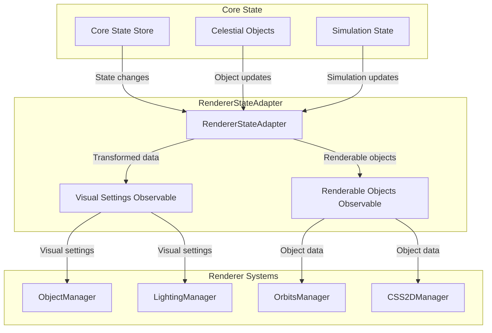

# RendererStateAdapter

Bridges the gap between core state and renderer systems, providing reactive data transformation and state synchronization.

## 🎯 Purpose

The RendererStateAdapter serves as the critical bridge that:

- **State Synchronization**: Keeps renderer systems synchronized with core state changes
- **Data Transformation**: Converts core state data to renderer-friendly formats
- **Event Broadcasting**: Broadcasts state changes to all dependent renderer systems
- **Performance Optimization**: Provides efficient change detection and selective updates
- **Reactive Integration**: Uses RxJS observables for reactive state management

## 🏗️ Architecture

The RendererStateAdapter follows a reactive pattern using RxJS observables:



### Core Components

```typescript
class RendererStateAdapter extends StateSubscriptionMixin {
  /** An observable for visual settings that renderer components can subscribe to. */
  public $visualSettings: BehaviorSubject<RendererVisualSettings>;

  /** The current simulation time, used for calculating rotations. */
  private currentSimulationTime: number = 0;

  /** The factory for creating renderable object instances. */
  private factory: RenderableObjectFactory;

  /** Cache of last processed objects for change detection */
  private lastProcessedObjects?: Record<string, CelestialObject>;
}
```

## 🚀 Core Features

### State Transformation

- **Object Conversion**: Converts core celestial objects to renderable objects
- **Settings Mapping**: Maps simulation settings to visual settings
- **Data Validation**: Validates and sanitizes state data
- **Type Safety**: Ensures type safety across state boundaries

### Reactive Updates

- **Observable Streams**: Provides reactive streams for state changes
- **Change Detection**: Efficiently detects and broadcasts changes
- **Selective Updates**: Only updates systems that need updates
- **Performance Optimization**: Minimizes unnecessary re-renders

### Integration Management

- **State Subscription**: Manages subscriptions to core state
- **Lifecycle Management**: Handles subscription lifecycle
- **Error Handling**: Graceful error handling and recovery
- **Memory Management**: Proper cleanup and disposal

## 🔧 Core Methods

### State Management

#### Constructor

Creates a new RendererStateAdapter instance.

```typescript
constructor();
```

**Process:**

1. Initializes visual settings observable
2. Sets up state subscriptions
3. Configures change detection
4. Initializes object factory

#### processCelestialObjectsUpdateNow()

Processes celestial objects updates immediately.

```typescript
private processCelestialObjectsUpdateNow(
  objects: Record<string, CelestialObject>
): void
```

**Process:**

1. Detects object changes (added, removed, modified)
2. Creates renderable objects for new objects
3. Updates existing renderable objects
4. Removes renderable objects for deleted objects
5. Broadcasts changes to subscribers

### Subscription Management

#### subscribeToCoreState()

Sets up subscriptions to core state changes.

```typescript
private subscribeToCoreState(): void
```

**Process:**

1. Subscribes to celestial objects changes
2. Subscribes to simulation state changes
3. Sets up change detection logic
4. Configures error handling

#### extractVisualSettings()

Extracts visual settings from simulation state.

```typescript
private extractVisualSettings(
  simState: SimulationState
): RendererVisualSettings
```

**Process:**

1. Maps simulation configuration to visual settings
2. Extracts time scale and prediction settings
3. Configures trail length multiplier
4. Returns formatted visual settings

## 🔄 Data Flow

### State Update Flow

1. **Core State Change**: Core state emits change event
2. **Adapter Reception**: RendererStateAdapter receives change
3. **Data Transformation**: Converts core data to renderer format
4. **Change Detection**: Detects what actually changed
5. **Broadcast Update**: Broadcasts changes to subscribers
6. **System Update**: Renderer systems update accordingly

### Object Processing Flow

1. **Object Detection**: Detects new, modified, or removed objects
2. **Factory Creation**: Uses factory to create renderable objects
3. **Property Mapping**: Maps core object properties to renderer properties
4. **Validation**: Validates renderable object data
5. **Broadcast**: Broadcasts renderable objects to subscribers

### Settings Processing Flow

1. **Settings Extraction**: Extracts visual settings from simulation state
2. **Change Comparison**: Compares with previous settings
3. **Selective Update**: Only updates if settings actually changed
4. **Broadcast**: Broadcasts visual settings to subscribers

## 📊 Technical Specifications

### Interface Definitions

```typescript
interface RendererVisualSettings {
  /** A multiplier that adjusts the length of orbital trails. */
  trailLengthMultiplier: number;
  /** The simulation configuration for rendering-specific decisions. */
  simulationConfig: SimulationConfiguration;
  /** The time scale for the simulation. */
  timeScale: number;
  /** The number of steps for the simulation. */
  predictionSteps: number;
  /** The duration of the prediction in seconds. */
  predictionDuration: number;
}
```

### Observable Types

```typescript
/** Observable for visual settings changes */
$visualSettings: BehaviorSubject<RendererVisualSettings>;

/** Observable for renderable objects changes */
$renderableObjects: Observable<RenderableCelestialObject[]>;
```

### State Integration Types

```typescript
interface StateSubscriptionMixin {
  /** Manages RxJS subscriptions */
  protected subscriptions: Subscription[];

  /** Adds subscription for cleanup */
  protected addSubscription(subscription: Subscription): void;

  /** Disposes all subscriptions */
  dispose(): void;
}
```

## 💡 Usage Examples

### Basic Setup

```typescript
import { RendererStateAdapter } from "@teskooano/renderer-threejs";

// Create state adapter
const stateAdapter = new RendererStateAdapter();

// Subscribe to visual settings changes
stateAdapter.$visualSettings.subscribe((settings) => {
  console.log("Visual settings updated:", settings);
  // Update renderer systems with new settings
});

// Subscribe to renderable objects changes
stateAdapter.$renderableObjects.subscribe((objects) => {
  console.log("Renderable objects updated:", objects.length);
  // Update object managers with new objects
});
```

### Integration with Renderer Systems

```typescript
// In ObjectManager
class ObjectManager {
  constructor(stateAdapter: RendererStateAdapter) {
    // Subscribe to renderable objects
    stateAdapter.$renderableObjects.subscribe((objects) => {
      this.updateObjects(objects);
    });
  }

  private updateObjects(objects: RenderableCelestialObject[]) {
    // Update object renderers based on new data
    objects.forEach((object) => {
      this.updateObjectRenderer(object);
    });
  }
}
```

### Settings Integration

```typescript
// In OrbitsManager
class OrbitsManager {
  constructor(stateAdapter: RendererStateAdapter) {
    // Subscribe to visual settings
    stateAdapter.$visualSettings.subscribe((settings) => {
      this.updateTrailLength(settings.trailLengthMultiplier);
      this.updatePredictionSettings(
        settings.predictionSteps,
        settings.predictionDuration,
      );
    });
  }
}
```

## ⚡ Performance Considerations

### Change Detection Efficiency

- **Selective Updates**: Only processes objects that actually changed
- **Change Comparison**: Compares current state with previous state
- **Batch Processing**: Batches multiple changes into single updates
- **Debounced Updates**: Prevents excessive update cycles

### Memory Management

- **Subscription Cleanup**: Properly disposes all subscriptions
- **Object Caching**: Caches processed objects to avoid reprocessing
- **Memory Monitoring**: Monitors memory usage and cleans up unused objects
- **Garbage Collection**: Ensures proper garbage collection of disposed objects

### Observable Optimization

- **BehaviorSubject**: Uses BehaviorSubject for immediate value access
- **Efficient Operators**: Uses efficient RxJS operators for data transformation
- **Backpressure Handling**: Handles backpressure in high-frequency updates
- **Error Recovery**: Graceful error recovery without breaking observables

## 🔌 Integration Points

### Core State Integration

- **State Subscription**: Subscribes to core state observables
- **Data Transformation**: Transforms core state data for renderer consumption
- **Event Broadcasting**: Broadcasts state changes to renderer systems
- **Performance Optimization**: Optimizes state change propagation

### Renderer System Integration

- **ObjectManager**: Provides renderable objects for object management
- **LightingManager**: Provides visual settings for lighting configuration
- **OrbitsManager**: Provides settings for orbital visualization
- **CSS2DManager**: Provides object data for label management

### Factory Integration

- **RenderableObjectFactory**: Uses factory to create renderable objects
- **Object Creation**: Creates renderable objects from core objects
- **Property Mapping**: Maps core object properties to renderer properties
- **Type Safety**: Ensures type safety in object creation

## 🐛 Debug Features

### State Monitoring

- **Change Tracking**: Tracks all state changes and transformations
- **Performance Metrics**: Monitors performance of state processing
- **Memory Usage**: Tracks memory usage of state adapter
- **Subscription Status**: Monitors subscription status and health

### Validation and Testing

- **Data Validation**: Validates transformed data before broadcasting
- **Error Handling**: Comprehensive error handling and logging
- **State Consistency**: Ensures state consistency across systems
- **Integration Testing**: Tests integration with core state and renderer systems

### Debug Tools

- **State Inspection**: Tools for inspecting current state
- **Change Visualization**: Visualizes state changes and data flow
- **Performance Profiling**: Profiles state processing performance
- **Memory Analysis**: Analyzes memory usage patterns

## 🔮 Future Enhancements

### Optimization Opportunities

- **Incremental Updates**: Implement incremental state updates
- **Smart Caching**: Implement intelligent caching strategies
- **Parallel Processing**: Process state changes in parallel
- **Memory Optimization**: Optimize memory usage patterns

### Potential Improvements

- **State Persistence**: Add state persistence capabilities
- **Advanced Filtering**: Implement advanced state filtering
- **Real-time Analytics**: Add real-time state analytics
- **Plugin Architecture**: Support for custom state transformers

## 📚 Related Components

### Core Dependencies

- [[core/core-state/core-state|Core State]] - Core state management system
- [[data/data-types/data-types|Data Types]] - Core data structures and types
- [[RenderableObjectFactory]] - Factory for creating renderable objects

### Renderer Integration

- [[ModularSpaceRenderer]] - Main renderer orchestrator
- [[ObjectManager]] - Object management system
- [[LightingManager]] - Lighting management system
- [[OrbitsManager]] - Orbital visualization system

## 🏛️ Architecture Patterns

- **Adapter Pattern**: Bridges core state with renderer systems
- **Observer Pattern**: Uses RxJS observables for reactive updates
- **Factory Pattern**: Uses factory for object creation
- **Mixin Pattern**: Extends StateSubscriptionMixin for subscription management
- **Reactive Pattern**: Implements reactive programming patterns

---

_The RendererStateAdapter is the critical bridge that enables seamless integration between the core state management system and the renderer, providing reactive data transformation and efficient state synchronization._
