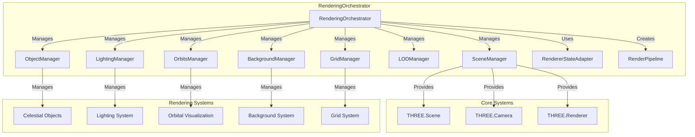

# RenderingOrchestrator

Manages core rendering systems including scene, objects, lighting, orbits, and background, providing centralized coordination for all rendering operations.

## 🎯 Purpose

The RenderingOrchestrator serves as the core rendering coordinator that:

- **System Management**: Manages all core rendering systems and their lifecycle
- **Resource Coordination**: Coordinates resources between different rendering systems
- **Performance Optimization**: Optimizes performance across all rendering systems
- **State Integration**: Integrates with RendererStateAdapter for state management
- **Debug Support**: Provides debug capabilities for rendering systems

## 🏗️ Architecture

The RenderingOrchestrator follows a centralized management pattern:



### Core Components

```typescript
class RenderingOrchestrator {
  /**
   * Handles the scene management and core Three.js objects.
   */
  private _sceneManager: SceneManager;

  /**
   * Manages celestial object rendering and lifecycle.
   */
  private _objectManager!: ObjectManager;

  /**
   * Manages orbital visualization and prediction.
   */
  private _orbitManager!: OrbitsManager;

  /**
   * Manages background rendering and skybox.
   */
  private _backgroundManager: BackgroundManager;

  /**
   * Manages scene lighting and light sources.
   */
  private _lightingManager: LightingManager;

  /**
   * Manages level of detail for performance optimization.
   */
  private _lodManager: LODManager;

  /**
   * Manages grid helper for spatial reference.
   */
  private _gridManager: GridManager;

  /**
   * Bridges core state with renderer systems.
   */
  private _stateAdapter: RendererStateAdapter;

  /**
   * Orchestrates the update sequence for all systems.
   */
  private _renderPipeline!: RenderPipeline;
}
```

## 🚀 Core Features

### System Management

- **Lifecycle Management**: Manages initialization, updates, and disposal of all systems
- **Resource Coordination**: Coordinates resources between different systems
- **Dependency Management**: Handles dependencies between systems
- **Error Handling**: Provides error handling and recovery for all systems

### Performance Optimization

- **LOD Management**: Manages level of detail for performance optimization
- **Resource Pooling**: Pools expensive resources for reuse
- **Memory Management**: Manages memory usage across all systems
- **Performance Monitoring**: Monitors performance of all systems

### State Integration

- **State Synchronization**: Synchronizes state across all systems
- **Data Transformation**: Transforms data for system consumption
- **Event Broadcasting**: Broadcasts events to all systems
- **Change Detection**: Detects and handles state changes

## 🔧 Core Methods

### Lifecycle Management

#### Constructor

Creates a new RenderingOrchestrator instance.

```typescript
constructor(container: HTMLElement)
```

**Process:**

1. Creates SceneManager with container
2. Initializes BackgroundManager
3. Initializes LightingManager
4. Initializes LODManager
5. Initializes GridManager
6. Creates RendererStateAdapter
7. Sets up system dependencies

#### initializeManagersWithCss2D()

Initializes managers that depend on CSS2D manager.

```typescript
initializeManagersWithCss2D(css2DManager: any): void
```

**Process:**

1. Initializes ObjectManager with CSS2D manager
2. Initializes OrbitsManager with CSS2D manager
3. Creates RenderPipeline with all managers
4. Sets up system integration

#### setControlsManager()

Sets the controls manager for the orchestrator.

```typescript
setControlsManager(controlsManager: any): void
```

**Process:**

1. Stores controls manager reference
2. Integrates controls with other systems
3. Sets up control dependencies

### System Access

#### sceneManager

Returns the scene manager instance.

```typescript
get sceneManager(): SceneManager
```

#### objectManager

Returns the object manager instance.

```typescript
get objectManager(): ObjectManager
```

#### orbitManager

Returns the orbit manager instance.

```typescript
get orbitManager(): OrbitsManager
```

#### renderPipeline

Returns the render pipeline instance.

```typescript
get renderPipeline(): RenderPipeline
```

#### gridManager

Returns the grid manager instance.

```typescript
get gridManager(): GridManager
```

#### stateAdapter

Returns the state adapter instance.

```typescript
get stateAdapter(): RendererStateAdapter
```

#### backgroundManager

Returns the background manager instance.

```typescript
get backgroundManager(): BackgroundManager
```

#### lightingManager

Returns the lighting manager instance.

```typescript
get lightingManager(): LightingManager
```

#### lodManager

Returns the LOD manager instance.

```typescript
get lodManager(): LODManager
```

### Debug and Analysis

#### setDebugMode()

Enables or disables debug mode across all systems.

```typescript
setDebugMode(enabled: boolean): void
```

**Process:**

1. Enables debug mode in all manager systems
2. Configures debug visualization
3. Sets up debug monitoring

#### getTriangleCount()

Returns the total number of triangles being rendered.

```typescript
getTriangleCount(): number
```

**Process:**

1. Gets triangle count from object manager
2. Gets triangle count from background manager
3. Gets triangle count from orbit manager
4. Returns total triangle count

## 🔄 Data Flow

### Initialization Flow

1. **Container Setup**: Receives HTML container element
2. **Core System Creation**: Creates SceneManager and core systems
3. **Manager Initialization**: Initializes all manager systems
4. **State Adapter Setup**: Creates and configures RendererStateAdapter
5. **Pipeline Creation**: Creates RenderPipeline with all managers
6. **System Integration**: Integrates all systems together

### Update Flow

1. **State Changes**: Receives state changes from RendererStateAdapter
2. **System Updates**: Updates all manager systems
3. **Pipeline Execution**: Executes RenderPipeline update sequence
4. **Resource Management**: Manages resources and performance
5. **Error Handling**: Handles errors and recovery

### Disposal Flow

1. **Pipeline Stop**: Stops RenderPipeline
2. **Manager Disposal**: Disposes all manager systems
3. **State Adapter Disposal**: Disposes RendererStateAdapter
4. **Resource Cleanup**: Cleans up all resources
5. **Reference Clearing**: Clears all references

## 📊 Technical Specifications

### Manager Configuration

```typescript
interface RenderingOrchestratorConfig {
  /** Scene manager configuration */
  sceneManager: SceneManagerOptions;
  /** Background manager configuration */
  backgroundManager: BackgroundManagerOptions;
  /** Lighting manager configuration */
  lightingManager: LightingManagerOptions;
  /** LOD manager configuration */
  lodManager: LODManagerOptions;
  /** Grid manager configuration */
  gridManager: GridManagerOptions;
}
```

### System Dependencies

```typescript
interface SystemDependencies {
  /** Scene manager provides core Three.js objects */
  sceneManager: SceneManager;
  /** State adapter provides state integration */
  stateAdapter: RendererStateAdapter;
  /** CSS2D manager for 2D labels */
  css2DManager?: Layer2DManager;
  /** Controls manager for user interaction */
  controlsManager?: ControlsManager;
}
```

## 💡 Usage Examples

### Basic Setup

```typescript
import { RenderingOrchestrator } from "@teskooano/renderer-threejs";

// Create rendering orchestrator
const container = document.getElementById("renderer-container");
const renderingOrchestrator = new RenderingOrchestrator(container);

// Initialize with CSS2D manager
renderingOrchestrator.initializeManagersWithCss2D(css2DManager);

// Set controls manager
renderingOrchestrator.setControlsManager(controlsManager);

// Access systems
const sceneManager = renderingOrchestrator.sceneManager;
const objectManager = renderingOrchestrator.objectManager;
const orbitManager = renderingOrchestrator.orbitManager;
```

### Debug Mode

```typescript
// Enable debug mode
renderingOrchestrator.setDebugMode(true);

// Get performance metrics
const triangleCount = renderingOrchestrator.getTriangleCount();
console.log(`Rendering ${triangleCount} triangles`);

// Access individual systems for debugging
const gridManager = renderingOrchestrator.gridManager;
gridManager.setVisible(true);
```

### System Integration

```typescript
// Access render pipeline
const renderPipeline = renderingOrchestrator.renderPipeline;

// Access state adapter
const stateAdapter = renderingOrchestrator.stateAdapter;

// Subscribe to state changes
stateAdapter.$visualSettings.subscribe((settings) => {
  console.log("Visual settings updated:", settings);
});

// Access individual managers
const lightingManager = renderingOrchestrator.lightingManager;
const backgroundManager = renderingOrchestrator.backgroundManager;
```

## ⚡ Performance Considerations

### System Coordination

- **Efficient Updates**: Only updates systems that need updates
- **Resource Sharing**: Shares resources between systems
- **Memory Management**: Manages memory usage across all systems
- **Performance Monitoring**: Monitors performance of all systems

### LOD Management

- **Level of Detail**: Manages LOD for performance optimization
- **Distance-Based LOD**: Adjusts LOD based on camera distance
- **Performance Scaling**: Scales performance based on device capabilities
- **Quality Management**: Manages quality settings for different systems

### Resource Management

- **Resource Pooling**: Pools expensive resources for reuse
- **Memory Optimization**: Optimizes memory usage patterns
- **Garbage Collection**: Minimizes garbage collection pressure
- **Resource Cleanup**: Properly cleans up unused resources

## 🔌 Integration Points

### Core System Integration

- **SceneManager**: Provides core Three.js scene, camera, and renderer
- **AnimationLoop**: Integrates with animation loop for updates
- **RendererStateAdapter**: Integrates with state management system

### Manager System Integration

- **ObjectManager**: Manages celestial object rendering
- **LightingManager**: Manages scene lighting and light sources
- **OrbitsManager**: Manages orbital visualization
- **BackgroundManager**: Manages background and skybox
- **GridManager**: Manages grid helper
- **LODManager**: Manages level of detail

### External System Integration

- **CSS2DManager**: Integrates with 2D label system
- **ControlsManager**: Integrates with user interaction system
- **Core State**: Integrates with core state management

## 🐛 Debug Features

### System Monitoring

- **Manager Status**: Tracks status of all manager systems
- **Performance Metrics**: Monitors performance across all systems
- **Memory Usage**: Tracks memory usage of all components
- **Resource Usage**: Monitors resource usage patterns

### Debug Tools

- **Debug Mode**: Enables debug mode across all systems
- **Triangle Counting**: Counts triangles being rendered
- **System Inspection**: Inspects state of all systems
- **Performance Profiling**: Profiles performance of all systems

### Validation and Testing

- **System Validation**: Validates system initialization and configuration
- **Integration Testing**: Tests integration between systems
- **Performance Testing**: Tests performance under various conditions
- **Error Handling**: Tests error recovery and graceful degradation

## 🔮 Future Enhancements

### Optimization Opportunities

- **System Lazy Loading**: Load systems only when needed
- **Dynamic Quality Adjustment**: Adjust quality based on performance
- **Memory Pool Optimization**: Optimize memory pooling strategies
- **Performance Scaling**: Implement dynamic performance scaling

### Potential Improvements

- **Multi-Threading Support**: Support for Web Workers
- **Advanced Caching**: Implement advanced caching strategies
- **Performance Analytics**: Enhanced performance analytics
- **Plugin Architecture**: Support for custom rendering plugins

## 📚 Related Components

### Core Dependencies

- [[SceneManager]] - Core scene management from threejs-core
- [[RendererStateAdapter]] - State integration and transformation
- [[RenderPipeline]] - Update orchestration

### Manager Systems

- [[ObjectManager]] - Object management system
- [[LightingManager]] - Lighting management system
- [[OrbitsManager]] - Orbital visualization system
- [[BackgroundManager]] - Background management system
- [[GridManager]] - Grid management system
- [[LODManager]] - Level of detail management

## 🏛️ Architecture Patterns

- **Orchestrator Pattern**: Coordinates multiple manager systems
- **Facade Pattern**: Provides simplified interface to complex subsystem
- **Manager Pattern**: Each system has its own manager
- **Resource Management**: Proper lifecycle management of all resources
- **Performance Optimization**: Implements performance optimization patterns

---

_The RenderingOrchestrator is the core rendering coordinator that manages all rendering systems, providing centralized coordination, performance optimization, and system integration._
