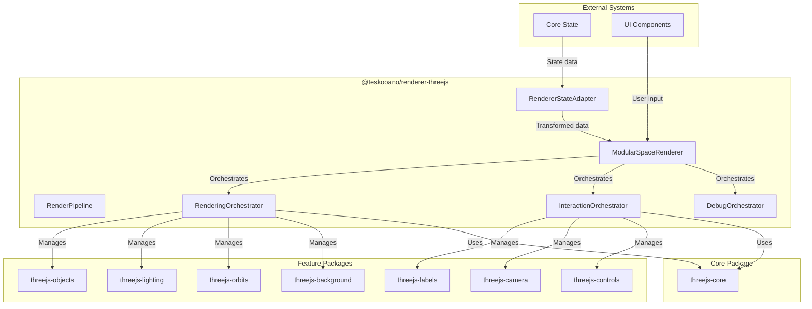

# Three.js Renderer (`@teskooano/renderer-threejs`)

The main integrator package that orchestrates all Three.js rendering components in the Teskooano space simulation.

## 🎯 Purpose

This package serves as the **integrator** for the modular Three.js rendering system:

- **System Orchestration**: Coordinates all renderer packages into a unified system
- **State Integration**: Bridges core state with rendering systems through RendererStateAdapter
- **Public API**: Provides clean, high-level interface for external systems
- **Lifecycle Management**: Handles initialization, updates, and cleanup of all renderer components
- **Performance Optimization**: Manages performance across all rendering subsystems

## 📚 Documentation Structure

### Core Components

- [[threejs/ModularSpaceRenderer|ModularSpaceRenderer]] - Main orchestrator and public facade
- [[threejs/RendererStateAdapter|RendererStateAdapter]] - State integration and transformation
- [[threejs/RenderPipeline|RenderPipeline]] - Per-frame update orchestration

### Orchestrators

- [[threejs/orchestrators|orchestrators]] - Orchestrator pattern overview and architecture
- [[threejs/RenderingOrchestrator|RenderingOrchestrator]] - Manages core rendering systems
- [[threejs/InteractionOrchestrator|InteractionOrchestrator]] - Manages user interaction systems
- [[threejs/DebugOrchestrator|DebugOrchestrator]] - Manages debug and analysis tools

### Architecture & Integration

- [[threejs-renderers/Renderer Architecture Index|Three.js Renderer Architecture]] - Overall system architecture
- [[State Integration Patterns]] - How core state integrates with renderer
- [[Performance Optimization]] - Performance considerations and strategies

## 🔄 Quick Navigation

### By Component Type

- **Main Orchestrator**: [[threejs/ModularSpaceRenderer|ModularSpaceRenderer]]
- **State Integration**: [[threejs/RendererStateAdapter|RendererStateAdapter]]
- **Update Pipeline**: [[threejs/RenderPipeline|RenderPipeline]]
- **Orchestrator Pattern**: [[threejs/orchestrators|orchestrators]]
- **System Orchestrators**: [[threejs/RenderingOrchestrator|RenderingOrchestrator]], [[threejs/InteractionOrchestrator|InteractionOrchestrator]], [[threejs/DebugOrchestrator|DebugOrchestrator]]

### By Architecture Pattern

- **Orchestrator Pattern**: [[threejs/ModularSpaceRenderer|ModularSpaceRenderer]] coordinates specialized orchestrators
- **Facade Pattern**: Provides simplified interface to complex subsystem
- **Adapter Pattern**: [[threejs/RendererStateAdapter|RendererStateAdapter]] bridges core state and renderers
- **Pipeline Pattern**: [[threejs/RenderPipeline|RenderPipeline]] manages update sequence

## 🚀 Core Features

### System Orchestration

- **Unified Interface**: Single entry point for all rendering functionality
- **Modular Design**: Each system is independently manageable
- **Loose Coupling**: Systems communicate through well-defined interfaces
- **Extensibility**: Easy to add new rendering features

### State Integration

- **Reactive Updates**: Automatically responds to core state changes
- **Data Transformation**: Converts core state to renderer-friendly formats
- **Event Broadcasting**: Propagates state changes to all systems
- **Performance Optimization**: Efficient change detection and updates

### Performance Management

- **Device Optimization**: Automatically adjusts quality based on device capabilities
- **Memory Management**: Proper resource cleanup and disposal
- **Render Optimization**: Efficient update cycles and rendering
- **Performance Monitoring**: Continuous performance tracking and adjustment

## 🚀 Getting Started

1. Start with [[ModularSpaceRenderer]] to understand the main interface
2. Explore [[RendererStateAdapter]] for state integration
3. Learn about [[RenderPipeline]] for update orchestration
4. Check out the orchestrators for system-specific management
5. Review the architecture patterns for system design

## 🏗️ System Architecture



## 📦 Dependencies

This package integrates the following packages:

### Core Dependencies

- **[[threejs-core/threejs-core|Three.js Core]]** - Foundational Three.js infrastructure
- **[[core/core-state/core-state|Core State]]** - State management and subscriptions
- **[[data/data-types/data-types|Data Types]]** - Core data structures and types

### Feature Packages

- **[[threejs-objects/threejs-objects|Three.js Objects]]** - Celestial object rendering
- **[[threejs-lighting/threejs-lighting|Three.js Lighting]]** - Dynamic lighting system
- **[[threejs-orbits/threejs-orbits|Three.js Orbits]]** - Orbital visualization
- **[[threejs-labels/threejs-labels|Three.js Labels]]** - 2D label rendering
- **[[threejs-camera/threejs-camera|Three.js Camera]]** - Camera management
- **[[threejs-controls/threejs-controls|Three.js Controls]]** - User interaction controls
- **[[threejs-background/threejs-background|Three.js Background]]** - Skybox and background

### External Dependencies

- **Three.js** - 3D graphics library

## 🎯 Key Features

### System Orchestration

- **Unified Interface**: Single entry point for all rendering functionality
- **Modular Design**: Each system is independently manageable
- **Loose Coupling**: Systems communicate through well-defined interfaces
- **Extensibility**: Easy to add new rendering features

### State Integration

- **Reactive Updates**: Automatically responds to core state changes
- **Data Transformation**: Converts core state to renderer-friendly formats
- **Event Broadcasting**: Propagates state changes to all systems
- **Performance Optimization**: Efficient change detection and updates

### Performance Management

- **Device Optimization**: Automatically adjusts quality based on device capabilities
- **Memory Management**: Proper resource cleanup and disposal
- **Render Optimization**: Efficient update cycles and rendering
- **Performance Monitoring**: Continuous performance tracking and adjustment

## 📊 Technical Specifications

### Package Configuration

```typescript
interface ModularSpaceRendererOptions extends WebGLRendererParameters {
  /** Enables/disables antialiasing. */
  antialias?: boolean;
  /** Enables/disables shadows. */
  shadows?: boolean;
  /** Enables/disables High Dynamic Range rendering for lighting. */
  hdr?: boolean;
  /** Sets the initial background. Can be a color string or a texture. */
  background?: string | THREE.Texture;
  /** Sets the initial visibility of the debug grid. */
  showGrid?: boolean;
  /** Sets the initial visibility of 2D object labels. */
  showCelestialLabels?: boolean;
  /** Sets the initial visibility of Astronomical Unit markers. */
  showAuMarkers?: boolean;
  /** Sets the initial visibility of particle effects for destroyed objects. */
  showDebrisEffects?: boolean;
  grid?: "polar" | "cartesian";
  labelConfig?: LabelVisibilityConfig;
}
```

### Orchestrator Types

```typescript
interface RenderPipelineOptions {
  /** The manager for the core THREE.Scene, camera, and renderer. */
  sceneManager: SceneManager;
  /** The manager for user interaction and camera controls. */
  controlsManager: ControlsManager;
  /** The manager for visualizing orbital paths. */
  orbitManager: OrbitsManager;
  /** The manager for creating and updating 3D objects. */
  objectManager: ObjectManager;
  /** The manager for the skybox and background. */
  backgroundManager: BackgroundManager;
  /** The manager for scene lighting. */
  lightingManager: LightingManager;
  /** The manager for the grid helper. */
  gridManager: GridManager;
  /** The optional manager for 2D HTML labels. */
  css2DManager: Layer2DManager;
}
```

## 🔧 Usage Examples

### Basic Setup

```typescript
import { ModularSpaceRenderer } from "@teskooano/renderer-threejs";

// Get container element
const container = document.getElementById("renderer-container");
if (!container) throw new Error("Container not found");

// Create renderer
const renderer = new ModularSpaceRenderer(container);

// Start rendering
renderer.start();

// Handle cleanup
window.addEventListener("beforeunload", () => {
  renderer.dispose();
});
```

### Advanced Configuration

```typescript
// Access individual systems through orchestrators
const sceneManager = renderer.renderingOrchestrator.sceneManager;
const objectManager = renderer.renderingOrchestrator.objectManager;
const controlsManager = renderer.interactionOrchestrator.getControlsManager();

// Enable debug mode
renderer.setDebugMode(true);

// Get performance metrics
const triangleCount = renderer.getTriangleCount();
```

## ⚡ Performance Considerations

### System Optimization

- **Orchestrator Efficiency**: Specialized management reduces overhead
- **Lazy Initialization**: Systems are initialized only when needed
- **Efficient Updates**: Only affected systems are updated
- **Resource Sharing**: Common resources are shared between systems

### Memory Management

- **Proper Disposal**: All systems are properly disposed on cleanup
- **Event Cleanup**: Event listeners are removed to prevent memory leaks
- **Resource Pooling**: Expensive resources are pooled and reused
- **Garbage Collection**: Unused objects are properly dereferenced

### Render Optimization

- **Callback Management**: Efficient callback registration and execution
- **Update Prioritization**: Critical updates are prioritized
- **Frame Budgeting**: Updates fit within frame budget
- **Performance Monitoring**: Continuous performance tracking

## 🔌 Integration Points

### Core State Integration

- **State Subscription**: Subscribes to core state changes through RendererStateAdapter
- **Data Transformation**: Converts core state data to renderer-friendly formats
- **Event Broadcasting**: Broadcasts state changes to all dependent systems
- **Performance Optimization**: Efficient change detection and selective updates

### External System Integration

- **UI Components**: Provides clean interface for UI systems to control rendering
- **Physics Engine**: Integrates with physics engine changes for orbital visualization
- **Simulation State**: Responds to simulation time scale and configuration changes
- **Device Capabilities**: Adapts to device performance and capabilities

### Package Dependencies

- **Core Package**: Uses threejs-core for foundational Three.js infrastructure
- **Feature Packages**: Integrates all specialized renderer packages
- **State Management**: Connects to core-state for reactive updates
- **Data Types**: Uses shared data types for consistent interfaces

## 🐛 Debug Features

### System Monitoring

- **Orchestrator Status**: Track status of all orchestrators
- **System Health**: Monitor health of individual systems
- **Performance Metrics**: Track performance across all systems
- **Memory Usage**: Monitor memory usage of all components

### Debug Tools

- **Depth Buffer Analysis**: Analyze depth buffer issues
- **Render Order Validation**: Validate render order correctness
- **Performance Profiling**: Profile performance bottlenecks
- **State Inspection**: Inspect system state and data flow

### Validation and Testing

- **System Validation**: Validate system initialization and configuration
- **Integration Testing**: Test integration between orchestrators
- **Performance Testing**: Test performance under various conditions
- **Error Handling**: Test error recovery and graceful degradation

## 🔮 Future Enhancements

### Optimization Opportunities

- **System Lazy Loading**: Load systems only when needed
- **Dynamic Quality Adjustment**: Adjust quality based on performance
- **Memory Pool Optimization**: Optimize memory pooling strategies
- **Render Pipeline Optimization**: Optimize render pipeline efficiency

### Potential Improvements

- **Multi-Threading Support**: Support for Web Workers
- **Advanced Caching**: Implement advanced caching strategies
- **Performance Analytics**: Enhanced performance analytics
- **Plugin Architecture**: Support for custom renderer plugins

## 🏛️ Architecture Patterns

- **Orchestrator Pattern**: Delegates to specialized orchestrators for system management
- **Facade Pattern**: Provides simplified interface to complex subsystem
- **Adapter Pattern**: Bridges core state with rendering systems
- **Observer Pattern**: Responds to state changes and events
- **Pipeline Pattern**: Manages update sequence through render pipeline
- **Resource Management**: Proper lifecycle management of all resources

## 📚 Related Documentation

### Core Package

- [[threejs-core/threejs-core|Three.js Core]] - Foundational Three.js infrastructure

### Feature Packages

- [[threejs-objects]] - Celestial object rendering
- [[threejs-lighting]] - Dynamic lighting system
- [[threejs-orbits]] - Orbital visualization
- [[threejs-labels]] - 2D label rendering
- [[threejs-camera]] - Camera management
- [[threejs-controls]] - User interaction controls
- [[threejs-background]] - Skybox and background

### System Integration

- [[core/core-state/core-state|Core State]] - State management system
- [[data/data-types/data-types|Data Types]] - Core data structures

---

_The Three.js Renderer package is the central integrator that brings together all rendering components into a cohesive, high-performance space simulation system._
