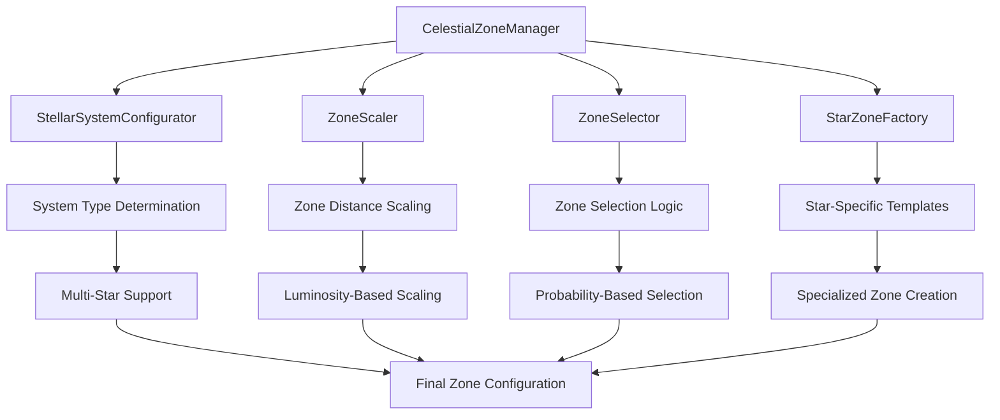

# CelestialZoneManager

The central coordinator for zone scaling, selection, and star-specific zone generation in the procedural generation system. This class orchestrates the creation of realistic celestial zones based on stellar properties and system configuration.

## 🎯 Purpose

`CelestialZoneManager` serves as the primary interface for managing celestial zones in procedural star system generation. It coordinates between zone scaling, selection, and star-specific zone generation to create realistic and varied planetary systems with scientifically accurate temperature-based zones and orbital configurations.

## 🏗️ Architecture

### Core Components

The manager orchestrates multiple specialized components for comprehensive zone management:

```typescript
class CelestialZoneManager {
  private readonly zones: CelestialZone[];
  private readonly stellarConfigurator: StellarSystemConfigurator;
  private readonly zoneSelector: ZoneSelector;
  private readonly zoneScaler: ZoneScaler;
  private readonly starZoneFactory: StarZoneFactory;
  private readonly random: () => number;
}
```

### Component Integration



## 🚀 Core Features

### Zone Management System

Comprehensive zone lifecycle management with scientific accuracy:

```typescript
interface CelestialZone {
  name: string;
  category: ZoneCategory;
  temperatureRange: { min: number; max: number };
  minAU: number;
  maxAU: number;
  baseMinAU: number;
  baseMaxAU: number;
  allowedPlanetTypes: PlanetType[];
  allowedGasGiantClasses: GasGiantClass[];
  cometChance: number;
  asteroidBeltChance: number;
  formationProbability: number;
  specialConfigurations: OrbitalConfiguration[];
  maxBodies: number;
  minBodies?: number;
}
```

**Zone Categories:**

- **SCORCHED**: 0.01-0.3 AU, >700K - Lava worlds, tidally locked
- **HOT**: 0.3-0.8 AU, 400-700K - Desert worlds, Venus-like
- **TEMPERATE**: 0.8-1.5 AU, 250-400K - Earth-like, habitable
- **COOL**: 1.5-3.0 AU, 150-250K - Ice worlds, frozen
- **COLD**: 3.0-10 AU, 50-150K - Gas giants, icy moons
- **FROZEN**: 10-50 AU, 20-50K - Ice giants, Kuiper belt
- **OUTER**: 50-200 AU, 10-20K - Distant planets, scattered
- **DISTANT**: 200-1000 AU, 5-10K - Long-period comets
- **INTERSTELLAR**: 1000-10000 AU, <5K - Rogue planets, Oort cloud

### Stellar System Configuration

Advanced multi-star system support with realistic probabilities:

```typescript
interface StellarSystemConfiguration {
  type: StellarSystemType;
  stars: number;
  separationAU?: [number, number];
  supportsCircumbinaryPlanets: boolean;
  systemName: string;
  description: string;
}

enum StellarSystemType {
  SINGLE_STAR = "SINGLE_STAR", // 60% - Standard systems
  BINARY_CLOSE = "BINARY_CLOSE", // 15% - Tidal interactions
  BINARY_WIDE = "BINARY_WIDE", // 20% - Independent systems
  TRIPLE_HIERARCHICAL = "TRIPLE_HIERARCHICAL", // 4% - Complex dynamics
  MULTIPLE_COMPLEX = "MULTIPLE_COMPLEX", // 1% - Rare configurations
}
```

### Zone Scaling System

Luminosity-based zone scaling with spectral class modifiers:

```typescript
interface ZoneScalingFactors {
  luminosity: number; // Primary scaling factor
  spectralClass: number; // O=2.5, B=2.0, A=1.5, F=1.2, G=1.0, K=0.8, M=0.6
  stellarType: number; // Special scaling for compact objects
  complexity: number; // Multi-star system complexity factor
  finalScaling: number; // Combined scaling factor (0.1-5.0)
}
```

## 🔧 Key Methods

### Constructor

```typescript
constructor(random: () => number, customZones?: CelestialZone[])
```

**Parameters:**

- `random`: Seeded random number generator for deterministic generation
- `customZones`: Optional custom zone configuration for specialized systems

**Initialization Process:**

1. **Component Setup**: Initializes all sub-components (configurator, scaler, selector, factory)
2. **Zone Loading**: Loads default zones or custom zone configuration
3. **Validation**: Validates zone boundaries and properties
4. **Optimization**: Optimizes zone configuration for performance

### Static Factory Method

```typescript
static createForStar(star: CelestialObject, random: () => number): CelestialZoneManager
```

**Purpose:**
Creates a zone manager specifically configured for a given star with optimized zone templates.

**Parameters:**

- `star`: The star to create zones for
- `random`: Seeded random number generator

**Returns:** `CelestialZoneManager` - Configured zone manager for the star

**Process:**

1. **Star Analysis**: Analyzes stellar properties (mass, radius, temperature, luminosity)
2. **Zone Template Selection**: Selects appropriate zone templates based on stellar type
3. **Zone Scaling**: Applies initial scaling based on stellar properties
4. **Manager Creation**: Creates and configures the zone manager instance

**Usage:**

```typescript
const zoneManager = CelestialZoneManager.createForStar(star, random);
const zones = zoneManager.getAllZones();
```

### System Configuration

```typescript
determineStellarConfiguration(): StellarSystemConfiguration
```

**Purpose:**
Determines the stellar system configuration using probability-based selection with realistic astronomical frequencies.

**Returns:** `StellarSystemConfiguration` - Complete system configuration with type and properties

**Configuration Process:**

1. **Probability Selection**: Uses seeded random number generator for deterministic results
2. **Type Determination**: Selects system type based on realistic probabilities
3. **Parameter Generation**: Generates system-specific parameters (separations, star counts)
4. **Validation**: Ensures configuration is physically realistic and stable

**Configuration Types:**

- **SINGLE_STAR**: 60% - Isolated main sequence star with standard planetary systems
- **BINARY_CLOSE**: 15% - Stars separated by <1 AU with tidal interactions
- **BINARY_WIDE**: 20% - Stars separated by 1-100 AU with independent systems
- **TRIPLE_HIERARCHICAL**: 4% - Three stars in nested binary configuration
- **MULTIPLE_COMPLEX**: 1% - Complex multi-star system with intricate dynamics

### Zone Scaling and Selection

```typescript
getAdjustedZones(stars: CelestialObject[], config: StellarSystemConfiguration): CelestialZone[]
```

**Purpose:**
Applies zone scaling based on stellar properties and system configuration.

**Parameters:**

- `stars`: Array of stars in the system
- `config`: System configuration with type and properties

**Returns:** `CelestialZone[]` - Scaled zones adjusted for stellar properties

**Scaling Process:**

1. **Luminosity Calculation**: Calculates combined luminosity for multi-star systems
2. **Spectral Scaling**: Applies spectral class-specific scaling factors
3. **Complexity Adjustment**: Adjusts for system complexity and stability
4. **Boundary Validation**: Ensures scaled zones maintain physical realism

```typescript
selectZonesForPlacement(stars: CelestialObject[], config: StellarSystemConfiguration): CelestialZone[]
```

**Purpose:**
Chooses active zones for body placement using probability-based selection with fallback strategies.

**Selection Strategy:**

- **Probability-Based**: Different inclusion probabilities per zone category
- **Minimum Body Guarantee**: Ensures minimum number of bodies in system
- **Priority Zones**: Prioritizes inner zones for placement
- **Fallback Strategy**: Adds zones if selection is empty
- **Final Cap**: Limits to 5-7 zones maximum

## 🔄 Data Flow

### Zone Management Pipeline

```typescript
// 1. System configuration determination
const config = zoneManager.determineStellarConfiguration();

// 2. Zone scaling based on stellar properties
const scaledZones = zoneManager.getAdjustedZones(stars, config);

// 3. Zone selection for body placement
const activeZones = zoneManager.selectZonesForPlacement(stars, config);

// 4. Zone lookup for specific distances
const zone = zoneManager.getZoneForDistance(1.0); // 1 AU
```

### Zone Scaling Process

```typescript
// Luminosity-based scaling calculation
const luminosityScaling = Math.sqrt(star.luminosity);

// Spectral class modifier application
const spectralModifier = getSpectralClassModifier(star.spectralClass);

// Multi-star system complexity factor
const complexityFactor = getComplexityFactor(config);

// Final scaling factor with constraints
const finalScaling = Math.max(
  0.1,
  Math.min(5.0, luminosityScaling * spectralModifier * complexityFactor),
);
```

## 🎯 Usage Examples

### Basic Zone Management

```typescript
import { CelestialZoneManager } from "@teskooano/systems-procedural-generation";

// Create zone manager
const random = () => Math.random();
const zoneManager = new CelestialZoneManager(random);

// Determine system configuration
const config = zoneManager.determineStellarConfiguration();
console.log("System type:", config.type);

// Get all zones
const allZones = zoneManager.getAllZones();
console.log("Available zones:", allZones.length);

// Find zone for specific distance
const zone = zoneManager.getZoneForDistance(1.0); // 1 AU
if (zone) {
  console.log("Zone at 1 AU:", zone.name);
}
```

### Star-Specific Zone Creation

```typescript
import { CelestialZoneManager } from "@teskooano/systems-procedural-generation";

// Create zones for a specific star
const star = {
  id: "test-star",
  name: "Test Star",
  type: CelestialType.STAR,
  realMass_kg: 1.989e30, // Solar mass
  realRadius_m: 6.96e8, // Solar radius
  temperature: 5778, // Solar temperature
  properties: {
    stellarType: "MAIN_SEQUENCE",
    spectralClass: "G2V",
    luminosity: 1.0,
  },
};

const zoneManager = CelestialZoneManager.createForStar(star, random);
const zones = zoneManager.getAllZones();

// Zones are now scaled for this specific star
zones.forEach((zone) => {
  console.log(`${zone.name}: ${zone.minAU}-${zone.maxAU} AU`);
});
```

### Multi-Star System Zones

```typescript
import { CelestialZoneManager } from "@teskooano/systems-procedural-generation";

// Create zone manager for multi-star system
const zoneManager = new CelestialZoneManager(random);

// Determine configuration
const config = zoneManager.determineStellarConfiguration();

// Get adjusted zones for multiple stars
const stars = [primaryStar, companionStar];
const adjustedZones = zoneManager.getAdjustedZones(stars, config);

// Select zones for placement
const activeZones = zoneManager.selectZonesForPlacement(stars, config);

console.log("Active zones for placement:", activeZones.length);
```

### Custom Zone Configuration

```typescript
import {
  CelestialZoneManager,
  createDefaultZones,
  ZoneCategory,
} from "@teskooano/systems-procedural-generation";

// Create custom zones
const customZones = createDefaultZones();

// Modify zones for specific requirements
customZones.forEach((zone) => {
  if (zone.category === ZoneCategory.TEMPERATE) {
    zone.formationProbability = 0.8; // Higher chance of planets
    zone.maxBodies = 3; // Limit to 3 bodies
  }
});

// Create zone manager with custom zones
const zoneManager = new CelestialZoneManager(random, customZones);
```

## 📊 Performance Considerations

### Efficiency Optimizations

- **Zone Caching**: Zones are created once and reused across multiple operations
- **Lazy Loading**: Zones are generated only when needed to reduce memory usage
- **Memory Management**: Proper cleanup of zone references and temporary objects
- **Batch Processing**: Multiple zone operations are batched for efficiency

### Scalability Features

- **Large Systems**: Handles systems with 100+ celestial bodies efficiently
- **Complex Configurations**: Supports multi-star systems with optimized algorithms
- **Zone Lookup**: O(log n) zone lookup by distance using optimized search algorithms
- **Memory Pooling**: Reuses zone objects to minimize garbage collection

### Performance Monitoring

- **Zone Creation Time**: Tracks time spent creating and scaling zones
- **Memory Usage**: Monitors memory consumption for zone management
- **Cache Hit Rates**: Tracks effectiveness of zone caching strategies
- **Selection Performance**: Monitors zone selection algorithm performance

## 🔧 Integration Points

### ZoneScaler Integration

```typescript
// ZoneScaler handles the actual scaling calculations
const scaledZones = ZoneScaler.scaleZones(zones, stars, config);
```

### ZoneSelector Integration

```typescript
// ZoneSelector handles the selection logic
const selectedZones = ZoneSelector.selectZonesForPlacement(zones, stars);
```

### StarZoneFactory Integration

```typescript
// StarZoneFactory creates star-specific zone templates
const starZones = StarZoneFactory.createStarSpecificZones(star);
```

## 🔍 Debug Features

### Zone Validation

- **Boundary Checks**: Validates zone min/max distance boundaries
- **Temperature Validation**: Ensures temperature ranges are physically realistic
- **Overlap Detection**: Identifies and resolves zone boundary overlaps
- **Property Consistency**: Validates zone properties for consistency

### Performance Monitoring

- **Zone Creation Metrics**: Tracks zone creation performance
- **Scaling Performance**: Monitors zone scaling operation timing
- **Selection Efficiency**: Measures zone selection algorithm performance
- **Memory Usage**: Tracks memory consumption patterns

### Configuration Debugging

- **System Type Analysis**: Analyzes system configuration selection
- **Zone Scaling Factors**: Displays scaling factor calculations
- **Selection Probabilities**: Shows zone selection probability distributions
- **Fallback Triggers**: Monitors when fallback strategies are activated

## 🚀 Future Enhancements

### Planned Features

- **Dynamic Zone Adjustment**: Real-time zone boundary adjustments based on system evolution
- **Advanced Zone Types**: Specialized zones for different astronomical phenomena
- **Zone Interaction Modeling**: Zones that interact and influence each other
- **Performance Profiling**: Built-in performance analysis tools

### Optimization Opportunities

- **GPU Acceleration**: Move zone calculations to GPU for large systems
- **Predictive Caching**: Cache zone results for common stellar configurations
- **Adaptive Algorithms**: Self-optimizing zone selection algorithms
- **Memory Optimization**: Advanced memory management for very large systems

### Advanced Features

- **Zone Evolution**: Zones that change over time with stellar evolution
- **Multi-Scale Zones**: Zones that operate at different distance scales
- **Zone Clustering**: Group related zones for efficient processing
- **Custom Zone Types**: User-defined zone categories and behaviors

## 📚 Related Documentation

- [[ZoneScaler]] - Handles zone scaling calculations
- [[ZoneSelector]] - Manages zone selection logic
- [[StellarSystemConfigurator]] - Determines system configuration
- [[StarZoneFactory]] - Creates star-specific zone templates
- [[CelestialZone]] - Zone data structure and properties
- [[StellarSystemConfiguration]] - System configuration interface
- [[PlanetGenerator]] - Uses zone information for planet generation
- [[CometGenerator]] - Generates comets based on zone properties
- [[RoguePlanetGenerator]] - Creates rogue objects in interstellar zones
