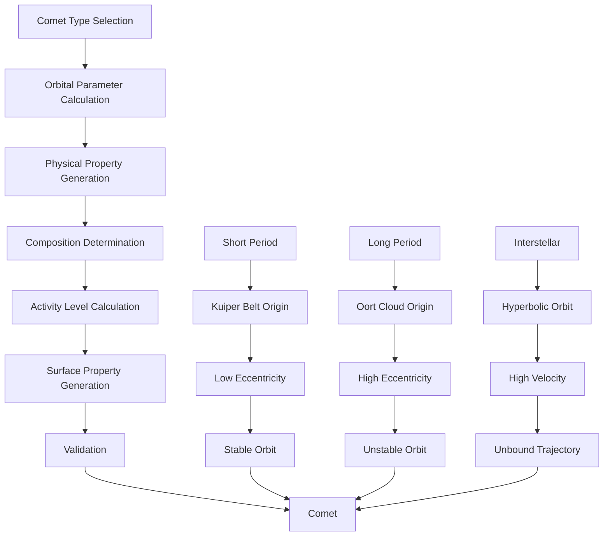

# CometGenerator

Generates comets with realistic orbital parameters, including short-period, long-period, and interstellar comets with appropriate orbital mechanics and composition.

## 🎯 Purpose

`CometGenerator` is responsible for creating comets with realistic orbital parameters, composition, and behavior. It generates different types of comets including short-period, long-period, and interstellar comets, each with appropriate orbital mechanics and physical properties based on scientific models and astronomical observations.

## 🏗️ Architecture

### Core Generation System

The CometGenerator implements a sophisticated multi-layered generation system:

```typescript
class CometGenerator {
  private readonly random: () => number;

  constructor(random: () => number);

  // Core generation methods
  generateComet(cometType: CometType): CelestialObject;
  generateShortPeriodComet(): CelestialObject;
  generateLongPeriodComet(): CelestialObject;
  generateInterstellarComet(): CelestialObject;
}
```

### Generation Pipeline



## 🚀 Core Features

### Comet Type Classification System

Comprehensive classification based on orbital parameters and origin:

```typescript
interface CometConfiguration {
  type: CometType;
  origin: CometOrigin;
  activity: CometActivity;
  orbitalPeriod: number; // years
  eccentricity: number;
  inclination: number; // degrees
  composition: CometComposition;
  activityLevel: CometActivityLevel;
}

enum CometType {
  SHORT_PERIOD = "SHORT_PERIOD", // < 200 years
  LONG_PERIOD = "LONG_PERIOD", // 200-1000000 years
  INTERSTELLAR = "INTERSTELLAR", // Unbound trajectory
}

enum CometOrigin {
  KUIPER_BELT = "KUIPER_BELT", // Short-period comets
  OORT_CLOUD = "OORT_CLOUD", // Long-period comets
  INTERSTELLAR = "INTERSTELLAR", // From another star system
}

enum CometActivity {
  ACTIVE = "ACTIVE", // High outgassing
  MODERATE = "MODERATE", // Moderate outgassing
  INACTIVE = "INACTIVE", // Low outgassing
}
```

### Orbital Mechanics System

Advanced orbital mechanics for different comet types:

```typescript
interface CometOrbitalParameters {
  semiMajorAxis: number; // AU
  eccentricity: number; // 0-1 for bound, >1 for unbound
  inclination: number; // degrees
  argumentOfPeriapsis: number; // degrees
  longitudeOfAscendingNode: number; // degrees
  meanAnomaly: number; // degrees
  orbitalPeriod: number; // years (Infinity for unbound)
  perihelion: number; // AU
  aphelion: number; // AU
}

interface CometTrajectory {
  type: "ELLIPTICAL" | "PARABOLIC" | "HYPERBOLIC";
  bound: boolean; // True if gravitationally bound
  escapeVelocity: number; // km/s
  interstellarVelocity: number; // km/s (for unbound comets)
}
```

### Comet Property Generation

Realistic property generation based on type and origin:

```typescript
interface CometProperties {
  mass: number; // kg
  radius: number; // meters
  density: number; // kg/m³
  composition: CometComposition;
  nucleus: CometNucleus;
  coma: CometComa;
  tail: CometTail;
  activityLevel: CometActivityLevel;
  temperature: number; // Kelvin
  rotationPeriod: number; // hours
  axialTilt: number; // degrees
}

interface CometComposition {
  waterIce: number; // Percentage
  carbonDioxide: number; // Percentage
  methane: number; // Percentage
  ammonia: number; // Percentage
  organicCompounds: number; // Percentage
  dust: number; // Percentage
  rock: number; // Percentage
}
```

### Activity Level System

Realistic comet activity based on distance and composition:

```typescript
interface CometActivityLevel {
  level: "LOW" | "MODERATE" | "HIGH" | "VERY_HIGH";
  outgassingRate: number; // kg/s
  comaSize: number; // km
  tailLength: number; // km
  brightness: number; // Magnitude
  dustProduction: number; // kg/s
  gasProduction: number; // kg/s
}
```

## 🔧 Key Methods

### Constructor

```typescript
constructor(random: () => number)
```

**Parameters:**

- `random`: Seeded random number generator for deterministic generation

**Initialization Process:**

1. **Random Generator Setup**: Initializes seeded random number generator
2. **Configuration Loading**: Loads default comet generation parameters
3. **Validation Setup**: Prepares validation systems for generated comets
4. **Performance Optimization**: Optimizes generation algorithms for efficiency

### Comet Type Generation

```typescript
generateComet(cometType: CometType): CelestialObject
```

**Purpose:**
Generates a comet of the specified type with realistic properties.

**Parameters:**

- `cometType`: The type of comet to generate

**Returns:** `CelestialObject` - Generated comet with realistic properties

**Generation Process:**

1. **Type Validation**: Validates comet type parameter
2. **Orbital Calculation**: Calculates appropriate orbital parameters
3. **Property Generation**: Generates realistic comet properties
4. **Activity Calculation**: Determines comet activity level
5. **Validation**: Validates generated comet properties

### Short-Period Comet Generation

```typescript
generateShortPeriodComet(): CelestialObject
```

**Purpose:**
Generates a short-period comet with Kuiper Belt origin and stable orbital characteristics.

**Returns:** `CelestialObject` - Generated short-period comet

**Characteristics:**

- **Orbital Period**: 1-200 years
- **Origin**: Kuiper Belt
- **Eccentricity**: 0.1-0.9
- **Inclination**: 0-30 degrees
- **Activity**: High due to frequent solar encounters

### Long-Period Comet Generation

```typescript
generateLongPeriodComet(): CelestialObject
```

**Purpose:**
Generates a long-period comet with Oort Cloud origin and highly eccentric orbit.

**Returns:** `CelestialObject` - Generated long-period comet

**Characteristics:**

- **Orbital Period**: 200-1,000,000 years
- **Origin**: Oort Cloud
- **Eccentricity**: 0.9-0.999
- **Inclination**: 0-180 degrees
- **Activity**: Very high due to infrequent solar encounters

### Interstellar Comet Generation

```typescript
generateInterstellarComet(): CelestialObject
```

**Purpose:**
Generates an interstellar comet with hyperbolic orbit and high velocity.

**Returns:** `CelestialObject` - Generated interstellar comet

**Characteristics:**

- **Orbital Period**: Infinity (unbound)
- **Origin**: Interstellar space
- **Eccentricity**: >1.0 (hyperbolic)
- **Velocity**: High interstellar velocity
- **Activity**: Variable depending on composition

## 🔄 Data Flow

### Generation Pipeline

```typescript
// 1. Comet type determination
const cometType = determineCometType(random);

// 2. Orbital parameter calculation
const orbitalParams = calculateCometOrbit(cometType, random);

// 3. Physical property generation
const properties = generateCometProperties(cometType, orbitalParams, random);

// 4. Composition determination
const composition = determineCometComposition(cometType, properties, random);

// 5. Activity level calculation
const activity = calculateCometActivity(properties, composition, random);

// 6. Final validation
const comet = validateAndCreateComet(
  properties,
  orbitalParams,
  composition,
  activity,
);
```

### Orbital Mechanics Calculation

```typescript
// Short-period comet orbital parameters
const shortPeriodParams = {
  semiMajorAxis: 1 + random() * 50, // 1-50 AU
  eccentricity: 0.1 + random() * 0.8, // 0.1-0.9
  inclination: random() * 30, // 0-30 degrees
  period: calculateOrbitalPeriod(semiMajorAxis),
};

// Long-period comet orbital parameters
const longPeriodParams = {
  semiMajorAxis: 50 + random() * 9950, // 50-10000 AU
  eccentricity: 0.9 + random() * 0.099, // 0.9-0.999
  inclination: random() * 180, // 0-180 degrees
  period: calculateOrbitalPeriod(semiMajorAxis),
};

// Interstellar comet orbital parameters
const interstellarParams = {
  semiMajorAxis: -(1 + random() * 100), // -1 to -100 AU (negative for hyperbolas)
  eccentricity: 1.1 + random() * 8.9, // 1.1-10.0
  inclination: random() * 180, // 0-180 degrees
  period: Infinity, // Unbound orbit
};
```

## 🎯 Usage Examples

### Basic Comet Generation

```typescript
import { CometGenerator } from "@teskooano/systems-procedural-generation";

// Create comet generator
const random = () => Math.random();
const cometGenerator = new CometGenerator(random);

// Generate short-period comet
const shortPeriodComet = cometGenerator.generateShortPeriodComet();

console.log("Generated short-period comet:", shortPeriodComet);
console.log("Comet type:", shortPeriodComet.type);
console.log("Orbital period:", shortPeriodComet.orbitalPeriod, "years");
console.log("Semi-major axis:", shortPeriodComet.semiMajorAxis, "AU");
console.log("Eccentricity:", shortPeriodComet.eccentricity);
```

### Long-Period Comet Generation

```typescript
import { CometGenerator } from "@teskooano/systems-procedural-generation";

// Generate long-period comet
const longPeriodComet = cometGenerator.generateLongPeriodComet();

console.log("Generated long-period comet:", longPeriodComet);
console.log("Comet type:", longPeriodComet.type);
console.log("Orbital period:", longPeriodComet.orbitalPeriod, "years");
console.log("Semi-major axis:", longPeriodComet.semiMajorAxis, "AU");
console.log("Eccentricity:", longPeriodComet.eccentricity);
console.log("Origin:", longPeriodComet.origin);
```

### Interstellar Comet Generation

```typescript
import { CometGenerator } from "@teskooano/systems-procedural-generation";

// Generate interstellar comet
const interstellarComet = cometGenerator.generateInterstellarComet();

console.log("Generated interstellar comet:", interstellarComet);
console.log("Comet type:", interstellarComet.type);
console.log("Orbital period:", interstellarComet.orbitalPeriod, "years");
console.log("Semi-major axis:", interstellarComet.semiMajorAxis, "AU");
console.log("Eccentricity:", interstellarComet.eccentricity);
console.log("Origin:", interstellarComet.origin);
```

### Multiple Comet Generation

```typescript
import { CometGenerator } from "@teskooano/systems-procedural-generation";

// Generate multiple comets
function generateMultipleComets(count: number) {
  const comets = [];

  for (let i = 0; i < count; i++) {
    const cometType = Math.random() < 0.5 ? "SHORT_PERIOD" : "LONG_PERIOD";
    const comet = cometGenerator.generateComet(cometType);
    comets.push(comet);
  }

  return comets;
}

const comets = generateMultipleComets(10);

console.log("Generated comets:", comets.length);
comets.forEach((comet, index) => {
  console.log(`Comet ${index + 1}:`);
  console.log(`  Type: ${comet.type}`);
  console.log(`  Origin: ${comet.origin}`);
  console.log(`  Orbital period: ${comet.orbitalPeriod} years`);
  console.log(`  Semi-major axis: ${comet.semiMajorAxis} AU`);
  console.log(`  Eccentricity: ${comet.eccentricity}`);
  console.log(`  Activity level: ${comet.activityLevel}`);
});
```

### Comet Analysis

```typescript
import { CometGenerator } from "@teskooano/systems-procedural-generation";

// Analyze comet properties
function analyzeComet(comet: CelestialObject) {
  console.log("=== Comet Analysis ===");
  console.log(`Type: ${comet.type}`);
  console.log(`Origin: ${comet.origin}`);
  console.log(`Orbital period: ${comet.orbitalPeriod} years`);
  console.log(`Semi-major axis: ${comet.semiMajorAxis} AU`);
  console.log(`Eccentricity: ${comet.eccentricity}`);
  console.log(`Inclination: ${comet.inclination} degrees`);
  console.log(`Activity level: ${comet.activityLevel}`);

  if (comet.composition) {
    console.log("Composition:");
    console.log(`  Water ice: ${comet.composition.waterIce}%`);
    console.log(`  Carbon dioxide: ${comet.composition.carbonDioxide}%`);
    console.log(`  Methane: ${comet.composition.methane}%`);
    console.log(`  Ammonia: ${comet.composition.ammonia}%`);
    console.log(`  Organic compounds: ${comet.composition.organicCompounds}%`);
    console.log(`  Dust: ${comet.composition.dust}%`);
    console.log(`  Rock: ${comet.composition.rock}%`);
  }

  // Determine habitability potential
  const habitability = assessCometHabitability(comet);
  console.log(`Habitability potential: ${habitability}`);
}

function assessCometHabitability(comet: CelestialObject): string {
  if (comet.composition && comet.composition.waterIce > 50) {
    return "High water content - potential for life";
  } else if (comet.composition && comet.composition.organicCompounds > 20) {
    return "Organic compounds present - building blocks for life";
  } else {
    return "Low habitability potential";
  }
}
```

## Usage Examples

### Basic Comet Generation

```typescript
import { CometGenerator } from "@teskooano/systems-procedural-generation";

// Create comet generator
const random = () => Math.random();
const cometGenerator = new CometGenerator(random);

// Generate short-period comet
const shortPeriodComet = cometGenerator.generateShortPeriodComet();

console.log("Generated short-period comet:", shortPeriodComet);
console.log("Comet type:", shortPeriodComet.type);
console.log("Orbital period:", shortPeriodComet.orbitalPeriod, "years");
console.log("Semi-major axis:", shortPeriodComet.semiMajorAxis, "AU");
console.log("Eccentricity:", shortPeriodComet.eccentricity);
```

### Long-Period Comet Generation

```typescript
import { CometGenerator } from "@teskooano/systems-procedural-generation";

// Generate long-period comet
const longPeriodComet = cometGenerator.generateLongPeriodComet();

console.log("Generated long-period comet:", longPeriodComet);
console.log("Comet type:", longPeriodComet.type);
console.log("Orbital period:", longPeriodComet.orbitalPeriod, "years");
console.log("Semi-major axis:", longPeriodComet.semiMajorAxis, "AU");
console.log("Eccentricity:", longPeriodComet.eccentricity);
console.log("Origin:", longPeriodComet.origin);
```

### Interstellar Comet Generation

```typescript
import { CometGenerator } from "@teskooano/systems-procedural-generation";

// Generate interstellar comet
const interstellarComet = cometGenerator.generateInterstellarComet();

console.log("Generated interstellar comet:", interstellarComet);
console.log("Comet type:", interstellarComet.type);
console.log("Orbital period:", interstellarComet.orbitalPeriod, "years");
console.log("Semi-major axis:", interstellarComet.semiMajorAxis, "AU");
console.log("Eccentricity:", interstellarComet.eccentricity);
console.log("Origin:", interstellarComet.origin);
```

## Performance Considerations

### Efficiency

- **Fast Generation**: Efficient comet generation algorithms
- **Minimal Calculations**: Only necessary calculations performed
- **Caching**: Can cache comet generation results
- **Memory Usage**: Minimal memory footprint

## Error Handling

### Validation

- **Comet Property Validation**: Validates generated comet properties
- **Orbital Validation**: Ensures orbital stability
- **Composition Validation**: Validates comet composition
- **Activity Level Validation**: Validates activity level

## Best Practices

### Comet Generation

1. **Use Realistic Parameters**: Base generation on scientific data
2. **Validate Results**: Ensure generated comets are valid
3. **Consider Comet Types**: Account for different comet types
4. **Balance Variety**: Create diverse but realistic comets

## Related

- [[PlanetGenerator]] - Generates planets in star systems
- [[RoguePlanetGenerator]] - Generates rogue planets with similar orbital mechanics
- [[CelestialObject]] - Comet data structure
- [[OrbitalParameters]] - Orbital parameter data structure
- [[CometType]] - Comet type enumeration
