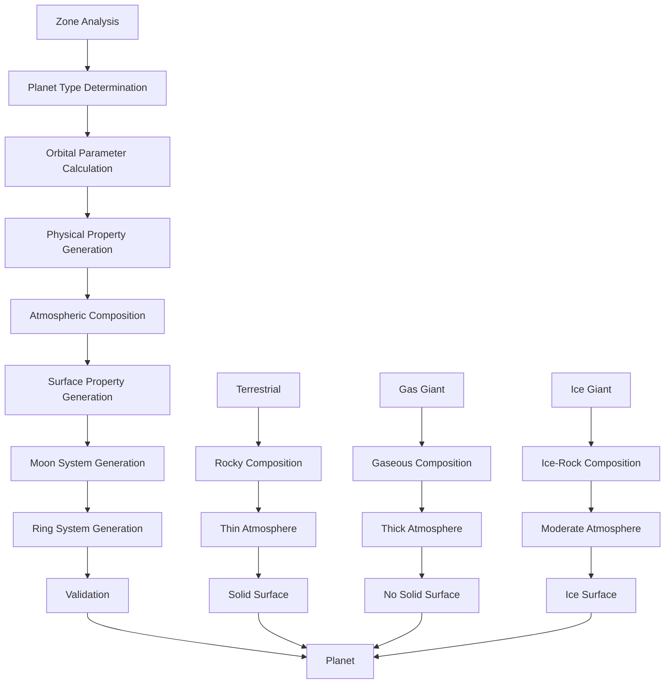

# PlanetGenerator

Generates planets with realistic properties, orbital mechanics, and surface characteristics based on zone parameters and stellar properties.

## 🎯 Purpose

`PlanetGenerator` is responsible for creating planets with realistic properties, orbital mechanics, and surface characteristics. It generates planets based on zone parameters, stellar properties, and system configuration, ensuring scientifically accurate and varied planetary systems with proper orbital dynamics and physical properties.

## 🏗️ Architecture

### Core Generation System

The PlanetGenerator implements a sophisticated multi-layered generation system:

```typescript
class PlanetGenerator {
  private readonly random: () => number;
  private readonly zoneManager: CelestialZoneManager;

  constructor(random: () => number, zoneManager: CelestialZoneManager);

  // Core generation methods
  generatePlanet(
    zone: CelestialZone,
    stars: CelestialObject[],
    systemConfig: StellarSystemConfiguration,
  ): CelestialObject;
  generatePlanetWithMoons(
    zone: CelestialZone,
    stars: CelestialObject[],
    systemConfig: StellarSystemConfiguration,
  ): CelestialObject;
  generatePlanetWithRings(
    zone: CelestialZone,
    stars: CelestialObject[],
    systemConfig: StellarSystemConfiguration,
  ): CelestialObject;
}
```

### Generation Pipeline



## 🚀 Core Features

### Planet Type Classification System

Comprehensive classification based on zone characteristics and stellar properties:

```typescript
interface PlanetConfiguration {
  type: PlanetType;
  gasGiantClass: GasGiantClass;
  mass: number; // Earth masses
  radius: number; // Earth radii
  density: number; // g/cm³
  composition: SurfaceComposition;
  atmosphere: AtmosphericComposition;
  surfacePressure: number; // Earth atmospheres
  temperature: number; // Kelvin
  habitability: HabitabilityAssessment;
}

enum PlanetType {
  TERRESTRIAL = "TERRESTRIAL", // Rocky planets with solid surfaces
  GAS_GIANT = "GAS_GIANT", // Large planets with thick atmospheres
  ICE_GIANT = "ICE_GIANT", // Planets with significant ice content
  OCEAN = "OCEAN", // Water-covered planets
  ROCKY = "ROCKY", // Rocky planets without significant water
  DESERT = "DESERT", // Dry, rocky planets
  LAVA = "LAVA", // Molten surface planets
  ICE = "ICE", // Ice-covered planets
  METALLIC = "METALLIC", // Metal-rich planets
}

enum GasGiantClass {
  HOT_JUPITER = "HOT_JUPITER", // Close-in gas giants
  COLD_JUPITER = "COLD_JUPITER", // Distant gas giants
  SUPER_JUPITER = "SUPER_JUPITER", // Massive gas giants
  MINI_NEPTUNE = "MINI_NEPTUNE", // Small gas giants
  NEPTUNE_LIKE = "NEPTUNE_LIKE", // Neptune-like planets
}
```

### Orbital Mechanics System

Advanced orbital mechanics for different planet types:

```typescript
interface PlanetOrbitalParameters {
  semiMajorAxis: number; // AU
  eccentricity: number; // 0-1
  inclination: number; // degrees
  argumentOfPeriapsis: number; // degrees
  longitudeOfAscendingNode: number; // degrees
  meanAnomaly: number; // degrees
  orbitalPeriod: number; // years
  perihelion: number; // AU
  aphelion: number; // AU
  hillSphere: number; // AU
  rocheLimit: number; // AU
}

interface PlanetTrajectory {
  type: "STABLE" | "UNSTABLE" | "RESONANT";
  stability: number; // 0-1 stability factor
  tidalLocking: boolean; // True if tidally locked
  orbitalResonance: number; // Resonance ratio
}
```

### Planet Property Generation

Realistic property generation based on type and zone:

```typescript
interface PlanetProperties {
  mass: number; // Earth masses
  radius: number; // Earth radii
  density: number; // g/cm³
  composition: SurfaceComposition;
  atmosphere: AtmosphericComposition;
  surfacePressure: number; // Earth atmospheres
  temperature: number; // Kelvin
  magneticField: number; // Magnetic field strength
  rotationPeriod: number; // Hours
  axialTilt: number; // Degrees
  albedo: number; // Surface reflectivity
  greenhouseEffect: number; // Greenhouse factor
}

interface SurfaceComposition {
  rock: number; // Percentage
  metal: number; // Percentage
  ice: number; // Percentage
  water: number; // Percentage
  organic: number; // Percentage
  other: number; // Percentage
}

interface AtmosphericComposition {
  nitrogen: number; // Percentage
  oxygen: number; // Percentage
  carbonDioxide: number; // Percentage
  waterVapor: number; // Percentage
  methane: number; // Percentage
  ammonia: number; // Percentage
  hydrogen: number; // Percentage
  helium: number; // Percentage
  other: number; // Percentage
}
```

### Moon and Ring System Generation

Realistic moon and ring systems for planets:

```typescript
interface MoonSystem {
  moons: CelestialObject[];
  totalMass: number; // Combined moon mass
  hillSphere: number; // Hill sphere radius
  stabilityFactor: number; // Orbital stability
  tidalEffects: number; // Tidal heating
  captureProbability: number; // Likelihood of moon capture
}

interface RingSystem {
  innerRadius: number; // Inner ring radius
  outerRadius: number; // Outer ring radius
  thickness: number; // Ring thickness
  composition: RingComposition;
  density: number; // Ring density
  age: number; // Ring age
  stability: number; // Ring stability
}

interface RingComposition {
  ice: number; // Percentage
  rock: number; // Percentage
  dust: number; // Percentage
  organic: number; // Percentage
}
```

## 🔧 Key Methods

### Constructor

```typescript
constructor(random: () => number, zoneManager: CelestialZoneManager)
```

**Parameters:**

- `random`: Seeded random number generator for deterministic generation
- `zoneManager`: CelestialZoneManager for zone-based planet placement

**Initialization Process:**

1. **Random Generator Setup**: Initializes seeded random number generator
2. **Zone Manager Integration**: Integrates with CelestialZoneManager
3. **Configuration Loading**: Loads default planet generation parameters
4. **Validation Setup**: Prepares validation systems for generated planets
5. **Performance Optimization**: Optimizes generation algorithms for efficiency

### Basic Planet Generation

```typescript
generatePlanet(zone: CelestialZone, stars: CelestialObject[], systemConfig: StellarSystemConfiguration): CelestialObject
```

**Purpose:**
Generates a basic planet with realistic properties based on zone characteristics and stellar properties.

**Parameters:**

- `zone`: The celestial zone for planet placement
- `stars`: Array of stars in the system
- `systemConfig`: Stellar system configuration

**Returns:** `CelestialObject` - Generated planet with realistic properties

**Generation Process:**

1. **Zone Analysis**: Analyzes zone characteristics and constraints
2. **Planet Type Determination**: Determines appropriate planet type
3. **Orbital Calculation**: Calculates realistic orbital parameters
4. **Property Generation**: Generates realistic planet properties
5. **Validation**: Validates generated planet properties

### Planet with Moon System

```typescript
generatePlanetWithMoons(zone: CelestialZone, stars: CelestialObject[], systemConfig: StellarSystemConfiguration): CelestialObject
```

**Purpose:**
Generates a planet with a realistic moon system, considering gravitational stability and formation mechanisms.

**Parameters:**

- `zone`: The celestial zone for planet placement
- `stars`: Array of stars in the system
- `systemConfig`: Stellar system configuration

**Returns:** `CelestialObject` - Generated planet with moon system

**Generation Process:**

1. **Planet Generation**: Generates base planet
2. **Moon System Creation**: Creates realistic moon system
3. **Orbital Dynamics**: Ensures stable moon orbits
4. **Hill Sphere**: Considers gravitational influence
5. **Validation**: Validates planet and moon system

### Planet with Ring System

```typescript
generatePlanetWithRings(zone: CelestialZone, stars: CelestialObject[], systemConfig: StellarSystemConfiguration): CelestialObject
```

**Purpose:**
Generates a planet with a realistic ring system, considering formation mechanisms and stability.

**Parameters:**

- `zone`: The celestial zone for planet placement
- `stars`: Array of stars in the system
- `systemConfig`: Stellar system configuration

**Returns:** `CelestialObject` - Generated planet with ring system

**Generation Process:**

1. **Planet Generation**: Generates base planet
2. **Ring System Creation**: Creates realistic ring system
3. **Stability Analysis**: Ensures ring stability
4. **Composition**: Determines ring composition
5. **Validation**: Validates planet and ring system

## 🔄 Data Flow

### Generation Pipeline

```typescript
// 1. Zone analysis
const zoneConstraints = analyzeZoneConstraints(zone, stars, systemConfig);

// 2. Planet type determination
const planetType = determinePlanetType(zoneConstraints, random);

// 3. Orbital parameter calculation
const orbitalParams = calculateOrbitalParameters(zone, planetType, random);

// 4. Physical property generation
const properties = generatePlanetProperties(planetType, orbitalParams, random);

// 5. Atmospheric composition
const atmosphere = generateAtmosphericComposition(
  planetType,
  properties,
  random,
);

// 6. Surface property generation
const surface = generateSurfaceProperties(planetType, properties, random);

// 7. Moon system generation (if applicable)
const moonSystem = generateMoonSystem(properties, random);

// 8. Ring system generation (if applicable)
const ringSystem = generateRingSystem(properties, random);

// 9. Final validation
const planet = validateAndCreatePlanet(
  properties,
  orbitalParams,
  atmosphere,
  surface,
  moonSystem,
  ringSystem,
);
```

### Orbital Mechanics Calculation

```typescript
// Semi-major axis calculation with logarithmic distribution
const semiMajorAxis = calculateSemiMajorAxis(zone, random);

// Eccentricity calculation based on planet type
const eccentricity = calculateEccentricity(planetType, random);

// Inclination calculation
const inclination = calculateInclination(planetType, random);

// Orbital period calculation
const orbitalPeriod = calculateOrbitalPeriod(semiMajorAxis, starMass);

// Hill sphere calculation
const hillSphere = calculateHillSphere(planetMass, starMass, semiMajorAxis);

// Roche limit calculation
const rocheLimit = calculateRocheLimit(planetRadius, planetDensity, starMass);
```

## 🎯 Usage Examples

### Basic Planet Generation

```typescript
import {
  PlanetGenerator,
  CelestialZoneManager,
} from "@teskooano/systems-procedural-generation";

// Create planet generator
const random = () => Math.random();
const zoneManager = new CelestialZoneManager(random);
const planetGenerator = new PlanetGenerator(random, zoneManager);

// Define zone
const zone = {
  name: "Habitable Zone",
  minDistanceAU: 1.0,
  maxDistanceAU: 6.0,
  temperatureRange: [200, 400],
  planetTypes: ["Terrestrial", "Ocean"],
};

// Define stars
const stars = [
  {
    type: "G",
    mass: 1.0,
    luminosity: 1.0,
    temperature: 5778,
  },
];

// Define system configuration
const systemConfig = {
  type: "SINGLE_STAR",
  stars: 1,
};

// Generate planet
const planet = planetGenerator.generatePlanet(zone, stars, systemConfig);

console.log("Generated planet:", planet);
console.log("Planet type:", planet.type);
console.log("Mass:", planet.mass, "Earth masses");
console.log("Radius:", planet.radius, "Earth radii");
console.log("Temperature:", planet.temperature, "Kelvin");
```

### Planet with Moon System

```typescript
import { PlanetGenerator } from "@teskooano/systems-procedural-generation";

// Generate planet with moons
const planetWithMoons = planetGenerator.generatePlanetWithMoons(
  zone,
  stars,
  systemConfig,
);

console.log("Planet with moons:", planetWithMoons);
console.log("Number of moons:", planetWithMoons.moons?.length || 0);

if (planetWithMoons.moons) {
  planetWithMoons.moons.forEach((moon, index) => {
    console.log(`Moon ${index + 1}:`, moon);
    console.log(`  Mass: ${moon.mass} Earth masses`);
    console.log(`  Radius: ${moon.radius} Earth radii`);
    console.log(`  Orbital period: ${moon.orbitalPeriod} days`);
  });
}
```

### Planet with Ring System

```typescript
import { PlanetGenerator } from "@teskooano/systems-procedural-generation";

// Generate planet with rings
const planetWithRings = planetGenerator.generatePlanetWithRings(
  zone,
  stars,
  systemConfig,
);

console.log("Planet with rings:", planetWithRings);
console.log("Ring system:", planetWithRings.ringSystem);

if (planetWithRings.ringSystem) {
  console.log(`Inner radius: ${planetWithRings.ringSystem.innerRadius} AU`);
  console.log(`Outer radius: ${planetWithRings.ringSystem.outerRadius} AU`);
  console.log(`Thickness: ${planetWithRings.ringSystem.thickness} km`);
  console.log(`Composition: ${planetWithRings.ringSystem.composition}`);
}
```

### Multiple Planet Generation

```typescript
import { PlanetGenerator } from "@teskooano/systems-procedural-generation";

// Generate multiple planets
function generateMultiplePlanets(zones: CelestialZone[], count: number) {
  const planets = [];

  for (let i = 0; i < count; i++) {
    const zone = zones[i % zones.length];
    const planet = planetGenerator.generatePlanet(zone, stars, systemConfig);
    planets.push(planet);
  }

  return planets;
}

const zones = [
  {
    name: "Hot Zone",
    minDistanceAU: 0.1,
    maxDistanceAU: 0.5,
    planetTypes: ["Rocky", "Lava"],
  },
  {
    name: "Habitable Zone",
    minDistanceAU: 1.0,
    maxDistanceAU: 6.0,
    planetTypes: ["Terrestrial", "Ocean"],
  },
  {
    name: "Cold Zone",
    minDistanceAU: 10.0,
    maxDistanceAU: 50.0,
    planetTypes: ["Ice", "Gas Giant"],
  },
];

const planets = generateMultiplePlanets(zones, 10);

console.log("Generated planets:", planets.length);
planets.forEach((planet, index) => {
  console.log(`Planet ${index + 1}:`);
  console.log(`  Type: ${planet.type}`);
  console.log(`  Mass: ${planet.mass} Earth masses`);
  console.log(`  Radius: ${planet.radius} Earth radii`);
  console.log(`  Temperature: ${planet.temperature} Kelvin`);
  console.log(`  Orbital period: ${planet.orbitalPeriod} years`);
});
```

### Planet Analysis

```typescript
import { PlanetGenerator } from "@teskooano/systems-procedural-generation";

// Analyze planet properties
function analyzePlanet(planet: CelestialObject) {
  console.log("=== Planet Analysis ===");
  console.log(`Type: ${planet.type}`);
  console.log(`Mass: ${planet.mass} Earth masses`);
  console.log(`Radius: ${planet.radius} Earth radii`);
  console.log(`Density: ${planet.density} g/cm³`);
  console.log(`Temperature: ${planet.temperature} Kelvin`);
  console.log(`Orbital period: ${planet.orbitalPeriod} years`);
  console.log(`Eccentricity: ${planet.eccentricity}`);
  console.log(`Inclination: ${planet.inclination} degrees`);

  if (planet.atmosphere) {
    console.log("Atmospheric composition:");
    console.log(`  Nitrogen: ${planet.atmosphere.nitrogen}%`);
    console.log(`  Oxygen: ${planet.atmosphere.oxygen}%`);
    console.log(`  Carbon dioxide: ${planet.atmosphere.carbonDioxide}%`);
    console.log(`  Water vapor: ${planet.atmosphere.waterVapor}%`);
  }

  if (planet.composition) {
    console.log("Surface composition:");
    console.log(`  Rock: ${planet.composition.rock}%`);
    console.log(`  Metal: ${planet.composition.metal}%`);
    console.log(`  Ice: ${planet.composition.ice}%`);
    console.log(`  Water: ${planet.composition.water}%`);
  }

  // Determine habitability potential
  const habitability = assessPlanetHabitability(planet);
  console.log(`Habitability potential: ${habitability}`);
}

function assessPlanetHabitability(planet: CelestialObject): string {
  if (planet.temperature > 273 && planet.temperature < 373) {
    return "Potential for liquid water - highly habitable";
  } else if (planet.temperature > 200 && planet.temperature < 400) {
    return "Moderate habitability potential";
  } else if (planet.temperature > 100 && planet.temperature < 500) {
    return "Low habitability potential";
  } else {
    return "Not habitable for life as we know it";
  }
}
```

## 📊 Performance Considerations

### Efficiency Optimizations

- **Fast Generation**: Efficient planet generation algorithms
- **Minimal Calculations**: Only necessary calculations performed
- **Caching**: Can cache planet generation results
- **Memory Usage**: Minimal memory footprint

### Generation Quality

- **Realistic Properties**: Scientifically accurate planet properties
- **Varied Results**: Diverse planet configurations
- **Stable Orbits**: Ensures orbital stability for planets and moons
- **Consistent Properties**: Maintains property consistency

### Performance Monitoring

- **Generation Time**: Tracks time spent generating planets
- **Memory Usage**: Monitors memory consumption for generation
- **Cache Hit Rates**: Tracks effectiveness of generation caching
- **Validation Performance**: Monitors validation algorithm performance

## 🔧 Integration Points

### CelestialZoneManager Integration

```typescript
// PlanetGenerator is used by CelestialZoneManager for planet placement
const planets = generatePlanetsInZone(zone, random);
```

### ZoneScaler Integration

```typescript
// PlanetGenerator uses ZoneScaler for zone-based planet placement
const scaledZones = zoneScaler.scaleZones(zones, stars, systemConfig);
```

### ZoneSelector Integration

```typescript
// PlanetGenerator uses ZoneSelector for zone selection
const selectedZones = zoneSelector.selectZonesForPlacement(stars, systemConfig);
```

## 🔍 Debug Features

### Planet Validation

- **Property Validation**: Validates generated planet properties
- **Orbital Validation**: Ensures orbital stability
- **Moon System Validation**: Validates moon system configuration
- **Ring System Validation**: Validates ring system properties

### Performance Monitoring

- **Generation Metrics**: Tracks planet generation performance
- **Memory Usage**: Monitors memory consumption patterns
- **Cache Effectiveness**: Measures caching strategy effectiveness
- **Validation Performance**: Monitors validation algorithm performance

### Configuration Debugging

- **Type Analysis**: Analyzes planet type selection
- **Orbital Calculation**: Displays orbital parameter calculations
- **Property Generation**: Shows property generation algorithms
- **Moon System Analysis**: Monitors moon system generation

## 🚀 Future Enhancements

### Planned Features

- **Advanced Physics**: More sophisticated gravitational interactions
- **Stellar Evolution**: Time-dependent planet evolution
- **Atmospheric Evolution**: Dynamic atmospheric composition changes
- **Tectonic Activity**: Plate tectonics and geological processes

### Optimization Opportunities

- **Parallel Generation**: Multi-threaded generation for large systems
- **GPU Acceleration**: GPU-based calculations for complex physics
- **Predictive Caching**: Cache generation results for common configurations
- **Adaptive Quality**: Dynamic quality adjustment based on system complexity

### Advanced Features

- **Galactic Context**: Generate planets within galactic environments
- **Stellar Clusters**: Multi-system generation with gravitational interactions
- **Time Evolution**: Simulate planet evolution over billions of years
- **Life Simulation**: Basic life formation and evolution modeling for planets

## 📚 Related Documentation

- [[CelestialZoneManager]] - Provides zone information for planet generation
- [[ZoneScaler]] - Scales zones for planet placement
- [[ZoneSelector]] - Selects zones for planet generation
- [[CelestialObject]] - Planet data structure
- [[CelestialZone]] - Zone data structure
- [[StellarSystemConfiguration]] - System configuration
- [[RoguePlanetGenerator]] - Generates rogue planets with similar mechanics
- [[CometGenerator]] - Generates comets with similar orbital mechanics
