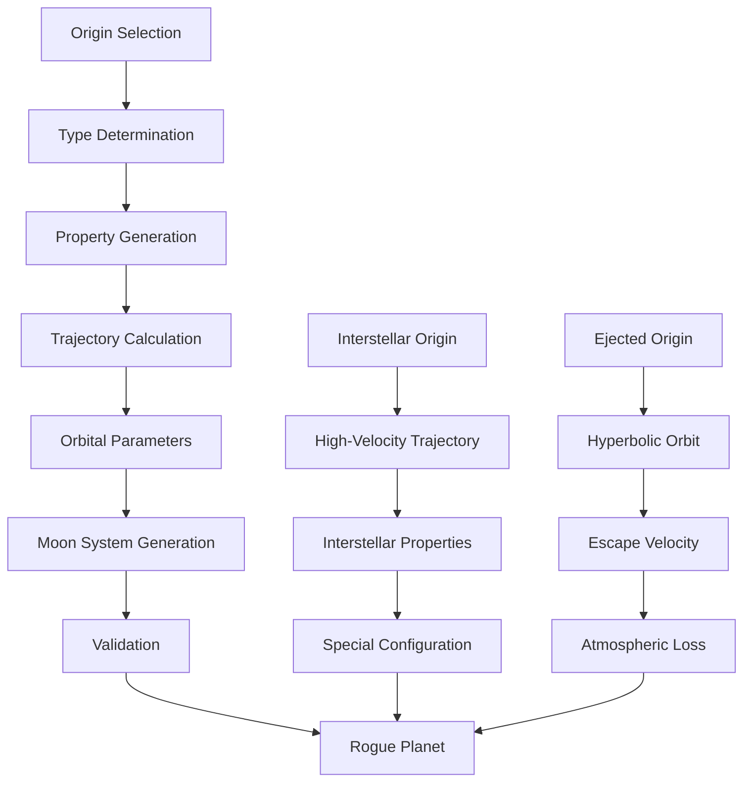

# RoguePlanetGenerator

Generates rogue planets (free-floating planets) with realistic properties and orbital characteristics, including hyperbolic orbits and interstellar trajectories.

## 🎯 Purpose

`RoguePlanetGenerator` is responsible for creating rogue planets - planets that have been ejected from their parent star systems and now travel through interstellar space. These planets can have various origins and trajectories, making them unique and interesting celestial objects with scientifically accurate properties and realistic interstellar mechanics.

## 🏗️ Architecture

### Core Generation System

The RoguePlanetGenerator implements a sophisticated multi-layered generation system:

```typescript
class RoguePlanetGenerator {
  private readonly random: () => number;

  constructor(random: () => number);

  // Core generation methods
  generateRoguePlanet(): CelestialObject;
  generateRoguePlanetWithMoons(): CelestialObject;
  generateInterstellarRoguePlanet(): CelestialObject;
}
```

### Generation Pipeline



## 🚀 Core Features

### Rogue Planet Classification System

Comprehensive classification based on origin and trajectory:

```typescript
interface RoguePlanetConfiguration {
  origin: RoguePlanetOrigin;
  trajectory: RoguePlanetTrajectory;
  interstellarVelocity: number; // km/s
  temperature: number; // Kelvin
  atmosphericRetention: number; // 0-1
  habitabilityPotential: HabitabilityAssessment;
}

enum RoguePlanetOrigin {
  EJECTED = "EJECTED", // Ejected from parent system
  ISOLATED_FORMATION = "ISOLATED_FORMATION", // Formed in isolation
  INTERSTELLAR = "INTERSTELLAR", // From another star system
}

enum RoguePlanetTrajectory {
  HYPERBOLIC = "HYPERBOLIC", // High-velocity escape trajectory
  PARABOLIC = "PARABOLIC", // Critical escape trajectory
  SLOW_DRIFT = "SLOW_DRIFT", // Slow drift through space
}
```

### Orbital Mechanics System

Advanced orbital mechanics for unbound objects:

```typescript
interface HyperbolicOrbit {
  eccentricity: number; // > 1.0 for hyperbolic orbits
  semiMajorAxis: number; // Negative for hyperbolas
  inclination: number; // Orbital inclination
  argumentOfPeriapsis: number; // Argument of periapsis
  longitudeOfAscendingNode: number; // Longitude of ascending node
  period: number; // Infinity for hyperbolic orbits
}

interface InterstellarVelocity {
  velocity: number; // km/s
  direction: OSVector3; // 3D velocity vector
  escapeVelocity: number; // Required escape velocity
  interstellarSpace: boolean; // True if in interstellar space
}
```

### Planet Property Generation

Realistic property generation based on origin and environment:

```typescript
interface RoguePlanetProperties {
  mass: number; // Earth masses
  radius: number; // Earth radii
  density: number; // g/cm³
  composition: SurfaceComposition;
  atmosphere: AtmosphericComposition;
  surfacePressure: number; // Earth atmospheres
  temperature: number; // Kelvin (space temperature)
  magneticField: number; // Magnetic field strength
  rotationPeriod: number; // Hours
  axialTilt: number; // Degrees
}
```

### Moon System Generation

Realistic moon systems for rogue planets:

```typescript
interface RogueMoonSystem {
  moons: CelestialObject[];
  totalMass: number; // Combined moon mass
  hillSphere: number; // Hill sphere radius
  stabilityFactor: number; // Orbital stability
  tidalEffects: number; // Tidal heating
  captureProbability: number; // Likelihood of moon capture
}
```

## 🔧 Key Methods

### Constructor

```typescript
constructor(random: () => number)
```

**Parameters:**

- `random`: Seeded random number generator for deterministic generation

**Initialization Process:**

1. **Random Generator Setup**: Initializes seeded random number generator
2. **Configuration Loading**: Loads default rogue planet generation parameters
3. **Validation Setup**: Prepares validation systems for generated planets
4. **Performance Optimization**: Optimizes generation algorithms for efficiency

### Basic Rogue Planet Generation

```typescript
generateRoguePlanet(): CelestialObject
```

**Purpose:**
Generates a basic rogue planet with realistic properties based on scientific models.

**Returns:** `CelestialObject` - Generated rogue planet with realistic properties

**Generation Process:**

1. **Origin Selection**: Selects planet origin (ejected, formed in isolation)
2. **Type Determination**: Determines planet type based on origin
3. **Property Generation**: Generates realistic planet properties
4. **Trajectory Calculation**: Calculates interstellar trajectory
5. **Validation**: Validates generated planet properties

**Usage:**

```typescript
const roguePlanet = roguePlanetGenerator.generateRoguePlanet();
console.log("Generated rogue planet:", roguePlanet);
```

### Rogue Planet with Moon System

```typescript
generateRoguePlanetWithMoons(): CelestialObject
```

**Purpose:**
Generates a rogue planet with a realistic moon system, considering gravitational stability and capture mechanisms.

**Returns:** `CelestialObject` - Generated rogue planet with moon system

**Generation Process:**

1. **Planet Generation**: Generates base rogue planet
2. **Moon System Creation**: Creates realistic moon system
3. **Orbital Dynamics**: Ensures stable moon orbits
4. **Hill Sphere**: Considers gravitational influence
5. **Validation**: Validates planet and moon system

### Interstellar Rogue Planet

```typescript
generateInterstellarRoguePlanet(): CelestialObject
```

**Purpose:**
Generates a rogue planet with interstellar trajectory, representing planets from other star systems.

**Returns:** `CelestialObject` - Generated interstellar rogue planet

**Generation Process:**

1. **Interstellar Origin**: Determines interstellar origin
2. **Trajectory Calculation**: Calculates interstellar trajectory
3. **Velocity Determination**: Determines interstellar velocity
4. **Property Generation**: Generates planet properties
5. **Validation**: Validates interstellar planet

## 🔄 Data Flow

### Generation Pipeline

```typescript
// 1. Origin determination
const origin = determineRoguePlanetOrigin(random);

// 2. Type classification
const planetType = classifyRoguePlanetType(origin, random);

// 3. Property generation
const properties = generateRoguePlanetProperties(planetType, origin, random);

// 4. Trajectory calculation
const trajectory = calculateInterstellarTrajectory(origin, properties, random);

// 5. Moon system generation (if applicable)
const moonSystem = generateRogueMoonSystem(properties, random);

// 6. Final validation
const roguePlanet = validateAndCreateRoguePlanet(
  properties,
  trajectory,
  moonSystem,
);
```

### Orbital Mechanics Calculation

```typescript
// Hyperbolic orbit calculation
const eccentricity = 1.1 + random() * 5.0; // 1.1 to 6.1
const semiMajorAxis = -(1.0 + random() * 10.0); // -1 to -11 AU

// Interstellar velocity calculation
const minVelocity = 10; // km/s
const maxVelocity = 100; // km/s
const velocity = calculateInterstellarVelocity(
  minVelocity,
  maxVelocity,
  random,
);

// Escape velocity calculation
const escapeVelocity = Math.sqrt((2 * G * starMass) / distance);
```

## 🎯 Usage Examples

### Basic Rogue Planet Generation

```typescript
import { RoguePlanetGenerator } from "@teskooano/systems-procedural-generation";

// Create rogue planet generator
const random = () => Math.random();
const roguePlanetGenerator = new RoguePlanetGenerator(random);

// Generate rogue planet
const roguePlanet = roguePlanetGenerator.generateRoguePlanet();

console.log("Generated rogue planet:", roguePlanet);
console.log("Planet type:", roguePlanet.type);
console.log("Origin:", roguePlanet.origin);
console.log("Mass:", roguePlanet.mass, "Earth masses");
console.log("Radius:", roguePlanet.radius, "Earth radii");
console.log("Temperature:", roguePlanet.temperature, "Kelvin");
```

### Rogue Planet with Moon System

```typescript
import { RoguePlanetGenerator } from "@teskooano/systems-procedural-generation";

// Generate rogue planet with moons
const roguePlanetWithMoons =
  roguePlanetGenerator.generateRoguePlanetWithMoons();

console.log("Rogue planet with moons:", roguePlanetWithMoons);
console.log("Number of moons:", roguePlanetWithMoons.moons?.length || 0);

if (roguePlanetWithMoons.moons) {
  roguePlanetWithMoons.moons.forEach((moon, index) => {
    console.log(`Moon ${index + 1}:`, moon);
    console.log(`  Mass: ${moon.mass} Earth masses`);
    console.log(`  Radius: ${moon.radius} Earth radii`);
    console.log(`  Orbital period: ${moon.orbitalPeriod} days`);
  });
}
```

### Interstellar Rogue Planet

```typescript
import { RoguePlanetGenerator } from "@teskooano/systems-procedural-generation";

// Generate interstellar rogue planet
const interstellarRogue =
  roguePlanetGenerator.generateInterstellarRoguePlanet();

console.log("Interstellar rogue planet:", interstellarRogue);
console.log("Planet type:", interstellarRogue.type);
console.log("Origin:", interstellarRogue.origin);
console.log(
  "Interstellar velocity:",
  interstellarRogue.interstellarVelocity,
  "km/s",
);
console.log("Trajectory:", interstellarRogue.trajectory);
```

### Multiple Rogue Planet Generation

```typescript
import { RoguePlanetGenerator } from "@teskooano/systems-procedural-generation";

// Generate multiple rogue planets
function generateMultipleRoguePlanets(count: number) {
  const roguePlanets = [];

  for (let i = 0; i < count; i++) {
    const roguePlanet = roguePlanetGenerator.generateRoguePlanet();
    roguePlanets.push(roguePlanet);
  }

  return roguePlanets;
}

const roguePlanets = generateMultipleRoguePlanets(5);

console.log("Generated rogue planets:", roguePlanets.length);
roguePlanets.forEach((planet, index) => {
  console.log(`Rogue planet ${index + 1}:`);
  console.log(`  Type: ${planet.type}`);
  console.log(`  Origin: ${planet.origin}`);
  console.log(`  Mass: ${planet.mass} Earth masses`);
  console.log(`  Radius: ${planet.radius} Earth radii`);
  console.log(`  Temperature: ${planet.temperature} Kelvin`);
  console.log(`  Interstellar velocity: ${planet.interstellarVelocity} km/s`);
});
```

### Rogue Planet Analysis

```typescript
import { RoguePlanetGenerator } from "@teskooano/systems-procedural-generation";

// Analyze rogue planet properties
function analyzeRoguePlanet(planet: CelestialObject) {
  console.log("=== Rogue Planet Analysis ===");
  console.log(`Type: ${planet.type}`);
  console.log(`Origin: ${planet.origin}`);
  console.log(`Mass: ${planet.mass} Earth masses`);
  console.log(`Radius: ${planet.radius} Earth radii`);
  console.log(`Density: ${planet.density} g/cm³`);
  console.log(`Temperature: ${planet.temperature} Kelvin`);

  if (planet.interstellarVelocity) {
    console.log(`Interstellar velocity: ${planet.interstellarVelocity} km/s`);
  }

  if (planet.trajectory) {
    console.log(`Trajectory: ${planet.trajectory}`);
  }

  if (planet.moons) {
    console.log(`Number of moons: ${planet.moons.length}`);
  }

  // Determine habitability potential
  const habitability = assessRoguePlanetHabitability(planet);
  console.log(`Habitability potential: ${habitability}`);
}

function assessRoguePlanetHabitability(planet: CelestialObject): string {
  if (planet.temperature > 273) {
    return "Potential for liquid water";
  } else if (planet.temperature > 100) {
    return "Cold but potentially habitable with technology";
  } else {
    return "Too cold for life as we know it";
  }
}
```

## 📊 Performance Considerations

### Efficiency Optimizations

- **Fast Generation**: Efficient rogue planet generation algorithms
- **Minimal Calculations**: Only necessary calculations performed
- **Caching**: Can cache rogue planet generation results
- **Memory Usage**: Minimal memory footprint

### Generation Quality

- **Realistic Properties**: Scientifically accurate rogue planet properties
- **Varied Results**: Diverse rogue planet configurations
- **Stable Orbits**: Ensures orbital stability for moons
- **Consistent Properties**: Maintains property consistency

### Performance Monitoring

- **Generation Time**: Tracks time spent generating rogue planets
- **Memory Usage**: Monitors memory consumption for generation
- **Cache Hit Rates**: Tracks effectiveness of generation caching
- **Validation Performance**: Monitors validation algorithm performance

## 🔧 Integration Points

### CelestialZoneManager Integration

```typescript
// RoguePlanetGenerator is used by CelestialZoneManager for interstellar zones
const roguePlanets = generateRoguePlanetsInInterstellarZone(zone, random);
```

### PlanetGenerator Integration

```typescript
// RoguePlanetGenerator shares property generation with PlanetGenerator
const sharedProperties = generateSharedPlanetProperties(planetType, random);
```

### CometGenerator Integration

```typescript
// RoguePlanetGenerator shares orbital mechanics with CometGenerator
const sharedOrbitalMechanics = calculateUnboundOrbitalParameters(random);
```

## 🔍 Debug Features

### Rogue Planet Validation

- **Property Validation**: Validates generated rogue planet properties
- **Orbital Validation**: Ensures orbital stability for moons
- **Trajectory Validation**: Validates interstellar trajectories
- **Moon System Validation**: Validates moon system configuration

### Performance Monitoring

- **Generation Metrics**: Tracks rogue planet generation performance
- **Memory Usage**: Monitors memory consumption patterns
- **Cache Effectiveness**: Measures caching strategy effectiveness
- **Validation Performance**: Monitors validation algorithm performance

### Configuration Debugging

- **Origin Analysis**: Analyzes rogue planet origin selection
- **Trajectory Calculation**: Displays trajectory calculation methods
- **Property Generation**: Shows property generation algorithms
- **Moon System Analysis**: Monitors moon system generation

## 🚀 Future Enhancements

### Planned Features

- **Advanced Physics**: More sophisticated gravitational interactions
- **Stellar Evolution**: Time-dependent rogue planet evolution
- **Interstellar Medium**: Interaction with interstellar medium
- **Galactic Dynamics**: Rogue planets in galactic context

### Optimization Opportunities

- **Parallel Generation**: Multi-threaded generation for large systems
- **GPU Acceleration**: GPU-based calculations for complex physics
- **Predictive Caching**: Cache generation results for common configurations
- **Adaptive Quality**: Dynamic quality adjustment based on system complexity

### Advanced Features

- **Galactic Context**: Generate rogue planets within galactic environments
- **Stellar Clusters**: Multi-system generation with gravitational interactions
- **Time Evolution**: Simulate rogue planet evolution over billions of years
- **Life Simulation**: Basic life formation and evolution modeling for rogue planets

## 📚 Related Documentation

- [[PlanetGenerator]] - Generates regular planets in star systems
- [[CometGenerator]] - Generates comets with similar orbital mechanics
- [[CelestialObject]] - Rogue planet data structure
- [[OrbitalParameters]] - Orbital parameter data structure
- [[StellarSystemConfiguration]] - System configuration
- [[CelestialZoneManager]] - Manages interstellar zones for rogue planets
- [[ZoneScaler]] - Scales zones for rogue planet placement
- [[ZoneSelector]] - Selects zones for rogue planet generation
