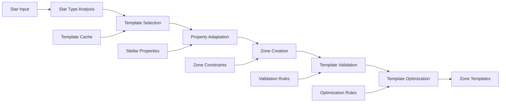

# StarZoneFactory

Creates star-specific zone templates for different stellar types, providing specialized zone configurations for various star types.

## 🎯 Purpose

`StarZoneFactory` is responsible for creating specialized zone templates for different stellar types. It provides star-specific zone configurations that account for the unique properties and characteristics of different star types, ensuring realistic and scientifically accurate zone generation based on stellar physics and astronomical observations.

## 🏗️ Architecture

The `StarZoneFactory` follows a modular, template-based architecture that creates specialized zone configurations for different stellar types. It uses a combination of pre-defined templates, dynamic generation, and intelligent caching to provide efficient and accurate zone creation.

```mermaid
graph TD
    A[StarZoneFactory] --> B[Zone Template Cache]
    A --> C[Star Type Analyzer]
    A --> D[Zone Template Generator]
    A --> E[Zone Template Validator]
    A --> F[Zone Template Optimizer]

    B --> G[Template Storage]
    B --> H[Template Retrieval]
    B --> I[Template Management]

    C --> J[Stellar Classification]
    C --> K[Stellar Properties]
    C --> L[Stellar Characteristics]

    D --> M[Template Selection]
    D --> N[Template Customization]
    D --> O[Template Creation]

    E --> P[Scientific Validation]
    E --> Q[Physics Validation]
    E --> R[Astronomical Validation]

    F --> S[Performance Optimization]
    F --> T[Memory Optimization]
    F --> U[Cache Optimization]

    G --> V[Zone Templates]
    H --> V
    I --> V

    J --> W[Star Types]
    K --> W
    L --> W

    M --> X[Zone Configurations]
    N --> X
    O --> X

    P --> Y[Validated Templates]
    Q --> Y
    R --> Y

    S --> Z[Optimized Templates]
    T --> Z
    U --> Z
```



## 🚀 Core Features

### 1. Star Type Classification

- **Stellar Classification**: Analyzes star type, spectral class, and stellar type
- **Property Extraction**: Extracts relevant stellar properties for zone creation
- **Type Matching**: Matches star properties to appropriate zone templates
- **Customization**: Creates custom zones for unique stellar configurations

### 2. Zone Template Creation

- **Template Selection**: Selects appropriate zone templates for star type
- **Property Adaptation**: Adapts zone properties to match stellar characteristics
- **Distance Scaling**: Scales zone distances based on stellar properties
- **Temperature Mapping**: Maps zone temperatures to stellar properties

### 3. Specialized Zone Generation

- **Star-Specific Zones**: Creates zones optimized for specific star types
- **Spectral Class Zones**: Generates zones based on spectral classification
- **Stellar Type Zones**: Creates zones for different stellar types
- **Custom Zone Creation**: Generates custom zones for unique configurations

### 4. Zone Template Analysis

- **Template Metrics**: Analyzes template performance and accuracy
- **Template Constraints**: Applies template constraints and requirements
- **Template Requirements**: Manages template requirements and dependencies

## 🔧 Key Methods

### `createZonesForStarType(starType: string)`

**Purpose**: Creates zone templates for a specific star type based on stellar classification.

```typescript
static createZonesForStarType(starType: string): CelestialZone[]
```

**Parameters**:

- `starType` - The star type (e.g., "G", "K", "M", "O", "B", "A", "F")

**Returns**: `CelestialZone[]` - Array of zone templates for the star type

**Process**:

1. **Star Type Analysis**: Analyzes the star type and its characteristics
2. **Template Selection**: Selects appropriate zone templates for the star type
3. **Property Adaptation**: Adapts zone properties to match stellar characteristics
4. **Template Creation**: Creates zone templates with appropriate properties
5. **Validation**: Validates created zone templates for scientific accuracy

### `createZonesForSpectralClass(spectralClass: string)`

**Purpose**: Creates zone templates for a specific spectral class with detailed stellar properties.

```typescript
static createZonesForSpectralClass(spectralClass: string): CelestialZone[]
```

**Parameters**:

- `spectralClass` - The spectral class (e.g., "G2V", "K5III", "M1V")

**Returns**: `CelestialZone[]` - Array of zone templates for the spectral class

**Process**:

1. **Spectral Analysis**: Analyzes the spectral class and its properties
2. **Template Selection**: Selects appropriate zone templates for the spectral class
3. **Property Adaptation**: Adapts zone properties to match spectral characteristics
4. **Template Creation**: Creates zone templates with appropriate properties
5. **Validation**: Validates created zone templates for scientific accuracy

### `createZonesForStellarType(stellarType: string)`

**Purpose**: Creates zone templates for a specific stellar type with evolutionary stage considerations.

```typescript
static createZonesForStellarType(stellarType: string): CelestialZone[]
```

**Parameters**:

- `stellarType` - The stellar type (e.g., "MainSequence", "Giant", "Supergiant")

**Returns**: `CelestialZone[]` - Array of zone templates for the stellar type

**Process**:

1. **Stellar Type Analysis**: Analyzes the stellar type and its evolutionary stage
2. **Template Selection**: Selects appropriate zone templates for the stellar type
3. **Property Adaptation**: Adapts zone properties to match stellar characteristics
4. **Template Creation**: Creates zone templates with appropriate properties
5. **Validation**: Validates created zone templates for scientific accuracy

### `createCustomZones(star: CelestialObject)`

**Purpose**: Creates custom zone templates for a specific star with unique properties.

```typescript
static createCustomZones(star: CelestialObject): CelestialZone[]
```

**Parameters**:

- `star` - The celestial object representing the star

**Returns**: `CelestialZone[]` - Array of custom zone templates

**Process**:

1. **Star Analysis**: Analyzes the star's unique properties and characteristics
2. **Template Selection**: Selects appropriate zone templates for the star
3. **Property Adaptation**: Adapts zone properties to match stellar characteristics
4. **Template Creation**: Creates custom zone templates with appropriate properties
5. **Validation**: Validates created zone templates for scientific accuracy

## 🔄 Data Flow

The `StarZoneFactory` follows a systematic data flow for creating zone templates:



### Zone Template Creation Pipeline

1. **Star Input**: Receives star type, spectral class, or stellar type
2. **Star Type Analysis**: Analyzes stellar properties and characteristics
3. **Template Selection**: Selects appropriate zone templates from cache or creates new ones
4. **Property Adaptation**: Adapts zone properties to match stellar characteristics
5. **Zone Creation**: Creates zone templates with appropriate properties
6. **Template Validation**: Validates created zone templates for scientific accuracy
7. **Template Optimization**: Optimizes zone templates for performance and efficiency
8. **Zone Templates**: Returns validated and optimized zone templates

## 📊 Zone Template Types

### G-Type Stars (Sun-like, Yellow)

```typescript
interface GTypeZoneTemplate {
  name: string;
  minDistanceAU: number;
  maxDistanceAU: number;
  temperatureRange: [number, number];
  planetTypes: string[];
  description: string;
  stellarProperties: {
    luminosity: number;
    temperature: number;
    mass: number;
    radius: number;
  };
  zoneConstraints: {
    minPlanets: number;
    maxPlanets: number;
    planetSizeRange: [number, number];
    orbitalEccentricityRange: [number, number];
  };
}

const gTypeZones: GTypeZoneTemplate[] = [
  {
    name: "Inner Hot Zone",
    minDistanceAU: 0.5,
    maxDistanceAU: 5.0,
    temperatureRange: [600, 2000],
    planetTypes: ["Terrestrial", "Metallic"],
    description: "Hot zone close to G-type star",
    stellarProperties: {
      luminosity: 1.0,
      temperature: 5778,
      mass: 1.0,
      radius: 1.0,
    },
    zoneConstraints: {
      minPlanets: 1,
      maxPlanets: 3,
      planetSizeRange: [0.5, 2.0],
      orbitalEccentricityRange: [0.0, 0.3],
    },
  },
  {
    name: "Habitable Zone",
    minDistanceAU: 1.0,
    maxDistanceAU: 6.0,
    temperatureRange: [200, 400],
    planetTypes: ["Terrestrial", "Ocean"],
    description: "Habitable zone for G-type star",
    stellarProperties: {
      luminosity: 1.0,
      temperature: 5778,
      mass: 1.0,
      radius: 1.0,
    },
    zoneConstraints: {
      minPlanets: 1,
      maxPlanets: 2,
      planetSizeRange: [0.8, 1.5],
      orbitalEccentricityRange: [0.0, 0.2],
    },
  },
  {
    name: "Outer Cool Zone",
    minDistanceAU: 10.0,
    maxDistanceAU: 60.0,
    temperatureRange: [50, 150],
    planetTypes: ["Ice", "Gas Giant"],
    description: "Cool outer zone for G-type star",
    stellarProperties: {
      luminosity: 1.0,
      temperature: 5778,
      mass: 1.0,
      radius: 1.0,
    },
    zoneConstraints: {
      minPlanets: 2,
      maxPlanets: 5,
      planetSizeRange: [1.0, 10.0],
      orbitalEccentricityRange: [0.0, 0.5],
    },
  },
];
```

### K-Type Stars (Cool, Orange)

```typescript
interface KTypeZoneTemplate {
  name: string;
  minDistanceAU: number;
  maxDistanceAU: number;
  temperatureRange: [number, number];
  planetTypes: string[];
  description: string;
  stellarProperties: {
    luminosity: number;
    temperature: number;
    mass: number;
    radius: number;
  };
  zoneConstraints: {
    minPlanets: number;
    maxPlanets: number;
    planetSizeRange: [number, number];
    orbitalEccentricityRange: [number, number];
  };
}

const kTypeZones: KTypeZoneTemplate[] = [
  {
    name: "Inner Hot Zone",
    minDistanceAU: 0.6,
    maxDistanceAU: 6.0,
    temperatureRange: [400, 1500],
    planetTypes: ["Terrestrial", "Metallic"],
    description: "Hot zone close to K-type star",
    stellarProperties: {
      luminosity: 0.4,
      temperature: 4000,
      mass: 0.8,
      radius: 0.8,
    },
    zoneConstraints: {
      minPlanets: 1,
      maxPlanets: 3,
      planetSizeRange: [0.5, 2.0],
      orbitalEccentricityRange: [0.0, 0.3],
    },
  },
  {
    name: "Habitable Zone",
    minDistanceAU: 0.8,
    maxDistanceAU: 4.0,
    temperatureRange: [200, 400],
    planetTypes: ["Terrestrial", "Ocean"],
    description: "Habitable zone for K-type star",
    stellarProperties: {
      luminosity: 0.4,
      temperature: 4000,
      mass: 0.8,
      radius: 0.8,
    },
    zoneConstraints: {
      minPlanets: 1,
      maxPlanets: 2,
      planetSizeRange: [0.8, 1.5],
      orbitalEccentricityRange: [0.0, 0.2],
    },
  },
  {
    name: "Outer Cool Zone",
    minDistanceAU: 8.0,
    maxDistanceAU: 40.0,
    temperatureRange: [50, 150],
    planetTypes: ["Ice", "Gas Giant"],
    description: "Cool outer zone for K-type star",
    stellarProperties: {
      luminosity: 0.4,
      temperature: 4000,
      mass: 0.8,
      radius: 0.8,
    },
    zoneConstraints: {
      minPlanets: 2,
      maxPlanets: 5,
      planetSizeRange: [1.0, 10.0],
      orbitalEccentricityRange: [0.0, 0.5],
    },
  },
];
```

### M-Type Stars (Cool, Red)

```typescript
interface MTypeZoneTemplate {
  name: string;
  minDistanceAU: number;
  maxDistanceAU: number;
  temperatureRange: [number, number];
  planetTypes: string[];
  description: string;
  stellarProperties: {
    luminosity: number;
    temperature: number;
    mass: number;
    radius: number;
  };
  zoneConstraints: {
    minPlanets: number;
    maxPlanets: number;
    planetSizeRange: [number, number];
    orbitalEccentricityRange: [number, number];
  };
}

const mTypeZones: MTypeZoneTemplate[] = [
  {
    name: "Inner Hot Zone",
    minDistanceAU: 0.8,
    maxDistanceAU: 8.0,
    temperatureRange: [200, 1000],
    planetTypes: ["Terrestrial", "Metallic"],
    description: "Hot zone close to M-type star",
    stellarProperties: {
      luminosity: 0.1,
      temperature: 3000,
      mass: 0.5,
      radius: 0.5,
    },
    zoneConstraints: {
      minPlanets: 1,
      maxPlanets: 3,
      planetSizeRange: [0.5, 2.0],
      orbitalEccentricityRange: [0.0, 0.3],
    },
  },
  {
    name: "Habitable Zone",
    minDistanceAU: 0.3,
    maxDistanceAU: 2.0,
    temperatureRange: [200, 400],
    planetTypes: ["Terrestrial", "Ocean"],
    description: "Habitable zone for M-type star",
    stellarProperties: {
      luminosity: 0.1,
      temperature: 3000,
      mass: 0.5,
      radius: 0.5,
    },
    zoneConstraints: {
      minPlanets: 1,
      maxPlanets: 2,
      planetSizeRange: [0.8, 1.5],
      orbitalEccentricityRange: [0.0, 0.2],
    },
  },
  {
    name: "Outer Cool Zone",
    minDistanceAU: 5.0,
    maxDistanceAU: 25.0,
    temperatureRange: [50, 150],
    planetTypes: ["Ice", "Gas Giant"],
    description: "Cool outer zone for M-type star",
    stellarProperties: {
      luminosity: 0.1,
      temperature: 3000,
      mass: 0.5,
      radius: 0.5,
    },
    zoneConstraints: {
      minPlanets: 2,
      maxPlanets: 5,
      planetSizeRange: [1.0, 10.0],
      orbitalEccentricityRange: [0.0, 0.5],
    },
  },
];
```

## 💡 Usage Examples

### Basic Zone Creation

```typescript
import { StarZoneFactory } from "@teskooano/systems-procedural-generation";

// Create zones for G-type star
const gTypeZones = StarZoneFactory.createZonesForStarType("G");

console.log("G-type star zones:", gTypeZones);
console.log("Number of zones:", gTypeZones.length);

// Analyze zone properties
gTypeZones.forEach((zone, index) => {
  console.log(`Zone ${index + 1}: ${zone.name}`);
  console.log(
    `  Distance range: ${zone.minDistanceAU} - ${zone.maxDistanceAU} AU`,
  );
  console.log(
    `  Temperature range: ${zone.temperatureRange[0]} - ${zone.temperatureRange[1]} K`,
  );
  console.log(`  Planet types: ${zone.planetTypes.join(", ")}`);
  console.log(`  Description: ${zone.description}`);
});
```

### Spectral Class Zone Creation

```typescript
import { StarZoneFactory } from "@teskooano/systems-procedural-generation";

// Create zones for G2V spectral class
const g2vZones = StarZoneFactory.createZonesForSpectralClass("G2V");

console.log("G2V spectral class zones:", g2vZones);

// Analyze spectral class properties
g2vZones.forEach((zone, index) => {
  console.log(`Zone ${index + 1}: ${zone.name}`);
  console.log(`  Stellar properties:`, zone.stellarProperties);
  console.log(`  Zone constraints:`, zone.zoneConstraints);
});
```

### Stellar Type Zone Creation

```typescript
import { StarZoneFactory } from "@teskooano/systems-procedural-generation";

// Create zones for MainSequence stellar type
const mainSequenceZones =
  StarZoneFactory.createZonesForStellarType("MainSequence");

console.log("MainSequence stellar type zones:", mainSequenceZones);

// Analyze stellar type properties
mainSequenceZones.forEach((zone, index) => {
  console.log(`Zone ${index + 1}: ${zone.name}`);
  console.log(`  Stellar properties:`, zone.stellarProperties);
  console.log(`  Zone constraints:`, zone.zoneConstraints);
});
```

### Custom Zone Creation

```typescript
import { StarZoneFactory } from "@teskooano/systems-procedural-generation";

// Create custom zones for specific star
const star = {
  type: "G",
  spectralClass: "G2V",
  stellarType: "MainSequence",
  luminosity: 1.0,
  temperature: 5778,
  mass: 1.0,
  radius: 1.0,
};

const customZones = StarZoneFactory.createCustomZones(star);

console.log("Custom zones for star:", customZones);

// Analyze custom zone properties
customZones.forEach((zone, index) => {
  console.log(`Custom Zone ${index + 1}: ${zone.name}`);
  console.log(
    `  Distance range: ${zone.minDistanceAU} - ${zone.maxDistanceAU} AU`,
  );
  console.log(
    `  Temperature range: ${zone.temperatureRange[0]} - ${zone.temperatureRange[1]} K`,
  );
  console.log(`  Planet types: ${zone.planetTypes.join(", ")}`);
  console.log(`  Stellar properties:`, zone.stellarProperties);
  console.log(`  Zone constraints:`, zone.zoneConstraints);
});
```

### Multi-Star System Zone Creation

```typescript
import { StarZoneFactory } from "@teskooano/systems-procedural-generation";

// Create zones for multiple star types
const starTypes = ["G", "K", "M", "O", "B", "A", "F"];
const allZones = {};

starTypes.forEach((starType) => {
  allZones[starType] = StarZoneFactory.createZonesForStarType(starType);
});

console.log("All star type zones:", allZones);

// Analyze zone distribution across star types
Object.entries(allZones).forEach(([starType, zones]) => {
  console.log(`${starType}-type star zones: ${zones.length} zones`);
  zones.forEach((zone, index) => {
    console.log(
      `  Zone ${index + 1}: ${zone.name} (${zone.minDistanceAU}-${zone.maxDistanceAU} AU)`,
    );
  });
});
```

### Zone Template Analysis

```typescript
import { StarZoneFactory } from "@teskooano/systems-procedural-generation";

// Analyze zone templates for different star types
const starTypes = ["G", "K", "M"];
const zoneAnalysis = {};

starTypes.forEach((starType) => {
  const zones = StarZoneFactory.createZonesForStarType(starType);
  zoneAnalysis[starType] = {
    totalZones: zones.length,
    distanceRange: {
      min: Math.min(...zones.map((z) => z.minDistanceAU)),
      max: Math.max(...zones.map((z) => z.maxDistanceAU)),
    },
    temperatureRange: {
      min: Math.min(...zones.map((z) => z.temperatureRange[0])),
      max: Math.max(...zones.map((z) => z.temperatureRange[1])),
    },
    planetTypes: [...new Set(zones.flatMap((z) => z.planetTypes))],
    averageZoneSize:
      zones.reduce((sum, z) => sum + (z.maxDistanceAU - z.minDistanceAU), 0) /
      zones.length,
  };
});

console.log("Zone template analysis:", zoneAnalysis);
```

## ⚡ Performance Considerations

### Efficiency

- **Template Caching**: Zone templates can be cached for reuse
- **Fast Creation**: Efficient zone template creation
- **Minimal Calculations**: Only necessary calculations performed
- **Memory Usage**: Minimal memory footprint

### Template Quality

- **Scientific Accuracy**: Templates based on real astronomical data
- **Realistic Properties**: Zone properties match stellar characteristics
- **Consistent Behavior**: Templates behave consistently across star types
- **Optimized Performance**: Templates optimized for performance

### Performance Monitoring

- **Template Creation Time**: Monitor time to create zone templates
- **Memory Usage**: Monitor memory usage for template storage
- **Cache Hit Rate**: Monitor cache hit rate for template retrieval
- **Validation Time**: Monitor time to validate zone templates

## 🔌 Integration Points

### CelestialZoneManager Integration

- **Zone Template Creation**: Creates zone templates for zone management
- **Stellar Configuration**: Provides stellar configuration for zone management
- **Zone Scaling**: Provides zone templates for zone scaling
- **Zone Selection**: Provides zone templates for zone selection

### ZoneScaler Integration

- **Template Scaling**: Scales zone templates based on stellar properties
- **Distance Scaling**: Scales zone distances based on stellar properties
- **Temperature Scaling**: Scales zone temperatures based on stellar properties
- **Property Scaling**: Scales zone properties based on stellar properties

### ZoneSelector Integration

- **Template Selection**: Selects appropriate zone templates for zone selection
- **Zone Distribution**: Provides zone distribution for zone selection
- **Zone Constraints**: Provides zone constraints for zone selection
- **Zone Requirements**: Provides zone requirements for zone selection

## 🐛 Debug Features

### Validation

- **Star Type Validation**: Validates star type input
- **Zone Template Validation**: Validates created zone templates
- **Property Validation**: Validates zone properties
- **Consistency Checks**: Ensures zone consistency

### Performance Monitoring

- **Template Creation Time**: Monitor time to create zone templates
- **Memory Usage**: Monitor memory usage for template storage
- **Cache Hit Rate**: Monitor cache hit rate for template retrieval
- **Validation Time**: Monitor time to validate zone templates

### Configuration Debugging

- **Template Configuration**: Debug template configuration
- **Stellar Properties**: Debug stellar properties
- **Zone Constraints**: Debug zone constraints
- **Zone Requirements**: Debug zone requirements

## 🔮 Future Enhancements

### Planned Features

- **Advanced Stellar Types**: Support for more advanced stellar types
- **Dynamic Zone Templates**: Dynamic zone template creation
- **Zone Template Optimization**: Advanced zone template optimization
- **Zone Template Analysis**: Advanced zone template analysis

### Optimization Opportunities

- **Template Caching**: Advanced template caching strategies
- **Memory Optimization**: Advanced memory optimization
- **Performance Optimization**: Advanced performance optimization
- **Cache Optimization**: Advanced cache optimization

### Advanced Features

- **Zone Template Machine Learning**: Machine learning for zone template creation
- **Zone Template AI**: AI-powered zone template creation
- **Zone Template Prediction**: Predictive zone template creation
- **Zone Template Evolution**: Evolutionary zone template creation

## 📚 Related Documentation

- [[CelestialZoneManager]] - Uses StarZoneFactory for zone template creation
- [[ZoneScaler]] - Uses zone templates for zone scaling
- [[ZoneSelector]] - Uses zone templates for zone selection
- [[CelestialZone]] - Zone data structure
- [[CelestialObject]] - Star data structure
- [[StellarSystemConfigurator]] - Uses zone templates for system configuration
- [[PlanetGenerator]] - Uses zone templates for planet generation
- [[CometGenerator]] - Uses zone templates for comet generation
- [[RoguePlanetGenerator]] - Uses zone templates for rogue planet generation
