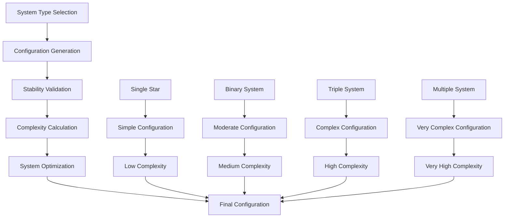

# StellarSystemConfigurator

Randomly chooses a stellar system topology (single, close/wide binary, triple, complex) with tuned weights for variety, providing realistic stellar system configurations.

## 🎯 Purpose

`StellarSystemConfigurator` is responsible for determining the topology and configuration of stellar systems. It randomly selects between different system types (single, binary, triple, complex) using scientifically accurate probabilities to create realistic and varied stellar systems based on astronomical observations and stellar formation models.

## 🏗️ Architecture

### Core Configuration System

The StellarSystemConfigurator implements a sophisticated multi-layered configuration system:

```typescript
class StellarSystemConfigurator {
  private readonly random: () => number;

  constructor(random: () => number);

  // Core configuration methods
  determineStellarConfiguration(): StellarSystemConfiguration;
}
```

### Configuration Pipeline



## 🚀 Core Features

### System Type Classification System

Comprehensive classification based on astronomical observations:

```typescript
interface SystemTypeClassification {
  type: StellarSystemType;
  probability: number;
  characteristics: SystemCharacteristics;
  stability: SystemStability;
  complexity: SystemComplexity;
}

enum StellarSystemType {
  SINGLE_STAR = "SINGLE_STAR", // 60% - Isolated main sequence star
  BINARY_CLOSE = "BINARY_CLOSE", // 15% - Stars separated by <1 AU
  BINARY_WIDE = "BINARY_WIDE", // 20% - Stars separated by 1-100 AU
  TRIPLE_HIERARCHICAL = "TRIPLE_HIERARCHICAL", // 4% - Three stars in nested binary
  MULTIPLE_COMPLEX = "MULTIPLE_COMPLEX", // 1% - Complex multi-star system
}

interface SystemCharacteristics {
  starCount: number; // Number of stars in system
  separationRange: [number, number]; // AU separation range
  supportsCircumbinaryPlanets: boolean; // Whether circumbinary planets are possible
  gravitationalStability: number; // 0-1 stability factor
  formationProbability: number; // Probability of formation
}
```

### System Configuration Management

Advanced configuration management for different system types:

```typescript
interface StellarSystemConfiguration {
  type: StellarSystemType;
  stars: number;
  systemName: string;
  description: string;
  separationAU?: [number, number];
  supportsCircumbinaryPlanets: boolean;
  complexity: SystemComplexity;
  stability: SystemStability;
  formationAge: number; // System age in years
  evolutionStage: string; // Current evolution stage
}

interface SystemComplexity {
  level: "LOW" | "MODERATE" | "HIGH" | "VERY_HIGH";
  factors: ComplexityFactors;
  score: number; // 0-1 complexity score
  description: string;
}

interface ComplexityFactors {
  starCount: number; // Number of stars
  orbitalDynamics: number; // Orbital complexity
  gravitationalInteractions: number; // Gravitational complexity
  planetaryDynamics: number; // Planetary system complexity
  stability: number; // System stability
}
```

### System Stability Analysis

Comprehensive stability analysis for system configurations:

```typescript
interface SystemStability {
  level: "STABLE" | "MODERATE" | "UNSTABLE" | "CHAOTIC";
  factors: StabilityFactors;
  score: number; // 0-1 stability score
  lifetime: number; // Expected system lifetime in years
  description: string;
}

interface StabilityFactors {
  gravitationalStability: number; // Gravitational stability
  orbitalStability: number; // Orbital stability
  tidalEffects: number; // Tidal interaction effects
  resonanceEffects: number; // Orbital resonance effects
  massRatio: number; // Mass ratio stability
  separationStability: number; // Separation distance stability
}
```

## 🔧 Key Methods

### Constructor

```typescript
constructor(random: () => number)
```

**Parameters:**

- `random`: Seeded random number generator for deterministic generation

**Initialization Process:**

1. **Random Generator Setup**: Initializes seeded random number generator
2. **Configuration Loading**: Loads default system configuration parameters
3. **Validation Setup**: Prepares validation systems for system configurations
4. **Performance Optimization**: Optimizes configuration algorithms for efficiency

### System Configuration Determination

```typescript
determineStellarConfiguration(): StellarSystemConfiguration
```

**Purpose:**
Determines the stellar system configuration based on realistic probabilities and astronomical observations.

**Returns:** `StellarSystemConfiguration` - Complete system configuration

**Configuration Process:**

1. **Random Selection**: Uses seeded random number generator
2. **Probability Weighting**: Applies realistic system type probabilities
3. **Configuration Generation**: Creates appropriate configuration
4. **Validation**: Ensures configuration is valid and stable
5. **Optimization**: Optimizes configuration for stability and complexity

## 🔄 Data Flow

### Configuration Pipeline

```typescript
// 1. System type selection
const systemType = selectSystemType(random, systemTypeProbabilities);

// 2. Configuration generation
const configuration = createSystemConfiguration(systemType, random);

// 3. Stability validation
const stability = validateSystemStability(configuration);

// 4. Complexity calculation
const complexity = calculateSystemComplexity(configuration);

// 5. System optimization
const optimizedConfig = optimizeSystemConfiguration(
  configuration,
  stability,
  complexity,
);

// 6. Final validation
const finalConfig = validateFinalConfiguration(optimizedConfig);
```

### System Type Selection Process

```typescript
// System type selection with weighted probabilities
const systemTypeProbabilities = {
  SINGLE_STAR: 0.6, // 60% - Most common
  BINARY_CLOSE: 0.15, // 15% - Close binary systems
  BINARY_WIDE: 0.2, // 20% - Wide binary systems
  TRIPLE_HIERARCHICAL: 0.04, // 4% - Triple star systems
  MULTIPLE_COMPLEX: 0.01, // 1% - Complex multi-star systems
};

// Weighted random selection
const systemType = selectWeightedRandom(systemTypeProbabilities, random);
```

## 🎯 Usage Examples

### Basic System Configuration

```typescript
import { StellarSystemConfigurator } from "@teskooano/systems-procedural-generation";

// Create configurator
const random = () => Math.random();
const configurator = new StellarSystemConfigurator(random);

// Determine system configuration
const config = configurator.determineStellarConfiguration();

console.log("System type:", config.type);
console.log("Number of stars:", config.stars);
console.log("System name:", config.systemName);
console.log("Description:", config.description);
```

### Multiple Configuration Generation

```typescript
import { StellarSystemConfigurator } from "@teskooano/systems-procedural-generation";

// Generate multiple system configurations
const configurator = new StellarSystemConfigurator(random);
const configurations = [];

for (let i = 0; i < 10; i++) {
  const config = configurator.determineStellarConfiguration();
  configurations.push(config);
}

// Analyze distribution
const typeCounts = configurations.reduce((counts, config) => {
  counts[config.type] = (counts[config.type] || 0) + 1;
  return counts;
}, {});

console.log("System type distribution:", typeCounts);
```

### Custom Configuration Probabilities

```typescript
import { StellarSystemConfigurator } from "@teskooano/systems-procedural-generation";

// Create custom configurator with modified probabilities
class CustomStellarSystemConfigurator extends StellarSystemConfigurator {
  determineStellarConfiguration(): StellarSystemConfiguration {
    const random = this.random;

    // Custom probabilities for specific requirements
    const customProbabilities = {
      SINGLE_STAR: 0.4, // Reduced single star probability
      BINARY_CLOSE: 0.25, // Increased close binary probability
      BINARY_WIDE: 0.25, // Increased wide binary probability
      TRIPLE_HIERARCHICAL: 0.08, // Increased triple star probability
      MULTIPLE_COMPLEX: 0.02, // Increased complex system probability
    };

    // Use custom probabilities for selection
    const systemType = this.selectSystemType(customProbabilities);
    return this.createConfiguration(systemType);
  }
}

// Use custom configurator
const customConfigurator = new CustomStellarSystemConfigurator(random);
const config = customConfigurator.determineStellarConfiguration();
```

### System Configuration Analysis

```typescript
import { StellarSystemConfigurator } from "@teskooano/systems-procedural-generation";

// Analyze system configuration
function analyzeSystemConfiguration(config: StellarSystemConfiguration) {
  console.log("=== System Configuration Analysis ===");
  console.log(`Type: ${config.type}`);
  console.log(`Stars: ${config.stars}`);

  if (config.separationAU) {
    console.log(
      `Separation: ${config.separationAU[0]}-${config.separationAU[1]} AU`,
    );
  }

  console.log(
    `Circumbinary Planets: ${config.supportsCircumbinaryPlanets ? "Yes" : "No"}`,
  );
  console.log(`System Name: ${config.systemName}`);
  console.log(`Description: ${config.description}`);

  // Determine complexity level
  const complexity = getSystemComplexity(config);
  console.log(`Complexity Level: ${complexity}`);

  // Determine stability level
  const stability = getSystemStability(config);
  console.log(`Stability Level: ${stability}`);
}

function getSystemComplexity(config: StellarSystemConfiguration): string {
  switch (config.type) {
    case "SINGLE_STAR":
      return "Low";
    case "BINARY_WIDE":
      return "Low";
    case "BINARY_CLOSE":
      return "Moderate";
    case "TRIPLE_HIERARCHICAL":
      return "High";
    case "MULTIPLE_COMPLEX":
      return "Very High";
    default:
      return "Unknown";
  }
}

function getSystemStability(config: StellarSystemConfiguration): string {
  switch (config.type) {
    case "SINGLE_STAR":
      return "Very Stable";
    case "BINARY_WIDE":
      return "Stable";
    case "BINARY_CLOSE":
      return "Moderately Stable";
    case "TRIPLE_HIERARCHICAL":
      return "Unstable";
    case "MULTIPLE_COMPLEX":
      return "Very Unstable";
    default:
      return "Unknown";
  }
}
```

## 📊 Performance Considerations

### Efficiency Optimizations

- **Fast Selection**: Uses efficient probability-based selection
- **Minimal Calculations**: Only necessary calculations performed
- **Caching**: Can cache configuration results for repeated use
- **Memory Usage**: Minimal memory footprint

### Configuration Quality

- **Realistic Configurations**: Scientifically accurate system configurations
- **Varied Results**: Diverse system configurations
- **Stable Systems**: Ensures gravitational stability
- **Consistent Properties**: Maintains configuration consistency

### Performance Monitoring

- **Configuration Time**: Tracks time spent generating configurations
- **Memory Usage**: Monitors memory consumption for configuration
- **Cache Hit Rates**: Tracks effectiveness of configuration caching
- **Validation Performance**: Monitors validation algorithm performance

## 🔧 Integration Points

### CelestialZoneManager Integration

```typescript
// StellarSystemConfigurator is used by CelestialZoneManager for system configuration
const systemConfig = stellarSystemConfigurator.determineStellarConfiguration();
```

### ZoneScaler Integration

```typescript
// StellarSystemConfigurator provides system configuration for ZoneScaler
const scaledZones = zoneScaler.scaleZones(zones, stars, systemConfig);
```

### ZoneSelector Integration

```typescript
// StellarSystemConfigurator provides system configuration for ZoneSelector
const selectedZones = zoneSelector.selectZonesForPlacement(zones, stars);
```

## 🔍 Debug Features

### Configuration Validation

- **Configuration Validity**: Validates generated configurations are valid
- **Property Validation**: Validates all required properties
- **Type Consistency**: Ensures system type matches configuration
- **Stability Checks**: Validates gravitational stability

### Performance Monitoring

- **Configuration Metrics**: Tracks system configuration performance
- **Memory Usage**: Monitors memory consumption patterns
- **Cache Effectiveness**: Measures caching strategy effectiveness
- **Validation Performance**: Monitors validation algorithm performance

### Configuration Debugging

- **Type Analysis**: Analyzes system type selection
- **Configuration Generation**: Displays configuration generation methods
- **Stability Analysis**: Shows stability validation algorithms
- **Complexity Analysis**: Monitors complexity calculation methods

## 🚀 Future Enhancements

### Planned Features

- **Advanced Physics**: More sophisticated gravitational interactions
- **Stellar Evolution**: Time-dependent system evolution
- **Dynamic Configurations**: Dynamic configuration changes over time
- **Galactic Context**: System configuration within galactic environments

### Optimization Opportunities

- **Parallel Configuration**: Multi-threaded configuration for large systems
- **GPU Acceleration**: GPU-based calculations for complex physics
- **Predictive Caching**: Cache configuration results for common configurations
- **Adaptive Quality**: Dynamic quality adjustment based on system complexity

### Advanced Features

- **Galactic Context**: Generate systems within galactic environments
- **Stellar Clusters**: Multi-system generation with gravitational interactions
- **Time Evolution**: Simulate system evolution over billions of years
- **Life Simulation**: Basic life formation and evolution modeling for systems

## 📚 Related Documentation

- [[CelestialZoneManager]] - Uses StellarSystemConfigurator for system configuration
- [[StellarSystemConfiguration]] - Configuration data structure
- [[StellarSystemType]] - System type enumeration
- [[ZoneScaler]] - Uses system configuration for zone scaling
- [[ZoneSelector]] - Uses system configuration for zone selection
- [[StarZoneFactory]] - Creates zone templates for system configuration
- [[CelestialZone]] - Zone data structure for system configuration
