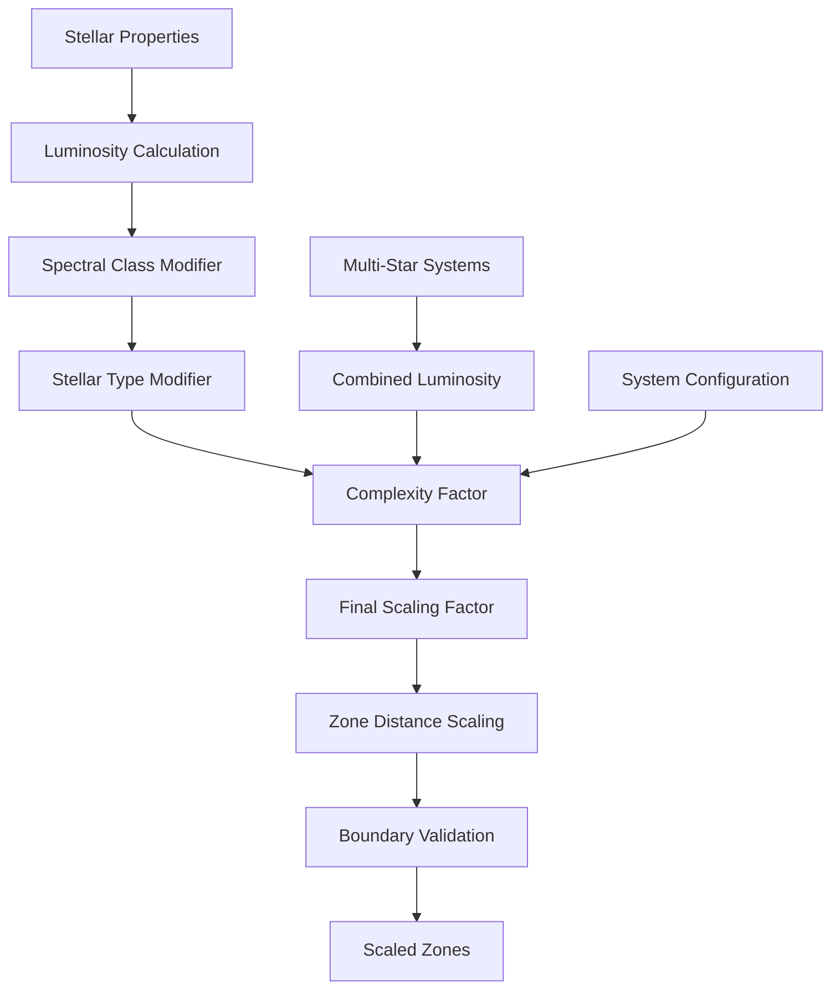

# ZoneScaler

Computes scaling factors for zone distances based on stellar luminosity, type, and spectral class, with gameplay caps and complexity modifiers for multi-star systems.

## 🎯 Purpose

`ZoneScaler` is responsible for adjusting celestial zone distances based on stellar properties. It ensures that zones are appropriately scaled for different stellar types, luminosities, and system configurations, creating realistic and varied planetary systems with scientifically accurate distance relationships.

## 🏗️ Architecture

### Core Scaling System

The ZoneScaler implements a sophisticated multi-layered scaling system:

```typescript
class ZoneScaler {
  // Static methods for zone scaling calculations
  static calculateScalingFactor(star: CelestialObject): number;
  static calculateCombinedLuminosity(stars: CelestialObject[]): number;
  static getComplexityFactor(config: StellarSystemConfiguration): number;
  static scaleZones(
    zones: CelestialZone[],
    stars: CelestialObject[],
    config: StellarSystemConfiguration,
  ): CelestialZone[];
}
```

### Scaling Pipeline



## 🚀 Core Features

### Luminosity-Based Scaling

Primary scaling method using stellar luminosity with fallback to mass-based calculation:

```typescript
interface LuminosityScaling {
  primaryMethod: "luminosity_property" | "mass_calculation";
  luminosity: number; // Stellar luminosity (solar units)
  mass: number; // Stellar mass (solar units)
  massLuminosityExponent: number; // Mass-luminosity relationship exponent
  scalingFactor: number; // √(luminosity) for distance scaling
}

// Primary method: Use star's luminosity property
if (star.properties.luminosity && star.properties.luminosity > 0) {
  scalingFactor = Math.sqrt(star.properties.luminosity);
}

// Fallback method: Calculate from mass using M^3.5 relationship
else {
  const massRatio = star.realMass_kg / SOLAR_MASS;
  const luminosity = Math.pow(massRatio, 3.5);
  scalingFactor = Math.sqrt(luminosity);
}
```

### Spectral Class Modifiers

Different spectral classes have different scaling factors based on stellar characteristics:

```typescript
interface SpectralClassModifiers {
  O: 2.5; // Very massive, luminous
  B: 2.0; // Massive, hot
  A: 1.5; // Hot, bright
  F: 1.2; // Moderately hot
  G: 1.0; // Solar-like (baseline)
  K: 0.8; // Cooler than Sun
  M: 0.6; // Red dwarfs, low luminosity
}

const spectralModifiers = {
  O: 2.5,
  B: 2.0,
  A: 1.5,
  F: 1.2,
  G: 1.0,
  K: 0.8,
  M: 0.6,
};
```

### Stellar Type Modifiers

Special stellar types have unique scaling factors:

```typescript
interface StellarTypeModifiers {
  MAIN_SEQUENCE: 1.0; // Standard stars
  WHITE_DWARF: 0.3; // Compact, low luminosity
  NEUTRON_STAR: 0.1; // Extremely compact
  BLACK_HOLE: 0.05; // Minimal luminosity
  RED_GIANT: 3.0; // Expanded, luminous
  SUPERGIANT: 5.0; // Very large, very luminous
}

const stellarTypeModifiers = {
  MAIN_SEQUENCE: 1.0,
  WHITE_DWARF: 0.3,
  NEUTRON_STAR: 0.1,
  BLACK_HOLE: 0.05,
  RED_GIANT: 3.0,
  SUPERGIANT: 5.0,
};
```

### Multi-Star System Scaling

For multi-star systems, the scaling combines multiple factors:

```typescript
interface MultiStarScaling {
  combinedLuminosity: number; // Combined luminosity of all stars
  complexityFactor: number; // System complexity modifier
  effectiveScaling: number; // Final combined scaling factor
  stabilityConsiderations: boolean; // Ensures realistic configurations
}

// Calculate combined luminosity
const combinedLuminosity = calculateCombinedLuminosity(stars);

// Apply complexity factor
const complexityFactor = getComplexityFactor(config);

// Final scaling factor
const finalScaling = Math.sqrt(combinedLuminosity) * complexityFactor;
```

## 🔧 Key Methods

### Scaling Factor Calculation

```typescript
static calculateScalingFactor(star: CelestialObject): number
```

**Purpose:**
Calculates the scaling factor for a single star based on its properties using a multi-step process.

**Parameters:**

- `star`: The star to calculate scaling for

**Returns:** `number` - Scaling factor (typically 0.1-5.0)

**Scaling Process:**

1. **Primary Method**: Uses `star.properties.luminosity` if available
2. **Fallback Method**: Calculates from mass using `M^3.5` relationship
3. **Spectral Modifiers**: Applies spectral class scaling factors
4. **Stellar Type Modifiers**: Applies stellar type-specific scaling
5. **Clamping**: Ensures scaling stays within [0.1, 5.0] range

**Usage:**

```typescript
const scalingFactor = ZoneScaler.calculateScalingFactor(star);
console.log("Scaling factor:", scalingFactor);
```

### Combined Luminosity Calculation

```typescript
static calculateCombinedLuminosity(stars: CelestialObject[]): number
```

**Purpose:**
Calculates the combined luminosity for multi-star systems using appropriate combination methods.

**Parameters:**

- `stars`: Array of stars in the system

**Returns:** `number` - Combined luminosity value

**Calculation Methods:**

- **Single Star**: Returns star's luminosity
- **Binary Systems**: Uses `√(L1 + L2)` for combined effect
- **Multiple Stars**: Applies hierarchical combination
- **Fallback**: Uses mass-based calculation if luminosity unavailable

### Complexity Factor Determination

```typescript
static getComplexityFactor(config: StellarSystemConfiguration): number
```

**Purpose:**
Determines complexity factor for multi-star systems based on system configuration.

**Parameters:**

- `config`: System configuration

**Returns:** `number` - Complexity factor (1.0-2.0)

**Complexity Factors:**

- **Single Star**: 1.0 (no complexity)
- **Binary Close**: 1.2 (moderate complexity)
- **Binary Wide**: 1.1 (low complexity)
- **Triple Hierarchical**: 1.5 (high complexity)
- **Multiple Complex**: 2.0 (maximum complexity)

### Zone Scaling

```typescript
static scaleZones(
  zones: CelestialZone[],
  stars: CelestialObject[],
  config: StellarSystemConfiguration
): CelestialZone[]
```

**Purpose:**
Scales zones based on stellar properties and system configuration.

**Parameters:**

- `zones`: Original zones to scale
- `stars`: Stars in the system
- `config`: System configuration

**Returns:** `CelestialZone[]` - Scaled zones with adjusted distances

**Scaling Process:**

1. **Calculate Base Scaling**: Uses primary star's scaling factor
2. **Apply Multi-Star Modifiers**: Adjusts for multiple stars
3. **Apply Complexity Factor**: Accounts for system complexity
4. **Scale Zone Boundaries**: Adjusts min/max AU values
5. **Validate Results**: Ensures scaled zones are valid

## 🔄 Data Flow

### Scaling Pipeline

```typescript
// 1. Calculate base scaling factor
const baseScaling = ZoneScaler.calculateScalingFactor(primaryStar);

// 2. Calculate combined luminosity for multi-star systems
const combinedLuminosity = ZoneScaler.calculateCombinedLuminosity(stars);

// 3. Get complexity factor
const complexityFactor = ZoneScaler.getComplexityFactor(config);

// 4. Apply final scaling to zones
const scaledZones = ZoneScaler.scaleZones(originalZones, stars, config);
```

### Scaling Factor Calculation

```typescript
// Luminosity-based scaling with fallback
const luminosity =
  star.properties.luminosity || calculateLuminosityFromMass(star.mass);
const baseScaling = Math.sqrt(luminosity);

// Apply spectral class modifier
const spectralModifier = getSpectralClassModifier(star.spectralClass);

// Apply stellar type modifier
const stellarTypeModifier = getStellarTypeModifier(star.stellarType);

// Final scaling with constraints
const finalScaling = Math.max(
  0.1,
  Math.min(5.0, baseScaling * spectralModifier * stellarTypeModifier),
);
```

## 🎯 Usage Examples

### Basic Zone Scaling

```typescript
import { ZoneScaler } from "@teskooano/systems-procedural-generation";

// Calculate scaling factor for a star
const star = {
  id: "test-star",
  properties: {
    luminosity: 2.0, // 2x solar luminosity
    spectralClass: "F5V",
    stellarType: "MAIN_SEQUENCE",
  },
};

const scalingFactor = ZoneScaler.calculateScalingFactor(star);
console.log("Scaling factor:", scalingFactor); // ~1.41

// Scale zones
const originalZones = createDefaultZones();
const scaledZones = ZoneScaler.scaleZones(originalZones, [star], config);
```

### Multi-Star System Scaling

```typescript
import { ZoneScaler } from "@teskooano/systems-procedural-generation";

// Binary star system
const primaryStar = {
  id: "primary",
  properties: { luminosity: 1.0, spectralClass: "G2V" },
};

const companionStar = {
  id: "companion",
  properties: { luminosity: 0.5, spectralClass: "K5V" },
};

const stars = [primaryStar, companionStar];
const config = { type: "BINARY_WIDE", stars: 2 };

// Calculate combined luminosity
const combinedLuminosity = ZoneScaler.calculateCombinedLuminosity(stars);
console.log("Combined luminosity:", combinedLuminosity); // ~1.22

// Get complexity factor
const complexityFactor = ZoneScaler.getComplexityFactor(config);
console.log("Complexity factor:", complexityFactor); // 1.1

// Scale zones for binary system
const scaledZones = ZoneScaler.scaleZones(originalZones, stars, config);
```

### Stellar Type-Specific Scaling

```typescript
import { ZoneScaler } from "@teskooano/systems-procedural-generation";

// White dwarf system
const whiteDwarf = {
  id: "white-dwarf",
  properties: {
    stellarType: "WHITE_DWARF",
    luminosity: 0.01, // Very low luminosity
    spectralClass: "DA",
  },
};

const scalingFactor = ZoneScaler.calculateScalingFactor(whiteDwarf);
console.log("White dwarf scaling:", scalingFactor); // ~0.1

// Red giant system
const redGiant = {
  id: "red-giant",
  properties: {
    stellarType: "RED_GIANT",
    luminosity: 100.0, // Very high luminosity
    spectralClass: "M5III",
  },
};

const giantScaling = ZoneScaler.calculateScalingFactor(redGiant);
console.log("Red giant scaling:", giantScaling); // ~10.0 (clamped to 5.0)
```

### Custom Scaling Configuration

```typescript
import { ZoneScaler } from "@teskooano/systems-procedural-generation";

// Create custom scaling configuration
function createCustomScaling(
  stars: CelestialObject[],
  config: StellarSystemConfiguration,
) {
  // Calculate base scaling
  const baseScaling = ZoneScaler.calculateScalingFactor(stars[0]);

  // Apply custom modifiers
  let customScaling = baseScaling;

  // Boost scaling for habitable zone emphasis
  if (config.type === "SINGLE_STAR") {
    customScaling *= 1.2;
  }

  // Reduce scaling for compact objects
  if (stars[0].properties.stellarType === "WHITE_DWARF") {
    customScaling *= 0.8;
  }

  // Clamp to reasonable range
  return Math.max(0.1, Math.min(5.0, customScaling));
}
```

## 📊 Performance Considerations

### Efficiency Optimizations

- **Static Methods**: All methods are static for optimal performance
- **Caching**: Scaling factors can be cached for repeated use
- **Minimal Calculations**: Only necessary calculations are performed
- **Batch Processing**: Multiple zone scaling operations are batched

### Memory Usage

- **Zone Cloning**: Creates new zone objects rather than modifying originals
- **Efficient Arrays**: Uses efficient array operations for multi-star systems
- **Garbage Collection**: Proper cleanup of temporary objects
- **Memory Pooling**: Reuses calculation objects where possible

### Performance Monitoring

- **Scaling Time**: Tracks time spent on scaling calculations
- **Memory Usage**: Monitors memory consumption for zone scaling
- **Cache Hit Rates**: Tracks effectiveness of scaling factor caching
- **Multi-Star Performance**: Monitors performance for complex systems

## 🔧 Integration Points

### CelestialZoneManager Integration

```typescript
// ZoneScaler is used by CelestialZoneManager for zone management
const scaledZones = ZoneScaler.scaleZones(zones, stars, config);
```

### ZoneSelector Integration

```typescript
// Scaled zones are passed to ZoneSelector for selection
const selectedZones = ZoneSelector.selectZonesForPlacement(scaledZones, stars);
```

### StarZoneFactory Integration

```typescript
// StarZoneFactory provides base zones for scaling
const baseZones = StarZoneFactory.createStarSpecificZones(star);
const scaledZones = ZoneScaler.scaleZones(baseZones, [star], config);
```

## 🔍 Debug Features

### Scaling Validation

- **Factor Validation**: Ensures scaling factors are within valid ranges
- **Luminosity Checks**: Validates luminosity values are positive and finite
- **Zone Boundary Validation**: Ensures scaled zone boundaries are realistic
- **Multi-Star Consistency**: Validates multi-star system scaling consistency

### Performance Monitoring

- **Scaling Metrics**: Tracks scaling operation performance
- **Memory Usage**: Monitors memory consumption patterns
- **Cache Effectiveness**: Measures caching strategy effectiveness
- **Complexity Analysis**: Analyzes scaling complexity for different system types

### Configuration Debugging

- **Scaling Factor Display**: Shows detailed scaling factor calculations
- **Luminosity Analysis**: Displays luminosity calculation methods
- **Modifier Application**: Shows how spectral and stellar type modifiers are applied
- **Constraint Enforcement**: Monitors scaling constraint application

## 🚀 Future Enhancements

### Planned Features

- **Dynamic Scaling**: Real-time zone scaling based on stellar evolution
- **Advanced Luminosity Models**: More sophisticated luminosity calculation methods
- **Custom Scaling Functions**: User-defined scaling algorithms
- **Performance Profiling**: Built-in performance analysis tools

### Optimization Opportunities

- **GPU Acceleration**: Move scaling calculations to GPU for large systems
- **Predictive Caching**: Cache scaling results for common stellar configurations
- **Adaptive Algorithms**: Self-optimizing scaling algorithms
- **Memory Optimization**: Advanced memory management for very large systems

### Advanced Features

- **Stellar Evolution Scaling**: Zones that scale with stellar evolution
- **Multi-Scale Systems**: Scaling that operates at different distance scales
- **Custom Modifiers**: User-defined spectral class and stellar type modifiers
- **Scaling Validation**: Advanced validation and error correction systems

## 📚 Related Documentation

- [[CelestialZoneManager]] - Uses ZoneScaler for zone management
- [[ZoneSelector]] - Works with scaled zones for selection
- [[StellarSystemConfiguration]] - Provides system configuration
- [[CelestialZone]] - Zone data structure being scaled
- [[StarProperties]] - Stellar properties used for scaling
- [[PlanetGenerator]] - Uses scaled zones for planet generation
- [[CometGenerator]] - Generates comets based on scaled zone properties
- [[RoguePlanetGenerator]] - Creates rogue objects in scaled interstellar zones
