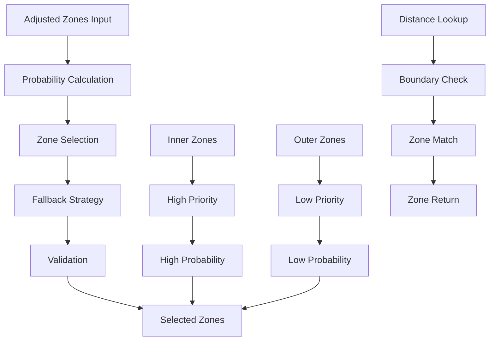

# ZoneSelector

Chooses active zones from adjusted zones using tuned probabilities and fallback strategies to ensure well-populated systems with realistic body distributions.

## 🎯 Purpose

`ZoneSelector` is responsible for selecting which zones will be used for celestial body placement. It uses probability-based selection with fallback strategies to ensure systems are well-populated while maintaining realistic distributions based on scientific models and astronomical observations.

## 🏗️ Architecture

### Core Selection System

The ZoneSelector implements a sophisticated multi-layered selection system:

```typescript
class ZoneSelector {
  private readonly random: () => number;

  constructor(random: () => number);

  // Core selection methods
  selectZonesForPlacement(
    adjustedZones: CelestialZone[],
    stars: CelestialObject[],
  ): CelestialZone[];
  getZoneForDistance(
    zones: CelestialZone[],
    distanceAU: number,
  ): CelestialZone | undefined;
}
```

### Selection Pipeline



## 🚀 Core Features

### Zone Selection Strategy System

Comprehensive selection based on probability and priority:

```typescript
interface ZoneSelectionStrategy {
  probabilities: ZoneProbability;
  priorities: ZonePriority;
  constraints: ZoneConstraints;
  fallback: ZoneFallbackStrategy;
  validation: ZoneValidation;
}

interface ZoneProbability {
  scorched: number; // 0.8 - High probability, close to star
  hot: number; // 0.9 - Very high probability, habitable zone
  temperate: number; // 1.0 - Maximum probability, prime habitable zone
  cool: number; // 0.8 - High probability, outer habitable zone
  cold: number; // 0.6 - Moderate probability, gas giant zone
  frozen: number; // 0.4 - Lower probability, ice giant zone
  outer: number; // 0.3 - Low probability, distant objects
  distant: number; // 0.2 - Very low probability, scattered disk
  interstellar: number; // 0.1 - Minimal probability, rogue objects
}

interface ZonePriority {
  inner: number; // High priority for inner zones
  middle: number; // Medium priority for middle zones
  outer: number; // Low priority for outer zones
  interstellar: number; // Very low priority for interstellar zones
}
```

### Zone Distribution Management

Advanced distribution algorithms for realistic body placement:

```typescript
interface ZoneDistribution {
  minZones: number; // Minimum zones per system
  maxZones: number; // Maximum zones per system
  targetZones: number; // Target number of zones
  distribution: ZoneDistributionPattern;
  balance: ZoneBalance;
}

interface ZoneDistributionPattern {
  inner: number; // Number of inner zones
  middle: number; // Number of middle zones
  outer: number; // Number of outer zones
  interstellar: number; // Number of interstellar zones
}

interface ZoneBalance {
  innerOuter: number; // Balance between inner and outer zones
  habitable: number; // Emphasis on habitable zones
  gasGiant: number; // Emphasis on gas giant zones
  iceGiant: number; // Emphasis on ice giant zones
}
```

### Distance-Based Zone Lookup

Efficient zone lookup and validation system:

```typescript
interface ZoneLookupResult {
  zone: CelestialZone | undefined;
  distance: number;
  boundary: ZoneBoundary;
  validation: ZoneValidation;
}

interface ZoneBoundary {
  minDistance: number; // Minimum distance in AU
  maxDistance: number; // Maximum distance in AU
  tolerance: number; // Boundary tolerance
  overlap: boolean; // Whether zone overlaps with others
}

interface ZoneValidation {
  isValid: boolean; // Whether zone is valid
  errors: string[]; // Validation errors
  warnings: string[]; // Validation warnings
  suggestions: string[]; // Improvement suggestions
}
```

## 🔧 Key Methods

### Constructor

```typescript
constructor(random: () => number)
```

**Parameters:**

- `random`: Seeded random number generator for deterministic generation

**Initialization Process:**

1. **Random Generator Setup**: Initializes seeded random number generator
2. **Configuration Loading**: Loads default zone selection parameters
3. **Validation Setup**: Prepares validation systems for zone selection
4. **Performance Optimization**: Optimizes selection algorithms for efficiency

### Zone Selection for Placement

```typescript
selectZonesForPlacement(adjustedZones: CelestialZone[], stars: CelestialObject[]): CelestialZone[]
```

**Purpose:**
Selects active zones for body placement using probability-based selection with fallback strategies.

**Parameters:**

- `adjustedZones`: Zones scaled by stellar properties
- `stars`: Stars in the system

**Returns:** `CelestialZone[]` - Selected zones for body placement

**Selection Strategy:**

1. **Calculate Minimum Bodies**: Determines minimum bodies needed
2. **Apply Zone Probabilities**: Uses probability-based selection
3. **Prioritize Inner Zones**: Favors inner zones for placement
4. **Apply Fallback Strategy**: Adds zones if selection is empty
5. **Final Cap**: Limits to 5-7 zones maximum

### Zone Lookup by Distance

```typescript
getZoneForDistance(zones: CelestialZone[], distanceAU: number): CelestialZone | undefined
```

**Purpose:**
Finds the appropriate zone for a given distance with efficient boundary validation.

**Parameters:**

- `zones`: Available zones to search
- `distanceAU`: Distance in astronomical units

**Returns:** `CelestialZone | undefined` - Zone containing the distance, or undefined if not found

**Lookup Logic:**

1. **Boundary Check**: Verifies distance falls within zone boundaries
2. **First Match**: Returns first zone containing the distance
3. **Efficient Search**: Uses optimized search algorithm
4. **Validation**: Ensures zone is valid and active

## 🔄 Data Flow

### Selection Pipeline

```typescript
// 1. Zone probability calculation
const probabilities = calculateZoneProbabilities(adjustedZones, stars);

// 2. Zone selection based on probabilities
const selectedZones = selectZonesByProbability(
  adjustedZones,
  probabilities,
  random,
);

// 3. Fallback strategy application
const finalZones = applyFallbackStrategy(selectedZones, adjustedZones, random);

// 4. Zone validation and optimization
const validatedZones = validateAndOptimizeZones(finalZones);

// 5. Final zone selection
const result = finalizeZoneSelection(validatedZones);
```

### Distance Lookup Process

```typescript
// 1. Distance validation
const isValidDistance = validateDistance(distanceAU);

// 2. Zone boundary checking
const matchingZones = findZonesContainingDistance(zones, distanceAU);

// 3. Zone selection (first match)
const selectedZone = selectFirstMatchingZone(matchingZones);

// 4. Result validation
const result = validateZoneLookupResult(selectedZone, distanceAU);
```

## 🎯 Usage Examples

### Basic Zone Selection

```typescript
import { ZoneSelector } from "@teskooano/systems-procedural-generation";

// Create zone selector
const random = () => Math.random();
const zoneSelector = new ZoneSelector(random);

// Select zones for placement
const adjustedZones = createAdjustedZones();
const stars = [primaryStar];

const selectedZones = zoneSelector.selectZonesForPlacement(
  adjustedZones,
  stars,
);

console.log(
  "Selected zones:",
  selectedZones.map((z) => z.name),
);
console.log("Total zones:", selectedZones.length);
```

### Zone Lookup by Distance

```typescript
import { ZoneSelector } from "@teskooano/systems-procedural-generation";

// Create zone selector
const zoneSelector = new ZoneSelector(random);

// Find zone for specific distance
const zones = createAllZones();
const distanceAU = 1.0; // 1 AU

const zone = zoneSelector.getZoneForDistance(zones, distanceAU);

if (zone) {
  console.log(`Distance ${distanceAU} AU is in zone: ${zone.name}`);
  console.log(`Zone range: ${zone.minAU}-${zone.maxAU} AU`);
} else {
  console.log(`No zone found for distance ${distanceAU} AU`);
}
```

### Custom Selection Strategy

```typescript
import { ZoneSelector } from "@teskooano/systems-procedural-generation";

// Create custom zone selector with modified probabilities
class CustomZoneSelector extends ZoneSelector {
  private getZoneInclusionMultiplier(category: ZoneCategory): number {
    // Custom probabilities for specific requirements
    switch (category) {
      case ZoneCategory.TEMPERATE:
        return 1.0; // Always include habitable zone
      case ZoneCategory.HOT:
        return 0.9; // High probability for hot zone
      case ZoneCategory.COOL:
        return 0.7; // Moderate probability for cool zone
      case ZoneCategory.COLD:
        return 0.5; // Lower probability for cold zone
      default:
        return 0.3; // Low probability for others
    }
  }
}

// Use custom selector
const customSelector = new CustomZoneSelector(random);
const selectedZones = customSelector.selectZonesForPlacement(
  adjustedZones,
  stars,
);
```

### Multi-Star System Selection

```typescript
import { ZoneSelector } from "@teskooano/systems-procedural-generation";

// Binary star system
const primaryStar = { id: "primary", properties: { luminosity: 1.0 } };
const companionStar = { id: "companion", properties: { luminosity: 0.5 } };
const stars = [primaryStar, companionStar];

// Create zone selector
const zoneSelector = new ZoneSelector(random);

// Select zones for binary system
const selectedZones = zoneSelector.selectZonesForPlacement(
  adjustedZones,
  stars,
);

// Binary systems typically have more zones due to complexity
console.log("Binary system zones:", selectedZones.length);
```

### Zone Analysis and Optimization

```typescript
import { ZoneSelector } from "@teskooano/systems-procedural-generation";

// Analyze zone selection
function analyzeZoneSelection(selectedZones: CelestialZone[]) {
  console.log("=== Zone Selection Analysis ===");
  console.log(`Total zones: ${selectedZones.length}`);

  const zoneTypes = selectedZones.reduce((types, zone) => {
    types[zone.category] = (types[zone.category] || 0) + 1;
    return types;
  }, {});

  console.log("Zone distribution:", zoneTypes);

  // Calculate zone coverage
  const totalCoverage = selectedZones.reduce((coverage, zone) => {
    return coverage + (zone.maxAU - zone.minAU);
  }, 0);

  console.log(`Total coverage: ${totalCoverage} AU`);

  // Analyze zone balance
  const innerZones = selectedZones.filter((z) => z.category === "INNER").length;
  const outerZones = selectedZones.filter((z) => z.category === "OUTER").length;
  const balance = innerZones / (innerZones + outerZones);

  console.log(`Inner/Outer balance: ${balance.toFixed(2)}`);
}
```

## 📊 Performance Considerations

### Efficiency Optimizations

- **Optimized Selection**: Uses efficient probability-based selection
- **Fast Lookup**: O(n) zone lookup by distance
- **Minimal Calculations**: Only necessary calculations performed
- **Caching**: Can cache selection results for repeated use

### Selection Quality

- **Realistic Distribution**: Scientifically accurate zone distributions
- **Varied Results**: Diverse zone configurations
- **Balanced Selection**: Proper balance between inner and outer zones
- **Consistent Results**: Maintains selection consistency

### Performance Monitoring

- **Selection Time**: Tracks time spent selecting zones
- **Memory Usage**: Monitors memory consumption for selection
- **Cache Hit Rates**: Tracks effectiveness of selection caching
- **Validation Performance**: Monitors validation algorithm performance

## 🔧 Integration Points

### CelestialZoneManager Integration

```typescript
// ZoneSelector is used by CelestialZoneManager for zone selection
const selectedZones = zoneSelector.selectZonesForPlacement(
  adjustedZones,
  stars,
);
```

### ZoneScaler Integration

```typescript
// ZoneSelector uses ZoneScaler for zone scaling
const scaledZones = zoneScaler.scaleZones(zones, stars, systemConfig);
```

### StellarSystemConfigurator Integration

```typescript
// ZoneSelector uses StellarSystemConfigurator for system configuration
const systemConfig = stellarSystemConfigurator.determineStellarConfiguration();
```

## 🔍 Debug Features

### Zone Selection Validation

- **Selection Validity**: Validates selected zones are reasonable
- **Probability Analysis**: Analyzes zone selection probabilities
- **Distribution Analysis**: Monitors zone distribution patterns
- **Fallback Analysis**: Tracks fallback strategy usage

### Performance Monitoring

- **Selection Metrics**: Tracks zone selection performance
- **Memory Usage**: Monitors memory consumption patterns
- **Cache Effectiveness**: Measures caching strategy effectiveness
- **Validation Performance**: Monitors validation algorithm performance

### Configuration Debugging

- **Probability Analysis**: Analyzes zone selection probabilities
- **Selection Strategy**: Displays selection strategy methods
- **Fallback Strategy**: Shows fallback strategy implementation
- **Zone Analysis**: Monitors zone selection patterns

## 🚀 Future Enhancements

### Planned Features

- **Advanced Selection**: More sophisticated selection algorithms
- **Dynamic Probabilities**: Time-dependent probability adjustments
- **Zone Evolution**: Dynamic zone evolution over time
- **Galactic Context**: Zone selection within galactic environments

### Optimization Opportunities

- **Parallel Selection**: Multi-threaded selection for large systems
- **GPU Acceleration**: GPU-based calculations for complex selection
- **Predictive Caching**: Cache selection results for common configurations
- **Adaptive Quality**: Dynamic quality adjustment based on system complexity

### Advanced Features

- **Galactic Context**: Generate zones within galactic environments
- **Stellar Clusters**: Multi-system generation with gravitational interactions
- **Time Evolution**: Simulate zone evolution over billions of years
- **Life Simulation**: Basic life formation and evolution modeling for zones

## 📚 Related Documentation

- [[CelestialZoneManager]] - Uses ZoneSelector for zone management
- [[ZoneScaler]] - Provides scaled zones for selection
- [[CelestialZone]] - Zone data structure being selected
- [[StellarSystemConfiguration]] - System configuration for selection
- [[ZoneCategory]] - Zone categories and their properties
- [[StellarSystemConfigurator]] - Configures stellar systems for zone selection
- [[StarZoneFactory]] - Creates zone templates for selection
