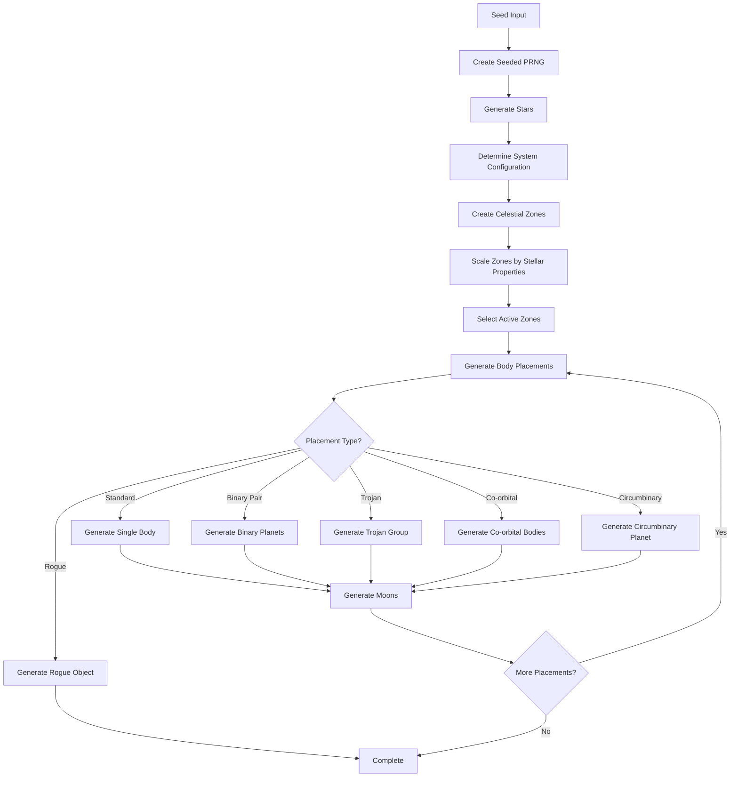

# Procedural Generation (`@teskooano/systems-procedural-generation`)

Advanced procedural star system generation with realistic celestial mechanics, sophisticated orbital configurations, and scientifically accurate planetary systems.

## 🎯 Purpose

The `@teskooano/systems-procedural-generation` package is a comprehensive, deterministic system for creating realistic star systems from seed strings. It generates complex multi-star hierarchies, special orbital configurations, rogue objects, and temperature-based zones using scientifically accurate physics and astronomical data.

## 🏗️ Architecture

### Core Generation Pipeline

The system follows a sophisticated, multi-layered architecture with clear separation of concerns:



### Component Architecture

| Component                     | Purpose                                              | Key Features                                          |
| ----------------------------- | ---------------------------------------------------- | ----------------------------------------------------- |
| **CelestialZoneManager**      | Manages temperature zones and orbital configurations | Zone scaling, selection, and star-specific generation |
| **StellarSystemConfigurator** | Creates hierarchical multi-star systems              | Binary, triple, and complex stellar arrangements      |
| **ZoneScaler**                | Scales zones based on stellar properties             | Luminosity-based distance calculations                |
| **ZoneSelector**              | Chooses active zones for body placement              | Probability-based zone selection                      |
| **StarZoneFactory**           | Creates star-specific zone templates                 | Specialized zones for different stellar types         |
| **PlanetGenerator**           | Generates planets with realistic properties          | Type determination, orbital mechanics, ring systems   |
| **CometGenerator**            | Creates comets with appropriate orbital parameters   | Short/long/interstellar period comets                 |
| **BodyPlacementSystem**       | Sophisticated placement with special configurations  | Binary pairs, trojans, co-orbital arrangements        |

## 🚀 Core Features

### Enhanced Multi-Star Systems

Hierarchical binary and multiple star configurations with proper barycentric motion:

```typescript
interface StellarSystemConfiguration {
  type: StellarSystemType;
  stars: number;
  separationAU?: [number, number];
  supportsCircumbinaryPlanets: boolean;
  systemName: string;
  description: string;
}

enum StellarSystemType {
  SINGLE_STAR = "SINGLE_STAR",
  BINARY_CLOSE = "BINARY_CLOSE",
  BINARY_WIDE = "BINARY_WIDE",
  TRIPLE_HIERARCHICAL = "TRIPLE_HIERARCHICAL",
  MULTIPLE_COMPLEX = "MULTIPLE_COMPLEX",
}
```

**System Type Probabilities:**

- **Single Star**: 60% - Standard planetary systems
- **Close Binary**: 15% - Tidal interactions, complex dynamics
- **Wide Binary**: 20% - Independent planetary systems
- **Hierarchical Triple**: 4% - Complex gravitational interactions
- **Multiple Complex**: 1% - Rare, complex multi-star systems

### Zone-Based Generation

Temperature and gravitational zone determination with realistic physics:

```typescript
interface CelestialZone {
  name: string;
  category: ZoneCategory;
  temperatureRange: { min: number; max: number };
  minAU: number;
  maxAU: number;
  baseMinAU: number;
  baseMaxAU: number;
  allowedPlanetTypes: PlanetType[];
  allowedGasGiantClasses: GasGiantClass[];
  cometChance: number;
  asteroidBeltChance: number;
  formationProbability: number;
  specialConfigurations: OrbitalConfiguration[];
  maxBodies: number;
  minBodies?: number;
}

enum ZoneCategory {
  SCORCHED = "SCORCHED",
  HOT = "HOT",
  TEMPERATE = "TEMPERATE",
  COOL = "COOL",
  COLD = "COLD",
  FROZEN = "FROZEN",
  OUTER = "OUTER",
  DISTANT = "DISTANT",
  INTERSTELLAR = "INTERSTELLAR",
}
```

### Special Orbital Configurations

Advanced orbital arrangements with realistic physics:

#### Binary Planet Pairs

```typescript
interface BinaryPlanetConfiguration {
  primary: CelestialObject;
  secondary: CelestialObject;
  separation: number; // AU
  massRatio: number; // 0.1-10:1
  orbitalPeriod: number; // days
  stabilityFactor: number; // 0-1
}
```

#### Trojan Configurations

```typescript
interface TrojanConfiguration {
  mainBody: CelestialObject;
  trojans: CelestialObject[];
  lagrangePoint: "L4" | "L5";
  phaseAngle: number; // degrees
  stabilityRadius: number; // AU
}
```

#### Co-Orbital Systems

```typescript
interface CoOrbitalConfiguration {
  bodies: CelestialObject[];
  sharedOrbit: OrbitalParameters;
  phaseSeparation: number; // degrees
  stabilityMargin: number; // AU
}
```

### Rogue Objects

Unbound planets in interstellar space with realistic trajectories:

```typescript
interface RoguePlanetConfiguration {
  origin: "EJECTED" | "ISOLATED_FORMATION" | "INTERSTELLAR";
  trajectory: "HYPERBOLIC" | "PARABOLIC" | "SLOW_DRIFT";
  interstellarVelocity: number; // km/s
  temperature: number; // Kelvin
  atmosphericRetention: number; // 0-1
}
```

## 🔧 Key Components

### CelestialZoneManager

The central coordinator for zone scaling, selection, and star-specific zone generation:

```typescript
class CelestialZoneManager {
  private readonly zones: CelestialZone[];
  private readonly stellarConfigurator: StellarSystemConfigurator;
  private readonly zoneSelector: ZoneSelector;

  constructor(random: () => number, customZones?: CelestialZone[]);

  static createForStar(
    star: CelestialObject,
    random: () => number,
  ): CelestialZoneManager;
  determineStellarConfiguration(): StellarSystemConfiguration;
  getAdjustedZones(
    stars: CelestialObject[],
    config: StellarSystemConfiguration,
  ): CelestialZone[];
  selectZonesForPlacement(
    stars: CelestialObject[],
    config: StellarSystemConfiguration,
  ): CelestialZone[];
  getAllZones(): CelestialZone[];
  getZoneForDistance(distanceAU: number): CelestialZone | undefined;
}
```

### ZoneScaler

Computes scaling factors for zone distances based on stellar properties:

```typescript
class ZoneScaler {
  static calculateScalingFactor(star: CelestialObject): number;
  static calculateCombinedLuminosity(stars: CelestialObject[]): number;
  static getComplexityFactor(config: StellarSystemConfiguration): number;
  static scaleZones(
    zones: CelestialZone[],
    stars: CelestialObject[],
    config: StellarSystemConfiguration,
  ): CelestialZone[];
}
```

**Scaling Algorithms:**

- **Luminosity Scaling**: `distance ∝ √(luminosity)`
- **Spectral Class Modifiers**: Different factors for O, B, A, F, G, K, M stars
- **Stellar Type Adjustments**: Special scaling for white dwarfs, neutron stars, black holes
- **Multi-Star Systems**: Combined luminosity calculations with complexity factors

### ZoneSelector

Chooses active zones using probability-based selection with fallback strategies:

```typescript
class ZoneSelector {
  private readonly random: () => number;

  constructor(random: () => number);

  selectZonesForPlacement(
    adjustedZones: CelestialZone[],
    stars: CelestialObject[],
  ): CelestialZone[];
  getZoneForDistance(
    zones: CelestialZone[],
    distanceAU: number,
  ): CelestialZone | undefined;
}
```

**Selection Strategy:**

- **Probability-Based**: Different inclusion probabilities per zone category
- **Minimum Body Guarantee**: Ensures minimum number of bodies in system
- **Priority Zones**: Prioritizes inner zones for placement
- **Fallback Strategy**: Adds zones if selection is empty
- **Final Cap**: Limits to 5-7 zones maximum

## 🔄 Data Flow

### Generation Pipeline

```typescript
// 1. Seed-based initialization
const seededRandom = new SeededRandom(seed);
const zoneManager = new CelestialZoneManager(seededRandom.random);

// 2. System configuration
const config = zoneManager.determineStellarConfiguration();
const stars = await generateStars(config, seededRandom);

// 3. Zone creation and scaling
const baseZones = createDefaultZones();
const scaledZones = ZoneScaler.scaleZones(baseZones, stars, config);
const activeZones = zoneManager.selectZonesForPlacement(stars, config);

// 4. Body placement
const objects$ = generateBodies(activeZones, stars, config, seededRandom);
```

### Reactive Generation

The system uses RxJS for streaming generation:

```typescript
async function generateSystem(seed: string): Promise<{
  systemName: string;
  objects$: Observable<CelestialObject>;
}> {
  const seededRandom = new SeededRandom(seed);

  return {
    systemName: generateSystemName(seededRandom),
    objects$: generateSystemObjects(seededRandom),
  };
}
```

## 🎨 Zone Categories

### Temperature-Based Zones

| Zone             | Distance Range | Temperature | Typical Objects             |
| ---------------- | -------------- | ----------- | --------------------------- |
| **SCORCHED**     | 0.01-0.3 AU    | >700K       | Lava worlds, tidally locked |
| **HOT**          | 0.3-0.8 AU     | 400-700K    | Desert worlds, Venus-like   |
| **TEMPERATE**    | 0.8-1.5 AU     | 250-400K    | Earth-like, habitable       |
| **COOL**         | 1.5-3.0 AU     | 150-250K    | Ice worlds, frozen          |
| **COLD**         | 3.0-10 AU      | 50-150K     | Gas giants, icy moons       |
| **FROZEN**       | 10-50 AU       | 20-50K      | Ice giants, Kuiper belt     |
| **OUTER**        | 50-200 AU      | 10-20K      | Distant planets, scattered  |
| **DISTANT**      | 200-1000 AU    | 5-10K       | Long-period comets          |
| **INTERSTELLAR** | 1000-10000 AU  | <5K         | Rogue planets, Oort cloud   |

### Zone Scaling Factors

Different stellar types have different scaling factors:

| Spectral Class | Scaling Multiplier | Characteristics            |
| -------------- | ------------------ | -------------------------- |
| **O**          | 2.5                | Very massive, luminous     |
| **B**          | 2.0                | Massive, hot               |
| **A**          | 1.5                | Hot, bright                |
| **F**          | 1.2                | Moderately hot             |
| **G**          | 1.0                | Solar-like (baseline)      |
| **K**          | 0.8                | Cooler than Sun            |
| **M**          | 0.6                | Red dwarfs, low luminosity |

## 📊 Performance Characteristics

### Deterministic Generation

- **Seed-Based**: Consistent results from seed values
- **Reproducible**: Same seed always produces same system
- **Cacheable**: Generated systems can be cached and reused

### Scalability

- **Large Systems**: Handles systems with 100+ celestial bodies
- **Complex Configurations**: Supports multi-star systems efficiently
- **Memory-Safe**: Proper resource management and cleanup

### Efficiency

- **Optimized Algorithms**: Efficient generation algorithms
- **Streaming**: RxJS-based reactive generation pipeline
- **Lazy Loading**: Generates objects on demand

## 🔧 Integration Points

### Core Dependencies

- **@teskooano/data-types**: Celestial object definitions and types
- **@teskooano/data-values**: Physical constants and astronomical data
- **@teskooano/core-math**: Mathematical utilities and seeded random generation
- **rxjs**: Reactive programming for streaming generation

### Output Integration

- **@teskooano/core-state**: Celestial object management
- **@teskooano/core-physics**: Orbital mechanics and gravitational calculations
- **@teskooano/renderer-threejs-celestial**: Visual representation of generated objects

## 🎯 Usage Examples

### Basic System Generation

```typescript
import { generateSystem } from "@teskooano/systems-procedural-generation";

async function createStarSystem() {
  const { systemName, objects$ } = await generateSystem("my-seed-string");

  console.log(`Generated system: ${systemName}`);

  // Subscribe to the stream of celestial objects
  objects$.subscribe({
    next: (celestialObject) => {
      console.log(
        `Generated: ${celestialObject.name} (${celestialObject.type})`,
      );
    },
    complete: () => {
      console.log("System generation complete!");
    },
  });
}
```

### Advanced Configuration

```typescript
import {
  generateSystem,
  CelestialZoneManager,
  createDefaultZones,
  ZoneCategory,
} from "@teskooano/systems-procedural-generation";

async function createComplexSystem() {
  const seed = "complex-multi-star-system";
  const { systemName, objects$ } = await generateSystem(seed);

  const objects: CelestialObject[] = [];

  await new Promise<void>((resolve) => {
    objects$.subscribe({
      next: (obj) => objects.push(obj),
      complete: () => resolve(),
    });
  });

  // Analyze the generated system
  const stars = objects.filter((obj) => obj.type === CelestialType.STAR);
  const planets = objects.filter((obj) => obj.type === CelestialType.PLANET);
  const gasGiants = objects.filter(
    (obj) => obj.type === CelestialType.GAS_GIANT,
  );
  const comets = objects.filter((obj) => obj.type === CelestialType.COMET);

  console.log(`System: ${systemName}`);
  console.log(`Stars: ${stars.length}`);
  console.log(`Planets: ${planets.length}`);
  console.log(`Gas Giants: ${gasGiants.length}`);
  console.log(`Comets: ${comets.length}`);
}
```

### Custom Zone Configuration

```typescript
import {
  CelestialZoneManager,
  createDefaultZones,
  ZoneCategory,
} from "@teskooano/systems-procedural-generation";

function createCustomZones() {
  const random = () => Math.random();
  const customZones = createDefaultZones();

  // Modify zones for specific requirements
  customZones.forEach((zone) => {
    if (zone.category === ZoneCategory.TEMPERATE) {
      zone.formationProbability = 0.8; // Higher chance of planets
      zone.maxBodies = 3; // Limit to 3 bodies
    }
  });

  const zoneManager = new CelestialZoneManager(random, customZones);
  return zoneManager;
}
```

### Multi-Star System Analysis

```typescript
import { generateSystem } from "@teskooano/systems-procedural-generation";

async function analyzeComplexSystem() {
  const seed = "complex-multi-star-system";
  const { systemName, objects$ } = await generateSystem(seed);

  const objects: CelestialObject[] = [];

  await new Promise<void>((resolve) => {
    objects$.subscribe({
      next: (obj) => objects.push(obj),
      complete: () => resolve(),
    });
  });

  // Analyze the generated system
  const stars = objects.filter((obj) => obj.type === CelestialType.STAR);
  const planets = objects.filter((obj) => obj.type === CelestialType.PLANET);
  const gasGiants = objects.filter(
    (obj) => obj.type === CelestialType.GAS_GIANT,
  );
  const comets = objects.filter((obj) => obj.type === CelestialType.COMET);

  console.log(`System: ${systemName}`);
  console.log(`Stars: ${stars.length}`);
  console.log(`Planets: ${planets.length}`);
  console.log(`Gas Giants: ${gasGiants.length}`);
  console.log(`Comets: ${comets.length}`);
}
```

## 🔍 Debug Features

### Generation Monitoring

- **Seed Tracking**: Monitor seed-based generation consistency
- **Performance Metrics**: Track generation speed and memory usage
- **System Analysis**: Analyze generated system properties

### Configuration Debugging

- **Zone Validation**: Verify zone boundaries and properties
- **Stellar Properties**: Validate stellar mass, radius, temperature
- **Orbital Parameters**: Check orbital stability and realism

### Visual Debugging

- **Zone Visualization**: Visualize zone boundaries and properties
- **Orbital Paths**: Show generated orbital configurations
- **System Hierarchy**: Display system structure and relationships

## 🚀 Future Enhancements

### Planned Features

- **Advanced Physics**: More sophisticated gravitational interactions
- **Stellar Evolution**: Time-dependent stellar and planetary evolution
- **Exoplanet Detection**: Simulate exoplanet detection methods
- **Asteroid Belts**: Detailed asteroid belt generation and dynamics

### Optimization Opportunities

- **Parallel Generation**: Multi-threaded generation for large systems
- **GPU Acceleration**: GPU-based calculations for complex physics
- **Predictive Caching**: Cache generation results for common seeds
- **Adaptive Quality**: Dynamic quality adjustment based on system complexity

### Advanced Features

- **Galactic Context**: Generate systems within galactic environments
- **Stellar Clusters**: Multi-system generation with gravitational interactions
- **Time Evolution**: Simulate system evolution over billions of years
- **Life Simulation**: Basic life formation and evolution modeling

## 📚 Related Documentation

- [[CelestialZoneManager]] - Zone management and configuration
- [[ZoneScaler]] - Stellar property-based zone scaling
- [[ZoneSelector]] - Active zone selection algorithms
- [[StellarSystemConfigurator]] - Multi-star system generation
- [[StarZoneFactory]] - Star-specific zone templates
- [[PlanetGenerator]] - Planet generation with realistic properties
- [[CometGenerator]] - Comet generation with orbital mechanics
- [[RoguePlanetGenerator]] - Rogue planet generation with interstellar mechanics
- [[BodyPlacementSystem]] - Advanced orbital configuration placement

## 🔧 Development

### Building

```bash
moon run procedural-generation:build
```

### Testing

```bash
moon run procedural-generation:test
```

### Type Checking

```bash
moon run procedural-generation:typecheck
```

## 📋 Changelog

See [CHANGELOG.md](./CHANGELOG.md) for detailed version history and recent enhancements.

## 📖 Architecture Documentation

For detailed technical documentation, see [ARCHITECTURE.md](./ARCHITECTURE.md).
