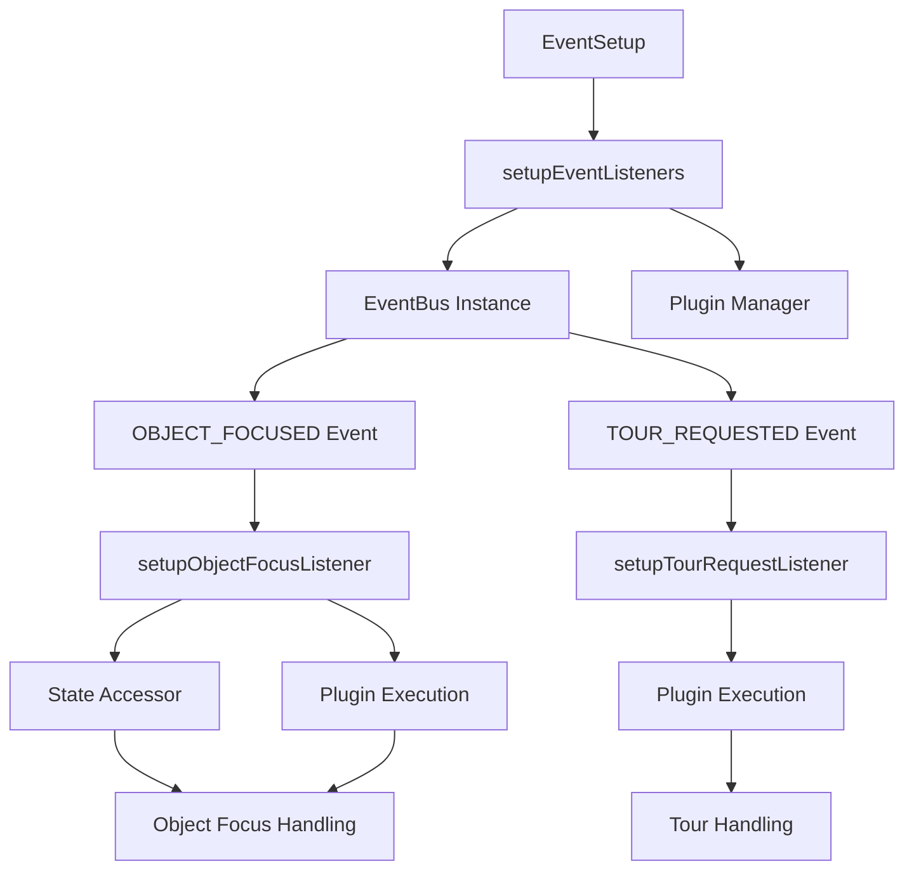
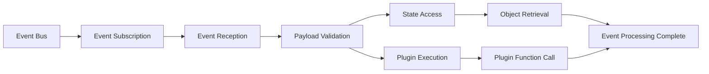

# EventSetup

A static utility class responsible for setting up application-wide event listeners that bridge core systems with the reactive UI pattern's event bus during application initialization.

## 🎯 Purpose

EventSetup serves as the event system coordinator, responsible for:

- **Event Bridge**: Bridges core system events with the reactive UI pattern's event bus
- **Standardized Events**: Replaces custom DOM events with standardized event bus events
- **Plugin Integration**: Integrates event handling with the plugin system
- **State Integration**: Connects events with the core state management system
- **Tour Integration**: Handles tour-related events and plugin execution

## 🏗️ Architecture

EventSetup follows a systematic event listener setup pattern:



## 🚀 Core Features

### 1. Object Focus Event Handling

- **Standardized Events**: Uses OBJECT_FOCUSED event instead of custom DOM events
- **State Integration**: Integrates with StateAccessor for object retrieval
- **Plugin Execution**: Executes tour functions through the plugin system
- **Error Handling**: Provides comprehensive error handling for focus events

### 2. Tour Request Event Handling

- **Tour Integration**: Handles tour restart requests through the plugin system
- **Event Standardization**: Uses TOUR_REQUESTED event instead of custom DOM events
- **Plugin Execution**: Executes tour restart through plugin system
- **Error Handling**: Provides error handling for tour request events

### 3. Event Bus Integration

- **Event Bus Connection**: Connects with the singleton EventBus instance
- **Event Subscription**: Subscribes to standardized application events
- **Event Translation**: Translates events into plugin system actions
- **Error Isolation**: Isolates event handling errors from application startup

## API Reference

### Event Listener Setup

#### `setupEventListeners(pluginManagerInstance, appContext): void`

Sets up all application event listeners, subscribing to various system events and translating them into actions within the reactive UI pattern system.

**Parameters:**

- `pluginManagerInstance` - The global plugin manager instance
- `appContext` - Context object containing core controllers like the DockviewController

**Process:**

1. **Event Bus Initialization**: Gets the singleton EventBus instance
2. **Object Focus Setup**: Sets up object focus event listener
3. **Tour Request Setup**: Sets up tour request event listener
4. **Event Subscription**: Subscribes to all required application events

**Usage:**

```typescript
import { EventSetup } from "./EventSetup";

EventSetup.setupEventListeners(pluginManager, {
  dockviewController: dockviewController,
});
```

#### `setupObjectFocusListener(pluginManagerInstance, eventBus): void`

Listens for the standardized OBJECT_FOCUSED event and executes the corresponding tour function, replacing the old custom 'engine-focus-request' DOM event.

**Parameters:**

- `pluginManagerInstance` - The global plugin manager instance
- `eventBus` - The singleton instance of the EventBus

**Process:**

1. **Event Subscription**: Subscribes to OBJECT_FOCUSED events
2. **Payload Validation**: Validates event payload and object ID
3. **State Access**: Retrieves celestial object from StateAccessor
4. **Plugin Execution**: Executes tour:setCelestialFocus plugin function
5. **Error Handling**: Handles errors in focus event processing

**Usage:**

```typescript
import { EventSetup } from "./EventSetup";

const eventBus = EventBus.getInstance();
EventSetup.setupObjectFocusListener(pluginManager, eventBus);
```

#### `setupTourRequestListener(pluginManagerInstance, eventBus): void`

Listens for the TOUR_REQUESTED event and executes the tour restart logic, replacing the old custom 'start-tour-request' DOM event.

**Parameters:**

- `pluginManagerInstance` - The global plugin manager instance
- `eventBus` - The singleton instance of the EventBus

**Process:**

1. **Event Subscription**: Subscribes to TOUR_REQUESTED events
2. **Plugin Execution**: Executes tour:restart plugin function
3. **Error Handling**: Handles errors in tour request processing

**Usage:**

```typescript
import { EventSetup } from "./EventSetup";

const eventBus = EventBus.getInstance();
EventSetup.setupTourRequestListener(pluginManager, eventBus);
```

## 🔄 Data Flow

The EventSetup follows a systematic data flow for event handling:



### Processing Pipeline

1. **Event Subscription**: Subscribes to standardized application events
2. **Event Reception**: Receives events from the EventBus
3. **Payload Validation**: Validates event payloads and required data
4. **State Access**: Accesses application state for object information
5. **Plugin Execution**: Executes appropriate plugin functions
6. **Error Handling**: Handles any errors in event processing
7. **Completion**: Marks event processing as complete

## 📊 Technical Specifications

### Interface/Type Definitions

```typescript
interface AppContext {
  dockviewController: DockviewController;
}

interface ObjectFocusedPayload {
  objectId: string;
  // ... other focus event properties
}

interface EventSetupConfig {
  pluginManagerInstance: typeof pluginManager;
  appContext: AppContext;
}
```

### Event Types

```typescript
enum Events {
  OBJECT_FOCUSED = "object-focused",
  TOUR_REQUESTED = "tour-requested",
}

interface EventPayload {
  objectId?: string;
  celestialName?: string;
  // ... other event properties
}
```

## 💡 Usage Examples

### Basic Event Setup

```typescript
import { EventSetup } from "./EventSetup";

// Setup all application event listeners
const setupApplicationEvents = () => {
  EventSetup.setupEventListeners(pluginManager, {
    dockviewController: dockviewController,
  });

  console.log("Application event listeners setup complete");
};
```

### Object Focus Event Handling

```typescript
import { EventSetup, EventBus } from "./EventSetup";

// Setup object focus event listener
const setupObjectFocusEvents = () => {
  const eventBus = EventBus.getInstance();

  EventSetup.setupObjectFocusListener(pluginManager, eventBus);

  // The listener will now handle OBJECT_FOCUSED events
  // and execute tour:setCelestialFocus plugin function
};
```

### Tour Request Event Handling

```typescript
import { EventSetup, EventBus } from "./EventSetup";

// Setup tour request event listener
const setupTourEvents = () => {
  const eventBus = EventBus.getInstance();

  EventSetup.setupTourRequestListener(pluginManager, eventBus);

  // The listener will now handle TOUR_REQUESTED events
  // and execute tour:restart plugin function
};
```

### Custom Event Integration

```typescript
import { EventSetup, EventBus } from "./EventSetup";

// Setup custom event handling
const setupCustomEvents = () => {
  const eventBus = EventBus.getInstance();

  // Setup standard event listeners
  EventSetup.setupEventListeners(pluginManager, {
    dockviewController: dockviewController,
  });

  // Add custom event listeners
  eventBus.on("custom-event", (event) => {
    console.log("Custom event received:", event);

    // Handle custom event
    try {
      pluginManager.execute("custom:handle", event.payload);
    } catch (error) {
      console.error("Custom event handling failed:", error);
    }
  });
};
```

### Error Handling and Recovery

```typescript
import { EventSetup } from "./EventSetup";

// Setup events with error handling
const setupEventsWithErrorHandling = () => {
  try {
    EventSetup.setupEventListeners(pluginManager, {
      dockviewController: dockviewController,
    });

    console.log("Event listeners setup successfully");
  } catch (error) {
    console.error("Failed to setup event listeners:", error);

    // Attempt to setup individual listeners
    try {
      const eventBus = EventBus.getInstance();

      EventSetup.setupObjectFocusListener(pluginManager, eventBus);
      console.log("Object focus listener setup successfully");
    } catch (focusError) {
      console.error("Object focus listener setup failed:", focusError);
    }

    try {
      const eventBus = EventBus.getInstance();

      EventSetup.setupTourRequestListener(pluginManager, eventBus);
      console.log("Tour request listener setup successfully");
    } catch (tourError) {
      console.error("Tour request listener setup failed:", tourError);
    }
  }
};
```

## ⚡ Performance Considerations

### Efficiency

- **Event Bus Integration**: Uses singleton EventBus for efficient event handling
- **Plugin Execution**: Direct plugin execution without intermediate layers
- **State Access**: Efficient state access through StateAccessor
- **Error Isolation**: Isolated error handling prevents event system failures

### Quality Metrics

- **Reliability**: Comprehensive error handling ensures robust event processing
- **Consistency**: Standardized event handling across all application events
- **Maintainability**: Clear separation of concerns and modular design
- **Scalability**: Easy to add new event listeners and handlers

### Performance Monitoring

- **Event Processing Time**: Tracks event processing performance
- **Plugin Execution Time**: Monitors plugin function execution times
- **Error Rate**: Tracks event handling success/failure rates
- **State Access Performance**: Monitors state access performance

## 🔌 Integration Points

### Primary Integration

- **Event Bus**: Direct integration with the EventBus singleton
- **Plugin System**: Integration with plugin system for function execution
- **State Management**: Integration with StateAccessor for object retrieval
- **Tour System**: Integration with tour system through plugin functions

### Secondary Integration

- **Error Handling**: Integration with application error handling systems
- **Logging**: Integration with application logging systems
- **Configuration**: Integration with application configuration management
- **Development Tools**: Integration with development and debugging tools

## 🐛 Debug Features

### Validation

- **Event Validation**: Validates event payloads and required data
- **Plugin Validation**: Validates plugin functions exist and are callable
- **State Validation**: Validates state access and object retrieval
- **Configuration Validation**: Validates event setup configuration

### Monitoring

- **Event Monitoring**: Tracks event reception and processing
- **Plugin Execution**: Monitors plugin function execution
- **Error Monitoring**: Comprehensive error logging and reporting
- **Performance Monitoring**: Tracks event handling performance

### Debugging Tools

- **Event Logging**: Detailed logging throughout event processing
- **Error Tracing**: Full stack traces for debugging event issues
- **Plugin Inspection**: Tools for debugging plugin function execution
- **State Inspection**: Tools for debugging state access issues

## 🔮 Future Enhancements

### Optimization Opportunities

- **Event Caching**: Implement event caching for better performance
- **Plugin Execution Optimization**: Optimize plugin function execution
- **State Access Optimization**: Optimize state access patterns
- **Error Recovery**: Improve error recovery mechanisms

### Potential Improvements

- **Event Management**: Add dynamic event listener management
- **Plugin Integration**: Add more sophisticated plugin integration
- **Monitoring Enhancement**: Add more detailed performance monitoring
- **User Experience**: Improve error messages and debugging tools

## 📚 Architecture Patterns

- **Event Bridge Pattern**: Bridge pattern for connecting different event systems
- **Plugin Pattern**: Plugin pattern for event handling execution
- **State Integration Pattern**: State integration pattern for event processing
- **Error Isolation Pattern**: Error isolation pattern for robust event handling

## 📚 Related Documentation

- [[apps/teskooano/src/core/initialization/ManagerInitializer|Manager Initializer]] - Manager initialization system
- [[packages/app/ui-plugin|UI Plugin System]] - Plugin management framework
- [[packages/core/state|Core State Management]] - State management system
- [[apps/teskooano/src/core/initialization|Initialization System]] - Complete initialization system
