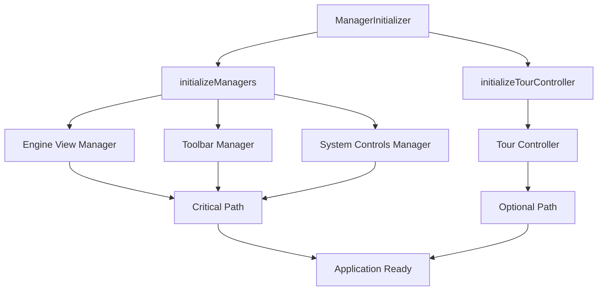
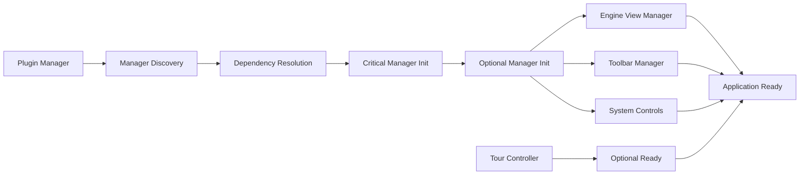

# ManagerInitializer

A static utility class responsible for orchestrating the initialization of all application managers in the correct dependency order during the Teskooano application startup process.

## 🎯 Purpose

ManagerInitializer serves as the central coordinator for manager initialization, responsible for:

- **Dependency Management**: Ensures managers are initialized in the correct order based on their dependencies
- **Critical Path Management**: Identifies and prioritizes critical managers that must initialize successfully
- **Error Handling**: Provides comprehensive error handling and reporting for manager initialization failures
- **Plugin Integration**: Coordinates with the plugin system to initialize manager services
- **Optional Service Handling**: Manages optional services that shouldn't block application startup

## 🏗️ Architecture

ManagerInitializer follows a systematic initialization pattern that ensures proper dependency ordering:



## 🚀 Core Features

### 1. Critical Manager Initialization

- **Engine View Manager**: Initializes the core 3D rendering and simulation view
- **Toolbar Manager**: Sets up the main application toolbar and controls
- **System Controls Manager**: Initializes system-level control interfaces
- **Dependency Ordering**: Ensures managers are initialized in the correct sequence

### 2. Optional Service Management

- **Tour Controller**: Initializes the user tour system (non-blocking)
- **Graceful Degradation**: Optional services that fail don't block application startup
- **Error Isolation**: Separates critical and optional service initialization

### 3. Plugin System Integration

- **Plugin Execution**: Uses the plugin system to execute manager initialization functions
- **Service Discovery**: Discovers and initializes manager services from loaded plugins
- **Configuration Management**: Passes appropriate configuration to each manager

## API Reference

### Lifecycle Management

#### `initializeManagers(pluginManagerInstance, appElement, toolbarElement, dockviewController): Promise<void>`

Initializes all critical application managers in the correct dependency order.

**Parameters:**

- `pluginManagerInstance` - The global plugin manager instance
- `appElement` - The main application DOM element
- `toolbarElement` - The toolbar DOM element
- `dockviewController` - The dockview controller instance

**Process:**

1. **Engine View Initialization**: Initializes the core 3D rendering system
2. **Toolbar Initialization**: Sets up the main application toolbar
3. **System Controls Initialization**: Initializes system control interfaces
4. **Error Handling**: Throws comprehensive errors if any critical manager fails

**Usage:**

```typescript
import { ManagerInitializer } from "./ManagerInitializer";

await ManagerInitializer.initializeManagers(
  pluginManager,
  appElement,
  toolbarElement,
  dockviewController,
);
```

#### `initializeTourController(pluginManagerInstance, dockviewController): Promise<void>`

Initializes the tour controller after panels are created (optional service).

**Parameters:**

- `pluginManagerInstance` - The global plugin manager instance
- `dockviewController` - The dockview controller instance

**Process:**

1. **Tour Initialization**: Attempts to initialize the tour controller
2. **Error Handling**: Logs warnings but doesn't throw errors for tour failures
3. **Non-blocking**: Tour initialization failure doesn't block application startup

**Usage:**

```typescript
import { ManagerInitializer } from "./ManagerInitializer";

// This is called after panels are created
await ManagerInitializer.initializeTourController(
  pluginManager,
  dockviewController,
);
```

## 🔄 Data Flow

The ManagerInitializer follows a systematic data flow for manager initialization:



### Processing Pipeline

1. **Plugin Discovery**: Discovers available manager services from loaded plugins
2. **Dependency Resolution**: Determines the correct initialization order
3. **Critical Path**: Initializes essential managers that must succeed
4. **Optional Path**: Initializes optional services that can fail gracefully
5. **Error Handling**: Provides comprehensive error reporting for failures
6. **Completion**: Marks application as ready for user interaction

## 📊 Technical Specifications

### Interface/Type Definitions

```typescript
interface ManagerInitializationContext {
  pluginManagerInstance: typeof pluginManager;
  appElement: HTMLElement;
  toolbarElement: HTMLElement;
  dockviewController: DockviewController;
}

interface TourInitializationContext {
  pluginManagerInstance: typeof pluginManager;
  dockviewController: DockviewController;
}
```

### Manager Initialization Sequence

```typescript
class ManagerInitializer {
  // Critical managers (must succeed)
  private static readonly CRITICAL_MANAGERS = [
    "engine-view:initialize",
    "toolbar:initialize",
    "system-controls:initialize",
  ];

  // Optional managers (can fail gracefully)
  private static readonly OPTIONAL_MANAGERS = ["tour:initialize"];
}
```

## 💡 Usage Examples

### Basic Manager Initialization

```typescript
import { ManagerInitializer } from "./ManagerInitializer";

// Initialize critical managers
try {
  await ManagerInitializer.initializeManagers(
    pluginManager,
    appElement,
    toolbarElement,
    dockviewController,
  );
  console.log("Critical managers initialized successfully");
} catch (error) {
  console.error("Manager initialization failed:", error);
  throw error; // Re-throw to prevent app startup
}
```

### Optional Service Initialization

```typescript
import { ManagerInitializer } from "./ManagerInitializer";

// Initialize optional services (non-blocking)
try {
  await ManagerInitializer.initializeTourController(
    pluginManager,
    dockviewController,
  );
  console.log("Tour controller initialized");
} catch (error) {
  console.warn("Tour controller failed to initialize:", error);
  // Continue with app startup - tour is optional
}
```

### Complete Initialization Sequence

```typescript
import { ManagerInitializer } from "./ManagerInitializer";

const initializeApplicationManagers = async () => {
  // Phase 1: Critical managers (blocking)
  await ManagerInitializer.initializeManagers(
    pluginManager,
    appElement,
    toolbarElement,
    dockviewController,
  );

  // Phase 2: Optional services (non-blocking)
  await ManagerInitializer.initializeTourController(
    pluginManager,
    dockviewController,
  );

  console.log("All managers initialized");
};
```

### Error Handling and Recovery

```typescript
import { ManagerInitializer } from "./ManagerInitializer";

const initializeWithErrorHandling = async () => {
  try {
    // Critical managers - must succeed
    await ManagerInitializer.initializeManagers(
      pluginManager,
      appElement,
      toolbarElement,
      dockviewController,
    );
  } catch (error) {
    console.error("Critical manager initialization failed:", error);

    // Attempt recovery or show error UI
    showCriticalError(error.message);
    throw error; // Prevent app startup
  }

  // Optional services - can fail gracefully
  try {
    await ManagerInitializer.initializeTourController(
      pluginManager,
      dockviewController,
    );
  } catch (error) {
    console.warn("Optional service initialization failed:", error);
    // Continue with app startup
  }
};
```

## ⚡ Performance Considerations

### Efficiency

- **Parallel Initialization**: Managers that don't depend on each other can initialize in parallel
- **Critical Path Optimization**: Prioritizes critical managers for faster startup
- **Optional Service Isolation**: Optional services don't block critical path
- **Error Fast-fail**: Fails quickly on critical manager errors

### Quality Metrics

- **Reliability**: Comprehensive error handling ensures robust initialization
- **Consistency**: Standardized initialization process across all managers
- **Maintainability**: Clear separation between critical and optional services
- **Scalability**: Easy to add new managers to the initialization sequence

### Performance Monitoring

- **Initialization Time**: Tracks total manager initialization time
- **Manager Performance**: Monitors individual manager initialization times
- **Error Rate**: Tracks manager initialization success/failure rates
- **Dependency Resolution**: Monitors dependency resolution performance

## 🔌 Integration Points

### Primary Integration

- **Plugin System**: Direct integration with the plugin management system
- **Dockview System**: Integration with dockview controller for panel management
- **DOM Integration**: Integration with application DOM elements
- **Service Discovery**: Integration with plugin service discovery

### Secondary Integration

- **Error Handling**: Integration with application error handling systems
- **Logging**: Integration with application logging systems
- **Configuration**: Integration with application configuration management
- **State Management**: Integration with application state management

## 🐛 Debug Features

### Validation

- **Manager Validation**: Validates manager configurations before initialization
- **Dependency Validation**: Validates manager dependencies are properly configured
- **Plugin Validation**: Validates required plugins are loaded
- **Element Validation**: Validates required DOM elements exist

### Monitoring

- **Initialization Monitoring**: Tracks manager initialization progress and timing
- **Error Monitoring**: Comprehensive error logging and reporting
- **Performance Monitoring**: Tracks manager initialization performance
- **Dependency Monitoring**: Monitors dependency resolution process

### Debugging Tools

- **Initialization Logging**: Detailed logging throughout initialization process
- **Error Tracing**: Full stack traces for debugging initialization issues
- **Manager Status**: Tools for checking manager initialization status
- **Dependency Inspection**: Tools for debugging dependency issues

## 🔮 Future Enhancements

### Optimization Opportunities

- **Parallel Initialization**: Implement parallel initialization for independent managers
- **Lazy Initialization**: Implement lazy loading for non-critical managers
- **Dependency Optimization**: Optimize dependency resolution for better performance
- **Error Recovery**: Improve error recovery mechanisms

### Potential Improvements

- **Configuration Enhancement**: Add runtime configuration for manager initialization
- **Manager Management**: Add dynamic manager loading/unloading capabilities
- **Monitoring Enhancement**: Add more detailed performance monitoring
- **User Experience**: Improve error messages and recovery options

## 📚 Architecture Patterns

- **Orchestrator Pattern**: Central orchestration of manager initialization process
- **Dependency Pattern**: Dependency management pattern for initialization ordering
- **Critical Path Pattern**: Critical path management for essential services
- **Optional Service Pattern**: Optional service management for non-critical features

## 📚 Related Documentation

- [[apps/teskooano/src/core/app/TeskooanoApp|TeskooanoApp Class]] - Main application class
- [[apps/teskooano/src/core/initialization/PanelRegistry|Panel Registry]] - Panel registration system
- [[apps/teskooano/src/core/initialization/EventSetup|Event Setup]] - Event system initialization
- [[packages/app/ui-plugin|UI Plugin System]] - Plugin management framework
- [[apps/teskooano/src/core/initialization|Initialization System]] - Complete initialization system
