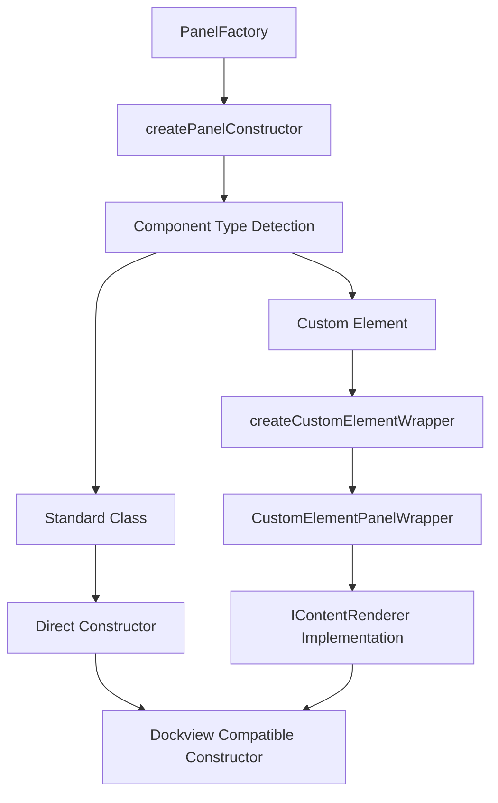
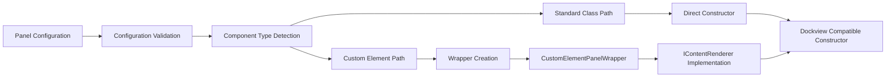

# PanelFactory

A factory class responsible for creating panel component constructors suitable for registration with Dockview, handling the distinction between standard class-based components and custom element-based components.

## 🎯 Purpose

PanelFactory serves as the constructor creation factory for panel components, responsible for:

- **Constructor Creation**: Creates appropriate constructors for Dockview panel registration
- **Component Type Detection**: Distinguishes between standard classes and custom elements
- **Interface Compliance**: Ensures all panel constructors comply with Dockview's IContentRenderer interface
- **Custom Element Wrapping**: Wraps custom elements to make them compatible with Dockview
- **Validation**: Validates panel configurations before constructor creation

## 🏗️ Architecture

PanelFactory follows a factory pattern that handles different component types:



## 🚀 Core Features

### 1. Component Type Detection

- **Standard Class Detection**: Identifies standard class-based components
- **Custom Element Detection**: Identifies custom element-based components
- **Interface Validation**: Validates components implement required interfaces
- **Type Safety**: Provides type-safe constructor creation

### 2. Custom Element Wrapping

- **Wrapper Creation**: Creates wrapper classes for custom elements
- **Interface Implementation**: Implements IContentRenderer interface for custom elements
- **Parameter Passing**: Handles Dockview parameter passing to custom elements
- **Element Management**: Manages custom element lifecycle and initialization

### 3. Constructor Management

- **Constructor Creation**: Creates appropriate constructors for different component types
- **Validation**: Validates panel configurations before constructor creation
- **Error Handling**: Provides comprehensive error handling for invalid configurations
- **Type Safety**: Ensures type safety throughout the creation process

## API Reference

### Constructor Creation

#### `createPanelConstructor(panelConfig, pluginId): new () => IContentRenderer`

Creates a constructor for a Dockview panel component based on the provided configuration.

**Parameters:**

- `panelConfig` - The configuration for the panel
- `pluginId` - The ID of the plugin providing the panel, for error logging

**Returns:** A constructor function that Dockview can use to create panel instances

**Process:**

1. **Configuration Validation**: Validates panel configuration and class definition
2. **Component Type Detection**: Determines if component is standard class or custom element
3. **Constructor Creation**: Creates appropriate constructor based on component type
4. **Error Handling**: Throws descriptive errors for invalid configurations

**Usage:**

```typescript
import { PanelFactory } from "./PanelFactory";

const panelFactory = new PanelFactory();
const panelConstructor = panelFactory.createPanelConstructor(
  panelConfig,
  "my-plugin-id",
);

// Register with Dockview
dockviewController.registerComponent(
  panelConfig.componentName,
  panelConstructor,
);
```

#### `createCustomElementWrapper(componentName): new () => IContentRenderer`

Creates a wrapper class for a custom element to make it compatible with the Dockview IContentRenderer interface.

**Parameters:**

- `componentName` - The tag name of the custom element to wrap

**Returns:** A constructor for the wrapper class

**Process:**

1. **Wrapper Class Creation**: Creates a wrapper class that implements IContentRenderer
2. **Element Creation**: Creates custom element instances
3. **Interface Implementation**: Implements required IContentRenderer methods
4. **Parameter Handling**: Handles Dockview parameter passing

**Usage:**

```typescript
import { PanelFactory } from "./PanelFactory";

const panelFactory = new PanelFactory();
const wrapperConstructor =
  panelFactory.createCustomElementWrapper("my-custom-element");

// The wrapper constructor can now be used with Dockview
dockviewController.registerComponent("my-panel", wrapperConstructor);
```

## 🔄 Data Flow

The PanelFactory follows a systematic data flow for constructor creation:



### Processing Pipeline

1. **Configuration Input**: Receives panel configuration and plugin ID
2. **Validation**: Validates panel configuration and class definition
3. **Type Detection**: Determines component type (standard class vs custom element)
4. **Constructor Creation**: Creates appropriate constructor based on type
5. **Interface Compliance**: Ensures constructor complies with IContentRenderer
6. **Output**: Returns Dockview-compatible constructor

## 📊 Technical Specifications

### Interface/Type Definitions

```typescript
interface PanelConfig {
  componentName: string;
  panelClass: new () => IContentRenderer;
  title?: string;
  icon?: string;
}

interface IContentRenderer {
  element: HTMLElement;
  init(params: PanelInitParameters): void;
}

interface PanelInitParameters {
  params: any;
  api: DockviewApi;
  // ... other Dockview parameters
}
```

### Custom Element Wrapper Implementation

```typescript
class CustomElementPanelWrapper implements IContentRenderer {
  private readonly _element: HTMLElement;

  get element(): HTMLElement {
    return this._element;
  }

  constructor() {
    this._element = document.createElement(componentName);
  }

  init(params: PanelInitParameters): void {
    // Handle Dockview parameter passing
    if (typeof (this._element as any).init === "function") {
      (this._element as any).init(params);
    }
  }
}
```

## 💡 Usage Examples

### Standard Class Panel Creation

```typescript
import { PanelFactory } from "./PanelFactory";

// Standard class-based panel
class MyStandardPanel implements IContentRenderer {
  public element: HTMLElement;

  constructor() {
    this.element = document.createElement("div");
    this.element.textContent = "My Standard Panel";
  }

  init(params: PanelInitParameters): void {
    // Handle initialization
  }
}

// Create constructor using factory
const panelFactory = new PanelFactory();
const panelConfig = {
  componentName: "my-standard-panel",
  panelClass: MyStandardPanel,
};

const constructor = panelFactory.createPanelConstructor(
  panelConfig,
  "my-plugin-id",
);
```

### Custom Element Panel Creation

```typescript
import { PanelFactory } from "./PanelFactory";

// Custom element panel
class MyCustomElement extends HTMLElement {
  connectedCallback() {
    this.innerHTML = "<div>My Custom Element Panel</div>";
  }

  init(params: PanelInitParameters) {
    // Handle Dockview parameters
    console.log("Panel initialized with params:", params);
  }
}

// Register custom element
customElements.define("my-custom-element", MyCustomElement);

// Create wrapper constructor using factory
const panelFactory = new PanelFactory();
const constructor =
  panelFactory.createCustomElementWrapper("my-custom-element");

// Register with Dockview
dockviewController.registerComponent("my-custom-panel", constructor);
```

### Plugin Integration

```typescript
import { PanelFactory } from "./PanelFactory";

// Plugin panel configuration
const pluginPanels = [
  {
    componentName: "engine-panel",
    panelClass: EnginePanel,
    title: "Engine Panel",
    icon: "engine-icon",
  },
  {
    componentName: "settings-panel",
    panelClass: SettingsPanel,
    title: "Settings",
    icon: "settings-icon",
  },
];

// Create constructors for all plugin panels
const panelFactory = new PanelFactory();
const constructors = pluginPanels.map((panelConfig) =>
  panelFactory.createPanelConstructor(panelConfig, "my-plugin-id"),
);

// Register all constructors with Dockview
constructors.forEach((constructor, index) => {
  dockviewController.registerComponent(
    pluginPanels[index].componentName,
    constructor,
  );
});
```

### Error Handling and Validation

```typescript
import { PanelFactory } from "./PanelFactory";

const createPanelWithValidation = (
  panelConfig: PanelConfig,
  pluginId: string,
) => {
  const panelFactory = new PanelFactory();

  try {
    // Validate configuration
    if (!panelConfig.panelClass) {
      throw new Error(
        `Panel class is not defined for component '${panelConfig.componentName}'`,
      );
    }

    if (!panelConfig.componentName) {
      throw new Error("Component name is required");
    }

    // Create constructor
    const constructor = panelFactory.createPanelConstructor(
      panelConfig,
      pluginId,
    );

    console.log(`Panel constructor created for ${panelConfig.componentName}`);
    return constructor;
  } catch (error) {
    console.error(
      `Failed to create panel constructor for ${panelConfig.componentName}:`,
      error,
    );
    throw error;
  }
};
```

## ⚡ Performance Considerations

### Efficiency

- **Type Detection**: Fast component type detection using instanceof checks
- **Constructor Caching**: Constructors are created once and reused
- **Wrapper Optimization**: Custom element wrappers are lightweight and efficient
- **Validation**: Minimal validation overhead for performance

### Quality Metrics

- **Reliability**: Comprehensive error handling ensures robust constructor creation
- **Type Safety**: Full TypeScript type safety throughout the creation process
- **Compatibility**: Ensures all constructors are compatible with Dockview
- **Maintainability**: Clear separation of concerns and modular design

### Performance Monitoring

- **Creation Time**: Tracks panel constructor creation time
- **Type Detection**: Monitors component type detection performance
- **Wrapper Performance**: Tracks custom element wrapper creation performance
- **Error Rate**: Monitors constructor creation success/failure rates

## 🔌 Integration Points

### Primary Integration

- **Dockview System**: Direct integration with Dockview controller for panel registration
- **Plugin System**: Integration with plugin system for panel configuration
- **Custom Elements**: Integration with custom element system
- **Type System**: Integration with TypeScript type system

### Secondary Integration

- **Error Handling**: Integration with application error handling systems
- **Logging**: Integration with application logging systems
- **Validation**: Integration with configuration validation systems
- **Development Tools**: Integration with development and debugging tools

## 🐛 Debug Features

### Validation

- **Configuration Validation**: Validates panel configurations before constructor creation
- **Class Validation**: Validates panel classes are properly defined
- **Interface Validation**: Validates components implement required interfaces
- **Type Validation**: Validates component types are supported

### Monitoring

- **Creation Monitoring**: Tracks panel constructor creation progress and timing
- **Error Monitoring**: Comprehensive error logging and reporting
- **Performance Monitoring**: Tracks constructor creation performance
- **Type Detection**: Monitors component type detection process

### Debugging Tools

- **Creation Logging**: Detailed logging throughout constructor creation process
- **Error Tracing**: Full stack traces for debugging creation issues
- **Constructor Inspection**: Tools for inspecting created constructors
- **Type Detection**: Tools for debugging component type detection

## 🔮 Future Enhancements

### Optimization Opportunities

- **Constructor Caching**: Implement constructor caching for better performance
- **Lazy Creation**: Implement lazy constructor creation for non-critical panels
- **Type Detection Optimization**: Optimize component type detection
- **Wrapper Optimization**: Optimize custom element wrapper creation

### Potential Improvements

- **Configuration Enhancement**: Add runtime configuration for constructor creation
- **Type Support**: Add support for additional component types
- **Monitoring Enhancement**: Add more detailed performance monitoring
- **User Experience**: Improve error messages and debugging tools

## 📚 Architecture Patterns

- **Factory Pattern**: Factory pattern for panel constructor creation
- **Wrapper Pattern**: Wrapper pattern for custom element compatibility
- **Type Detection Pattern**: Type detection pattern for component classification
- **Interface Compliance Pattern**: Interface compliance pattern for Dockview integration

## 📚 Related Documentation

- [[apps/teskooano/src/core/initialization/PanelRegistry|Panel Registry]] - Panel registration system
- [[apps/teskooano/src/core/controllers/dockview|Dockview Controller]] - Dockview integration
- [[packages/app/ui-plugin|UI Plugin System]] - Plugin management framework
- [[apps/teskooano/src/core/initialization|Initialization System]] - Complete initialization system
