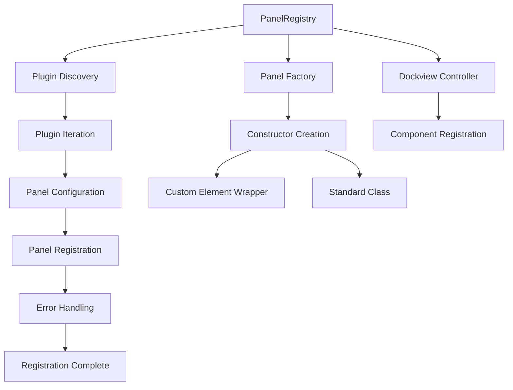
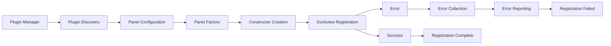

# PanelRegistry

A service class responsible for orchestrating the registration of panel components from all loaded plugins into the Dockview system during application initialization.

## 🎯 Purpose

PanelRegistry serves as the central coordinator for panel registration, responsible for:

- **Plugin Integration**: Discovers and registers panel components from all loaded plugins
- **Dockview Integration**: Integrates panel components with the Dockview panel system
- **Error Handling**: Provides comprehensive error handling and reporting for panel registration failures
- **Factory Delegation**: Delegates panel constructor creation to the PanelFactory
- **Validation**: Validates panel configurations before registration

## 🏗️ Architecture

PanelRegistry follows a systematic registration pattern that ensures proper panel integration:



## 🚀 Core Features

### 1. Plugin Panel Discovery

- **Plugin Iteration**: Iterates through all loaded plugins to discover panel configurations
- **Panel Configuration**: Extracts panel configurations from plugin definitions
- **Validation**: Validates panel configurations before registration
- **Error Collection**: Collects and reports all registration errors

### 2. Dockview Integration

- **Component Registration**: Registers panel components with the Dockview controller
- **Constructor Management**: Manages panel constructor creation and registration
- **Interface Compliance**: Ensures panels comply with Dockview's IContentRenderer interface
- **Factory Delegation**: Delegates constructor creation to specialized factory

### 3. Error Handling & Reporting

- **Comprehensive Error Collection**: Collects errors from all failed registrations
- **Detailed Error Messages**: Provides detailed error messages for debugging
- **Batch Error Reporting**: Reports all errors in a single comprehensive message
- **Registration Validation**: Validates panel configurations before registration

## API Reference

### Panel Registration

#### `registerAllPanels(): void`

Iterates through all loaded plugins and registers their panel components with comprehensive error handling.

**Process:**

1. **Plugin Discovery**: Gets all loaded plugins from the plugin manager
2. **Panel Iteration**: Iterates through each plugin's panel configurations
3. **Registration**: Attempts to register each panel with the Dockview controller
4. **Error Collection**: Collects errors from failed registrations
5. **Error Reporting**: Throws comprehensive error if any registrations fail

**Usage:**

```typescript
import { PanelRegistry } from "./PanelRegistry";

const panelRegistry = new PanelRegistry(pluginManager, dockviewController);
panelRegistry.registerAllPanels();
```

#### `registerPanel(panelConfig, pluginId): void`

Registers a single panel using the PanelFactory to create the constructor, then adds it to the Dockview controller.

**Parameters:**

- `panelConfig` - The configuration for the panel to register
- `pluginId` - The ID of the plugin that defines the panel

**Process:**

1. **Constructor Creation**: Uses PanelFactory to create panel constructor
2. **Component Registration**: Registers the constructor with Dockview controller
3. **Error Handling**: Handles any registration errors

**Usage:**

```typescript
import { PanelRegistry } from "./PanelRegistry";

const panelRegistry = new PanelRegistry(pluginManager, dockviewController);
panelRegistry.registerPanel(panelConfig, "my-plugin-id");
```

### Error Handling

#### `formatErrorMessage(panelConfig, pluginId, error): string`

Formats a consistent error message for a failed panel registration.

**Parameters:**

- `panelConfig` - The configuration of the panel that failed
- `pluginId` - The ID of the plugin attempting to register the panel
- `error` - The caught error object

**Returns:** A formatted, descriptive error string

**Usage:**

```typescript
const errorMessage = panelRegistry.formatErrorMessage(
  panelConfig,
  "my-plugin-id",
  error,
);
console.error(errorMessage);
```

## 🔄 Data Flow

The PanelRegistry follows a systematic data flow for panel registration:



### Processing Pipeline

1. **Plugin Discovery**: Discovers all loaded plugins from the plugin manager
2. **Panel Extraction**: Extracts panel configurations from each plugin
3. **Constructor Creation**: Uses PanelFactory to create panel constructors
4. **Dockview Registration**: Registers constructors with the Dockview controller
5. **Error Handling**: Collects and reports any registration errors
6. **Completion**: Marks panel registration as complete

## 📊 Technical Specifications

### Interface/Type Definitions

```typescript
interface PanelRegistryConfig {
  pluginManager: typeof pluginManager;
  dockviewController: DockviewController;
  panelFactory: PanelFactory;
}

interface PanelRegistrationResult {
  success: boolean;
  errors: string[];
  registeredPanels: string[];
}
```

### Panel Configuration Structure

```typescript
interface PanelConfig {
  componentName: string;
  panelClass: new () => IContentRenderer;
  title?: string;
  icon?: string;
}

interface TeskooanoPlugin {
  id: string;
  panels?: PanelConfig[];
  // ... other plugin properties
}
```

## 💡 Usage Examples

### Basic Panel Registration

```typescript
import { PanelRegistry } from "./PanelRegistry";

// Create panel registry instance
const panelRegistry = new PanelRegistry(pluginManager, dockviewController);

// Register all panels from loaded plugins
try {
  panelRegistry.registerAllPanels();
  console.log("All panels registered successfully");
} catch (error) {
  console.error("Panel registration failed:", error);
  throw error;
}
```

### Individual Panel Registration

```typescript
import { PanelRegistry } from "./PanelRegistry";

const panelRegistry = new PanelRegistry(pluginManager, dockviewController);

// Register a specific panel
const panelConfig = {
  componentName: "my-panel",
  panelClass: MyPanelComponent,
  title: "My Panel",
  icon: "panel-icon",
};

try {
  panelRegistry.registerPanel(panelConfig, "my-plugin-id");
  console.log("Panel registered successfully");
} catch (error) {
  console.error("Panel registration failed:", error);
}
```

### Error Handling and Recovery

```typescript
import { PanelRegistry } from "./PanelRegistry";

const registerPanelsWithErrorHandling = () => {
  const panelRegistry = new PanelRegistry(pluginManager, dockviewController);

  try {
    panelRegistry.registerAllPanels();
    console.log("All panels registered successfully");
  } catch (error) {
    console.error("Panel registration failed:", error);

    // Attempt to register individual panels
    const plugins = pluginManager.getPlugins();
    const successfulRegistrations = [];
    const failedRegistrations = [];

    plugins.forEach((plugin) => {
      plugin.panels?.forEach((panelConfig) => {
        try {
          panelRegistry.registerPanel(panelConfig, plugin.id);
          successfulRegistrations.push(panelConfig.componentName);
        } catch (error) {
          failedRegistrations.push({
            panel: panelConfig.componentName,
            plugin: plugin.id,
            error: error.message,
          });
        }
      });
    });

    console.log("Successful registrations:", successfulRegistrations);
    console.log("Failed registrations:", failedRegistrations);
  }
};
```

### Plugin Development Integration

```typescript
import { PanelRegistry } from "./PanelRegistry";

// Register panels for a new plugin
const registerNewPluginPanels = (
  pluginId: string,
  panelConfigs: PanelConfig[],
) => {
  const panelRegistry = new PanelRegistry(pluginManager, dockviewController);

  panelConfigs.forEach((panelConfig) => {
    try {
      panelRegistry.registerPanel(panelConfig, pluginId);
      console.log(
        `Panel ${panelConfig.componentName} registered for plugin ${pluginId}`,
      );
    } catch (error) {
      console.error(
        `Failed to register panel ${panelConfig.componentName}:`,
        error,
      );
    }
  });
};

// Example usage
const newPluginPanels = [
  {
    componentName: "new-feature-panel",
    panelClass: NewFeaturePanel,
    title: "New Feature",
    icon: "feature-icon",
  },
];

registerNewPluginPanels("new-plugin", newPluginPanels);
```

## ⚡ Performance Considerations

### Efficiency

- **Batch Registration**: Registers all panels in a single operation
- **Factory Delegation**: Delegates constructor creation to specialized factory
- **Error Collection**: Collects all errors before reporting
- **Validation**: Validates configurations before registration

### Quality Metrics

- **Reliability**: Comprehensive error handling ensures robust registration
- **Consistency**: Standardized registration process across all plugins
- **Maintainability**: Clear separation of concerns and modular design
- **Scalability**: Supports unlimited number of panels and plugins

### Performance Monitoring

- **Registration Time**: Tracks total panel registration time
- **Panel Performance**: Monitors individual panel registration times
- **Error Rate**: Tracks panel registration success/failure rates
- **Plugin Performance**: Monitors plugin panel discovery performance

## 🔌 Integration Points

### Primary Integration

- **Plugin System**: Direct integration with the plugin management system
- **Dockview System**: Integration with Dockview controller for panel management
- **Panel Factory**: Integration with PanelFactory for constructor creation
- **Error Handling**: Integration with application error handling systems

### Secondary Integration

- **Logging**: Integration with application logging systems
- **Configuration**: Integration with application configuration management
- **Validation**: Integration with configuration validation systems
- **Development Tools**: Integration with development and debugging tools

## 🐛 Debug Features

### Validation

- **Panel Validation**: Validates panel configurations before registration
- **Plugin Validation**: Validates plugin configurations and panel definitions
- **Constructor Validation**: Validates panel constructors are properly defined
- **Dockview Validation**: Validates Dockview controller is properly initialized

### Monitoring

- **Registration Monitoring**: Tracks panel registration progress and timing
- **Error Monitoring**: Comprehensive error logging and reporting
- **Performance Monitoring**: Tracks panel registration performance
- **Plugin Monitoring**: Monitors plugin panel discovery process

### Debugging Tools

- **Registration Logging**: Detailed logging throughout registration process
- **Error Tracing**: Full stack traces for debugging registration issues
- **Panel Status**: Tools for checking panel registration status
- **Plugin Inspection**: Tools for debugging plugin panel configurations

## 🔮 Future Enhancements

### Optimization Opportunities

- **Parallel Registration**: Implement parallel registration for independent panels
- **Lazy Registration**: Implement lazy registration for non-critical panels
- **Registration Caching**: Implement registration caching for better performance
- **Error Recovery**: Improve error recovery mechanisms

### Potential Improvements

- **Configuration Enhancement**: Add runtime configuration for panel registration
- **Panel Management**: Add dynamic panel loading/unloading capabilities
- **Monitoring Enhancement**: Add more detailed performance monitoring
- **User Experience**: Improve error messages and recovery options

## 📚 Architecture Patterns

- **Registry Pattern**: Central registry for panel registration and management
- **Factory Pattern**: Factory pattern for panel constructor creation
- **Orchestrator Pattern**: Central orchestration of panel registration process
- **Error Collection Pattern**: Comprehensive error collection and reporting

## 📚 Related Documentation

- [[apps/teskooano/src/core/initialization/PanelFactory|Panel Factory]] - Panel constructor creation
- [[apps/teskooano/src/core/initialization/ManagerInitializer|Manager Initializer]] - Manager initialization system
- [[packages/app/ui-plugin|UI Plugin System]] - Plugin management framework
- [[apps/teskooano/src/core/controllers/dockview|Dockview Controller]] - Dockview integration
- [[apps/teskooano/src/core/initialization|Initialization System]] - Complete initialization system
