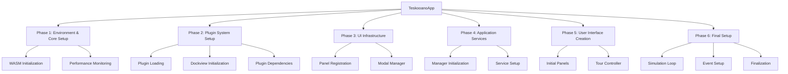
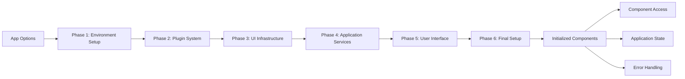

# TeskooanoApp

The main application class that orchestrates the complete initialization process and provides access to all core application components for the Teskooano space simulation.

## 🎯 Purpose

TeskooanoApp serves as the central orchestrator for the entire application, responsible for:

- **Initialization Orchestration**: Managing the 6-phase initialization process
- **Component Management**: Providing access to all core application components
- **Plugin Integration**: Coordinating plugin system initialization and management
- **Lifecycle Management**: Handling application startup, running state, and disposal
- **Error Handling**: Providing comprehensive error handling and recovery mechanisms
- **Resource Coordination**: Managing dependencies between different application systems

## 🏗️ Architecture

TeskooanoApp follows a systematic 6-phase initialization architecture that ensures proper dependency ordering:



## 🚀 Core Features

### 1. 6-Phase Initialization System

- **Phase 1**: Environment validation, WASM initialization, and performance monitoring
- **Phase 2**: Plugin system setup, dockview initialization, and plugin dependency management
- **Phase 3**: UI infrastructure setup including panel registration and modal management
- **Phase 4**: Application services initialization and manager setup
- **Phase 5**: User interface creation including initial panels and tour controller
- **Phase 6**: Final setup including simulation loop and event system

### 2. Component Management

- **Dockview Integration**: Full dockview controller and API management
- **Simulation Management**: Simulation loop manager for physics and rendering
- **Performance Monitoring**: Built-in performance monitoring and optimization
- **Modal Management**: Overlay and modal system management
- **Plugin Management**: Complete plugin system integration

### 3. Error Handling & Recovery

- **Comprehensive Error Catching**: Handles errors at every initialization phase
- **User-Friendly Error Display**: Shows meaningful error messages to users
- **Automatic Cleanup**: Performs cleanup on initialization failure
- **Developer Debugging**: Provides detailed error traces and logging

## API Reference

### Lifecycle Management

#### `constructor(options: TeskooanoAppOptions)`

Creates a new TeskooanoApp instance with the specified configuration options.

**Parameters:**

- `options.appName` - The name of the application (default: "Teskooano")
- `options.version` - The version of the application (default: "unknown")
- `options.gitHash` - The git hash of the application (default: "unknown")
- `options.pluginIds` - Array of plugin IDs to load

**Usage:**

```typescript
const app = new TeskooanoApp({
  appName: "Teskooano",
  version: "1.0.0",
  gitHash: "abc123",
  pluginIds: ["plugin1", "plugin2"],
});
```

#### `start(): Promise<void>`

Starts the application initialization process through the 6-phase system.

**Process:**

1. **Validation**: Checks if application is already started
2. **Initialization**: Executes the 6-phase initialization process
3. **State Update**: Marks application as started
4. **Error Handling**: Handles any initialization failures

**Usage:**

```typescript
try {
  await app.start();
  console.log("Application started successfully");
} catch (error) {
  console.error("Failed to start application:", error);
}
```

#### `dispose(): void`

Disposes of the application and cleans up all resources.

**Process:**

1. **Validation**: Checks if application was started
2. **Simulation Cleanup**: Disposes simulation loop manager
3. **Resource Cleanup**: Performs additional cleanup as needed
4. **Logging**: Logs disposal completion

**Usage:**

```typescript
app.dispose();
console.log("Application disposed");
```

### Component Access

#### `dockviewController: DockviewController`

Provides access to the dockview controller for panel management.

**Usage:**

```typescript
const panel = app.dockviewController.addPanel({
  id: "my-panel",
  component: "my-component",
});
```

#### `dockviewApi: DockviewApi`

Provides access to the dockview API for advanced panel operations.

**Usage:**

```typescript
app.dockviewApi.addPanel({
  id: "advanced-panel",
  component: "advanced-component",
  position: { x: 100, y: 100 },
});
```

#### `simulationLoopManager: SimulationLoopManager`

Provides access to the simulation loop manager for physics and rendering control.

**Usage:**

```typescript
app.simulationLoopManager.start();
app.simulationLoopManager.pause();
```

#### `performanceMonitor: PerformanceMonitor`

Provides access to the performance monitoring system.

**Usage:**

```typescript
const metrics = app.performanceMonitor.getMetrics();
console.log("Performance metrics:", metrics);
```

#### `modalManager: OverlayManager`

Provides access to the modal and overlay management system.

**Usage:**

```typescript
app.modalManager.showModal({
  id: "my-modal",
  component: "modal-component",
});
```

#### `pluginManager: typeof pluginManager`

Provides access to the plugin management system.

**Usage:**

```typescript
const result = await app.pluginManager.execute("plugin:function", data);
```

### Application Metadata

#### `appName: string`

The name of the application.

#### `version: string`

The version of the application.

#### `gitHash: string`

The git hash of the application build.

#### `pluginIds: string[]`

Array of plugin IDs that were loaded during initialization.

#### `isStarted: boolean`

Whether the application has been successfully started.

## 🔄 Data Flow

The TeskooanoApp follows a systematic data flow through the 6-phase initialization:



### Processing Pipeline

1. **Input**: Application options and plugin configuration
2. **Phase 1**: Environment validation and core system setup
3. **Phase 2**: Plugin system initialization and dockview setup
4. **Phase 3**: UI infrastructure and panel registration
5. **Phase 4**: Application services and manager initialization
6. **Phase 5**: User interface creation and tour setup
7. **Phase 6**: Simulation loop and event system setup
8. **Output**: Fully initialized application with all components accessible

## 📊 Technical Specifications

### Interface/Type Definitions

```typescript
interface TeskooanoAppOptions {
  pluginIds: string[];
  appName?: string;
  version?: string;
  gitHash?: string;
}

interface AppDependencies {
  dockviewApi: DockviewApi | null;
  dockviewController: DockviewController | null;
}
```

### Component Properties

```typescript
class TeskooanoApp {
  // Core Components
  public dockviewController!: DockviewController;
  public dockviewApi!: DockviewApi;
  public simulationLoopManager!: SimulationLoopManager;
  public performanceMonitor!: PerformanceMonitor;
  public modalManager!: OverlayManager;
  public pluginManager: typeof pluginManager;

  // Application Metadata
  public appName: string;
  public version: string;
  public gitHash: string;
  public pluginIds: string[];

  // State Management
  private _isStarted: boolean;
}
```

## 💡 Usage Examples

### Basic Application Initialization

```typescript
import { TeskooanoApp } from "./TeskooanoApp";

const app = new TeskooanoApp({
  appName: "Teskooano",
  version: "1.0.0",
  gitHash: "abc123",
  pluginIds: ["engine-panel", "celestial-hierarchy"],
});

await app.start();
console.log("Application ready:", app.isStarted);
```

### Component Access and Usage

```typescript
// Access dockview for panel management
const panel = app.dockviewController.addPanel({
  id: "engine-panel",
  component: "composite-engine-panel",
});

// Access simulation control
app.simulationLoopManager.start();
app.simulationLoopManager.setTimeScale(1.0);

// Access performance monitoring
const metrics = app.performanceMonitor.getMetrics();
console.log("FPS:", metrics.fps);
console.log("Memory:", metrics.memory);

// Access modal system
app.modalManager.showModal({
  id: "settings-modal",
  component: "settings-panel",
});
```

### Plugin System Integration

```typescript
// Execute plugin functions
const result = await app.pluginManager.execute("engine:start", {
  timeScale: 1.0,
});

// Access plugin managers
const engineManager = app.pluginManager.getManager("engine-manager");
if (engineManager) {
  engineManager.setTimeScale(2.0);
}
```

### Error Handling and Recovery

```typescript
try {
  await app.start();
} catch (error) {
  console.error("Initialization failed:", error);

  // Attempt recovery or show error UI
  showErrorMessage(error.message);
}
```

## ⚡ Performance Considerations

### Efficiency

- **Parallel Initialization**: Multiple phases run in parallel where dependencies allow
- **Lazy Loading**: Components are initialized only when needed
- **Resource Management**: Proper cleanup prevents memory leaks
- **Error Recovery**: Fast failure detection and recovery mechanisms

### Quality Metrics

- **Reliability**: Comprehensive error handling ensures robust initialization
- **Consistency**: Standardized 6-phase process across all environments
- **Maintainability**: Clear separation of concerns and modular design
- **Scalability**: Plugin-based architecture supports easy extension

### Performance Monitoring

- **Initialization Time**: Tracks total application startup time
- **Phase Timing**: Monitors individual phase execution times
- **Component Performance**: Tracks component initialization performance
- **Error Rate**: Monitors initialization success/failure rates

## 🔌 Integration Points

### Primary Integration

- **Plugin System**: Complete integration with the plugin ecosystem
- **Dockview System**: Full dockview controller and API integration
- **Simulation System**: Integration with physics and rendering systems
- **UI Framework**: Integration with modal and overlay systems

### Secondary Integration

- **Performance Monitoring**: Integration with performance tracking systems
- **State Management**: Integration with global state management
- **Event System**: Integration with application event handling
- **Development Tools**: Integration with debugging and development tools

## 🐛 Debug Features

### Validation

- **Startup Validation**: Validates application state before starting
- **Component Validation**: Validates component initialization
- **Plugin Validation**: Validates plugin loading and registration
- **Dependency Validation**: Ensures all dependencies are properly initialized

### Monitoring

- **Initialization Monitoring**: Tracks initialization progress and timing
- **Component Monitoring**: Monitors component state and performance
- **Error Monitoring**: Comprehensive error logging and reporting
- **Performance Monitoring**: Tracks application performance metrics

### Debugging Tools

- **Component Access**: Direct access to all application components
- **State Inspection**: Access to application state and metadata
- **Plugin Inspection**: Access to plugin manager and loaded plugins
- **Error Tracing**: Full stack traces for debugging initialization issues

## 🔮 Future Enhancements

### Optimization Opportunities

- **Initialization Optimization**: Optimize phase execution order for better performance
- **Component Loading Optimization**: Implement lazy loading for non-critical components
- **Memory Optimization**: Implement more aggressive memory management
- **Error Recovery Optimization**: Improve error recovery mechanisms

### Potential Improvements

- **Configuration Enhancement**: Add runtime configuration options
- **Component Management Enhancement**: Add dynamic component loading/unloading
- **Monitoring Enhancement**: Add more detailed performance monitoring
- **User Experience**: Improve error messages and recovery options

## 📚 Architecture Patterns

- **Orchestrator Pattern**: Central orchestration of complex initialization process
- **Phase Pattern**: Systematic phase-based initialization with dependency management
- **Component Pattern**: Component-based architecture with clear interfaces
- **Error Recovery Pattern**: Comprehensive error handling and recovery mechanisms

## 📚 Related Documentation

- [[apps/teskooano/src/main|Main Entry Point]] - Application bootstrap system
- [[apps/teskooano/src/config/pluginRegistry|Plugin Registry]] - Plugin configuration
- [[packages/app/ui-plugin|UI Plugin System]] - Plugin management framework
- [[packages/renderer/threejs-celestial|Performance Monitor]] - Performance monitoring system
- [[apps/teskooano/src/core/initialization|Initialization System]] - Initialization components
