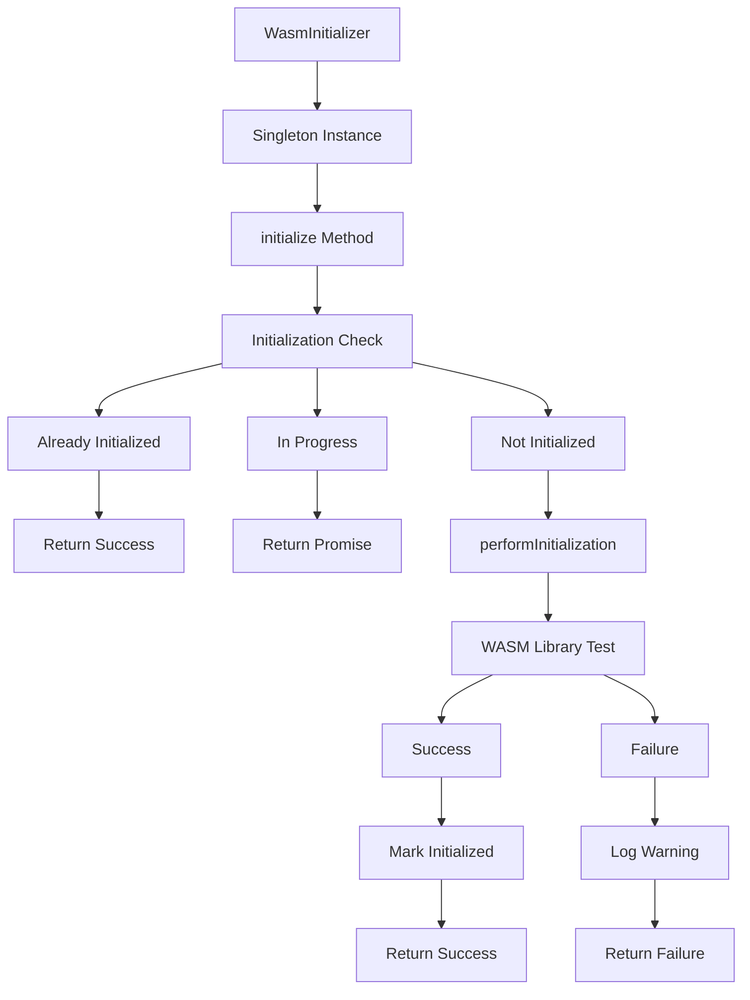
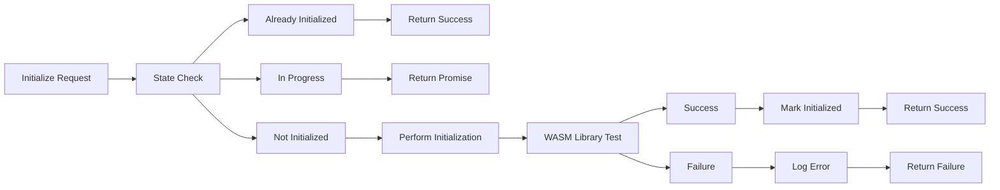

# WasmInitializer

A singleton service responsible for initializing WASM (WebAssembly) libraries during application startup, ensuring WASM is ready before any simulation components are created.

## 🎯 Purpose

WasmInitializer serves as the WASM initialization coordinator, responsible for:

- **WASM Initialization**: Initializes WebAssembly libraries for physics calculations
- **Singleton Management**: Provides singleton access to WASM initialization state
- **Initialization Safety**: Ensures WASM is initialized only once and safely
- **Performance Optimization**: Optimizes WASM initialization for better performance
- **Error Handling**: Provides comprehensive error handling for WASM initialization failures

## 🏗️ Architecture

WasmInitializer follows a singleton pattern with safe initialization:



## 🚀 Core Features

### 1. Singleton Pattern

- **Single Instance**: Ensures only one WASM initializer instance exists
- **State Management**: Manages initialization state across the application
- **Thread Safety**: Provides thread-safe initialization for concurrent access
- **Memory Efficiency**: Prevents multiple WASM initialization attempts

### 2. Safe Initialization

- **Initialization Guard**: Prevents multiple initialization attempts
- **Promise Management**: Manages initialization promises for concurrent calls
- **State Tracking**: Tracks initialization state and progress
- **Error Isolation**: Isolates WASM initialization errors from application startup

### 3. Performance Optimization

- **Lazy Initialization**: Initializes WASM only when needed
- **Promise Caching**: Caches initialization promises for concurrent access
- **Fast Path**: Provides fast path for already initialized state
- **Resource Management**: Efficiently manages WASM resources

## API Reference

### Initialization Management

#### `getInstance(): WasmInitializer`

Gets the singleton instance of the WasmInitializer.

**Returns:** The singleton WasmInitializer instance

**Process:**

1. **Instance Check**: Checks if instance already exists
2. **Instance Creation**: Creates new instance if none exists
3. **Instance Return**: Returns the singleton instance

**Usage:**

```typescript
import { WasmInitializer } from "./WasmInitializer";

const wasmInitializer = WasmInitializer.getInstance();
```

#### `initialize(): Promise<boolean>`

Initializes the WASM library. This should be called during application startup.

**Returns:** Promise that resolves to true if initialization was successful, false otherwise

**Process:**

1. **State Check**: Checks if already initialized
2. **Promise Check**: Checks if initialization is in progress
3. **Initialization**: Performs WASM initialization if needed
4. **Result Return**: Returns initialization result

**Usage:**

```typescript
import { WasmInitializer } from "./WasmInitializer";

const wasmInitializer = WasmInitializer.getInstance();
const success = await wasmInitializer.initialize();

if (success) {
  console.log("WASM initialized successfully");
} else {
  console.warn("WASM initialization failed");
}
```

#### `isInitialized(): boolean`

Checks if WASM has been initialized.

**Returns:** True if WASM is initialized, false otherwise

**Usage:**

```typescript
import { WasmInitializer } from "./WasmInitializer";

const wasmInitializer = WasmInitializer.getInstance();
if (wasmInitializer.isInitialized()) {
  console.log("WASM is ready");
} else {
  console.log("WASM not yet initialized");
}
```

#### `getInitializationStatus(): Promise<boolean>`

Gets the initialization status as a promise.

**Returns:** Promise that resolves to true if initialized, false otherwise

**Usage:**

```typescript
import { WasmInitializer } from "./WasmInitializer";

const wasmInitializer = WasmInitializer.getInstance();
const status = await wasmInitializer.getInitializationStatus();
console.log("WASM status:", status);
```

## 🔄 Data Flow

The WasmInitializer follows a systematic data flow for WASM initialization:



### Processing Pipeline

1. **Initialization Request**: Receives WASM initialization request
2. **State Check**: Checks current initialization state
3. **Initialization**: Performs WASM initialization if needed
4. **Library Test**: Tests WASM library functionality
5. **State Update**: Updates initialization state based on result
6. **Result Return**: Returns initialization result

## 📊 Technical Specifications

### Interface/Type Definitions

```typescript
interface WasmInitializationResult {
  success: boolean;
  error?: string;
  initializationTime?: number;
}

interface WasmInitializerConfig {
  testFunction: () => Promise<boolean>;
  timeout?: number;
  retryCount?: number;
}
```

### Singleton Implementation

```typescript
class WasmInitializer {
  private static instance: WasmInitializer;
  private initialized = false;
  private initializationPromise: Promise<boolean> | null = null;

  private constructor() {}

  public static getInstance(): WasmInitializer {
    if (!WasmInitializer.instance) {
      WasmInitializer.instance = new WasmInitializer();
    }
    return WasmInitializer.instance;
  }
}
```

## 💡 Usage Examples

### Basic WASM Initialization

```typescript
import { WasmInitializer } from "./WasmInitializer";

// Initialize WASM during application startup
const initializeWasm = async () => {
  const wasmInitializer = WasmInitializer.getInstance();

  try {
    const success = await wasmInitializer.initialize();

    if (success) {
      console.log("WASM initialized successfully");
    } else {
      console.warn("WASM initialization failed, using fallback methods");
    }
  } catch (error) {
    console.error("WASM initialization error:", error);
  }
};
```

### Concurrent Initialization Handling

```typescript
import { WasmInitializer } from "./WasmInitializer";

// Handle concurrent initialization requests
const handleConcurrentInitialization = async () => {
  const wasmInitializer = WasmInitializer.getInstance();

  // Multiple concurrent calls to initialize
  const promises = [
    wasmInitializer.initialize(),
    wasmInitializer.initialize(),
    wasmInitializer.initialize(),
  ];

  // All promises will resolve to the same result
  const results = await Promise.all(promises);
  console.log("All initialization results:", results);
};
```

### Initialization Status Checking

```typescript
import { WasmInitializer } from "./WasmInitializer";

// Check WASM initialization status
const checkWasmStatus = async () => {
  const wasmInitializer = WasmInitializer.getInstance();

  // Check if already initialized
  if (wasmInitializer.isInitialized()) {
    console.log("WASM is already initialized");
    return true;
  }

  // Get initialization status
  const status = await wasmInitializer.getInitializationStatus();
  console.log("WASM initialization status:", status);

  return status;
};
```

### Error Handling and Recovery

```typescript
import { WasmInitializer } from "./WasmInitializer";

// Initialize WASM with error handling
const initializeWasmWithErrorHandling = async () => {
  const wasmInitializer = WasmInitializer.getInstance();

  try {
    const success = await wasmInitializer.initialize();

    if (success) {
      console.log("WASM initialized successfully");
      return true;
    } else {
      console.warn("WASM initialization failed");

      // Implement fallback behavior
      console.log("Using fallback physics methods");
      return false;
    }
  } catch (error) {
    console.error("WASM initialization error:", error);

    // Handle initialization error
    console.log("WASM initialization failed, using fallback methods");
    return false;
  }
};
```

### Application Integration

```typescript
import { WasmInitializer } from "./WasmInitializer";

// Integrate WASM initialization with application startup
const initializeApplication = async () => {
  console.log("Starting application initialization...");

  // Initialize WASM first
  const wasmInitializer = WasmInitializer.getInstance();
  const wasmSuccess = await wasmInitializer.initialize();

  if (wasmSuccess) {
    console.log("WASM initialized successfully");
  } else {
    console.warn("WASM initialization failed, using fallback methods");
  }

  // Continue with other initialization
  console.log("Continuing with application initialization...");

  // Initialize other systems
  await initializeOtherSystems();

  console.log("Application initialization complete");
};
```

## ⚡ Performance Considerations

### Efficiency

- **Singleton Pattern**: Prevents multiple WASM initialization attempts
- **Promise Caching**: Caches initialization promises for concurrent access
- **Fast Path**: Provides fast path for already initialized state
- **Resource Management**: Efficiently manages WASM resources

### Quality Metrics

- **Reliability**: Comprehensive error handling ensures robust initialization
- **Consistency**: Consistent initialization behavior across all calls
- **Maintainability**: Clear separation of concerns and modular design
- **Scalability**: Supports concurrent initialization requests

### Performance Monitoring

- **Initialization Time**: Tracks WASM initialization time
- **Concurrent Access**: Monitors concurrent initialization requests
- **Error Rate**: Tracks WASM initialization success/failure rates
- **Resource Usage**: Monitors WASM resource usage

## 🔌 Integration Points

### Primary Integration

- **Core Physics**: Direct integration with core physics WASM libraries
- **Application Startup**: Integration with application initialization process
- **Error Handling**: Integration with application error handling systems
- **Logging**: Integration with application logging systems

### Secondary Integration

- **Configuration**: Integration with application configuration management
- **Performance Monitoring**: Integration with performance monitoring systems
- **Development Tools**: Integration with development and debugging tools
- **Fallback Systems**: Integration with fallback physics methods

## 🐛 Debug Features

### Validation

- **Initialization Validation**: Validates WASM initialization state
- **Library Validation**: Validates WASM library functionality
- **State Validation**: Validates initialization state consistency
- **Configuration Validation**: Validates WASM configuration

### Monitoring

- **Initialization Monitoring**: Tracks WASM initialization progress and timing
- **Error Monitoring**: Comprehensive error logging and reporting
- **Performance Monitoring**: Tracks WASM initialization performance
- **Concurrent Access**: Monitors concurrent initialization requests

### Debugging Tools

- **Initialization Logging**: Detailed logging throughout initialization process
- **Error Tracing**: Full stack traces for debugging initialization issues
- **State Inspection**: Tools for inspecting initialization state
- **Performance Profiling**: Tools for profiling WASM initialization performance

## 🔮 Future Enhancements

### Optimization Opportunities

- **Initialization Caching**: Implement initialization result caching
- **Lazy Loading**: Implement lazy WASM loading for better performance
- **Resource Optimization**: Optimize WASM resource usage
- **Error Recovery**: Improve error recovery mechanisms

### Potential Improvements

- **Configuration Enhancement**: Add runtime configuration for WASM initialization
- **Monitoring Enhancement**: Add more detailed performance monitoring
- **Fallback Enhancement**: Improve fallback physics methods
- **User Experience**: Improve error messages and recovery options

## 📚 Architecture Patterns

- **Singleton Pattern**: Singleton pattern for WASM initialization management
- **Promise Pattern**: Promise pattern for asynchronous initialization
- **State Management Pattern**: State management pattern for initialization state
- **Error Isolation Pattern**: Error isolation pattern for robust initialization

## 📚 Related Documentation

- [[packages/core/physics|Core Physics]] - Physics system and WASM libraries
- [[apps/teskooano/src/core/app/TeskooanoApp|TeskooanoApp Class]] - Main application class
- [[apps/teskooano/src/core/initialization|Initialization System]] - Complete initialization system
