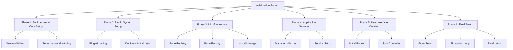

# Initialization System

A comprehensive system responsible for orchestrating the complete initialization process of the Teskooano application, ensuring proper dependency ordering and error handling throughout the startup sequence.

## 🎯 Purpose

The initialization system serves as the central coordinator for application startup, responsible for:

- **System Orchestration**: Orchestrates the initialization of all application systems and components
- **Dependency Management**: Ensures proper dependency ordering throughout the initialization process
- **Error Handling**: Provides comprehensive error handling and recovery mechanisms
- **Plugin Integration**: Integrates with the plugin system for component initialization
- **Resource Management**: Manages application resources and lifecycle during startup

## 📚 Documentation Structure

### Core Components

- [[ManagerInitializer|Manager Initializer]] - Orchestrates manager initialization in correct dependency order
- [[PanelRegistry|Panel Registry]] - Registers panel components from all loaded plugins
- [[PanelFactory|Panel Factory]] - Creates panel constructors for Dockview integration
- [[EventSetup|Event Setup]] - Sets up application-wide event listeners
- [[WasmInitializer|WASM Initializer]] - Initializes WebAssembly libraries for physics

### Manager Classes

- [[ManagerInitializer|Manager Initializer]] - Critical and optional manager initialization
- [[PanelRegistry|Panel Registry]] - Panel registration and error handling
- [[PanelFactory|Panel Factory]] - Panel constructor creation and validation

### Utilities

- [[EventSetup|Event Setup]] - Event system setup and plugin integration
- [[WasmInitializer|WASM Initializer]] - WASM library initialization and management

## 🔄 Quick Navigation

### By Component Type

- **Initialization Orchestrators**: [[ManagerInitializer]], [[PanelRegistry]]
- **Factory Components**: [[PanelFactory]]
- **System Setup**: [[EventSetup]], [[WasmInitializer]]
- **Error Handling**: All components include comprehensive error handling

### By Architecture Pattern

- **Orchestrator Pattern**: [[ManagerInitializer]], [[PanelRegistry]]
- **Factory Pattern**: [[PanelFactory]]
- **Singleton Pattern**: [[WasmInitializer]]
- **Event Bridge Pattern**: [[EventSetup]]

## 🚀 Getting Started

1. Start with [[ManagerInitializer]] to understand manager initialization
2. Explore [[PanelRegistry]] for panel registration system
3. Check out [[PanelFactory]] for panel constructor creation
4. Review [[EventSetup]] for event system integration
5. Examine [[WasmInitializer]] for WASM library initialization

## 🏗️ System Architecture

The initialization system follows a systematic 6-phase initialization pattern:



## 🔧 Core Features

### 1. Systematic Initialization

- **6-Phase Process**: Organized initialization through 6 distinct phases
- **Dependency Management**: Ensures proper dependency ordering
- **Error Isolation**: Isolates errors to prevent cascade failures
- **Progress Tracking**: Tracks initialization progress and timing

### 2. Component Integration

- **Plugin System**: Full integration with the plugin ecosystem
- **Dockview Integration**: Complete integration with Dockview panel system
- **Event System**: Integration with reactive event system
- **State Management**: Integration with core state management

### 3. Error Handling & Recovery

- **Comprehensive Error Handling**: Error handling at every initialization phase
- **Graceful Degradation**: Optional services can fail without blocking startup
- **Error Reporting**: Detailed error reporting and logging
- **Recovery Mechanisms**: Automatic recovery and fallback systems

## 💡 Usage Examples

### Complete Initialization Sequence

```typescript
import {
  ManagerInitializer,
  PanelRegistry,
  EventSetup,
  WasmInitializer,
} from "./initialization";

const initializeApplication = async () => {
  // Phase 1: WASM Initialization
  const wasmInitializer = WasmInitializer.getInstance();
  await wasmInitializer.initialize();

  // Phase 2: Plugin System (handled by TeskooanoApp)

  // Phase 3: UI Infrastructure
  const panelRegistry = new PanelRegistry(pluginManager, dockviewController);
  panelRegistry.registerAllPanels();

  // Phase 4: Application Services
  await ManagerInitializer.initializeManagers(
    pluginManager,
    appElement,
    toolbarElement,
    dockviewController,
  );

  // Phase 5: User Interface (handled by TeskooanoApp)

  // Phase 6: Final Setup
  EventSetup.setupEventListeners(pluginManager, { dockviewController });

  console.log("Application initialization complete");
};
```

### Error Handling and Recovery

```typescript
import {
  ManagerInitializer,
  PanelRegistry,
  EventSetup,
  WasmInitializer,
} from "./initialization";

const initializeWithErrorHandling = async () => {
  try {
    // Initialize WASM
    const wasmInitializer = WasmInitializer.getInstance();
    const wasmSuccess = await wasmInitializer.initialize();

    if (!wasmSuccess) {
      console.warn("WASM initialization failed, using fallback methods");
    }

    // Initialize panels
    const panelRegistry = new PanelRegistry(pluginManager, dockviewController);
    panelRegistry.registerAllPanels();

    // Initialize managers
    await ManagerInitializer.initializeManagers(
      pluginManager,
      appElement,
      toolbarElement,
      dockviewController,
    );

    // Setup events
    EventSetup.setupEventListeners(pluginManager, { dockviewController });

    console.log("Initialization completed successfully");
  } catch (error) {
    console.error("Initialization failed:", error);

    // Attempt recovery or show error UI
    showInitializationError(error.message);
    throw error;
  }
};
```

## ⚡ Performance Considerations

### Efficiency

- **Parallel Initialization**: Components initialize in parallel where dependencies allow
- **Lazy Loading**: Components are initialized only when needed
- **Resource Management**: Proper cleanup prevents memory leaks
- **Error Recovery**: Fast failure detection and recovery mechanisms

### Quality Metrics

- **Reliability**: Comprehensive error handling ensures robust initialization
- **Consistency**: Standardized initialization process across all components
- **Maintainability**: Clear separation of concerns and modular design
- **Scalability**: Plugin-based architecture supports easy extension

### Performance Monitoring

- **Initialization Time**: Tracks total application initialization time
- **Component Performance**: Monitors individual component initialization times
- **Error Rate**: Tracks initialization success/failure rates
- **Resource Usage**: Monitors resource consumption during initialization

## 🔌 Integration Points

### Primary Integration

- **Plugin System**: Complete integration with the plugin ecosystem
- **Dockview System**: Full integration with Dockview panel system
- **Event System**: Integration with reactive event system
- **State Management**: Integration with core state management

### Secondary Integration

- **Error Handling**: Integration with application error handling systems
- **Logging**: Integration with application logging systems
- **Configuration**: Integration with application configuration management
- **Development Tools**: Integration with development and debugging tools

## 🐛 Debug Features

### Validation

- **Configuration Validation**: Validates configurations before initialization
- **Dependency Validation**: Validates dependencies are properly configured
- **Component Validation**: Validates components are properly defined
- **State Validation**: Validates initialization state consistency

### Monitoring

- **Initialization Monitoring**: Tracks initialization progress and timing
- **Error Monitoring**: Comprehensive error logging and reporting
- **Performance Monitoring**: Tracks initialization performance metrics
- **Component Monitoring**: Monitors individual component initialization

### Debugging Tools

- **Initialization Logging**: Detailed logging throughout initialization process
- **Error Tracing**: Full stack traces for debugging initialization issues
- **Component Inspection**: Tools for inspecting component initialization status
- **Performance Profiling**: Tools for profiling initialization performance

## 🔮 Future Enhancements

### Optimization Opportunities

- **Initialization Optimization**: Optimize initialization sequence for better performance
- **Component Loading Optimization**: Implement lazy loading for non-critical components
- **Memory Optimization**: Implement more aggressive memory management
- **Error Recovery Optimization**: Improve error recovery mechanisms

### Potential Improvements

- **Configuration Enhancement**: Add runtime configuration options
- **Component Management**: Add dynamic component loading/unloading
- **Monitoring Enhancement**: Add more detailed performance monitoring
- **User Experience**: Improve error messages and recovery options

## 📚 Architecture Patterns

- **Orchestrator Pattern**: Central orchestration of initialization process
- **Factory Pattern**: Factory pattern for component creation
- **Singleton Pattern**: Singleton pattern for resource management
- **Event Bridge Pattern**: Event bridge pattern for system integration

## Dependencies

### Core Dependencies

- **@teskooano/ui-plugin** - Plugin management framework
- **@teskooano/core-state** - State management system
- **@teskooano/core-physics** - Physics system and WASM libraries

### Development Dependencies

- **typescript** - Type safety and modern JavaScript features
- **vite** - Build tool and development server
- **vitest** - Testing framework with browser support
- **@vitest/browser** - Browser testing capabilities
- **@playwright/test** - End-to-end testing

## 📚 Related Documentation

- [[apps/teskooano/src/core/app/TeskooanoApp|TeskooanoApp Class]] - Main application class
- [[apps/teskooano/src/main|Main Entry Point]] - Application bootstrap system
- [[apps/teskooano/src/config/pluginRegistry|Plugin Registry Configuration]] - Plugin configuration
- [[packages/app/ui-plugin|UI Plugin System]] - Plugin management framework
- [[packages/core/state|Core State Management]] - State management system
