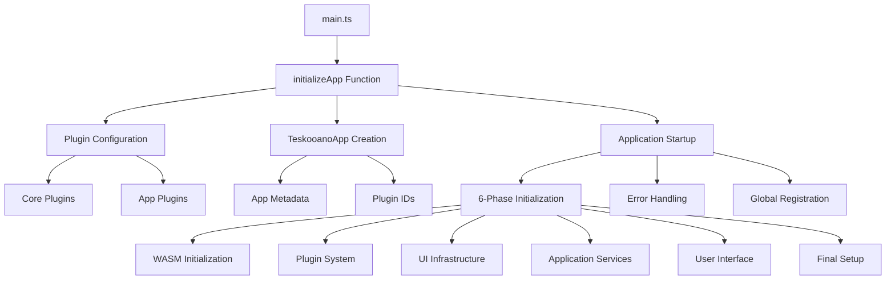
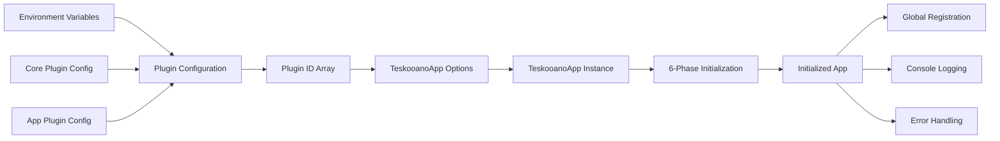

# Teskooano Main Entry Point

The primary application entry point that orchestrates the complete initialization and startup process for the Teskooano space simulation application.

## 🎯 Purpose

The main entry point serves as the application bootstrap system, responsible for:

- **Application Orchestration**: Coordinating the initialization of all core systems and plugins
- **Plugin Management**: Loading and registering the complete plugin ecosystem
- **Error Handling**: Providing comprehensive error handling and recovery mechanisms
- **Global Context**: Establishing the global application context accessible via `window.teskooano`
- **Resource Management**: Managing application lifecycle and cleanup

## 🏗️ Architecture

The main entry point follows a systematic initialization pattern that ensures proper dependency ordering and error recovery:



## 🚀 Core Features

### 1. Application Bootstrap

- **Plugin Discovery**: Automatically discovers and loads both core and application-specific plugins
- **Configuration Management**: Merges plugin configurations from multiple sources
- **Metadata Handling**: Manages application version, git hash, and build information
- **Environment Integration**: Integrates with Vite's build-time environment variables

### 2. Error Handling & Recovery

- **Comprehensive Error Catching**: Catches and handles all initialization errors
- **User-Friendly Error Display**: Shows meaningful error messages to users
- **Developer Debugging**: Provides detailed error traces in console
- **Graceful Degradation**: Attempts cleanup on initialization failure

### 3. Global Context Management

- **Window Registration**: Registers the application instance globally for debugging
- **Plugin Access**: Provides access to the plugin system for external tools
- **State Management**: Establishes the global application state context

## 🔧 Key Methods

### `initializeApp(): Promise<TeskooanoApp>`

**Purpose**: Orchestrates the complete application initialization process with comprehensive error handling.

```typescript
async function initializeApp(): Promise<TeskooanoApp>;
```

**Process:**

1. **Plugin Discovery**: Combines core and application plugin configurations
2. **Application Creation**: Instantiates the TeskooanoApp with metadata and plugin IDs
3. **Startup Execution**: Calls the application's start method
4. **Error Handling**: Catches and processes any initialization errors
5. **Return**: Returns the fully initialized application instance

**Usage:**

```typescript
const app = await initializeApp();
console.log(`Application started: ${app.appName} v${app.version}`);
```

## 🔄 Data Flow

The main entry point follows a systematic data flow for application initialization:



### Processing Pipeline

1. **Configuration**: Combines plugin configurations from core and app sources
2. **Plugin Discovery**: Extracts plugin IDs from configuration objects
3. **App Creation**: Creates TeskooanoApp instance with metadata and plugin IDs
4. **Initialization**: Executes the 6-phase initialization process
5. **Registration**: Registers app globally and logs startup information
6. **Error Recovery**: Handles any initialization failures with cleanup

## 📊 Technical Specifications

### Interface/Type Definitions

```typescript
interface TeskooanoAppOptions {
  pluginIds: string[];
  appName?: string;
  version?: string;
  gitHash?: string;
}

interface PluginRegistryConfig {
  [pluginId: string]: {
    path: string;
  };
}
```

### Configuration Options

```typescript
// Core plugin configuration
const corePluginConfig = {
  // Core system plugins
};

// Application plugin configuration
const pluginConfig: PluginRegistryConfig = {
  "teskooano-external-links": { path: "../plugins/external-links" },
  "teskooano-engine-panel": { path: "../plugins/engine-panel" },
  "teskooano-celestial-hierarchy": { path: "../plugins/celestial-hierarchy" },
  // ... additional plugins
};
```

## 💡 Usage Examples

### Basic Application Startup

```typescript
import { initializeApp } from "./main";

// Start the application
initializeApp()
  .then((app) => {
    console.log(`🛰️ ${app.appName} v${app.version} (${app.gitHash})`);
    // Application is now ready for use
  })
  .catch((error) => {
    console.error("Failed to start application:", error);
  });
```

### Development Environment Integration

```typescript
// Access application instance globally for debugging
const app = window.teskooano;
if (app) {
  console.log("Application instance:", app);
  console.log("Plugin manager:", app.pluginManager);
  console.log("Dockview API:", app.dockviewApi);
}
```

### Error Handling and Recovery

```typescript
initializeApp()
  .then((app) => {
    // Success - application is running
    setupApplicationFeatures(app);
  })
  .catch((error) => {
    // Handle initialization failure
    displayErrorMessage(error);
    attemptRecovery();
  });
```

## ⚡ Performance Considerations

### Efficiency

- **Parallel Plugin Loading**: Core and app plugins are loaded in parallel where possible
- **Lazy Initialization**: Components are initialized only when needed
- **Resource Management**: Proper cleanup prevents memory leaks
- **Error Recovery**: Fast failure detection and recovery mechanisms

### Quality Metrics

- **Reliability**: Comprehensive error handling ensures robust startup
- **Consistency**: Standardized initialization process across environments
- **Maintainability**: Clear separation of concerns and modular design
- **Scalability**: Plugin-based architecture supports easy extension

### Performance Monitoring

- **Startup Time**: Monitors total application initialization time
- **Plugin Load Time**: Tracks individual plugin loading performance
- **Error Rate**: Monitors initialization success/failure rates
- **Memory Usage**: Tracks memory consumption during startup

## 🔌 Integration Points

### Primary Integration

- **Plugin System**: Integrates with the complete plugin ecosystem
- **Core Libraries**: Connects all core Teskooano packages
- **UI Framework**: Integrates with Dockview for panel management
- **State Management**: Establishes global state management context

### Secondary Integration

- **Build System**: Integrates with Vite for development and production builds
- **Environment Variables**: Uses Vite's environment variable system
- **CSS Framework**: Integrates with design system and Dockview styles
- **Development Tools**: Provides global access for debugging and development

## 🐛 Debug Features

### Validation

- **Plugin Validation**: Validates plugin configurations before loading
- **Environment Validation**: Checks for required DOM elements and environment
- **Dependency Validation**: Ensures all required dependencies are available
- **Configuration Validation**: Validates application configuration options

### Monitoring

- **Startup Monitoring**: Tracks initialization progress and timing
- **Error Monitoring**: Comprehensive error logging and reporting
- **Plugin Monitoring**: Monitors plugin loading and registration
- **Performance Monitoring**: Tracks startup performance metrics

### Debugging Tools

- **Global Access**: Application instance available via `window.teskooano`
- **Console Logging**: Detailed logging throughout initialization process
- **Error Tracing**: Full stack traces for debugging initialization issues
- **Plugin Inspection**: Access to plugin manager for debugging plugin issues

## 🔮 Future Enhancements

### Optimization Opportunities

- **Plugin Loading Optimization**: Implement lazy loading for non-critical plugins
- **Startup Time Optimization**: Optimize initialization sequence for faster startup
- **Memory Optimization**: Implement more aggressive memory management during startup
- **Error Recovery Optimization**: Improve error recovery mechanisms

### Potential Improvements

- **Configuration Enhancement**: Add runtime configuration options
- **Plugin Management Enhancement**: Add dynamic plugin loading/unloading
- **Monitoring Enhancement**: Add more detailed performance monitoring
- **User Experience**: Improve error messages and recovery options

## 📚 Architecture Patterns

- **Bootstrap Pattern**: Standard application bootstrap and initialization pattern
- **Plugin Pattern**: Plugin-based architecture for modular functionality
- **Error Recovery Pattern**: Comprehensive error handling and recovery mechanisms
- **Global Context Pattern**: Global application context for debugging and integration

## 📚 Related Documentation

- [[apps/teskooano/src/core/app/TeskooanoApp|TeskooanoApp Class]] - Main application class
- [[apps/teskooano/src/config/pluginRegistry|Plugin Registry Configuration]] - Plugin configuration system
- [[packages/app/ui-plugin|UI Plugin System]] - Plugin management framework
- [[packages/design-system|Design System]] - UI component library
- [[packages/core/state|Core State Management]] - Application state management
