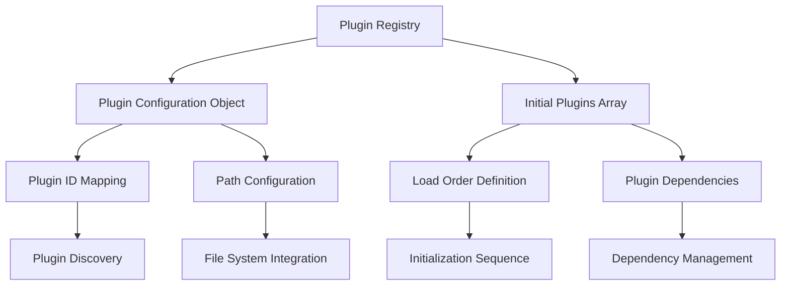
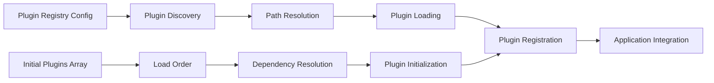

# Plugin Registry Configuration

The central configuration system that defines all available plugins and their initialization order for the Teskooano application.

## 🎯 Purpose

The plugin registry serves as the definitive source of truth for:

- **Plugin Discovery**: Defines all available plugins and their file system paths
- **Initialization Order**: Specifies the order in which plugins should be loaded
- **Plugin Management**: Provides a centralized way to manage plugin configurations
- **Development Integration**: Enables easy addition and removal of plugins during development
- **Build Integration**: Integrates with the build system for plugin loading

## 🏗️ Architecture

The plugin registry follows a simple but effective configuration pattern:



## 🚀 Core Features

### 1. Plugin Configuration Management

- **Path Mapping**: Maps plugin IDs to their file system paths
- **Plugin Discovery**: Enables automatic discovery of available plugins
- **Configuration Validation**: Validates plugin configurations before loading
- **Development Support**: Supports hot-reloading and development workflows

### 2. Initialization Order Control

- **Load Sequence**: Defines the exact order in which plugins are initialized
- **Dependency Management**: Ensures plugins are loaded in dependency order
- **Critical Plugin Priority**: Prioritizes essential plugins for application startup
- **Optional Plugin Support**: Supports optional plugins that can be conditionally loaded

### 3. Plugin Categories

- **Core Plugins**: Essential plugins required for basic application functionality
- **UI Plugins**: Plugins that provide user interface components and panels
- **System Plugins**: Plugins that provide system-level functionality
- **Development Plugins**: Plugins used for development and debugging

## 🔧 Core Methods

### Plugin Configuration Object

**Purpose**: Defines the mapping between plugin IDs and their file system paths.

```typescript
const pluginConfig: PluginRegistryConfig = {
  "plugin-id": { path: "relative/path/to/plugin" },
};
```

**Process:**

1. **Plugin ID Definition**: Each plugin has a unique identifier
2. **Path Mapping**: Maps plugin ID to relative file system path
3. **Configuration Validation**: Validates path exists and is accessible
4. **Plugin Discovery**: Enables automatic plugin discovery and loading

**Usage:**

```typescript
import { pluginConfig } from "./pluginRegistry";

// Access plugin configuration
const enginePanelConfig = pluginConfig["teskooano-engine-panel"];
console.log("Engine panel path:", enginePanelConfig.path);
```

### Initial Plugins Array

**Purpose**: Defines the order in which plugins should be loaded during application initialization.

```typescript
const INITIAL_PLUGINS: (keyof typeof pluginConfig)[] = [
  "teskooano-external-links",
  "teskooano-engine-panel",
  // ... additional plugins in load order
];
```

**Process:**

1. **Load Order Definition**: Specifies the exact sequence for plugin loading
2. **Dependency Resolution**: Ensures dependencies are loaded before dependents
3. **Critical Plugin Priority**: Prioritizes essential plugins for startup
4. **Initialization Sequence**: Controls the order of plugin initialization

**Usage:**

```typescript
import { INITIAL_PLUGINS } from "./pluginRegistry";

// Use initial plugins for application startup
const app = new TeskooanoApp({
  pluginIds: INITIAL_PLUGINS,
});
```

## 🔄 Data Flow

The plugin registry follows a systematic data flow for plugin management:



### Processing Pipeline

1. **Configuration**: Plugin registry defines available plugins and paths
2. **Discovery**: Plugin system discovers plugins using registry configuration
3. **Path Resolution**: Resolves plugin paths relative to application root
4. **Load Order**: Initial plugins array defines initialization sequence
5. **Dependency Resolution**: Ensures proper dependency ordering
6. **Plugin Loading**: Loads plugins in the specified order
7. **Registration**: Registers loaded plugins with the plugin system
8. **Integration**: Integrates plugins with the application

## 📊 Technical Specifications

### Interface/Type Definitions

```typescript
interface PluginRegistryConfig {
  [pluginId: string]: {
    path: string;
  };
}

type InitialPluginId = keyof typeof pluginConfig;
```

### Configuration Structure

```typescript
export const pluginConfig: PluginRegistryConfig = {
  // Core System Plugins
  "teskooano-external-links": {
    path: "../plugins/external-links",
  },

  // UI Panel Plugins
  "teskooano-engine-panel": {
    path: "../plugins/engine-panel",
  },

  // System Control Plugins
  "teskooano-simulation-controls": {
    path: "../plugins/engine-panel/main-toolbar/simulation-controls",
  },

  // Information Display Plugins
  "teskooano-celestial-info": {
    path: "../plugins/celestial-info",
  },
};
```

### Plugin Categories

```typescript
// Core System Plugins
const CORE_PLUGINS = [
  "teskooano-external-links",
  "teskooano-engine-panel",
  "teskooano-engine-settings",
];

// UI Component Plugins
const UI_PLUGINS = [
  "teskooano-celestial-hierarchy",
  "teskooano-celestial-info",
  "teskooano-settings",
];

// System Control Plugins
const CONTROL_PLUGINS = [
  "teskooano-simulation-controls",
  "teskooano-system-controls",
];

// Development Plugins
const DEV_PLUGINS = ["teskooano-debug-panel", "teskooano-plugin-manager"];
```

## 💡 Usage Examples

### Basic Plugin Configuration Access

```typescript
import { pluginConfig, INITIAL_PLUGINS } from "./pluginRegistry";

// Access plugin configuration
const enginePanelPath = pluginConfig["teskooano-engine-panel"].path;
console.log("Engine panel located at:", enginePanelPath);

// Use initial plugins for startup
const app = new TeskooanoApp({
  pluginIds: INITIAL_PLUGINS,
});
```

### Dynamic Plugin Loading

```typescript
import { pluginConfig } from "./pluginRegistry";

// Load specific plugins dynamically
const loadSpecificPlugins = async (pluginIds: string[]) => {
  const pluginPaths = pluginIds.map((id) => pluginConfig[id]?.path);

  for (const [id, path] of Object.entries(pluginPaths)) {
    if (path) {
      await loadPlugin(id, path);
    }
  }
};
```

### Plugin Development Integration

```typescript
import { pluginConfig } from "./pluginRegistry";

// Add new plugin during development
const addNewPlugin = (pluginId: string, pluginPath: string) => {
  pluginConfig[pluginId] = { path: pluginPath };

  // Update initial plugins if needed
  if (!INITIAL_PLUGINS.includes(pluginId)) {
    INITIAL_PLUGINS.push(pluginId);
  }
};

// Example: Add a new plugin
addNewPlugin("teskooano-new-feature", "../plugins/new-feature");
```

### Plugin Validation

```typescript
import { pluginConfig, INITIAL_PLUGINS } from "./pluginRegistry";

// Validate plugin configuration
const validatePluginConfig = () => {
  const errors: string[] = [];

  // Check that all initial plugins have configurations
  INITIAL_PLUGINS.forEach((pluginId) => {
    if (!pluginConfig[pluginId]) {
      errors.push(`Missing configuration for plugin: ${pluginId}`);
    }
  });

  // Check that all configured plugins exist in initial plugins
  Object.keys(pluginConfig).forEach((pluginId) => {
    if (!INITIAL_PLUGINS.includes(pluginId)) {
      console.warn(
        `Plugin ${pluginId} is configured but not in initial plugins`,
      );
    }
  });

  return errors;
};
```

## ⚡ Performance Considerations

### Efficiency

- **Static Configuration**: Plugin configuration is static and loaded once
- **Path Resolution**: Efficient path resolution using relative paths
- **Load Order Optimization**: Optimized plugin loading order for minimal dependencies
- **Memory Management**: Minimal memory footprint for configuration storage

### Quality Metrics

- **Reliability**: Consistent plugin loading and initialization
- **Maintainability**: Easy to add, remove, and modify plugin configurations
- **Scalability**: Supports unlimited number of plugins
- **Performance**: Minimal overhead for plugin discovery and loading

### Performance Monitoring

- **Plugin Load Time**: Tracks individual plugin loading times
- **Configuration Validation**: Monitors configuration validation performance
- **Dependency Resolution**: Tracks dependency resolution performance
- **Memory Usage**: Monitors memory usage for plugin configuration

## 🔌 Integration Points

### Primary Integration

- **Plugin System**: Direct integration with the UI plugin system
- **Application Bootstrap**: Integration with main application initialization
- **Build System**: Integration with Vite build system for plugin loading
- **Development Tools**: Integration with development and debugging tools

### Secondary Integration

- **File System**: Integration with file system for plugin path resolution
- **Module System**: Integration with ES modules for plugin loading
- **Configuration Management**: Integration with application configuration
- **Error Handling**: Integration with error handling and recovery systems

## 🐛 Debug Features

### Validation

- **Configuration Validation**: Validates plugin configuration structure
- **Path Validation**: Validates plugin paths exist and are accessible
- **Dependency Validation**: Validates plugin dependencies are properly configured
- **Load Order Validation**: Validates plugin load order is correct

### Monitoring

- **Plugin Discovery**: Monitors plugin discovery and loading
- **Configuration Loading**: Tracks configuration loading performance
- **Dependency Resolution**: Monitors dependency resolution process
- **Error Tracking**: Tracks configuration and loading errors

### Debugging Tools

- **Configuration Inspection**: Access to complete plugin configuration
- **Load Order Inspection**: Access to plugin load order
- **Path Resolution**: Tools for debugging path resolution issues
- **Plugin Status**: Tools for checking plugin loading status

## 🔮 Future Enhancements

### Optimization Opportunities

- **Configuration Caching**: Implement configuration caching for faster loading
- **Dynamic Configuration**: Add support for dynamic plugin configuration
- **Plugin Dependencies**: Implement automatic dependency resolution
- **Load Optimization**: Optimize plugin loading for better performance

### Potential Improvements

- **Configuration Validation**: Add runtime configuration validation
- **Plugin Management**: Add dynamic plugin management capabilities
- **Development Tools**: Add better development and debugging tools
- **Documentation**: Add automatic plugin documentation generation

## 📚 Architecture Patterns

- **Registry Pattern**: Central registry for plugin configuration and management
- **Configuration Pattern**: Static configuration pattern for plugin definitions
- **Dependency Pattern**: Dependency management pattern for plugin loading
- **Discovery Pattern**: Plugin discovery pattern for automatic plugin loading

## 📚 Related Documentation

- [[apps/teskooano/src/main|Main Entry Point]] - Application bootstrap system
- [[apps/teskooano/src/core/app/TeskooanoApp|TeskooanoApp Class]] - Main application class
- [[packages/app/ui-plugin|UI Plugin System]] - Plugin management framework
- [[apps/teskooano/src/plugins|Plugin Directory]] - Available plugins
- [[apps/teskooano/src/core/initialization|Initialization System]] - Plugin initialization
