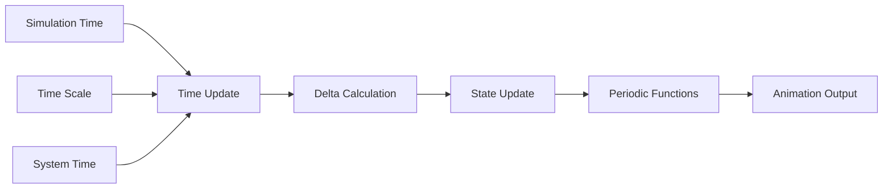

# TimeManager

Centralized time tracking and animation utilities for celestial renderers, providing simulation time management, delta time calculations, and periodic timing functions.

## 🎯 Purpose

The `TimeManager` provides comprehensive time management for celestial renderers:

- **Time Tracking**: Centralized time tracking for simulation and animation
- **Delta Time**: Accurate delta time calculations for smooth animations
- **Periodic Functions**: Utility functions for periodic animations and effects
- **Simulation Integration**: Integration with simulation time and time scale
- **Performance Optimization**: Efficient time calculations and caching

## 🏗️ Architecture

### Time State Management

Maintains internal time state including start time, elapsed time, and last simulation time for accurate calculations.

### Periodic Function Support

Provides utility functions for common periodic animations including sawtooth, triangle, and smooth step functions.

### Delta Time Calculation

Implements accurate delta time calculation for smooth animations regardless of frame rate.

## 🔧 Core Methods

### Time Tracking

```typescript
// Update time with simulation time and scale
update(simulationTime: number, timeScale: number = 1): void;

// Get elapsed time since manager creation
getElapsedTime(): number;

// Get start time of manager
getStartTime(): number;

// Get delta time between updates
getDeltaTime(currentSimulationTime: number, timeScale: number = 1): number;

// Get last simulation time
getLastSimulationTime(): number;
```

### Time Utilities

```typescript
// Reset time manager with new start time
reset(newStartTime?: number): void;

// Check if time interval has passed
hasIntervalPassed(interval: number): boolean;

// Get current system time
static getCurrentTime(): number;

// Convert milliseconds to seconds
static millisecondsToSeconds(milliseconds: number): number;

// Convert seconds to milliseconds
static secondsToMilliseconds(seconds: number): number;
```

### Periodic Functions

```typescript
// Get normalized time for periodic animations
getNormalizedTime(period: number, offset: number = 0): number;

// Get sawtooth wave time
getSawtoothTime(period: number, offset: number = 0): number;

// Get triangle wave time
getTriangleTime(period: number, offset: number = 0): number;

// Get smooth step time
getSmoothStepTime(period: number, offset: number = 0): number;
```

## 🔄 Data Flow

The TimeManager follows a systematic data flow:



### Processing Pipeline

1. **Time Input**: Receives simulation time and time scale
2. **Delta Calculation**: Calculates delta time between updates
3. **State Update**: Updates internal time state
4. **Periodic Functions**: Provides periodic timing functions
5. **Animation Output**: Outputs timing data for animations

## 📊 Technical Specifications

### Time State

```typescript
class TimeManager {
  private startTime: number; // Manager creation time
  private elapsedTime: number; // Elapsed time since creation
  private lastSimulationTime: number; // Last simulation time
}
```

### Periodic Function Formulas

```typescript
// Normalized time (0 to 1)
getNormalizedTime(period: number, offset: number = 0): number {
  return ((this.elapsedTime + offset) % period) / period;
}

// Sawtooth wave (0 to 1, then reset)
getSawtoothTime(period: number, offset: number = 0): number {
  return ((this.elapsedTime + offset) % period) / period;
}

// Triangle wave (-1 to 1)
getTriangleTime(period: number, offset: number = 0): number {
  const t = this.getNormalizedTime(period, offset);
  return t < 0.5 ? 4 * t - 1 : 3 - 4 * t;
}

// Smooth step (0 to 1 with smooth transitions)
getSmoothStepTime(period: number, offset: number = 0): number {
  const t = this.getNormalizedTime(period, offset);
  return t * t * (3 - 2 * t);
}
```

## 💡 Usage Examples

### Basic Usage

```typescript
import { TimeManager } from "@teskooano/renderer-threejs-celestial";

// Create time manager
const timeManager = new TimeManager();

// Update with simulation time
timeManager.update(simulationTime, timeScale);

// Get elapsed time
const elapsed = timeManager.getElapsedTime();
console.log("Elapsed time:", elapsed);

// Get delta time
const deltaTime = timeManager.getDeltaTime(currentTime, timeScale);
console.log("Delta time:", deltaTime);
```

### Periodic Animations

```typescript
// Create time manager
const timeManager = new TimeManager();

// Update time
timeManager.update(simulationTime, timeScale);

// Use periodic functions for animations
const rotationSpeed = 0.5; // radians per second
const rotationTime = timeManager.getNormalizedTime(
  (2 * Math.PI) / rotationSpeed,
);
const rotation = rotationTime * 2 * Math.PI;

// Apply rotation to object
object.rotation.y = rotation;

// Use sawtooth for pulsing effect
const pulseTime = timeManager.getSawtoothTime(2.0); // 2 second pulse
const pulseIntensity = 0.5 + 0.5 * pulseTime;

// Use triangle wave for oscillation
const oscillationTime = timeManager.getTriangleTime(1.0); // 1 second oscillation
const oscillation = oscillationTime * 0.1; // ±0.1 units

// Use smooth step for smooth transitions
const transitionTime = timeManager.getSmoothStepTime(3.0); // 3 second transition
const transitionValue = transitionTime * 100; // 0 to 100
```

### Advanced Usage

```typescript
// Check if interval has passed
if (timeManager.hasIntervalPassed(1.0)) {
  // 1 second interval
  console.log("One second has passed");
}

// Reset time manager
timeManager.reset(Date.now() / 1000);

// Get time statistics
const startTime = timeManager.getStartTime();
const elapsedTime = timeManager.getElapsedTime();
const lastSimulationTime = timeManager.getLastSimulationTime();

console.log("Time stats:", {
  startTime,
  elapsedTime,
  lastSimulationTime,
});

// Use static utility functions
const currentTime = TimeManager.getCurrentTime();
const seconds = TimeManager.millisecondsToSeconds(1500); // 1.5 seconds
const milliseconds = TimeManager.secondsToMilliseconds(2.5); // 2500 ms
```

### Integration with BaseCelestialRenderer

```typescript
class MyCelestialRenderer extends BaseCelestialRenderer {
  constructor(object: RenderableCelestialObject) {
    super(object);

    // Time manager is automatically available
    this.setupAnimations();
  }

  private setupAnimations(): void {
    // Setup periodic animations
    this.rotationPeriod = 10.0; // 10 second rotation
    this.pulsePeriod = 2.0; // 2 second pulse
  }

  update(
    object: RenderableCelestialObject,
    time: number,
    timeScale: number,
  ): void {
    // Call parent update
    super.update(object, time, timeScale);

    // Update animations using time manager
    this.updateAnimations();
  }

  private updateAnimations(): void {
    // Rotation animation
    const rotationTime = this.timeManager.getNormalizedTime(
      this.rotationPeriod,
    );
    this.mesh.rotation.y = rotationTime * 2 * Math.PI;

    // Pulse animation
    const pulseTime = this.timeManager.getSawtoothTime(this.pulsePeriod);
    const pulseScale = 1.0 + 0.1 * pulseTime;
    this.mesh.scale.setScalar(pulseScale);
  }
}
```

## ⚡ Performance Considerations

### Efficiency

- **Cached Calculations**: Time calculations cached for performance
- **Efficient Updates**: Minimal overhead for time updates
- **Static Utilities**: Static methods for common conversions
- **Memory Management**: Minimal memory footprint

### Quality Metrics

- **Accuracy**: Precise time calculations for smooth animations
- **Consistency**: Consistent timing across different frame rates
- **Reliability**: Robust time tracking and calculations
- **Performance**: Minimal performance impact

### Performance Monitoring

- **Update Frequency**: Monitor time update frequency
- **Calculation Overhead**: Track time calculation performance
- **Memory Usage**: Monitor time manager memory usage
- **Animation Smoothness**: Measure animation smoothness

## 🔌 Integration Points

### Primary Integration

- **BaseCelestialRenderer**: Automatic time management for all renderers
- **Simulation System**: Integration with simulation time and scale
- **Animation System**: Provides timing for animations

### Secondary Integration

- **Performance Monitoring**: Integration with performance monitoring
- **State Management**: Integration with state management systems
- **Camera System**: Integration with camera animation systems

## 🐛 Debug Features

### Validation

- **Time Validation**: Validates time values and calculations
- **Interval Validation**: Validates interval calculations
- **Periodic Function Validation**: Validates periodic function outputs
- **State Validation**: Validates time state consistency

### Monitoring

- **Time Statistics**: Tracks time statistics and metrics
- **Update Frequency**: Monitors time update frequency
- **Calculation Performance**: Monitors time calculation performance
- **Animation Timing**: Tracks animation timing accuracy

### Debugging Tools

- **Time Information**: Get detailed time information
- **Performance Stats**: Get performance statistics
- **State Debugging**: Debug time state issues
- **Timing Validation**: Validate timing calculations

## 🔮 Future Enhancements

### Optimization Opportunities

- **Time Caching**: Cache time calculations for better performance
- **Batch Updates**: Batch time updates for multiple objects
- **Predictive Timing**: Predict timing needs for better performance
- **Memory Optimization**: Optimize time manager memory usage

### Potential Improvements

- **Advanced Periodic Functions**: More sophisticated periodic functions
- **Time Interpolation**: Smooth time interpolation for better animations
- **Multi-threaded Updates**: Parallel time updates for better performance
- **Time Synchronization**: Synchronize time across multiple managers

## 📚 Architecture Patterns

- **Manager Pattern**: Centralized time management
- **State Pattern**: Time state management
- **Utility Pattern**: Static utility functions
- **Observer Pattern**: Integration with state management

## 📚 Related Documentation

- [[BaseCelestialRenderer]] - Uses this manager for time management
- [[CelestialRenderer Interface]] - Defines time management contract
- [[Animation System]] - Animation timing and management
- [[Performance Optimization]] - Time management performance considerations

---

_The TimeManager provides comprehensive time tracking and animation utilities with efficient calculations, periodic functions, and seamless integration with simulation systems for smooth, accurate animations._
