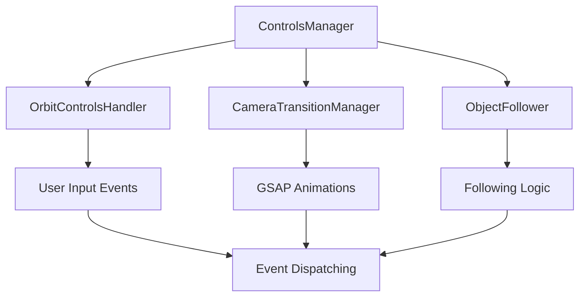

# ControlsManager

Main orchestrator for all camera control functionality, providing a unified interface for user input handling, animated transitions, and object following capabilities.

## 🎯 Purpose

The `ControlsManager` serves as the central coordinator for all camera control operations in the Teskooano Three.js scene. It composes specialized handlers to provide a comprehensive camera control system that handles user interactions, programmatic transitions, and object following while maintaining clean separation of concerns.

## 🏗️ Architecture

The ControlsManager follows a composition pattern where it orchestrates specialized handlers:



## 🚀 Core Features

### 1. User Input Orchestration

- **Input Delegation**: Delegates user input to OrbitControlsHandler
- **Event Coordination**: Coordinates events between different handlers
- **State Synchronization**: Maintains consistent state across all handlers
- **Input Validation**: Validates and processes user input appropriately

### 2. Transition Management

- **Programmatic Transitions**: Runs smooth transitions via CameraTransitionManager
- **Multi-Stage Transitions**: Supports single target, position+target, and look-at-first transitions
- **Transition Coordination**: Prevents conflicts between different transition types
- **Progress Tracking**: Monitors transition progress and completion

### 3. Object Following

- **Follow Behavior**: Maintains camera following behavior for moving objects
- **Offset Synchronization**: Synchronizes camera offsets after manual interaction
- **Following Coordination**: Coordinates following with transitions and user input
- **State Management**: Manages following state and transitions

### 4. Event System

- **Event Broadcasting**: Broadcasts camera state changes to the application
- **Event Coordination**: Coordinates events between different handlers
- **Custom Events**: Emits custom events for user interaction and transition completion
- **Event Cleanup**: Proper event listener cleanup and disposal

## 🔧 Key Methods

### `transitionTargetTo(target, withTransition, options)`

Smoothly transitions only the camera's target point while maintaining the current camera position.

**Process:**

1. **Validation**: Validates target position and transition parameters
2. **Handler Delegation**: Delegates to CameraTransitionManager for smooth animation
3. **State Update**: Updates camera target position
4. **Event Dispatch**: Dispatches completion events when finished

**Usage:**

```typescript
controlsManager.transitionTargetTo(new OSVector3(100, 50, 200));
```

### `moveToPosition(position, target, withTransition, options)`

Moves the camera to a new position and target with optional smooth transition.

**Process:**

1. **Position Validation**: Validates both position and target parameters
2. **Transition Planning**: Plans smooth transition if enabled
3. **Animation Execution**: Executes GSAP-based animation
4. **State Synchronization**: Synchronizes final state with all handlers

**Usage:**

```typescript
controlsManager.moveToPosition(
  new OSVector3(200, 100, 300),
  new OSVector3(0, 0, 0),
  true,
);
```

### `update(delta)`

Updates all control-related handlers in the correct order.

**Process:**

1. **Following Update**: Updates ObjectFollower for moving object tracking
2. **Controls Update**: Updates OrbitControlsHandler for user input processing
3. **Animation Update**: GSAP animations update themselves via callbacks
4. **State Synchronization**: Ensures all handlers are synchronized

**Usage:**

```typescript
// Called every frame in render loop
controlsManager.update(deltaTime);
```

## ⚡ Performance Considerations

### Efficiency

- **Handler Composition**: Efficient delegation to specialized handlers
- **Event Coordination**: Optimized event handling and coordination
- **State Management**: Efficient state synchronization across handlers
- **Resource Sharing**: Shared resources between handlers to minimize overhead

### Quality Metrics

- **Smooth Interactions**: 60 FPS user interactions with proper damping
- **Reliable Transitions**: Consistent, smooth animated transitions
- **Precise Following**: Accurate object tracking with minimal lag
- **Event Responsiveness**: Fast event processing and broadcasting

### Performance Monitoring

- **Update Order**: Optimized update order (follower → controls → animations)
- **Event Processing**: Efficient event handling and coordination
- **Memory Usage**: Proper resource management and cleanup
- **Animation Performance**: Smooth GSAP animation integration

## 🔌 Integration Points

### Primary Integration

- **Three.js**: Direct integration with Three.js camera and controls
- **GSAP**: Animation library integration for smooth transitions
- **Core State**: Integration with state management for object tracking
- **Event System**: Custom event system for application communication

### Secondary Integration

- **Data Types**: Uses shared interfaces and type definitions
- **Core Math**: OSVector3 integration for precise calculations
- **Renderer Core**: Integration with renderer events and timing
- **Notifications**: Progress notification system integration

## 🐛 Debug Features

### Validation

- **Input Validation**: Validates user input and camera parameters
- **State Validation**: Ensures control state consistency across handlers
- **Transition Validation**: Validates transition parameters and timing
- **Following Validation**: Validates object following state and offsets

### Monitoring

- **Performance Monitoring**: Tracks interaction and animation performance
- **Event Monitoring**: Monitors event handling and coordination
- **State Monitoring**: Tracks control state changes and updates
- **Handler Monitoring**: Monitors individual handler performance

### Debugging Tools

- **Debug Mode**: Placeholder for advanced debug controls
- **Event Logging**: Comprehensive event logging for troubleshooting
- **State Inspection**: Access to control state for debugging
- **Handler Inspection**: Individual handler state inspection

## 🔮 Future Enhancements

### Optimization Opportunities

- **Performance Optimization**: Further animation and interaction optimizations
- **Memory Optimization**: Advanced memory management and pooling strategies
- **Code Optimization**: Additional algorithmic improvements for control coordination
- **Architecture Optimization**: Enhanced modular architecture and handler design

### Potential Improvements

- **Advanced Controls**: Support for additional control types (fly controls, etc.)
- **Gesture Recognition**: Enhanced touch and gesture support
- **Multi-Camera Support**: Support for multiple camera instances
- **Advanced Following**: Enhanced object following with predictive algorithms

## 📚 Architecture Patterns

- **Composition Pattern**: Composes specialized handlers for different control aspects
- **Orchestrator Pattern**: Orchestrates complex interactions between handlers
- **Event-Driven Pattern**: Event-based communication between components
- **Resource Management Pattern**: Proper lifecycle management of all resources
- **Strategy Pattern**: Configurable control behaviors and transitions

## 📚 Related Documentation

- [[OrbitControlsHandler]] - User input handling and OrbitControls management
- [[CameraTransitionManager]] - GSAP-based animated transitions
- [[ObjectFollower]] - Camera following logic for moving objects
- [[threejs-camera]] - High-level camera management system
- [[threejs-core]] - Core renderer events and utilities
