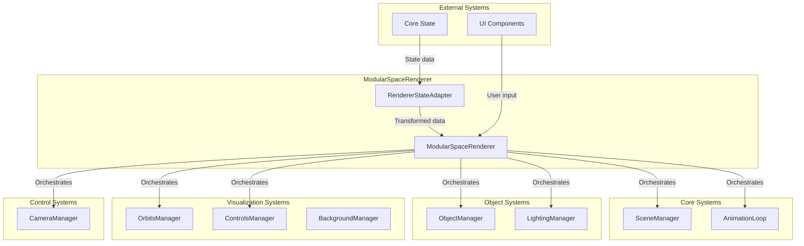

# Modular Space Renderer

The main orchestrator component that coordinates all renderer systems in the Teskooano space simulation.

## 🎯 Purpose

The Modular Space Renderer serves as the central hub that:

- **Orchestrates All Systems**: Coordinates between all renderer packages
- **Manages State Integration**: Bridges core state with rendering systems
- **Provides Public API**: Clean interface for external systems to control rendering
- **Handles Lifecycle**: Manages initialization, updates, and cleanup of all renderer components

## 🏗️ Core Architecture

### Main Components

**ModularSpaceRenderer**
The primary orchestrator class that manages all renderer systems.

**Key Responsibilities:**

- **System Coordination**: Manages all renderer managers and systems
- **State Integration**: Integrates with core state through RendererStateAdapter
- **Public API**: Provides clean interface for external control
- **Lifecycle Management**: Handles initialization, updates, and disposal

**Key Methods:**

```typescript
class ModularSpaceRenderer {
  constructor(options: RendererOptions);

  // Lifecycle
  initialize(): Promise<void>;
  start(): void;
  stop(): void;
  dispose(): void;

  // Public API
  setCameraPosition(position: THREE.Vector3): void;
  setCameraTarget(target: THREE.Vector3): void;
  setTimeScale(timeScale: number): void;
  setPhysicsEngine(engine: PhysicsEngine): void;

  // System access
  get sceneManager(): SceneManager;
  get objectManager(): ObjectManager;
  get orbitsManager(): OrbitsManager;
  get lightingManager(): LightingManager;
  get css2DManager(): CSS2DManager;
}
```

### RendererStateAdapter

Bridges the gap between core state and renderer systems.

**Key Responsibilities:**

- **State Synchronization**: Keeps renderer systems synchronized with core state
- **Data Transformation**: Converts core state data to renderer-friendly formats
- **Event Broadcasting**: Broadcasts state changes to renderer systems
- **Light Source Calculation**: Calculates light source relationships

**Key Methods:**

```typescript
class RendererStateAdapter {
  // State observables
  readonly $renderableObjects: Observable<RenderableCelestialObject[]>;
  readonly $visualSettings: Observable<VisualSettings>;
  readonly $cameraState: Observable<CameraState>;

  // Light source management
  calculateLightSourceMaps(): LightSourceMap;

  // State updates
  updateFromCoreState(): void;
}
```

## 🔄 System Integration

### Component Hierarchy



### Data Flow

**Initialization Flow:**

1. **Core State**: Provides initial celestial object data
2. **RendererStateAdapter**: Transforms data and calculates light sources
3. **ModularSpaceRenderer**: Initializes all manager systems
4. **Managers**: Create renderers, lights, and visualizations
5. **AnimationLoop**: Starts the render cycle

**Update Flow:**

1. **Core State**: Updates object positions and properties
2. **RendererStateAdapter**: Broadcasts changes to renderer systems
3. **Managers**: Update their respective renderers and visualizations
4. **AnimationLoop**: Drives the render cycle with callbacks
5. **SceneManager**: Renders the final scene

## 🎨 System Coordination

### Manager Orchestration

The ModularSpaceRenderer coordinates between different manager systems:

**ObjectManager Integration:**

- Creates and manages celestial object renderers
- Coordinates with LightingManager for light source creation
- Provides object data to OrbitsManager and CSS2DManager

**LightingManager Integration:**

- Receives light source data from ObjectManager
- Provides light queries to celestial renderers
- Manages dynamic lighting for multi-star systems

**OrbitsManager Integration:**

- Receives object data for orbital visualization
- Switches between Ideal and N-Body visualization modes
- Coordinates with physics engine changes

**CSS2DManager Integration:**

- Receives object data for label positioning
- Manages label occlusion and visibility
- Coordinates with camera for distance-based visibility

### State Synchronization

The RendererStateAdapter ensures all systems stay synchronized:

**Object Synchronization:**

- Tracks object creation, updates, and destruction
- Broadcasts changes to all dependent systems
- Maintains renderer lifecycle consistency

**Settings Synchronization:**

- Manages visual settings (physics engine, quality, etc.)
- Broadcasts setting changes to affected systems
- Ensures consistent state across all renderers

**Camera Synchronization:**

- Tracks camera position and orientation changes
- Updates dependent systems (labels, LOD, etc.)
- Manages camera controls and constraints

## 🚀 Usage Example

```typescript
// Create renderer
const renderer = new ModularSpaceRenderer({
  width: 1920,
  height: 1080,
  pixelRatio: window.devicePixelRatio,
  shadows: true,
  hdr: true,
});

// Initialize
await renderer.initialize();

// Start rendering
renderer.start();

// Control camera
renderer.setCameraPosition(new THREE.Vector3(0, 0, 10));
renderer.setCameraTarget(new THREE.Vector3(0, 0, 0));

// Change physics engine
renderer.setPhysicsEngine(PhysicsEngine.N_BODY);

// Control time
renderer.setTimeScale(2.0);

// Access systems
const sceneManager = renderer.sceneManager;
const objectManager = renderer.objectManager;
const orbitsManager = renderer.orbitsManager;
```

## 🔗 Related Components

- [[threejs-core]] - Provides SceneManager and AnimationLoop
- [[threejs-objects]] - ObjectManager for celestial object rendering
- [[threejs-lighting]] - LightingManager for dynamic lighting
- [[threejs-orbits]] - OrbitsManager for trajectory visualization
- [[threejs-labels]] - CSS2DManager for 2D label rendering
- [[threejs-camera]] - CameraManager for camera control
- [[threejs-controls]] - ControlsManager for user interaction

## 📚 Architecture Patterns

- **Orchestrator Pattern**: ModularSpaceRenderer coordinates all systems
- **Adapter Pattern**: RendererStateAdapter bridges core state and renderers
- **Manager Pattern**: Each system has its own manager for coordination
- **Observer Pattern**: State changes are broadcast to dependent systems
- **Facade Pattern**: Provides simplified interface to complex subsystem

## 🎯 Performance Considerations

### System Coordination

- **Efficient Updates**: Only update systems that need updates
- **Batch Operations**: Group related operations for efficiency
- **Lazy Initialization**: Initialize systems only when needed
- **Memory Management**: Proper disposal of all systems

### State Synchronization

- **Change Detection**: Only broadcast actual state changes
- **Debounced Updates**: Prevent excessive update cycles
- **Selective Broadcasting**: Target updates to relevant systems
- **Caching**: Cache frequently accessed state data

### Render Loop Optimization

- **Callback Management**: Efficient callback registration and execution
- **Update Prioritization**: Prioritize critical updates over cosmetic ones
- **Frame Budgeting**: Ensure updates fit within frame budget
- **Performance Monitoring**: Track performance metrics across all systems

## 🔍 Debug Features

### System Monitoring

- **Manager Status**: Track status of all manager systems
- **Performance Metrics**: Monitor performance across all systems
- **State Consistency**: Verify state consistency across systems
- **Memory Usage**: Track memory usage of all components

### Visualization Debug

- **System Hierarchy**: Visualize system relationships
- **Data Flow**: Show data flow between systems
- **Update Frequency**: Monitor update frequency of each system
- **Error Tracking**: Track and display system errors

---

_The Modular Space Renderer is the central nervous system that brings all the individual renderer components together into a cohesive, high-performance space simulation._
