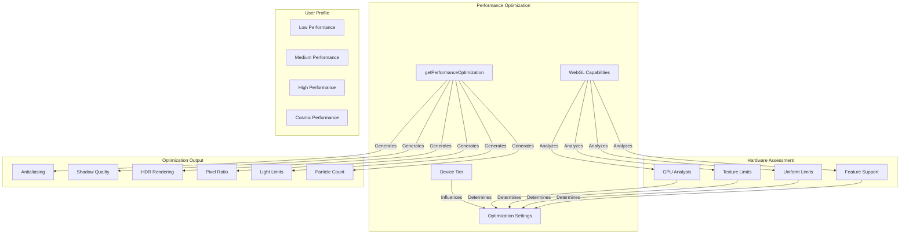

---
aliases:
  [
    PerformanceOptimization,
    performance-optimization,
    device-optimization,
    getPerformanceOptimization,
  ]
tags: [renderer, threejs, core, performance, optimization, device, capabilities]
type: Function
package: "@teskooano/renderer-threejs-core"
name: getPerformanceOptimization
dependencies: ["@teskooano/data-types", "three"]
classes: ["THREE.WebGLCapabilities"]
functions: ["getPerformanceOptimization"]
constants: []
types: ["DeviceTier", "PerformanceOptimization"]
status: active
---

# Performance Optimization

Determines optimal performance settings based on WebGL capabilities and user device tier, providing intelligent performance scaling for different hardware configurations.

## 🎯 Purpose

The Performance Optimization system provides:

- **Device Capability Detection**: Analyzes WebGL capabilities to determine hardware tier
- **Intelligent Scaling**: Adjusts rendering settings based on device capabilities
- **User Profile Integration**: Incorporates user performance preferences
- **Dynamic Optimization**: Provides real-time performance optimization recommendations
- **Hardware-Aware Settings**: Optimizes for GPU capabilities and limitations

## 🏗️ Architecture

The performance optimization follows a capability-based assessment pattern:



### Core Function

```typescript
function getPerformanceOptimization(
  capabilities: THREE.WebGLCapabilities,
  userProfile: DeviceTier,
): PerformanceOptimization;
```

## 🚀 Core Features

### Hardware Tier Detection

- **High-End GPU**: Advanced capabilities with maximum quality settings
- **Mid-Range GPU**: Balanced performance with moderate quality settings
- **Low-End GPU**: Conservative settings with aggressive optimization
- **Capability Analysis**: Evaluates texture limits, uniform capacity, and feature support

### User Profile Integration

- **Low Performance**: Aggressive optimization (0.5x multiplier)
- **Medium Performance**: Balanced optimization (0.8x multiplier)
- **High Performance**: Enhanced quality (1.2x multiplier)
- **Cosmic Performance**: Maximum quality (2.0x multiplier)

### Dynamic Setting Optimization

- **Antialiasing**: Enabled based on GPU capabilities and user profile
- **Shadow Quality**: PCFSoftShadowMap for high-end, BasicShadowMap for others
- **HDR Rendering**: Enabled for capable devices and high-performance profiles
- **Pixel Ratio**: Optimized based on device capabilities and user preferences

## 🔧 Core Methods

### getPerformanceOptimization()

Determines optimal performance settings based on WebGL capabilities and user profile.

```typescript
export function getPerformanceOptimization(
  capabilities: THREE.WebGLCapabilities,
  userProfile: DeviceTier,
): PerformanceOptimization;
```

**Parameters:**

- `capabilities` - WebGL capabilities from the renderer
- `userProfile` - User's performance preference tier

**Returns**: `PerformanceOptimization` - Optimized settings object

**Process:**

1. **Hardware Assessment**: Analyzes GPU capabilities and determines tier
2. **Profile Application**: Applies user profile multipliers
3. **Setting Calculation**: Calculates optimal settings for each feature
4. **Limitation Application**: Applies hardware limitations and constraints

### Hardware Tier Detection

#### High-End GPU Criteria

```typescript
const isHighEndGPU =
  capabilities.maxTextures >= 16 &&
  capabilities.maxTextureSize >= 8192 &&
  capabilities.maxFragmentUniforms >= 1024;
```

#### Mid-Range GPU Criteria

```typescript
const isMidRangeGPU =
  capabilities.maxTextures >= 8 &&
  capabilities.maxTextureSize >= 4096 &&
  capabilities.maxFragmentUniforms >= 512;
```

#### Low-End GPU

```typescript
const isLowEndGPU = !isHighEndGPU && !isMidRangeGPU;
```

## 🔄 Optimization Flow

### Capability Analysis

1. **Texture Analysis**: Evaluates maximum texture count and size
2. **Uniform Analysis**: Assesses fragment uniform capacity
3. **Feature Detection**: Checks for advanced WebGL features
4. **Performance Estimation**: Estimates GPU performance tier

### Profile Application

1. **Multiplier Selection**: Chooses appropriate multiplier based on user profile
2. **Quality Adjustment**: Adjusts quality settings based on profile
3. **Performance Balance**: Balances quality vs performance based on preferences

### Setting Generation

1. **Antialiasing**: Determines if antialiasing should be enabled
2. **Shadows**: Selects appropriate shadow map type and quality
3. **HDR**: Enables HDR rendering for capable devices
4. **Pixel Ratio**: Calculates optimal pixel ratio
5. **Resource Limits**: Sets limits for lights, shadows, and particles

## 📊 Technical Specifications

### PerformanceOptimization Interface

```typescript
interface PerformanceOptimization {
  /** Enable/disable antialiasing */
  antialias: boolean;
  /** Enable/disable shadow rendering */
  shadows: boolean;
  /** Enable/disable HDR rendering */
  hdr: boolean;
  /** Optimized pixel ratio */
  pixelRatio: number;
  /** Shadow map quality type */
  shadowMapType: THREE.ShadowMapType;
  /** Maximum number of lights */
  maxLights: number;
  /** Maximum number of shadow casters */
  maxShadowCasters: number;
  /** LOD distance multiplier */
  lodDistanceMultiplier: number;
  /** Trail quality setting */
  trailQuality: "low" | "medium" | "high";
  /** Particle count multiplier */
  particleCountMultiplier: number;
}
```

### Device Tier Types

```typescript
type DeviceTier = "low" | "medium" | "high" | "cosmic";
```

### Profile Multipliers

```typescript
const profileMultipliers = {
  low: 0.5, // Aggressive optimization
  medium: 0.8, // Balanced optimization
  high: 1.2, // Enhanced quality
  cosmic: 2.0, // Maximum quality
};
```

## 💡 Usage Examples

### Basic Usage

```typescript
import { getPerformanceOptimization } from "@teskooano/renderer-threejs-core";

// Get WebGL capabilities from renderer
const capabilities = renderer.capabilities;

// Get user profile from state or settings
const userProfile = "high"; // or "low", "medium", "cosmic"

// Calculate optimal settings
const optimization = getPerformanceOptimization(capabilities, userProfile);

// Apply settings to renderer
renderer.antialias = optimization.antialias;
renderer.shadowMap.enabled = optimization.shadows;
renderer.shadowMap.type = optimization.shadowMapType;
renderer.toneMapping = optimization.hdr
  ? THREE.ACESFilmicToneMapping
  : THREE.NoToneMapping;
renderer.setPixelRatio(optimization.pixelRatio);
```

### SceneManager Integration

```typescript
// In SceneManager constructor
const capabilities = this.renderer.capabilities;
const userProfile = this.getUserProfile(); // From state or settings
const optimization = getPerformanceOptimization(capabilities, userProfile);

// Apply optimization settings
this.renderer.antialias = optimization.antialias;
this.renderer.shadowMap.enabled = optimization.shadows;
this.renderer.shadowMap.type = optimization.shadowMapType;
this.renderer.toneMapping = optimization.hdr
  ? THREE.ACESFilmicToneMapping
  : THREE.NoToneMapping;
this.renderer.setPixelRatio(optimization.pixelRatio);

// Store optimization for later use
this.performanceOptimization = optimization;
```

### Dynamic Profile Changes

```typescript
// Subscribe to profile changes
stateManager.performanceProfile$.subscribe((newProfile) => {
  const capabilities = renderer.capabilities;
  const optimization = getPerformanceOptimization(capabilities, newProfile);

  // Apply new settings
  renderer.antialias = optimization.antialias;
  renderer.shadowMap.enabled = optimization.shadows;
  renderer.shadowMap.type = optimization.shadowMapType;
  renderer.toneMapping = optimization.hdr
    ? THREE.ACESFilmicToneMapping
    : THREE.NoToneMapping;
  renderer.setPixelRatio(optimization.pixelRatio);

  // Update other systems
  lightingManager.setMaxLights(optimization.maxLights);
  particleManager.setCountMultiplier(optimization.particleCountMultiplier);
});
```

### Hardware-Specific Optimization

```typescript
// Analyze specific hardware capabilities
function analyzeHardwareCapabilities(capabilities: THREE.WebGLCapabilities) {
  const analysis = {
    gpuTier: "unknown",
    maxTextures: capabilities.maxTextures,
    maxTextureSize: capabilities.maxTextureSize,
    maxFragmentUniforms: capabilities.maxFragmentUniforms,
    supportsHDR: capabilities.maxFragmentUniforms >= 1024,
    supportsAdvancedShadows: capabilities.maxFragmentUniforms >= 512,
  };

  // Determine GPU tier
  if (capabilities.maxTextures >= 16 && capabilities.maxTextureSize >= 8192) {
    analysis.gpuTier = "high-end";
  } else if (
    capabilities.maxTextures >= 8 &&
    capabilities.maxTextureSize >= 4096
  ) {
    analysis.gpuTier = "mid-range";
  } else {
    analysis.gpuTier = "low-end";
  }

  return analysis;
}

// Use analysis for optimization
const analysis = analyzeHardwareCapabilities(renderer.capabilities);
const optimization = getPerformanceOptimization(
  renderer.capabilities,
  "medium",
);

console.log(`GPU Tier: ${analysis.gpuTier}`);
console.log(`Optimization:`, optimization);
```

## ⚡ Performance Considerations

### Optimization Benefits

- **Automatic Scaling**: Automatically adjusts settings based on hardware capabilities
- **User Preference**: Respects user performance preferences
- **Resource Management**: Prevents overloading low-end devices
- **Quality Balance**: Maintains visual quality while ensuring performance

### Calculation Efficiency

- **Lightweight Analysis**: Minimal computational overhead
- **Cached Results**: Results can be cached until capabilities change
- **Profile Caching**: Profile multipliers are pre-calculated
- **Hardware Detection**: Efficient hardware tier detection

### Memory Management

- **No Memory Allocation**: Returns static configuration objects
- **Efficient Calculations**: Uses simple mathematical operations
- **Minimal Dependencies**: Only depends on WebGL capabilities
- **Stateless Function**: No internal state to manage

## 🔌 Integration Points

### SceneManager Integration

- **Initialization**: Used during SceneManager setup
- **Dynamic Updates**: Responds to profile changes
- **Renderer Configuration**: Directly configures renderer settings
- **Performance Monitoring**: Provides optimization metrics

### State Management Integration

- **Profile Subscription**: Subscribes to performance profile changes
- **Setting Updates**: Updates renderer settings when profile changes
- **Performance Metrics**: Reports optimization effectiveness
- **User Preferences**: Integrates with user preference system

### External System Integration

- **Lighting Systems**: Provides light count limits
- **Particle Systems**: Provides particle count multipliers
- **LOD Systems**: Provides LOD distance multipliers
- **Trail Systems**: Provides trail quality settings

## 🐛 Debug Features

### Capability Analysis

```typescript
// Debug WebGL capabilities
function debugWebGLCapabilities(capabilities: THREE.WebGLCapabilities) {
  console.log("WebGL Capabilities:");
  console.log(`Max Textures: ${capabilities.maxTextures}`);
  console.log(`Max Texture Size: ${capabilities.maxTextureSize}`);
  console.log(`Max Fragment Uniforms: ${capabilities.maxFragmentUniforms}`);
  console.log(`Max Vertex Uniforms: ${capabilities.maxVertexUniforms}`);
  console.log(`Max Attributes: ${capabilities.maxAttributes}`);
  console.log(`Max Varyings: ${capabilities.maxVaryings}`);
}
```

### Optimization Analysis

```typescript
// Debug optimization results
function debugOptimization(optimization: PerformanceOptimization) {
  console.log("Performance Optimization:");
  console.log(`Antialiasing: ${optimization.antialias}`);
  console.log(`Shadows: ${optimization.shadows}`);
  console.log(`HDR: ${optimization.hdr}`);
  console.log(`Pixel Ratio: ${optimization.pixelRatio}`);
  console.log(`Max Lights: ${optimization.maxLights}`);
  console.log(`Max Shadow Casters: ${optimization.maxShadowCasters}`);
  console.log(`LOD Distance Multiplier: ${optimization.lodDistanceMultiplier}`);
  console.log(`Trail Quality: ${optimization.trailQuality}`);
  console.log(
    `Particle Count Multiplier: ${optimization.particleCountMultiplier}`,
  );
}
```

### Performance Monitoring

```typescript
// Monitor optimization effectiveness
function monitorOptimizationEffectiveness(
  optimization: PerformanceOptimization,
) {
  const startTime = performance.now();

  // Apply optimization
  renderer.antialias = optimization.antialias;
  renderer.shadowMap.enabled = optimization.shadows;
  renderer.setPixelRatio(optimization.pixelRatio);

  // Measure performance impact
  const endTime = performance.now();
  console.log(`Optimization applied in ${endTime - startTime}ms`);

  // Monitor frame rate
  let frameCount = 0;
  let lastTime = performance.now();

  function measureFrameRate() {
    frameCount++;
    const currentTime = performance.now();

    if (currentTime - lastTime >= 1000) {
      const fps = (frameCount * 1000) / (currentTime - lastTime);
      console.log(`Current FPS: ${fps.toFixed(2)}`);
      frameCount = 0;
      lastTime = currentTime;
    }

    requestAnimationFrame(measureFrameRate);
  }

  measureFrameRate();
}
```

## 🔮 Future Enhancements

### Optimization Opportunities

- **Machine Learning**: Use ML to predict optimal settings based on usage patterns
- **Real-Time Adaptation**: Dynamically adjust settings based on performance metrics
- **Advanced Profiling**: More sophisticated hardware profiling and analysis
- **Predictive Optimization**: Predict performance impact of setting changes

### Potential Improvements

- **WebGPU Support**: Add WebGPU capability detection and optimization
- **Advanced Features**: Support for more advanced rendering features
- **User Learning**: Learn from user preferences and usage patterns
- **Performance Prediction**: Predict performance impact before applying settings

## 📚 Related Components

### Core Dependencies

- [[SceneManager]] - Uses optimization for renderer configuration
- [[AnimationLoop]] - Monitors performance metrics
- [[rendererEvents]] - Broadcasts optimization changes

### Integration Components

- [[core-state]] - Provides user profile and performance state
- [[data-types]] - Provides DeviceTier and PerformanceOptimization types
- [[threejs-helpers]] - Provides WebGL capability detection

## 🏛️ Architecture Patterns

- **Strategy Pattern**: Different optimization strategies for different hardware tiers
- **Factory Pattern**: Creates optimization configurations based on inputs
- **Observer Pattern**: Responds to profile and capability changes
- **Configuration Pattern**: Provides configuration objects for system setup

---

_The Performance Optimization system provides intelligent, hardware-aware performance scaling that automatically adjusts rendering settings based on device capabilities and user preferences, ensuring optimal performance across all hardware configurations._
