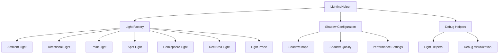

# LightingHelper

Factory helpers for common light types with consistent defaults and optional shadow configuration.

## 🎯 Purpose

The `LightingHelper` class provides factory methods for creating common Three.js light types with consistent defaults and optimized shadow configurations. It simplifies lighting setup for prototyping, debugging, and quick scene configuration while maintaining performance and visual quality.

## 🏗️ Architecture

The `LightingHelper` uses a factory pattern with consistent lighting defaults:



## 🚀 Core Features

- **Light Factory**: Centralized creation of all Three.js light types
- **Shadow Configuration**: Optimized shadow map settings and quality
- **Consistent Defaults**: Standardized lighting parameters across the renderer
- **Debug Visualization**: Built-in light helpers for debugging
- **Performance Optimization**: Pre-configured settings for optimal performance
- **Flexible Configuration**: Customizable parameters for different use cases

## 🔧 Key Methods

### Light Creation

```typescript
// Create ambient light
static createAmbientLight(color?: THREE.Color, intensity?: number): THREE.AmbientLight

// Create directional light with shadow support
static createDirectionalLight(
  color?: THREE.Color,
  intensity?: number,
  position?: THREE.Vector3,
  castShadow?: boolean,
  shadowMapSize?: number
): THREE.DirectionalLight

// Create point light with advanced options
static createPointLight(options: PointLightOptions): THREE.PointLight

// Create hemisphere light
static createHemisphereLight(
  skyColor?: THREE.Color,
  groundColor?: THREE.Color,
  intensity?: number
): THREE.HemisphereLight

// Create spot light
static createSpotLight(
  color?: THREE.Color,
  intensity?: number,
  distance?: number,
  angle?: number,
  penumbra?: number,
  decay?: number
): THREE.SpotLight

// Create rect area light
static createRectAreaLight(
  color?: THREE.Color,
  intensity?: number,
  width?: number,
  height?: number
): THREE.RectAreaLight

// Create light probe
static createLightProbe(): THREE.LightProbe
```

### Debug Helpers

```typescript
// Create light helpers for debugging
static createLightHelpers(
  lights: THREE.Light[],
  helperSize?: number,
  show?: boolean
): THREE.Object3D[]
```

## 📊 Technical Specifications

- **Light Types**: All standard Three.js light types supported
- **Shadow Quality**: Optimized shadow map configurations
- **Performance**: Pre-configured for 60fps rendering
- **TypeScript**: Full type definitions included
- **Debug Support**: Built-in visualization helpers

## 💡 Usage Examples

### Basic Lighting Setup

```typescript
import { LightingHelper } from "@teskooano/renderer-threejs-helpers";

// Create ambient light for overall illumination
const ambientLight = LightingHelper.createAmbientLight(
  new THREE.Color(0x404040),
  0.4,
);

// Create directional light (sun)
const directionalLight = LightingHelper.createDirectionalLight(
  new THREE.Color(0xffffff),
  1,
  new THREE.Vector3(10, 10, 5),
  true,
  2048,
);

// Add lights to scene
scene.add(ambientLight);
scene.add(directionalLight);
```

### Point Light with Advanced Options

```typescript
// Create point light with custom configuration
const pointLight = LightingHelper.createPointLight({
  color: new THREE.Color(0xff0000),
  intensity: 1,
  distance: 100,
  decay: 2,
  position: new THREE.Vector3(0, 10, 0),
  castShadow: true,
  shadowMapSize: 1024,
  name: "Red Point Light",
});
```

### Hemisphere Light

```typescript
// Create hemisphere light for natural lighting
const hemisphereLight = LightingHelper.createHemisphereLight(
  new THREE.Color(0x87ceeb), // sky blue
  new THREE.Color(0x8b4513), // ground brown
  0.6,
);
```

### Debug Lighting

```typescript
// Create debug helpers for all lights
const lights = [ambientLight, directionalLight, pointLight];
const helpers = LightingHelper.createLightHelpers(lights, 1, true);

// Add helpers to scene for debugging
helpers.forEach((helper) => scene.add(helper));
```

### Spot Light Configuration

```typescript
// Create spot light with specific parameters
const spotLight = LightingHelper.createSpotLight(
  new THREE.Color(0xffffff),
  1,
  100,
  Math.PI / 6, // 30 degrees
  0.1,
  2,
);

spotLight.position.set(0, 20, 0);
spotLight.target.position.set(0, 0, 0);
```

## ⚡ Performance Considerations

- **Shadow Optimization**: Pre-configured shadow map sizes for performance
- **Light Limits**: Recommended limits for different light types
- **Quality Settings**: Balanced quality vs performance configurations
- **Memory Management**: Efficient light creation and disposal

## 🔌 Integration Points

- **threejs-lighting**: Used for prototyping before production lighting setup
- **threejs-celestial**: Provides lighting for celestial object rendering
- **threejs-core**: Used during scene initialization and debugging
- **Debug Systems**: Integrates with debug visualization systems

## 🐛 Debug Features

- **Light Helpers**: Visual representation of light sources and directions
- **Shadow Debugging**: Shadow map visualization and debugging
- **Performance Monitoring**: Built-in performance optimization settings
- **Configuration Validation**: Ensures proper light parameters

## 🔮 Future Enhancements

- **WebGPU Support**: Prepare for WebGPU lighting pipeline
- **Advanced Shadows**: Enhanced shadow techniques and quality
- **Light Baking**: Support for lightmap baking and precomputed lighting
- **Performance Profiling**: Advanced performance monitoring and optimization

## 📚 Architecture Patterns

- **Factory Pattern**: Centralized object creation with consistent defaults
- **Strategy Pattern**: Configurable lighting algorithms and parameters
- **Utility Pattern**: Static utility methods for common operations

## 📚 Related Documentation

- [[threejs-lighting|LightingManager]]: Production lighting management system
- [[threejs-celestial]]: Celestial object rendering with lighting
- [[threejs-core]]: Core rendering infrastructure
- [[threejs-background]]: Background rendering and lighting
