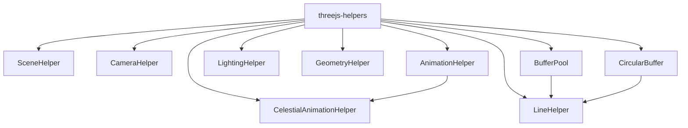

# Three.js Helpers (`@teskooano/renderer-threejs-helpers`)

Utility helpers shared across renderer packages. These provide optimized creation of common Three.js constructs, memory utilities, and rendering helpers.

## 🎯 Purpose

The `threejs-helpers` package provides a comprehensive set of utility classes and functions that simplify common Three.js operations across the Teskooano renderer ecosystem. These helpers abstract complex patterns, optimize performance, and provide consistent interfaces for creating and managing Three.js objects.

## 🚀 Core Features

- **Scene & Camera Management**: Optimized factory methods for scenes, renderers, and cameras
- **Animation System**: GSAP-powered animation utilities with lifecycle management
- **Memory Optimization**: Buffer pooling and circular buffer implementations
- **Geometry Creation**: Fast geometry builders and mesh factories
- **Lighting Setup**: Convenient light creation with shadow configuration
- **Line Rendering**: Efficient line and curve creation for orbits and trails
- **Performance Monitoring**: Built-in statistics and memory usage tracking

## 🏗️ Architecture

The helpers package follows a modular architecture where each helper class focuses on a specific domain:



## 📊 Technical Specifications

- **Package Type**: Utility library
- **Dependencies**: Three.js 0.179.1, GSAP 3.13.0
- **TypeScript**: Full type definitions included
- **Memory Management**: Automatic buffer pooling and disposal
- **Performance**: Optimized for 60fps rendering with minimal GC pressure

## ⚡ Performance Considerations

- **Buffer Pooling**: `BufferPool` reduces garbage collection by reusing ArrayBuffer instances
- **Circular Buffers**: Fixed-size buffers prevent memory growth for history data
- **Animation Management**: Centralized animation tracking prevents memory leaks
- **Geometry Caching**: Reusable geometry instances for common shapes
- **Frustum Culling**: Optimized rendering settings for line geometries

## 🔌 Integration Points

- **threejs-core**: Uses `SceneHelper` and `CameraHelper` during initialization
- **threejs-celestial**: Integrates with `CelestialAnimationHelper` for celestial animations
- **threejs-orbits**: Utilizes `LineHelper` and `BufferPool` for orbital rendering
- **threejs-camera**: Leverages `CameraHelper` for camera management
- **threejs-lighting**: Uses `LightingHelper` for debug and prototyping

## 🐛 Debug Features

- **Animation Tracking**: Monitor active animations and their counts
- **Memory Statistics**: Track buffer pool usage and memory consumption
- **Performance Metrics**: Built-in timing and performance monitoring
- **Helper Visualization**: Debug helpers for lights and camera frustums

## 🔮 Future Enhancements

- **WebGPU Support**: Prepare helpers for WebGPU migration
- **Advanced Caching**: Implement more sophisticated geometry caching
- **Animation Blending**: Add support for animation blending and transitions
- **Performance Profiling**: Enhanced performance monitoring and profiling tools

## 📚 Architecture Patterns

- **Factory Pattern**: Centralized object creation with consistent defaults
- **Pool Pattern**: Memory-efficient object reuse and recycling
- **Utility Pattern**: Static utility methods for common operations
- **Manager Pattern**: Centralized management of related resources
- **Strategy Pattern**: Configurable algorithms for different use cases

## 📚 Documentation Structure

### Core Helpers

- [[SceneHelper]]: Scene and renderer factory with optimized defaults
- [[CameraHelper]]: Camera creation, presets, and configuration
- [[AnimationHelper]]: GSAP-powered animation utilities with lifecycle management
- [[CelestialAnimationHelper]]: Domain-specific animations for celestial objects

### Utility Helpers

- [[LightingHelper]]: Light creation and shadow configuration
- [[LineHelper]]: Efficient line and curve rendering with buffer pooling
- [[GeometryHelper]]: Fast geometry creation and mesh factories
- [[BufferPool]]: Memory-efficient buffer reuse and management
- [[CircularBuffer]]: Fixed-size circular buffer for history data

## 🔄 Quick Navigation

### By Category

- **Scene Management**: [[SceneHelper]], [[CameraHelper]]
- **Animation**: [[AnimationHelper]], [[CelestialAnimationHelper]]
- **Rendering**: [[LineHelper]], [[GeometryHelper]], [[LightingHelper]]
- **Memory**: [[BufferPool]], [[CircularBuffer]]

### By Use Case

- **Initialization**: [[SceneHelper]], [[CameraHelper]]
- **Animations**: [[AnimationHelper]], [[CelestialAnimationHelper]]
- **Orbits/Trails**: [[LineHelper]], [[BufferPool]]
- **Debug/Prototyping**: [[LightingHelper]], [[GeometryHelper]]

## 🚀 Getting Started

```typescript
import {
  SceneHelper,
  CameraHelper,
  AnimationHelper,
} from "@teskooano/renderer-threejs-helpers";

// Create optimized scene and camera
const scene = SceneHelper.createScene();
const camera = CameraHelper.createPerspectiveCamera();

// Set up animations
const animationHelper = new AnimationHelper();
animationHelper.animatePosition(object, targetPosition, { duration: 2 });
```

## 📦 Dependencies

### Runtime Dependencies

- `three`: Three.js 3D library
- `gsap`: GreenSock Animation Platform

### Development Dependencies

- `@types/three`: TypeScript definitions for Three.js

## 📚 Related Documentation

- [[threejs-core]]: Core rendering infrastructure
- [[threejs-celestial]]: Celestial object rendering
- [[threejs-orbits]]: Orbital mechanics and rendering
- [[threejs-camera]]: Advanced camera management
- [[threejs-lighting]]: Lighting system and management

---
