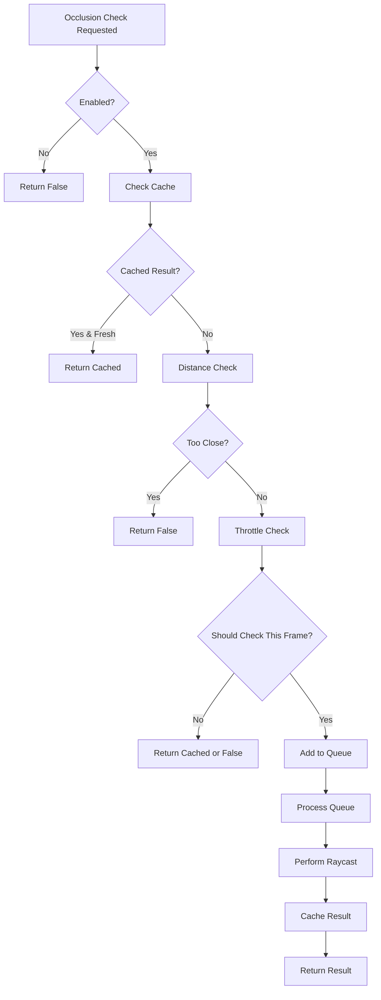

# BaseLabelLayer

The abstract base class for all label layers, providing common functionality for element management, occlusion detection, and performance optimization.

## 🎯 Purpose

`BaseLabelLayer` serves as the foundation for all specialized label layers, providing shared functionality for element lifecycle management, sophisticated occlusion detection, and performance optimization. It implements a robust system for determining when labels should be hidden behind celestial objects.

## 🏗️ Architecture

### Core Components

- **Element Registry**: Map-based storage of CSS2DObject instances
- **Occlusion System**: Advanced raycasting-based occlusion detection
- **Performance Optimization**: Caching, throttling, and spatial culling
- **Visibility Management**: Global and individual element visibility control

### Occlusion Configuration

```typescript
public occlusionConfig = {
  checkFrequency: 60,           // Check every 60 frames
  maxTestsPerFrame: 3,          // Max occlusion tests per frame
  cacheDuration: 2000,          // Cache results for 2 seconds
  nearbyDistanceThreshold: 50,  // Skip tests for nearby labels
  enabled: true,                // Master occlusion toggle
  useWasmOptimization: true,    // Future WASM optimization
};
```

### Performance Strategy

- **Throttled Updates**: Occlusion checks limited to prevent performance impact
- **Spatial Culling**: Quick distance checks before expensive raycasting
- **Result Caching**: Occlusion results cached to avoid redundant calculations
- **Queue Processing**: Limited number of tests per frame for smooth performance

## 🔧 Core Methods

### Constructor

```typescript
constructor(scene?: THREE.Scene, occlusionOptions?: Partial<OcclusionConfig>)
```

- **scene**: Optional Three.js scene for element positioning
- **occlusionOptions**: Custom occlusion configuration overrides
- **Initialization**: Sets up raycaster and performance optimizations

### Element Management

```typescript
public setVisibility(visible: boolean): void
public removeElement(id: string): void
public clear(): void
public getElement(id: string): CSS2DObject | undefined
public hasElements(): boolean
```

- **Visibility Control**: Global visibility toggle for all elements
- **Element Lifecycle**: Add, remove, and clear element management
- **Element Access**: Safe element retrieval and existence checking

### Component Registration

```typescript
public getRequiredComponents(): UIRegistryComponent[]
```

- **Returns**: Array of web components required by this layer
- **Registration**: Used by Layer2DManager for automatic component registration
- **Interface**: Defines component tag names and classes

### Update Interface

```typescript
public update(camera: THREE.PerspectiveCamera, objectManager: ObjectManager): void
```

- **Default Implementation**: Empty - subclasses must override
- **Camera Access**: Current camera for visibility calculations
- **Object Manager**: Access to celestial objects for occlusion testing

## 🔍 Occlusion Detection System

### Optimized Occlusion Checking

```typescript
protected isLabelOccludedOptimized(
  labelId: string,
  labelPosition: OSVector3,
  camera: THREE.PerspectiveCamera,
  objectManager: ObjectManager,
  labelObjectId: string
): boolean
```

### Occlusion Algorithm Flow



### Spatial Culling

- **Distance Threshold**: Labels within 50 scene units skip occlusion tests
- **Performance Gain**: Avoids expensive raycasting for nearby labels
- **Configurable**: Threshold can be adjusted via `setNearbyDistanceThreshold()`

### Throttling System

- **Check Frequency**: Occlusion tests performed every 60 frames (1 second at 60fps)
- **Frame Limiting**: Maximum 3 occlusion tests per frame
- **Queue Processing**: Labels queued for testing when frequency allows
- **Configurable**: Both frequency and per-frame limits are adjustable

### Caching System

- **Result Storage**: Occlusion results cached with timestamps
- **Cache Duration**: Results valid for 2 seconds
- **Memory Management**: Automatic cache cleanup
- **Performance**: Avoids redundant raycasting calculations

### Raycasting Implementation

```typescript
private performOcclusionTest(
  labelPosition: THREE.Vector3,
  camera: THREE.PerspectiveCamera,
  objectManager: ObjectManager,
  labelObjectId: string
): boolean
```

### Raycasting Features

- **Camera to Label**: Raycast from camera position to label position
- **Object Filtering**: Excludes the label's own object from occlusion
- **Spatial Optimization**: Only tests objects near the ray path
- **Mesh Traversal**: Tests main mesh and immediate children
- **Error Handling**: Graceful fallback if raycasting fails

## 🚀 Usage Example

```typescript
// Create a specialized layer
class MyLabelLayer extends BaseLabelLayer {
  constructor(scene: THREE.Scene) {
    super(scene, {
      checkFrequency: 30, // Check every 30 frames
      maxTestsPerFrame: 5, // 5 tests per frame
      cacheDuration: 1000, // 1 second cache
      nearbyDistanceThreshold: 25, // 25 unit threshold
    });
  }

  public override getRequiredComponents(): UIRegistryComponent[] {
    return [
      {
        tagName: "my-label",
        componentClass: MyLabelComponent,
      },
    ];
  }

  public override update(
    camera: THREE.PerspectiveCamera,
    objectManager: ObjectManager,
  ): void {
    // Process elements with occlusion checking
    this.elements.forEach((label, id) => {
      const labelPosition = OSVector3.fromThreeJS(label.position);

      // Check if label is occluded
      const isOccluded = this.isLabelOccludedOptimized(
        id,
        labelPosition,
        camera,
        objectManager,
        id,
      );

      // Update visibility based on occlusion
      label.element.toggleAttribute("visible", !isOccluded);
    });
  }
}
```

## 🔧 Configuration Methods

### Occlusion Control

```typescript
public setOcclusionEnabled(enabled: boolean): void
public setOcclusionCheckFrequency(frequency: number): void
public setMaxOcclusionTestsPerFrame(maxTests: number): void
public setOcclusionCacheDuration(duration: number): void
public setNearbyDistanceThreshold(threshold: number): void
public getOcclusionConfig(): OcclusionConfig
```

### Configuration Examples

```typescript
// Disable occlusion for performance
layer.setOcclusionEnabled(false);

// Increase check frequency for more responsive occlusion
layer.setOcclusionCheckFrequency(30);

// Allow more tests per frame
layer.setMaxOcclusionTestsPerFrame(10);

// Reduce cache duration for more frequent updates
layer.setOcclusionCacheDuration(500);

// Adjust distance threshold
layer.setNearbyDistanceThreshold(100);
```

## 🎯 Performance Considerations

### Memory Management

- **Pre-allocated Vectors**: Reuses THREE.Vector3 instances to reduce GC pressure
- **Efficient Caching**: Map-based cache with automatic cleanup
- **Queue Management**: Limited queue size to prevent memory growth
- **Element Cleanup**: Proper disposal of CSS2DObject instances

### CPU Optimization

- **Throttled Updates**: Occlusion checks limited to prevent frame drops
- **Spatial Culling**: Quick distance checks before expensive operations
- **Batch Processing**: Multiple elements processed efficiently
- **Configurable Limits**: Adjustable thresholds for different performance targets

### Raycasting Optimization

- **Object Filtering**: Only tests relevant objects near ray path
- **Mesh Traversal**: Efficient child object testing
- **Error Handling**: Graceful fallback prevents crashes
- **Distance Calculation**: Optimized distance and direction calculations

## 🔍 Debug Features

### Occlusion Debugging

- **Cache Inspection**: View cached occlusion results and timestamps
- **Queue Monitoring**: Track occlusion test queue status
- **Performance Metrics**: Monitor occlusion check frequency and timing
- **Spatial Visualization**: Debug spatial culling effectiveness

### Configuration Debugging

- **Config Inspection**: View current occlusion configuration
- **Threshold Testing**: Test different distance thresholds
- **Frequency Analysis**: Monitor check frequency effectiveness
- **Cache Analysis**: Analyze cache hit rates and performance

## 📚 Related Components

- **[[Layer2DManager]]** - Manages all label layers
- **[[CelestialLabelLayer]]** - Celestial body labels with occlusion
- **[[AuMarkerLabelLayer]]** - AU marker labels with occlusion
- **[[PredictionLabelLayer]]** - Prediction labels with occlusion
- **[[Occlusion Detection System]]** - Detailed occlusion system documentation

## 🏛️ Architecture Patterns

- **Template Method Pattern**: Abstract base with specialized implementations
- **Strategy Pattern**: Configurable occlusion detection strategies
- **Caching Pattern**: Result caching for performance optimization
- **Queue Pattern**: Throttled processing with queue management
- **Observer Pattern**: Element updates triggered by external changes
- **Resource Management Pattern**: Proper cleanup and disposal methods

---
