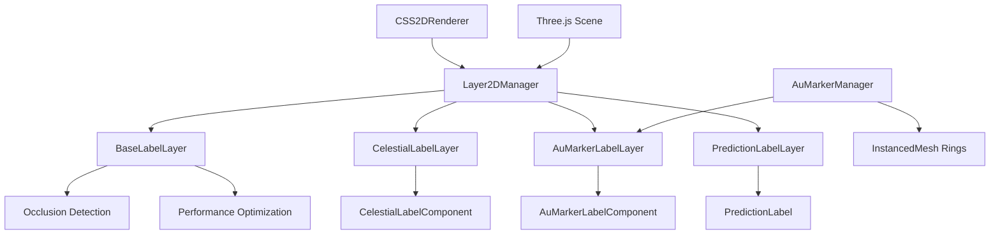

# Three.js Labels (`@teskooano/renderer-threejs-labels`)

The comprehensive 2D label system for the Teskooano renderer, providing CSS2D-based UI elements that overlay the 3D scene.

## 🎯 Purpose

This package provides a sophisticated 2D label system that renders HTML-based UI elements in 3D space:

- **Celestial Labels**: Dynamic labels for planets, stars, moons, and other celestial bodies
- **AU Distance Markers**: Ring-based distance indicators with 2D labels
- **Prediction Labels**: Time-based trajectory prediction markers
- **Occlusion Detection**: Smart visibility management to prevent labels from showing through objects
- **Performance Optimization**: Efficient rendering with caching and throttling

## 🚀 Core Features

### 1. Label Management System

- **Multi-Layer Architecture**: Organized layers for different label types
- **CSS2D Integration**: HTML elements rendered in 3D space
- **Dynamic Visibility**: Distance and occlusion-based visibility rules
- **Performance Optimization**: Caching, throttling, and efficient updates

### 2. Celestial Body Labels

- **Rich Information Display**: Names, distances, and speeds
- **Type-Specific Visibility**: Different rules for planets, stars, moons, etc.
- **Surface-to-Surface Distance**: Accurate distance calculations
- **Real-time Updates**: Dynamic position and data updates

### 3. Distance Marker System

- **AU Ring Markers**: Visual distance reference rings
- **Instanced Rendering**: Efficient rendering of multiple rings
- **Cardinal Direction Labels**: Labels at X+, X-, Z+, Z- positions
- **Color-Coded System**: Green for decade markers, orange for others

### 4. Prediction Labels

- **Time-Based Markers**: Future position indicators
- **Velocity-Scaled Visibility**: Visibility based on object speed
- **Time Category Styling**: Color-coded by prediction time distance
- **Occlusion Integration**: Smart visibility management

## 🏗️ Architecture

The label system follows a layered architecture with specialized components:



### Core Components

- **Layer2DManager**: Central orchestrator for all CSS2D layers
- **BaseLabelLayer**: Abstract base with occlusion detection and performance optimization
- **Specialized Layers**: Type-specific layers for different label categories
- **Web Components**: Custom HTML elements for label rendering
- **Manager Classes**: Specialized managers for complex systems

## 📊 Technical Specifications

### Layer Types

```typescript
enum CSS2DLayerType {
  CELESTIAL_LABELS = "celestial-labels",
  TOOLTIPS = "tooltips",
  AU_MARKERS = "au-markers",
  PREDICTION_LABELS = "prediction-labels",
}
```

### Label System Interface

```typescript
interface LabelSystem {
  css2DManager: Layer2DManager;
  auMarkerManager: AuMarkerManager;
}

interface LabelSystemOptions {
  showAuMarkers?: boolean;
  labelConfig?: LabelVisibilityConfig;
}
```

### Visibility Configuration

```typescript
interface LabelVisibilityConfig {
  planet?: number; // 500 AU default
  gasGiant?: number; // 800 AU default
  moon?: number; // 200 AU default
  comet?: number; // 300 AU default
  ejectedMoon?: number; // 150 AU default
  secondaryStar?: number; // 1000 AU default
  default?: number; // 400 AU default
  satellite?: number; // 1 AU default
  ejectedSatellite?: number; // 200,000,000 AU default
  asteroid?: number; // 100 AU default
}
```

## ⚡ Performance Considerations

### Occlusion Detection

- **Throttled Updates**: Limited to 3 tests per frame, every 60 frames
- **Result Caching**: 2-second cache duration for occlusion results
- **Spatial Culling**: Skip tests for nearby labels (50 scene units)
- **Queue Processing**: Efficient queue management for occlusion tests

### Rendering Optimization

- **InstancedMesh**: Single mesh for all AU rings with GPU instancing
- **Attribute Caching**: Only update DOM when values change
- **Position Caching**: Skip position updates for stationary objects
- **Visibility Caching**: Cache visibility states to prevent redundant updates

### Memory Management

- **Pre-allocated Vectors**: Reuse THREE.Vector3 instances
- **Efficient Caching**: Map-based caches with automatic cleanup
- **Resource Cleanup**: Proper disposal of CSS2DObject instances
- **Buffer Pooling**: Efficient buffer management for line rendering

## 🔌 Integration Points

### Three.js Integration

- **Scene Integration**: Labels positioned relative to 3D objects
- **Camera Integration**: Camera position for visibility and occlusion
- **CSS2DRenderer**: Underlying renderer for HTML element overlay
- **ObjectManager**: Access to celestial objects for occlusion testing

### Core Package Integration

- **@teskooano/data-types**: RenderableCelestialObject and CelestialType
- **@teskooano/core-math**: OSVector3 for vector mathematics
- **@teskooano/data-values**: Constants like AU_METERS and SCALE
- **@teskooano/renderer-threejs-objects**: ObjectManager for mesh access
- **@teskooano/renderer-threejs-core**: RenderOrderManager for effect ordering

### System Integration

- **Renderer Integration**: Integration with main renderer system
- **State Management**: Integration with application state
- **Event System**: Integration with renderer events
- **Performance Monitoring**: Integration with performance systems

## 🐛 Debug Features

### Occlusion Debugging

- **Cache Inspection**: View cached occlusion results and timestamps
- **Queue Monitoring**: Track occlusion test queue status
- **Performance Metrics**: Monitor occlusion check frequency and timing
- **Spatial Visualization**: Debug spatial culling effectiveness

### Label Debugging

- **Visibility Rules**: Debug type-specific visibility rules
- **Distance Calculations**: Monitor distance-based visibility zones
- **Attribute Updates**: Track attribute change frequency
- **Position Updates**: Debug label positioning and movement

### Performance Monitoring

- **Update Frequency**: Track label update performance
- **Memory Usage**: Monitor label and cache memory consumption
- **Render Performance**: Track CSS2D rendering performance
- **Occlusion Performance**: Monitor occlusion detection performance

## 🔮 Future Enhancements

### Performance Optimizations

- **WASM Integration**: WebAssembly-based occlusion detection for better performance
- **Web Workers**: Offload occlusion calculations to background threads
- **GPU Occlusion**: GPU-based occlusion detection using compute shaders
- **Spatial Indexing**: Octree or BVH for faster spatial queries

### Feature Enhancements

- **Label Clustering**: Group nearby labels to reduce visual clutter
- **Adaptive LOD**: Dynamic level-of-detail for labels based on distance
- **Interactive Labels**: Clickable labels with hover effects
- **Label Animations**: Smooth transitions for label appearance/disappearance

### Integration Improvements

- **VR/AR Support**: Enhanced support for immersive environments
- **Mobile Optimization**: Touch-friendly label interactions
- **Accessibility**: Screen reader support and keyboard navigation
- **Internationalization**: Multi-language label support

## 📚 Architecture Patterns

- **Manager Pattern**: Centralized orchestration of multiple layers
- **Layer Pattern**: Specialized layers for different label types
- **Web Component Pattern**: Custom HTML elements with shadow DOM
- **Occlusion Pattern**: Performance-optimized visibility detection
- **Caching Pattern**: Efficient attribute and position caching
- **Factory Pattern**: Automatic component registration and creation
- **Observer Pattern**: Layer updates triggered by external events
- **Registry Pattern**: Map-based layer registration and retrieval

## 📚 Documentation Structure

### Core System

- [[Layer2DManager]] - Main orchestrator for all CSS2D layers
- [[LabelSystem Interface]] - System configuration and initialization interface

### Layer Architecture

- [[BaseLabelLayer]] - Abstract base class for all label layers
- [[CelestialLabelLayer]] - Labels for celestial bodies with distance and speed info
- [[AuMarkerLabelLayer]] - Distance marker labels with occlusion detection
- [[PredictionLabelLayer]] - Trajectory prediction labels with time-based visibility

### Managers

- [[AuMarkerManager]] - Manages AU distance rings and their labels

### Web Components

- [[CelestialLabelComponent]] - Custom element for celestial body labels
- [[AuMarkerLabelComponent]] - Custom element for AU distance markers
- [[PredictionLabel]] - Custom element for prediction labels

### Architecture & Patterns

- [[CSS2D Label Architecture]] - Overall system architecture
- [[Occlusion Detection System]] - Performance-optimized visibility management
- [[Web Component Integration]] - Custom element registration and lifecycle

## 🔄 Quick Navigation

### By Component Type

- **System Management**: [[Layer2DManager]], [[LabelSystem Interface]]
- **Layer Types**: [[BaseLabelLayer]], [[CelestialLabelLayer]], [[AuMarkerLabelLayer]], [[PredictionLabelLayer]]
- **Managers**: [[AuMarkerManager]]
- **Web Components**: [[CelestialLabelComponent]], [[AuMarkerLabelComponent]], [[PredictionLabel]]

### By Architecture Pattern

- **Manager Pattern**: [[Layer2DManager]] orchestrates all layers
- **Layer Pattern**: Each label type has its own specialized layer
- **Web Component Pattern**: Custom HTML elements for label rendering
- **Occlusion Pattern**: Performance-optimized visibility detection
- **Caching Pattern**: Efficient attribute and position caching

## 🚀 Getting Started

1. Start with [[Layer2DManager]] to understand the core system
2. Explore [[BaseLabelLayer]] for the layer architecture foundation
3. Learn about [[CelestialLabelLayer]] for celestial body labeling
4. Check out [[AuMarkerManager]] for distance marker system
5. Review [[Occlusion Detection System]] for performance optimization

## 📦 Dependencies

### Core Dependencies

- **[[data-types]]** - Core data structures and types
- **[[core-math]]** - Vector mathematics (OSVector3)
- **[[data-values]]** - Constants and scale values
- **[[threejs-objects]]** - Object management and mesh access
- **[[threejs-core]]** - Render order management
- **Three.js** - Three.js core library and CSS2DRenderer

### Development Dependencies

- **@types/three** - TypeScript definitions for Three.js
- **typescript** - Type safety and modern JavaScript features
- **vitest** - Testing framework with browser support

## 📚 Related Documentation

- **[[threejs]]** - Main Three.js renderer package
- **[[threejs-core]]** - Core rendering utilities and managers
- **[[threejs-objects]]** - Object management and mesh systems
- **[[data-types]]** - Core data structures and celestial types
- **[[core-math]]** - Vector mathematics and spatial calculations
- **[[data-values]]** - Constants and scale values for space simulation

---
