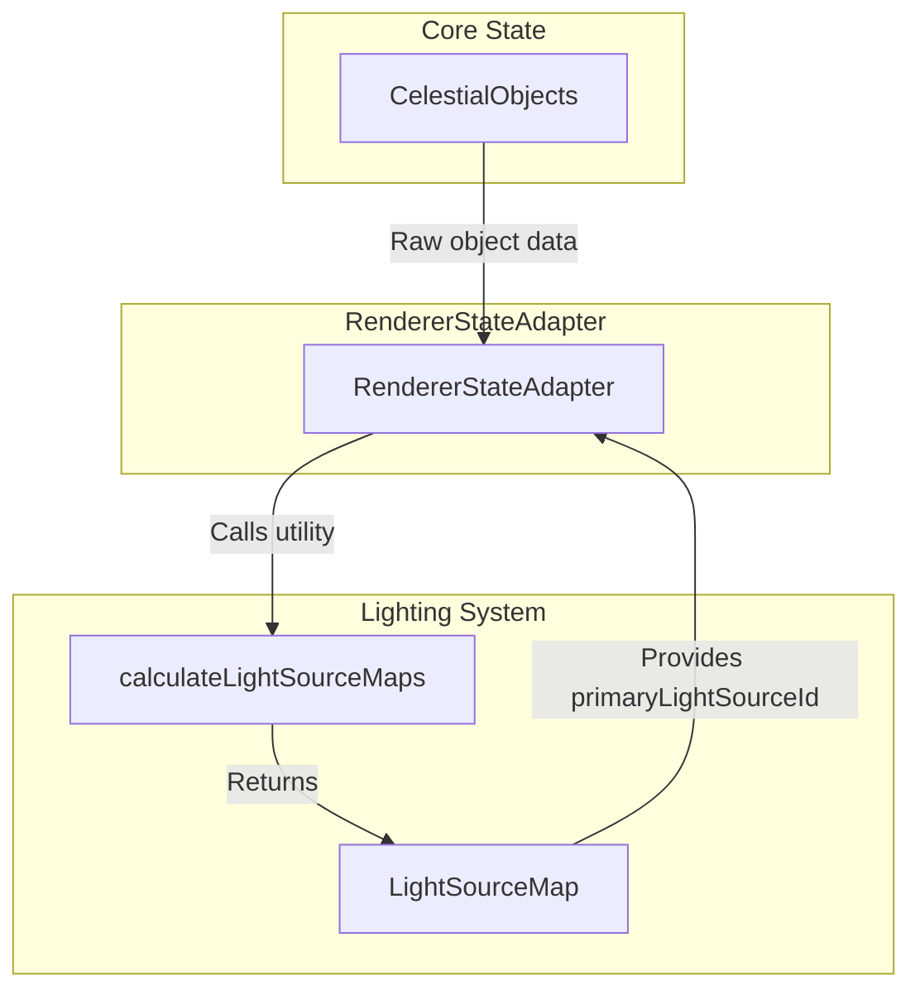

# Three.js Lighting (`@teskooano/renderer-threejs-lighting`)

The dynamic lighting management system for the Teskooano renderer, providing sophisticated star illumination, shadow casting, and multi-star system support.

## 🎯 Purpose

This package manages the complex lighting requirements of a space simulation:

- **Dynamic Light Sources**: Stars that move and change intensity based on stellar properties
- **Multi-Star Systems**: Support for binary and multiple star systems with proper light source assignment
- **Planetary Shadow Casting**: Planets automatically cast shadows on each other when positioned between light sources and targets
- **Performance-Optimized Queries**: Efficient finding of influential lights for each object using squared distance calculations
- **Hierarchy Calculation**: Determining which star illuminates each celestial body based on gravitational relationships

## 🏗️ Core Components

### [[LightingManager]]

A registry that holds all active `LightSourceComponent` instances in the scene.

**Key Responsibilities:**

- Maintains a registry of all active light sources
- Provides performant queries for influential lights affecting specific objects
- Manages light source lifecycle (registration/unregistration)
- Handles dynamic shadow casting for planets and ring systems
- Optimizes light source queries using squared distance calculations

### [[LightSourceComponent]]

A wrapper that associates a `THREE.Light` instance with a `RenderableCelestialObject`.

**Key Responsibilities:**

- Wraps a `THREE.Light` instance with celestial object data
- Updates light position to match its associated object
- Provides access to both the light and its celestial object
- Manages light intensity and color based on stellar properties

### [[calculateLightSourceMaps]] Utility

A function that operates on raw `CelestialObject` data from the core state.

**Key Responsibilities:**

- Traverses the system's hierarchy to build light source relationships
- Determines which star illuminates each object based on gravitational dominance
- Calculates `primaryLightSourceId` for every object
- Handles complex multi-star system lighting relationships

## 🔄 Data Flow

The lighting process is split into two distinct phases:

### Phase 1: Hierarchy Calculation (Pre-Render)



### Phase 2: Scene Lighting (Render-time)

```mermaid
graph TD
    subgraph "ObjectManager"
        OM[ObjectManager]
    end

    subgraph "LightingManager"
        LM[LightingManager]
        LSC[LightSourceComponent]
    end

    subgraph "Three.js Scene"
        SC[THREE.Scene]
        L[THREE.Light]
    end

    subgraph "Celestial Renderers"
        CR[CelestialRenderers]
    end

    OM -->|Creates| LSC
    OM -->|Registers| LM
    LSC -->|Wraps| L
    LM -->|Adds to| SC
    CR -->|Queries for lights| LM
    LM -->|getInfluentialLights()| CR
```

## 🎨 Multi-Star System Support

### Binary Star Systems

- **Close Binaries**: Planets within 3x binary separation orbit the primary star
- **Wide Binaries**: Distance-based logic with bias toward primary star
- **Dynamic Switching**: Planets can switch between stars based on gravitational dominance

### Multiple Star Systems

- **Hierarchical Analysis**: Determines gravitational relationships between stars
- **Light Source Assignment**: Assigns primary light sources based on mass and distance
- **Complex Interactions**: Handles tertiary and higher-order star systems

## 🔧 Configuration

### LightSourceMapOptions

```typescript
interface LightSourceMapOptions {
  maxLights?: number;
  distanceThreshold?: number;
  massWeight?: number;
}
```

### Light Source Types

```typescript
interface LightSourceData {
  position: OSVector3;
  color: THREE.Color;
  intensity: number;
  distance: number;
}

interface LightSourceMap {
  [objectId: string]: string; // objectId -> primaryLightSourceId
}
```

## 🚀 Usage Example

```typescript
// Phase 1: Calculate light source relationships
const lightSourceMap = calculateLightSourceMaps(celestialObjects);

// Phase 2: Create and register light sources
const lightingManager = new LightingManager(scene);

// For each star, create a light source component
stars.forEach((star) => {
  const light = new THREE.PointLight(star.color, star.luminosity);
  const lightSource = new LightSourceComponent(star);

  lightingManager.register(lightSource);
  scene.add(light);
});

// Register planets as shadow casters
planets.forEach((planet) => {
  lightingManager.registerShadowCaster(planet.id, planetMesh, planet);
});

// In celestial renderers, query for influential lights
const influentialLights = lightingManager.getInfluentialLights(
  objectPosition,
  3, // max 3 lights
);

// Update shader uniforms with light data
shaderMaterial.uniforms.lightPositions.value = influentialLights.map((light) =>
  light.getPosition(),
);
```

## 🔗 Related Components

- **[[threejs-objects]]** - Creates and manages LightSourceComponent instances
- **[[threejs-celestial]]** - Uses light source data for shader calculations
- **[[threejs-core]]** - Provides scene access for light attachment
- **[[Modular Space Renderer]]** - Orchestrates the lighting pipeline

## 📚 Architecture Patterns

- **Registry Pattern**: LightingManager acts as a registry for light sources
- **Component Pattern**: LightSourceComponent wraps light with celestial data
- **Utility Pattern**: calculateLightSourceMaps provides pure function calculations
- **Query Pattern**: Efficient light source queries for renderers
- **Shadow Pattern**: Dynamic shadow casting based on geometric relationships

## 🎯 Performance Considerations

### Light Source Queries

- **Squared Distance**: Avoids expensive square root operations
- **Distance Thresholds**: Limits queries to relevant light sources
- **Caching**: Light source positions cached for efficient updates

### Multi-Star Optimization

- **Hierarchy Caching**: Light source relationships cached until system changes
- **Incremental Updates**: Only recalculate when star positions change significantly
- **Distance-Based Filtering**: Ignore stars too far away to be influential

### Shadow Casting Optimization

- **Geometric Calculations**: Efficient shadow casting using ray-object intersections
- **Update Throttling**: Shadow updates limited to prevent performance impact
- **Ring System Support**: Specialized shadow casting for ring systems

### Memory Management

- **Component Lifecycle**: Automatic cleanup when objects are removed
- **Light Disposal**: Proper disposal of Three.js light instances
- **Registry Cleanup**: LightingManager clears unused light sources

## 🔍 Debug Features

### Light Source Visualization

- **Debug Spheres**: Visual representation of light source positions
- **Intensity Indicators**: Color-coded spheres showing light intensity
- **Relationship Lines**: Lines showing light source assignments

### Performance Monitoring

- **Query Counts**: Track number of light source queries per frame
- **Update Frequency**: Monitor light source update frequency
- **Memory Usage**: Track light source component memory usage
- **Shadow Performance**: Monitor shadow casting performance

---

_This package provides the dynamic lighting system that brings the space simulation to life with realistic star illumination and planetary shadows._
