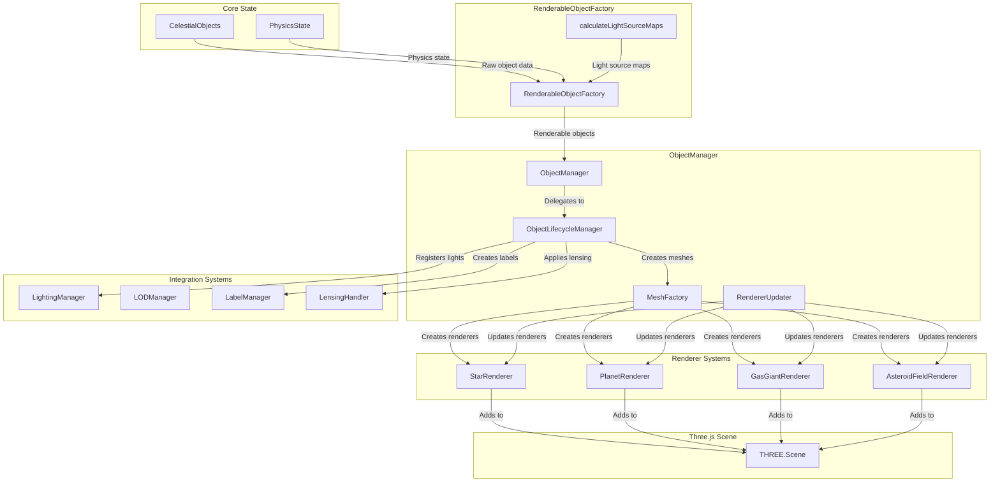

# Three.js Objects (`@teskooano/renderer-threejs-objects`)

The central object management system for the Teskooano renderer, responsible for creating, managing, and orchestrating all celestial object meshes and renderers in the 3D scene.

## 🎯 Purpose

This package serves as the central hub for celestial object rendering:

- **Object Lifecycle Management**: Creates, updates, and disposes of celestial object renderers based on state changes
- **Mesh Factory System**: Factory functions for creating different types of celestial meshes with appropriate renderers
- **Renderer Orchestration**: Coordinates between different renderer systems (lighting, LOD, labels, orbits)
- **Light Source Management**: Creates and manages star light sources through the lighting system
- **State Synchronization**: Keeps the 3D scene synchronized with the physics simulation state

## 🏗️ Core Components

### [[ObjectManager]]

The central orchestrator for all celestial object rendering, acting as a facade that delegates to specialized sub-managers.

**Key Responsibilities:**

- **Initialization**: Instantiates and coordinates all sub-managers
- **State Subscription**: Subscribes to renderable objects stream for reactive updates
- **Update Loop**: Manages the per-frame update cycle for all visual effects
- **API Facade**: Provides clean public API for object management and debugging

### [[ObjectLifecycleManager]]

Manages the creation, updating, and removal of Three.js Object3D instances representing celestial bodies.

**Key Responsibilities:**

- **State Synchronization**: Syncs scene objects with renderable object state
- **Object Creation**: Creates new meshes using MeshFactory when objects appear
- **Object Updates**: Updates position and rotation of existing objects
- **Object Removal**: Performs comprehensive cleanup when objects are destroyed
- **Component Integration**: Manages lights, labels, lensing, and shadow casting

### [[MeshFactory]]

Factory class responsible for creating appropriate Three.js mesh objects for different celestial body types.

**Key Responsibilities:**

- **Type-Based Creation**: Selects appropriate creation method based on object type
- **Renderer Selection**: Delegates to specialized celestial renderer factories
- **LOD Integration**: Creates LOD objects with appropriate detail levels
- **Debug Support**: Provides fallback meshes for debugging scenarios

### [[RendererUpdater]]

Manages per-frame updates for all active celestial renderers with reactive state integration.

**Key Responsibilities:**

- **Reactive Updates**: Subscribes to state changes and updates renderers automatically
- **Light Integration**: Provides influential light data to renderers for shader calculations
- **Context Management**: Manages rendering context (time, camera, scene) for renderers
- **Performance Optimization**: Efficient batch processing of renderer updates

### [[RenderableObjectFactory]]

Factory responsible for creating and updating `RenderableCelestialObject` instances from core state data.

**Key Responsibilities:**

- **Data Transformation**: Converts raw `CelestialObject` data to renderable format
- **Position Scaling**: Handles coordinate system conversion and scaling
- **Rotation Calculations**: Manages axial tilt and sidereal rotation
- **Light Source Mapping**: Integrates with lighting system for light source relationships
- **Caching**: Optimizes performance with property caching

## 🔄 Data Flow



## 🎨 Celestial Object Types

### Stars

- **Main Sequence Stars**: G-type, K-type, M-type stars with different spectral characteristics
- **Giant Stars**: Red giants, blue giants with extended atmospheres
- **Stellar Remnants**: White dwarfs, neutron stars, black holes
- **Special Types**: Pulsars, variable stars, binary star components

### Planets

- **Terrestrial Planets**: Rocky worlds with solid surfaces
- **Gas Giants**: Massive planets with thick atmospheres
- **Ice Giants**: Cold planets with icy compositions
- **Dwarf Planets**: Small planetary bodies

### Small Bodies

- **Asteroids**: Rocky bodies in asteroid belts
- **Comets**: Icy bodies with tails
- **Moons**: Natural satellites of planets
- **Rings**: Particle systems around planets

## 🔧 Renderer Selection Logic

### Type-Based Selection

```typescript
function selectRenderer(object: RenderableCelestialObject): CelestialRenderer {
  switch (object.celestialType) {
    case CelestialType.STAR:
      return createStarRenderer(object);
    case CelestialType.PLANET:
      return createPlanetRenderer(object);
    case CelestialType.GAS_GIANT:
      return createGasGiantRenderer(object);
    case CelestialType.ASTEROID_FIELD:
      return createAsteroidFieldRenderer(object);
    default:
      throw new Error(`Unsupported celestial type: ${object.celestialType}`);
  }
}
```

### Sub-Renderer Creation

Complex objects (like planets with rings) create sub-renderers:

```typescript
// In createPlanetMesh
const planetRenderer = new BaseTerrestrialRenderer(object);
planetRenderer.initialize(object); // Creates sub-renderers like rings

// Sub-renderer creation happens in initialize()
if (object.hasRings) {
  const ringRenderer = new RingSystemRenderer(object);
  planetRenderer.addSubRenderer(ringRenderer);
}
```

## 🚀 Usage Example

```typescript
// Create object manager with dependencies
const objectManager = new ObjectManager(
  scene,
  camera,
  renderableObjects$,
  renderer,
  css2DManager,
  acceleration$,
  lightingManager,
);

// ObjectManager automatically handles:
// - State subscription and reactive updates
// - Object lifecycle management
// - Renderer creation and updates
// - Light source management
// - Label creation and management
// - Special effects (lensing, debris)

// Update is called automatically by the render loop
objectManager.update(renderer, scene, camera);

// Debug features
objectManager.setDebugMode(true);
objectManager.setDebugVisualization(true);
objectManager.setDebrisEffectsEnabled(true);

// Cleanup
objectManager.dispose();
```

## Dependencies

### Core Dependencies

- **@teskooano/core-state** - Provides state management and physics state access
- **@teskooano/data-types** - Provides celestial object type definitions
- **@teskooano/renderer-threejs-core** - Core Three.js renderer utilities
- **@teskooano/renderer-threejs-lighting** - Lighting system for light source management
- **@teskooano/renderer-threejs-orbits** - Orbital visualization system
- **@teskooano/renderer-threejs-celestial** - Base celestial renderer classes
- **@teskooano/renderer-threejs-labels** - 2D label management system
- **three** - Three.js 3D graphics library
- **rxjs** - Reactive programming library for state management
- **eventemitter3** - Event system for object lifecycle events

### Celestial Renderer Dependencies

- **@teskooano/celestials-comet** - Comet-specific renderer
- **@teskooano/celestials-terrestrial** - Terrestrial planet renderer
- **@teskooano/celestials-gas-giants** - Gas giant renderer
- **@teskooano/celestials-stars** - Star renderer
- **@teskooano/celestials-asteroid-field** - Asteroid field renderer
- **@teskooano/celestials-rings** - Ring system renderer
- **@teskooano/celestials-oort-cloud** - Oort cloud renderer
- **@teskooano/celestials-asteroid** - Individual asteroid renderer

### Development Dependencies

- **@types/three** - TypeScript definitions for Three.js
- **vitest** - Testing framework

## 🔗 Related Components

- **[[threejs-celestial]]** - Provides base renderer classes and interfaces
- **[[threejs-lighting]]** - Manages light sources created by ObjectManager
- **[[threejs-orbits]]** - Receives object data for orbital visualization
- **[[threejs-labels]]** - Uses object data for label positioning
- **[[threejs-core]]** - Provides scene access for mesh attachment
- **[[celestials-stars]]** - Star-specific renderer creation
- **[[celestials-terrestrial]]** - Planet and moon renderer creation
- **[[celestials-gas-giants]]** - Gas giant renderer creation

## 📚 Architecture Patterns

- **Manager Pattern**: ObjectManager orchestrates specialized sub-managers
- **Factory Pattern**: MeshFactory creates appropriate renderers for each object type
- **Lifecycle Pattern**: ObjectLifecycleManager handles object creation, updates, and disposal
- **Reactive Pattern**: State-driven updates with RxJS subscriptions
- **Component Pattern**: Specialized managers for different aspects (lighting, LOD, effects)
- **Cache Pattern**: RenderableObjectFactory caches static properties for performance

## 🎯 Performance Considerations

### State-Driven Updates

- **Reactive Architecture**: Only updates when state actually changes
- **Efficient Synchronization**: Compares current and new state to minimize operations
- **Batch Processing**: Processes multiple objects in single update cycles

### Renderer Caching

- **Avoid Recreation**: Cached renderers prevent expensive recreation
- **Memory Management**: Automatic cleanup of unused renderers
- **Lifecycle Tracking**: Efficient monitoring of object creation/destruction

### Light Source Optimization

- **Star Filtering**: Only create light sources for actual stars
- **Intensity Scaling**: Scale light intensity based on stellar properties
- **Distance Culling**: Ignore stars too far away to be influential

### Special Effects Performance

- **Debris Effects**: Particle-based destruction effects with instanced rendering
- **Gravitational Lensing**: Render-to-texture effects for massive objects
- **Acceleration Visualization**: Debug arrows for physics force visualization

## 🔍 Debug Features

### Object Tracking

- **Renderer Count**: Track number of active renderers
- **Memory Usage**: Monitor renderer memory consumption
- **Update Performance**: Track time spent in object updates

### Visualization Debug

- **Object Bounds**: Visualize object bounding boxes
- **Renderer Types**: Color-code objects by renderer type
- **Light Sources**: Visualize light source positions and intensities
- **Acceleration Vectors**: Debug arrows showing physics forces

### Debug Modes

- **Debug Mode**: Creates simplified fallback meshes
- **Debug Visualization**: Shows acceleration vectors and other debug info
- **Debris Effects**: Particle effects for object destruction

## 🏛️ Sub-Manager Architecture

### Specialized Managers

- **GlobalLODManager**: Tracks all LOD objects in the scene
- **GravitationalLensingHandler**: Manages lensing effects for massive objects
- **DebrisEffectManager**: Handles particle effects for destroyed objects
- **AccelerationVisualizer**: Debug visualization for physics forces

### Integration Points

- **State System**: Reactive updates based on core state changes
- **Lighting System**: Light source creation and management
- **Label System**: 2D label creation and visibility management
- **LOD System**: Level of detail management for performance
- **Effect System**: Special visual effects (lensing, debris)

---

_This package serves as the central hub that brings all celestial objects to life in the 3D scene, orchestrating their creation, management, and integration with all rendering systems._
