# Three.js Orchestrators

The orchestrator pattern implementation for the Three.js renderer system, providing centralized coordination and management of related rendering subsystems.

## 🎯 Purpose

The orchestrator pattern serves to:

- **System Coordination**: Coordinate related rendering systems and their interactions
- **Complexity Management**: Reduce complexity by grouping related functionality
- **API Simplification**: Provide simplified interfaces to complex subsystems
- **Maintainability**: Improve maintainability through clear separation of concerns
- **Extensibility**: Enable easy extension and modification of system behavior

## 📚 Documentation Structure

### Core Orchestrators

- [[RenderingOrchestrator]] - Manages core rendering systems and operations
- [[InteractionOrchestrator]] - Manages user interaction and interface systems
- [[DebugOrchestrator]] - Manages debug tools and analysis systems

### Architecture & Integration

- [[Orchestrator Pattern Guide]] - Detailed explanation of the orchestrator pattern
- [[System Integration Patterns]] - How orchestrators integrate with each other
- [[Performance Optimization]] - Performance considerations for orchestrators

## 🔄 Quick Navigation

### By Orchestrator Type

- **Core Rendering**: [[RenderingOrchestrator]] - Scene, objects, lighting, orbits, background
- **User Interaction**: [[InteractionOrchestrator]] - Controls, labels, AU markers
- **Debug & Analysis**: [[DebugOrchestrator]] - Debug tools, performance monitoring

### By System Responsibility

- **Scene Management**: [[RenderingOrchestrator]] coordinates scene, camera, renderer
- **Object Management**: [[RenderingOrchestrator]] manages celestial objects and rendering
- **User Interface**: [[InteractionOrchestrator]] manages 2D labels and user controls
- **Debug Tools**: [[DebugOrchestrator]] provides debugging and analysis capabilities

## 🏗️ Orchestrator Architecture

```mermaid
graph TD
    subgraph "ModularSpaceRenderer"
        MSR[ModularSpaceRenderer]
        RO[RenderingOrchestrator]
        IO[InteractionOrchestrator]
        DO[DebugOrchestrator]
    end

    subgraph "RenderingOrchestrator Systems"
        SM[SceneManager]
        OM[ObjectManager]
        LM[LightingManager]
        ORM[OrbitsManager]
        BM[BackgroundManager]
        LOD[LODManager]
        GM[GridManager]
    end

    subgraph "InteractionOrchestrator Systems"
        CM[ControlsManager]
        L2D[Layer2DManager]
        AMM[AuMarkerManager]
        CL[CelestialLabelLayer]
    end

    subgraph "DebugOrchestrator Systems"
        DBD[DepthBufferDebugger]
        PM[PerformanceMonitor]
        SHM[SystemHealthMonitor]
        DA[DebugAnalytics]
    end

    MSR -->|Coordinates| RO
    MSR -->|Coordinates| IO
    MSR -->|Coordinates| DO
    RO -->|Manages| SM
    RO -->|Manages| OM
    RO -->|Manages| LM
    RO -->|Manages| ORM
    RO -->|Manages| BM
    RO -->|Manages| LOD
    RO -->|Manages| GM
    IO -->|Manages| CM
    IO -->|Manages| L2D
    IO -->|Manages| AMM
    IO -->|Manages| CL
    DO -->|Manages| DBD
    DO -->|Manages| PM
    DO -->|Manages| SHM
    DO -->|Manages| DA
```



## 🚀 Core Features

### System Orchestration

- **Centralized Management**: Each orchestrator manages a group of related systems
- **Dependency Coordination**: Handles dependencies between systems
- **Resource Sharing**: Coordinates resource sharing between systems
- **Lifecycle Management**: Manages initialization, updates, and disposal

### API Simplification

- **Unified Interface**: Provides unified interface to complex subsystems
- **Method Delegation**: Delegates methods to appropriate subsystems
- **Error Handling**: Centralized error handling and recovery
- **Performance Optimization**: Optimizes performance across subsystems

### Extensibility

- **Plugin Architecture**: Supports adding new systems to orchestrators
- **Configuration Management**: Manages configuration for all subsystems
- **Event Broadcasting**: Broadcasts events across subsystems
- **State Synchronization**: Synchronizes state across subsystems

## 🔧 Usage Examples

### Basic Orchestrator Setup

```typescript
import {
  RenderingOrchestrator,
  InteractionOrchestrator,
  DebugOrchestrator,
} from "@teskooano/renderer-threejs";

// Create orchestrators
const container = document.getElementById("renderer-container");
const renderingOrchestrator = new RenderingOrchestrator(container);
const interactionOrchestrator = new InteractionOrchestrator(
  container,
  renderingOrchestrator,
);
const debugOrchestrator = new DebugOrchestrator(
  renderingOrchestrator.sceneManager,
);

// Access individual systems through orchestrators
const sceneManager = renderingOrchestrator.sceneManager;
const controlsManager = interactionOrchestrator.getControlsManager();
const depthDebugger = debugOrchestrator.getDepthDebugger();
```

### Orchestrator Integration

```typescript
// RenderingOrchestrator manages core rendering systems
const objectManager = renderingOrchestrator.objectManager;
const lightingManager = renderingOrchestrator.lightingManager;
const orbitManager = renderingOrchestrator.orbitManager;

// InteractionOrchestrator manages user interaction systems
const layer2DManager = interactionOrchestrator.getLayer2DManager();
const auMarkerManager = interactionOrchestrator.getAuMarkerManager();

// DebugOrchestrator manages debug and analysis systems
debugOrchestrator.runDepthAnalysis();
const healthReport = debugOrchestrator.checkSystemHealth();
```

### System Coordination

```typescript
// Enable debug mode across all orchestrators
renderingOrchestrator.setDebugMode(true);
interactionOrchestrator.setDebugMode(true);

// Handle resize events across all orchestrators
function handleResize(width: number, height: number) {
  renderingOrchestrator.sceneManager.onResize(width, height);
  interactionOrchestrator.onResize(width, height);
}

// Dispose all orchestrators
function cleanup() {
  renderingOrchestrator.dispose();
  interactionOrchestrator.dispose();
  debugOrchestrator.dispose();
}
```

## ⚡ Performance Considerations

### Orchestrator Efficiency

- **Lazy Initialization**: Systems are initialized only when needed
- **Resource Sharing**: Common resources are shared between systems
- **Efficient Updates**: Only affected systems are updated
- **Memory Management**: Proper memory management across all systems

### System Coordination

- **Update Ordering**: Ensures systems are updated in the correct order
- **Dependency Management**: Handles dependencies between systems efficiently
- **Error Isolation**: Isolates errors to prevent system-wide failures
- **Performance Monitoring**: Monitors performance across all systems

### Resource Management

- **Resource Pooling**: Pools expensive resources for reuse
- **Memory Optimization**: Optimizes memory usage patterns
- **Garbage Collection**: Minimizes garbage collection pressure
- **Resource Cleanup**: Properly cleans up unused resources

## 🔌 Integration Points

### Inter-Orchestrator Integration

- **RenderingOrchestrator ↔ InteractionOrchestrator**: Scene and camera coordination
- **RenderingOrchestrator ↔ DebugOrchestrator**: Scene access for debugging
- **InteractionOrchestrator ↔ DebugOrchestrator**: User interaction debugging

### External System Integration

- **Core State**: All orchestrators integrate with core state management
- **UI Components**: InteractionOrchestrator integrates with UI components
- **Performance Monitoring**: DebugOrchestrator integrates with performance monitoring
- **Development Tools**: DebugOrchestrator integrates with development tools

### Package Dependencies

- **Core Package**: All orchestrators use threejs-core for foundational systems
- **Feature Packages**: Each orchestrator uses relevant feature packages
- **State Management**: All orchestrators integrate with core state
- **Data Types**: All orchestrators use shared data types

## 🐛 Debug Features

### Orchestrator Monitoring

- **System Status**: Tracks status of all orchestrators and their systems
- **Performance Metrics**: Monitors performance across all orchestrators
- **Resource Usage**: Tracks resource usage of all systems
- **Error Tracking**: Tracks errors across all orchestrators

### Debug Tools

- **Orchestrator Inspection**: Inspects orchestrator state and configuration
- **System Analysis**: Analyzes individual systems within orchestrators
- **Performance Profiling**: Profiles performance of orchestrators and systems
- **Integration Testing**: Tests integration between orchestrators

### Validation and Testing

- **Orchestrator Validation**: Validates orchestrator initialization and configuration
- **System Integration Testing**: Tests integration between systems
- **Performance Testing**: Tests performance under various conditions
- **Error Handling**: Tests error recovery and graceful degradation

## 🔮 Future Enhancements

### Optimization Opportunities

- **Dynamic Orchestration**: Implement dynamic orchestrator configuration
- **Advanced Resource Sharing**: Implement more sophisticated resource sharing
- **Performance Scaling**: Implement dynamic performance scaling
- **Memory Optimization**: Optimize memory usage patterns

### Potential Improvements

- **Plugin Architecture**: Support for custom orchestrators
- **Advanced Monitoring**: Enhanced monitoring and analytics
- **Automated Optimization**: Automated performance optimization
- **Multi-Threading**: Support for Web Workers

## 🏛️ Architecture Patterns

- **Orchestrator Pattern**: Coordinates multiple related systems
- **Facade Pattern**: Provides simplified interface to complex subsystems
- **Manager Pattern**: Each system has its own manager
- **Observer Pattern**: Observes system events and state changes
- **Resource Management**: Proper lifecycle management of all resources

## 📚 Related Documentation

### Core Orchestrators

- [[RenderingOrchestrator]] - Core rendering systems coordination
- [[InteractionOrchestrator]] - User interaction systems coordination
- [[DebugOrchestrator]] - Debug and analysis systems coordination

### Architecture Components

- [[ModularSpaceRenderer]] - Main orchestrator coordinator
- [[RenderPipeline]] - Update orchestration
- [[RendererStateAdapter]] - State integration

### System Integration

- [[threejs-core]] - Foundational Three.js infrastructure
- [[core-state]] - State management system
- [[data-types]] - Core data structures

---

_The Three.js Orchestrators provide a clean, maintainable architecture for managing complex rendering systems through the orchestrator pattern, enabling better separation of concerns and system coordination._
